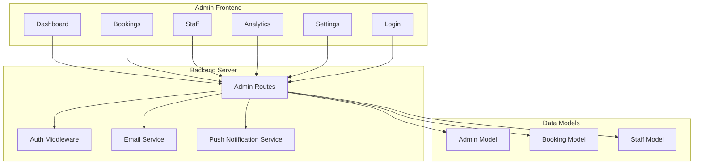
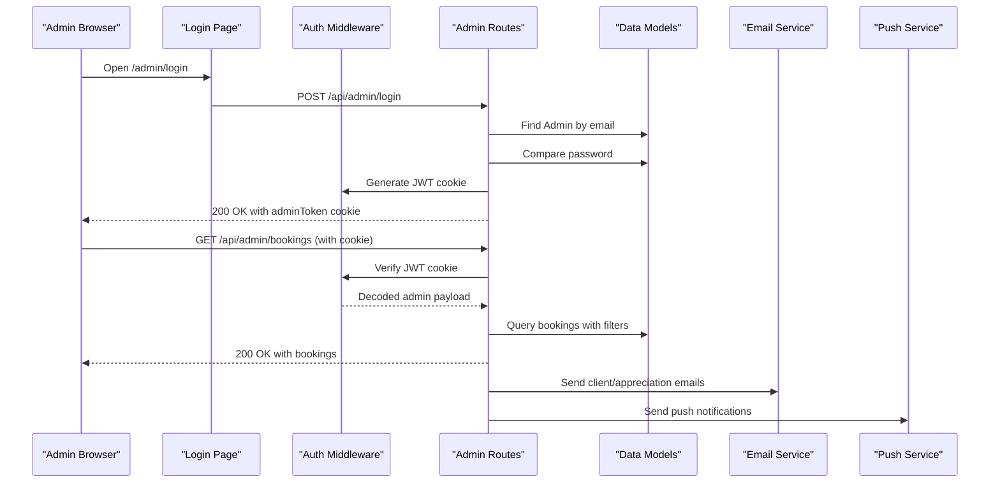
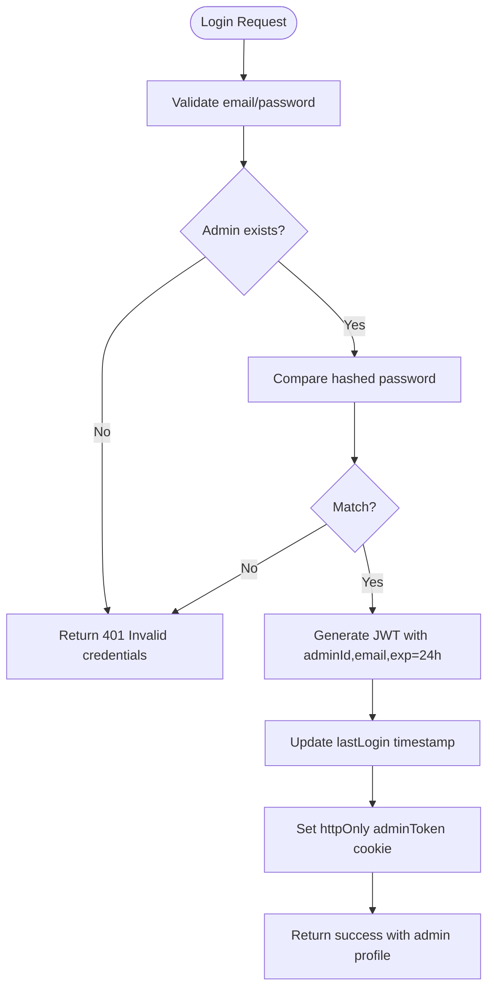
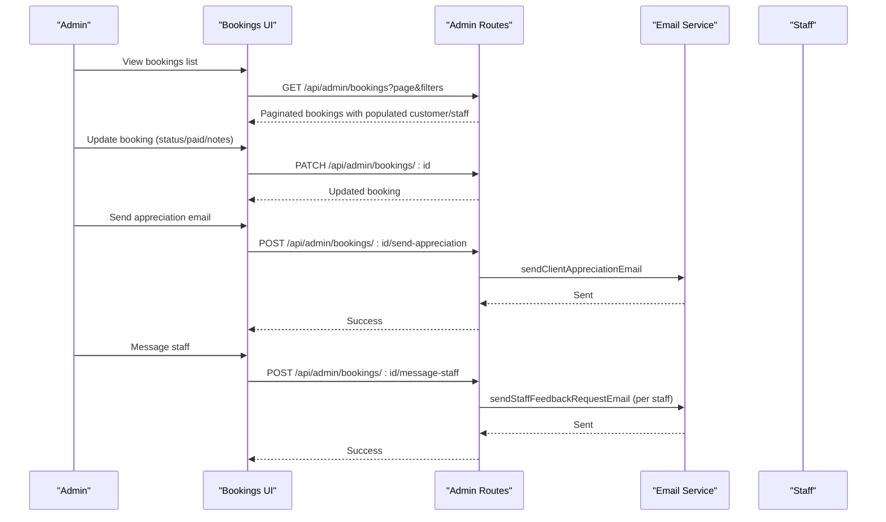
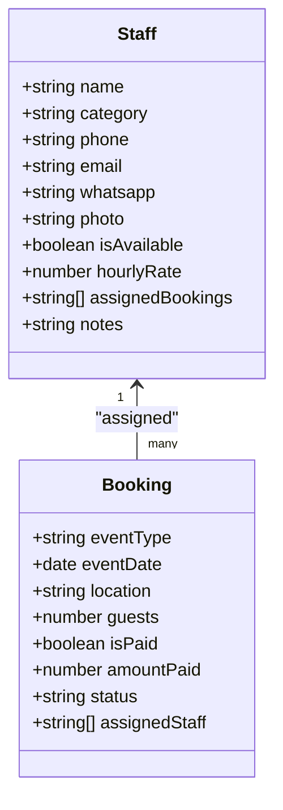
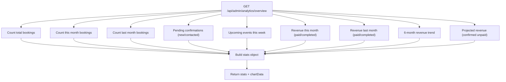
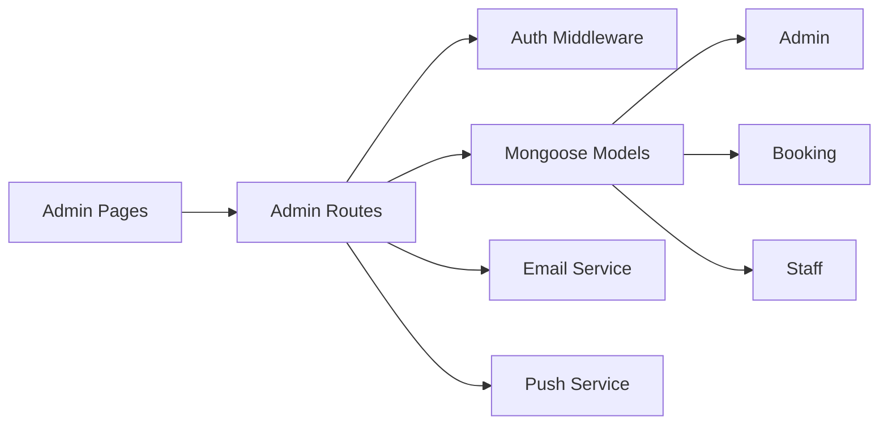

# Admin Dashboard & Management

<cite>
**Referenced Files in This Document**
- [admin/dashboard.html](file://admin/dashboard.html)
- [admin/bookings.html](file://admin/bookings.html)
- [admin/staff.html](file://admin/staff.html)
- [admin/analytics.html](file://admin/analytics.html)
- [admin/settings.html](file://admin/settings.html)
- [admin/login.html](file://admin/login.html)
- [server/middleware/adminAuth.js](file://server/middleware/adminAuth.js)
- [server/models/Admin.js](file://server/models/Admin.js)
- [server/models/Booking.js](file://server/models/Booking.js)
- [server/models/Staff.js](file://server/models/Staff.js)
- [server/routes/adminRoutes.js](file://server/routes/adminRoutes.js)
- [server/services/emailService.js](file://server/services/emailService.js)
- [server/services/notificationService.js](file://server/services/notificationService.js)
</cite>

## Table of Contents
1. [Introduction](#introduction)
2. [Project Structure](#project-structure)
3. [Core Components](#core-components)
4. [Architecture Overview](#architecture-overview)
5. [Detailed Component Analysis](#detailed-component-analysis)
6. [Dependency Analysis](#dependency-analysis)
7. [Performance Considerations](#performance-considerations)
8. [Troubleshooting Guide](#troubleshooting-guide)
9. [Conclusion](#conclusion)

## Introduction
This document describes the Emerald Pearland Events admin dashboard system. It covers the complete admin interface including booking management, staff coordination, client communication, analytics reporting, and settings configuration. It also explains the JWT-based authentication system, session management, role-based access control, and security considerations including audit logging and administrative access controls.

## Project Structure
The admin portal is composed of:
- Static admin pages (HTML/CSS/JS) under the admin/ folder for dashboards, bookings, staff, analytics, settings, and login
- Backend server with Express routing under server/ for protected admin APIs
- Authentication middleware and models for admin users and related entities
- Services for email and push notifications

**Diagram sources**
- [admin/dashboard.html](file://admin/dashboard.html#L1-L800)
- [admin/bookings.html](file://admin/bookings.html#L1-L800)
- [admin/staff.html](file://admin/staff.html#L1-L800)
- [admin/analytics.html](file://admin/analytics.html#L1-L800)
- [admin/settings.html](file://admin/settings.html#L1-L800)
- [admin/login.html](file://admin/login.html#L1-L800)
- [server/routes/adminRoutes.js](file://server/routes/adminRoutes.js#L1-L1160)
- [server/middleware/adminAuth.js](file://server/middleware/adminAuth.js#L1-L56)
- [server/services/emailService.js](file://server/services/emailService.js#L1-L467)
- [server/services/notificationService.js](file://server/services/notificationService.js#L1-L78)
- [server/models/Admin.js](file://server/models/Admin.js#L1-L70)
- [server/models/Booking.js](file://server/models/Booking.js#L1-L169)
- [server/models/Staff.js](file://server/models/Staff.js#L1-L57)

**Section sources**
- [admin/dashboard.html](file://admin/dashboard.html#L1-L800)
- [admin/bookings.html](file://admin/bookings.html#L1-L800)
- [admin/staff.html](file://admin/staff.html#L1-L800)
- [admin/analytics.html](file://admin/analytics.html#L1-L800)
- [admin/settings.html](file://admin/settings.html#L1-L800)
- [admin/login.html](file://admin/login.html#L1-L800)
- [server/routes/adminRoutes.js](file://server/routes/adminRoutes.js#L1-L1160)
- [server/middleware/adminAuth.js](file://server/middleware/adminAuth.js#L1-L56)
- [server/models/Admin.js](file://server/models/Admin.js#L1-L70)
- [server/models/Booking.js](file://server/models/Booking.js#L1-L169)
- [server/models/Staff.js](file://server/models/Staff.js#L1-L57)
- [server/services/emailService.js](file://server/services/emailService.js#L1-L467)
- [server/services/notificationService.js](file://server/services/notificationService.js#L1-L78)

## Core Components
- Authentication and Authorization
  - JWT-based session via httpOnly cookies
  - Protected routes middleware
  - Admin roles: super_admin, admin, manager
- Booking Management
  - CRUD operations, status updates, payment tracking, notes, staff assignment
  - Client and staff communication workflows
- Staff Management
  - Personnel profiles, availability toggles, category filtering, assigned bookings
- Analytics
  - Business metrics, revenue tracking, conversion funnels, charts
- Settings
  - System preferences, branding, social links, notification preferences
- Communication
  - Email templates for bookings, reminders, appreciation, staff feedback
  - Push notifications via Web Push (VAPID)

**Section sources**
- [server/middleware/adminAuth.js](file://server/middleware/adminAuth.js#L1-L56)
- [server/models/Admin.js](file://server/models/Admin.js#L1-L70)
- [server/routes/adminRoutes.js](file://server/routes/adminRoutes.js#L1-L1160)
- [server/models/Booking.js](file://server/models/Booking.js#L1-L169)
- [server/models/Staff.js](file://server/models/Staff.js#L1-L57)
- [server/services/emailService.js](file://server/services/emailService.js#L1-L467)
- [server/services/notificationService.js](file://server/services/notificationService.js#L1-L78)

## Architecture Overview
The admin portal follows a classic client-server pattern:
- Admin pages are static HTML/CSS/JS with embedded JavaScript for UI interactions
- Protected admin APIs are served by Express routes
- Authentication middleware validates JWT cookies and enforces access control
- Data models define schemas for Admin, Booking, Staff, and related entities
- Services encapsulate external integrations (email via Brevo, push via Web Push)

**Diagram sources**
- [admin/login.html](file://admin/login.html#L720-L800)
- [server/middleware/adminAuth.js](file://server/middleware/adminAuth.js#L1-L56)
- [server/routes/adminRoutes.js](file://server/routes/adminRoutes.js#L59-L152)
- [server/models/Admin.js](file://server/models/Admin.js#L1-L70)
- [server/services/emailService.js](file://server/services/emailService.js#L1-L467)
- [server/services/notificationService.js](file://server/services/notificationService.js#L1-L78)

## Detailed Component Analysis

### Authentication System (JWT, Session, RBAC)
- Cookie-based JWT
  - Token stored as httpOnly cookie with secure flags
  - Expiration: 24 hours
  - Verification on protected routes and pages
- Admin Roles
  - Enumerated roles: super_admin, admin, manager
  - Access enforced by middleware and route handlers
- Password Security
  - Bcrypt hashing for password storage
  - Pre-save hooks hash passwords before persisting

**Diagram sources**
- [server/routes/adminRoutes.js](file://server/routes/adminRoutes.js#L59-L142)
- [server/middleware/adminAuth.js](file://server/middleware/adminAuth.js#L3-L31)
- [server/models/Admin.js](file://server/models/Admin.js#L52-L67)

**Section sources**
- [server/middleware/adminAuth.js](file://server/middleware/adminAuth.js#L1-L56)
- [server/models/Admin.js](file://server/models/Admin.js#L1-L70)
- [server/routes/adminRoutes.js](file://server/routes/adminRoutes.js#L59-L152)

### Booking Management Dashboard
- Real-time booking display with filters (status, event type, search)
- Pagination and sorting
- Actions: update status, mark paid, add admin notes, assign staff, delete
- Client communication: send appreciation email, message staff with custom message
- Staff assignment workflow: select staff members and dispatch feedback requests

**Diagram sources**
- [admin/bookings.html](file://admin/bookings.html#L1-L800)
- [server/routes/adminRoutes.js](file://server/routes/adminRoutes.js#L174-L418)
- [server/services/emailService.js](file://server/services/emailService.js#L295-L378)

**Section sources**
- [admin/bookings.html](file://admin/bookings.html#L1-L800)
- [server/routes/adminRoutes.js](file://server/routes/adminRoutes.js#L174-L418)
- [server/models/Booking.js](file://server/models/Booking.js#L1-L169)
- [server/services/emailService.js](file://server/services/emailService.js#L295-L378)

### Staff Management System
- Personnel profiles with category, contact info, availability toggle
- Availability tracking and filtering
- Performance insights via assigned bookings count and notes
- CRUD operations for adding/removing staff

**Diagram sources**
- [server/models/Staff.js](file://server/models/Staff.js#L1-L57)
- [server/models/Booking.js](file://server/models/Booking.js#L1-L169)
- [server/routes/adminRoutes.js](file://server/routes/adminRoutes.js#L633-L712)

**Section sources**
- [admin/staff.html](file://admin/staff.html#L1-L800)
- [server/routes/adminRoutes.js](file://server/routes/adminRoutes.js#L633-L712)
- [server/models/Staff.js](file://server/models/Staff.js#L1-L57)

### Analytics Reporting
- Overview metrics: total bookings, this month vs last month, pending confirmations, upcoming events, revenue, projected revenue
- Charts: monthly bookings trend, revenue by event type, event distribution, booking funnel, annual comparison, conversion funnel
- Data aggregation via MongoDB aggregation pipeline

**Diagram sources**
- [server/routes/adminRoutes.js](file://server/routes/adminRoutes.js#L448-L560)
- [admin/analytics.html](file://admin/analytics.html#L690-L742)

**Section sources**
- [admin/analytics.html](file://admin/analytics.html#L1-L800)
- [server/routes/adminRoutes.js](file://server/routes/adminRoutes.js#L448-L560)

### Settings Configuration
- System preferences: business name, phone, email, address
- Notification settings: new booking, WhatsApp notifications
- UI preferences: dark mode, social handles, BeholdFeed ID
- Branding: profile image
- Persistence via AdminSettings model with creation on first access

**Section sources**
- [admin/settings.html](file://admin/settings.html#L1-L800)
- [server/routes/adminRoutes.js](file://server/routes/adminRoutes.js#L753-L800)

### Client Communication Center
- Email templates for:
  - Business notifications
  - Client booking confirmation
  - Follow-up emails
  - Event reminders (48 hours prior)
  - Client appreciation and feedback
  - Staff feedback requests
  - Staff event reminders
- Brevo SDK integration for transactional emails
- Reply-to and sender configuration

**Section sources**
- [server/services/emailService.js](file://server/services/emailService.js#L1-L467)
- [server/routes/adminRoutes.js](file://server/routes/adminRoutes.js#L336-L418)

### Push Notifications (Web Push)
- VAPID public/private key configuration
- Subscription management per admin
- Broadcast push notifications to subscribed admins
- Automatic cleanup of expired subscriptions

**Section sources**
- [server/services/notificationService.js](file://server/services/notificationService.js#L1-L78)
- [server/routes/adminRoutes.js](file://server/routes/adminRoutes.js#L22-L57)
- [server/models/Admin.js](file://server/models/Admin.js#L45-L48)

## Dependency Analysis
- Frontend to Backend
  - Admin pages call protected APIs under /api/admin
  - Authentication enforced by middleware on all protected routes
- Backend Dependencies
  - Express routes depend on models for data access
  - Email service depends on Brevo SDK and environment variables
  - Push service depends on VAPID keys and browser subscriptions
- Data Models
  - Admin, Booking, Staff interconnected via references
  - Indexes on frequently queried fields (eventDate, status, createdAt)

**Diagram sources**
- [server/routes/adminRoutes.js](file://server/routes/adminRoutes.js#L1-L1160)
- [server/middleware/adminAuth.js](file://server/middleware/adminAuth.js#L1-L56)
- [server/services/emailService.js](file://server/services/emailService.js#L1-L467)
- [server/services/notificationService.js](file://server/services/notificationService.js#L1-L78)
- [server/models/Admin.js](file://server/models/Admin.js#L1-L70)
- [server/models/Booking.js](file://server/models/Booking.js#L1-L169)
- [server/models/Staff.js](file://server/models/Staff.js#L1-L57)

**Section sources**
- [server/routes/adminRoutes.js](file://server/routes/adminRoutes.js#L1-L1160)
- [server/middleware/adminAuth.js](file://server/middleware/adminAuth.js#L1-L56)
- [server/models/Admin.js](file://server/models/Admin.js#L1-L70)
- [server/models/Booking.js](file://server/models/Booking.js#L1-L169)
- [server/models/Staff.js](file://server/models/Staff.js#L1-L57)

## Performance Considerations
- Database indexing
  - Booking indices on customerId, eventDate, status, createdAt for efficient queries
- Pagination and limits
  - Default page size and skip/limit for listing endpoints
- Aggregation efficiency
  - Revenue aggregations grouped by month/year to support trend charts
- Email throughput
  - Batched staff feedback requests with success/failure counts
- Push notifications
  - Iterative delivery with automatic cleanup of invalid subscriptions

[No sources needed since this section provides general guidance]

## Troubleshooting Guide
- Authentication failures
  - Missing or expired adminToken cookie
  - Verify JWT verification and redirect behavior
- Email service issues
  - BREVO_API_KEY missing disables email service
  - Review template rendering and sender configuration
- Push notifications
  - Missing VAPID keys disable push
  - Expired subscriptions are automatically removed
- Booking updates
  - Ensure required fields are present (status, isPaid, notes, assignedStaff)
  - Validate staff IDs for messaging workflows

**Section sources**
- [server/middleware/adminAuth.js](file://server/middleware/adminAuth.js#L3-L44)
- [server/services/emailService.js](file://server/services/emailService.js#L9-L27)
- [server/services/notificationService.js](file://server/services/notificationService.js#L6-L14)
- [server/routes/adminRoutes.js](file://server/routes/adminRoutes.js#L294-L418)

## Conclusion
The Emerald Pearland Events admin dashboard provides a comprehensive management solution with secure authentication, robust booking workflows, staff coordination, rich analytics, and flexible settings. The system leverages JWT cookies, role-based access control, modular services for email and push notifications, and well-defined data models to support efficient operations and scalability.