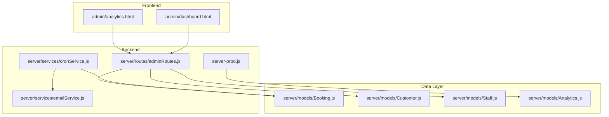
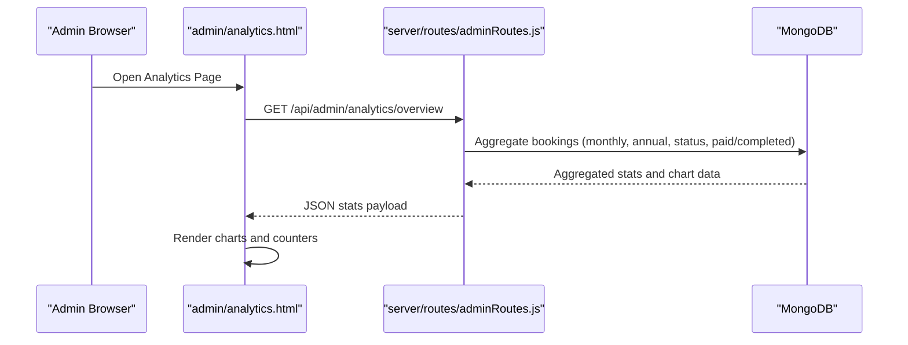
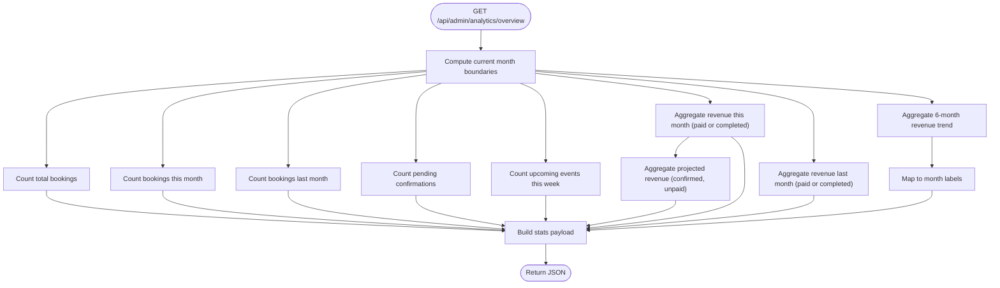
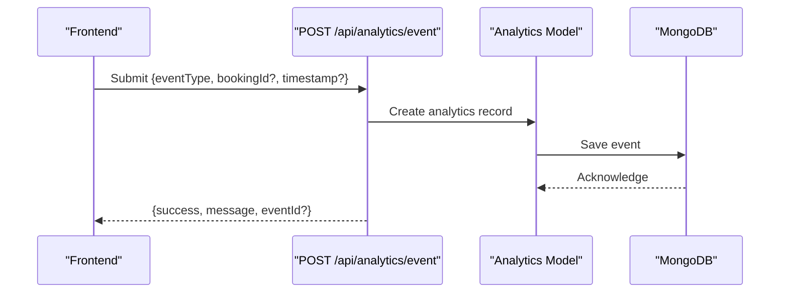
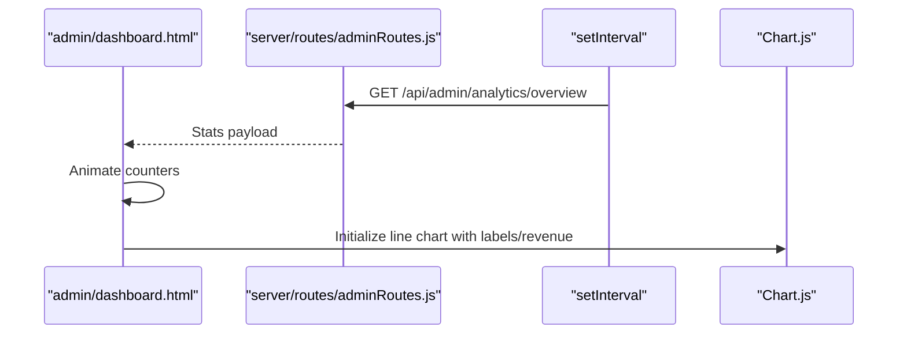
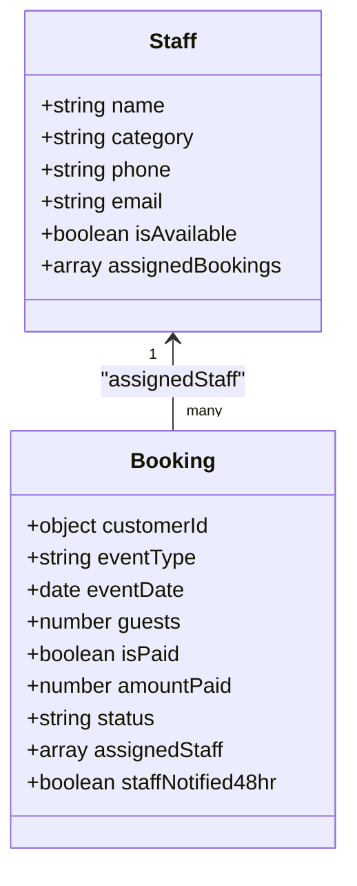
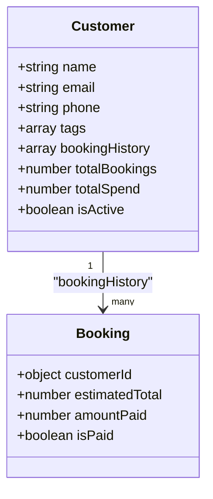
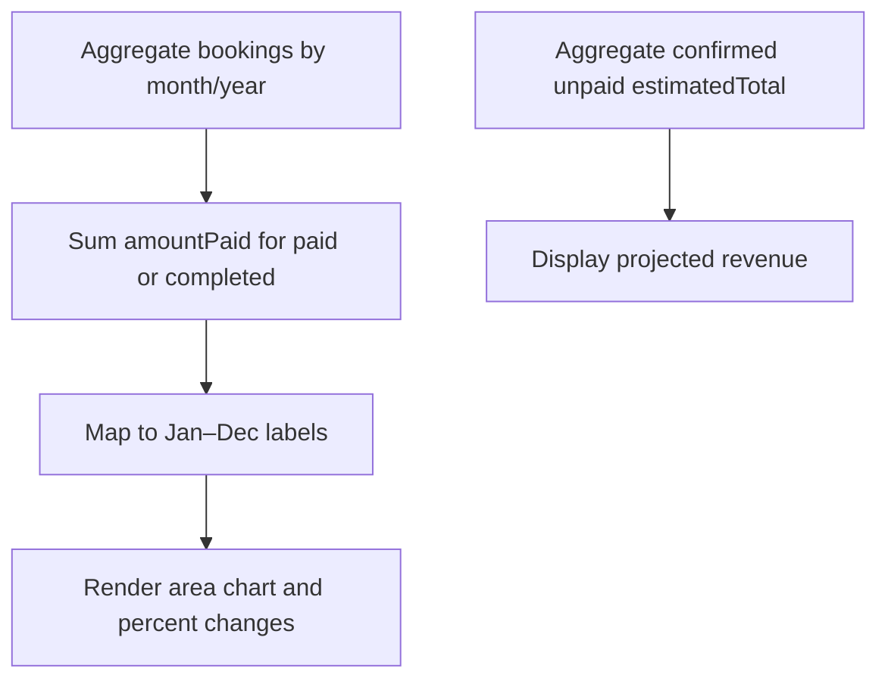
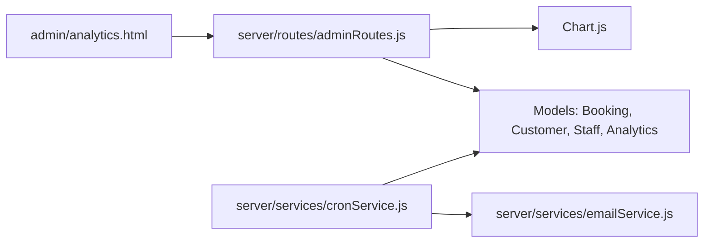
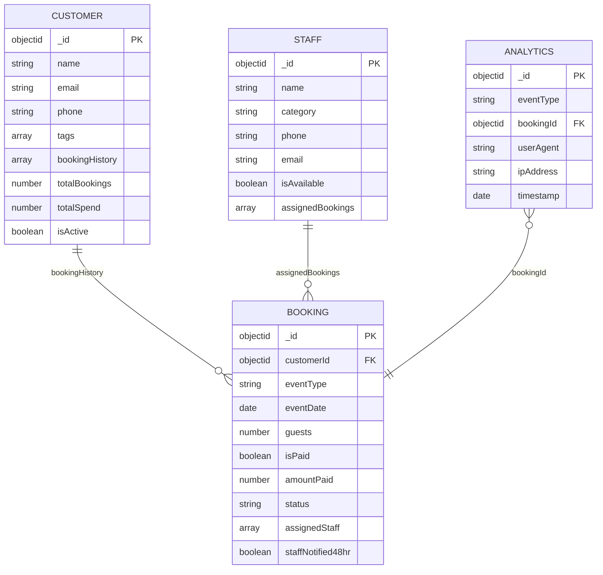

# Analytics & Reporting

<cite>
**Referenced Files in This Document**
- [analytics.html](file://admin/analytics.html)
- [Analytics.js](file://server/models/Analytics.js)
- [adminRoutes.js](file://server/routes/adminRoutes.js)
- [Booking.js](file://server/models/Booking.js)
- [Customer.js](file://server/models/Customer.js)
- [Staff.js](file://server/models/Staff.js)
- [server-prod.js](file://server-prod.js)
- [cronService.js](file://server/services/cronService.js)
- [emailService.js](file://server/services/emailService.js)
- [dashboard.html](file://admin/dashboard.html)
</cite>

## Table of Contents
1. [Introduction](#introduction)
2. [Project Structure](#project-structure)
3. [Core Components](#core-components)
4. [Architecture Overview](#architecture-overview)
5. [Detailed Component Analysis](#detailed-component-analysis)
6. [Dependency Analysis](#dependency-analysis)
7. [Performance Considerations](#performance-considerations)
8. [Troubleshooting Guide](#troubleshooting-guide)
9. [Conclusion](#conclusion)
10. [Appendices](#appendices)

## Introduction
This document describes the analytics and reporting dashboard for the Emerald Pearland Events booking system. It covers business metrics visualization (revenue tracking, booking volume trends, staff performance indicators, and client acquisition analytics), data aggregation processes, report generation workflows, export capabilities, real-time dashboard widgets, forecasting and trend analysis, comparative reporting, and interpretation guidance. It also documents the underlying data models, caching strategies, and real-time synchronization mechanisms.

## Project Structure
The analytics dashboard is composed of:
- Frontend: a dedicated analytics page with embedded charts powered by Chart.js
- Backend: Express routes for analytics overview and event tracking, with MongoDB models for bookings, customers, staff, and analytics events
- Services: email automation and scheduled tasks for reminders and follow-ups
- Real-time: periodic refresh of dashboard statistics and push notification infrastructure

**Diagram sources**
- [analytics.html](file://admin/analytics.html#L694-L741)
- [adminRoutes.js](file://server/routes/adminRoutes.js#L448-L560)
- [server-prod.js](file://server-prod.js#L268-L307)
- [Booking.js](file://server/models/Booking.js#L1-L169)
- [Customer.js](file://server/models/Customer.js#L1-L93)
- [Staff.js](file://server/models/Staff.js#L1-L57)
- [Analytics.js](file://server/models/Analytics.js#L1-L41)
- [cronService.js](file://server/services/cronService.js#L1-L185)
- [emailService.js](file://server/services/emailService.js#L1-L467)

**Section sources**
- [analytics.html](file://admin/analytics.html#L694-L741)
- [adminRoutes.js](file://server/routes/adminRoutes.js#L448-L560)
- [server-prod.js](file://server-prod.js#L268-L307)

## Core Components
- Analytics overview endpoint: aggregates monthly and annual revenue, booking counts, pending confirmations, upcoming events, and projected revenue
- Analytics event tracking endpoint: records frontend analytics events (e.g., form submission, WhatsApp click, service selection, page view, booking confirmed, budget selected)
- Dashboard widgets: animated counters and charts for key performance indicators
- Staff performance indicators: staff availability and assignment tracking via staff model and booking assignments
- Client acquisition analytics: customer tagging and history for CRM insights
- Automated reminders and follow-ups: cron-based email notifications for follow-ups, event reminders, and staff alerts

**Section sources**
- [adminRoutes.js](file://server/routes/adminRoutes.js#L448-L560)
- [server-prod.js](file://server-prod.js#L271-L307)
- [analytics.html](file://admin/analytics.html#L696-L740)
- [Staff.js](file://server/models/Staff.js#L1-L57)
- [Customer.js](file://server/models/Customer.js#L1-L93)
- [cronService.js](file://server/services/cronService.js#L21-L161)

## Architecture Overview
The analytics dashboard integrates frontend visualization with backend aggregation and event logging. The overview endpoint performs aggregations on the Booking collection to compute metrics and trends. The event tracking endpoint persists analytics events for later analysis. Email and cron services support operational metrics and reminders.

**Diagram sources**
- [adminRoutes.js](file://server/routes/adminRoutes.js#L448-L560)
- [analytics.html](file://admin/analytics.html#L696-L740)

## Detailed Component Analysis

### Analytics Overview Endpoint
The overview endpoint computes:
- Total bookings and this month’s bookings
- Percentage change in bookings and revenue vs. last month
- Pending confirmations and upcoming events this week
- Revenue this month and last month using paid or completed criteria
- Six-month revenue trend for the line chart
- Projected revenue from confirmed but unpaid bookings

**Diagram sources**
- [adminRoutes.js](file://server/routes/adminRoutes.js#L448-L560)

**Section sources**
- [adminRoutes.js](file://server/routes/adminRoutes.js#L448-L560)

### Analytics Event Tracking Endpoint
The event tracking endpoint logs frontend analytics events with metadata:
- eventType: constrained to predefined values
- bookingId: optional reference to a booking
- userAgent, ipAddress, timestamp

**Diagram sources**
- [server-prod.js](file://server-prod.js#L271-L307)
- [Analytics.js](file://server/models/Analytics.js#L1-L41)

**Section sources**
- [server-prod.js](file://server-prod.js#L271-L307)
- [Analytics.js](file://server/models/Analytics.js#L7-L38)

### Real-Time Dashboard Widgets
The dashboard page loads stats periodically and animates counters. It also initializes the monthly revenue chart using data returned by the overview endpoint.

**Diagram sources**
- [dashboard.html](file://admin/dashboard.html#L1186-L1211)
- [adminRoutes.js](file://server/routes/adminRoutes.js#L448-L560)

**Section sources**
- [dashboard.html](file://admin/dashboard.html#L1186-L1211)
- [adminRoutes.js](file://server/routes/adminRoutes.js#L448-L560)

### Staff Performance Indicators
Staff availability and assignments are tracked via the Staff model and Booking assignments. The dashboard and staff pages leverage these fields to monitor capacity and workload.

**Diagram sources**
- [Staff.js](file://server/models/Staff.js#L1-L57)
- [Booking.js](file://server/models/Booking.js#L1-L169)

**Section sources**
- [Staff.js](file://server/models/Staff.js#L1-L57)
- [Booking.js](file://server/models/Booking.js#L76-L101)

### Client Acquisition Analytics
Customer records include tags, booking history, preferred services, and spend metrics. These support CRM insights and acquisition funnel analysis.

**Diagram sources**
- [Customer.js](file://server/models/Customer.js#L1-L93)
- [Booking.js](file://server/models/Booking.js#L41-L105)

**Section sources**
- [Customer.js](file://server/models/Customer.js#L36-L66)
- [Booking.js](file://server/models/Booking.js#L93-L105)

### Forecasting and Trend Analysis
- Monthly revenue trend: six-month aggregation grouped by month/year
- Projected revenue: sum of estimated totals for confirmed, unpaid bookings
- Comparative reporting: monthly vs. last month comparisons for bookings and revenue

**Diagram sources**
- [adminRoutes.js](file://server/routes/adminRoutes.js#L498-L534)

**Section sources**
- [adminRoutes.js](file://server/routes/adminRoutes.js#L498-L534)

### Report Generation and Export Capabilities
- The analytics page renders charts for visualization but does not expose built-in export buttons in the provided code.
- To implement export, integrate Chart.js export plugins or backend endpoints to generate CSV/PDF reports from aggregated data.

[No sources needed since this section provides general guidance]

### Custom Report Creation Tools and Filters
- The analytics page does not include date-range filters or custom report builders in the provided code.
- To enable filtering, add date-range inputs and backend aggregation endpoints similar to the overview endpoint.

[No sources needed since this section provides general guidance]

## Dependency Analysis
The analytics system depends on:
- Express routes for overview and event tracking
- Mongoose models for bookings, customers, staff, and analytics
- Chart.js for frontend visualization
- Email and cron services for operational metrics

**Diagram sources**
- [adminRoutes.js](file://server/routes/adminRoutes.js#L448-L560)
- [Analytics.js](file://server/models/Analytics.js#L1-L41)
- [Booking.js](file://server/models/Booking.js#L1-L169)
- [Customer.js](file://server/models/Customer.js#L1-L93)
- [Staff.js](file://server/models/Staff.js#L1-L57)
- [cronService.js](file://server/services/cronService.js#L1-L185)
- [emailService.js](file://server/services/emailService.js#L1-L467)

**Section sources**
- [adminRoutes.js](file://server/routes/adminRoutes.js#L448-L560)
- [Analytics.js](file://server/models/Analytics.js#L1-L41)
- [Booking.js](file://server/models/Booking.js#L1-L169)
- [Customer.js](file://server/models/Customer.js#L1-L93)
- [Staff.js](file://server/models/Staff.js#L1-L57)
- [cronService.js](file://server/services/cronService.js#L1-L185)
- [emailService.js](file://server/services/emailService.js#L1-L467)

## Performance Considerations
- Aggregation queries: ensure proper indexes on date and status fields to optimize overview computations.
- Chart rendering: defer heavy computations until data is available; use virtualized lists for large datasets.
- Caching: cache frequently accessed overview metrics for short intervals to reduce database load.
- Background tasks: schedule cron jobs at off-peak times to minimize impact on analytics queries.

[No sources needed since this section provides general guidance]

## Troubleshooting Guide
- Analytics endpoint errors: verify BREVO API key initialization and email service readiness.
- Overview aggregation failures: check date boundary calculations and aggregation pipeline correctness.
- Event tracking failures: confirm eventType validation and that analytics records are persisted despite transient errors.

**Section sources**
- [emailService.js](file://server/services/emailService.js#L9-L27)
- [adminRoutes.js](file://server/routes/adminRoutes.js#L553-L559)
- [server-prod.js](file://server-prod.js#L299-L306)

## Conclusion
The analytics and reporting dashboard provides a robust foundation for monitoring business performance, with real-time metrics, trend analysis, and operational automation. Extending it with export capabilities, date-range filters, and advanced forecasting will further enhance decision-making and reporting workflows.

[No sources needed since this section summarizes without analyzing specific files]

## Appendices

### Data Models Diagram

**Diagram sources**
- [Booking.js](file://server/models/Booking.js#L1-L169)
- [Customer.js](file://server/models/Customer.js#L1-L93)
- [Staff.js](file://server/models/Staff.js#L1-L57)
- [Analytics.js](file://server/models/Analytics.js#L1-L41)

### Interpretation Guidance
- Revenue trends: rising monthly revenue indicates growth; sustained increases in paid bookings improve cash flow.
- Conversion funnel: declining counts between stages suggest bottlenecks (e.g., low quote-to-confirmation conversion).
- Pending confirmations: high counts imply delays in follow-ups or resource allocation.
- Upcoming events: weekly counts help balance staffing and logistics.
- Projected revenue: track uncollected confirmed income to manage liquidity.

[No sources needed since this section provides general guidance]