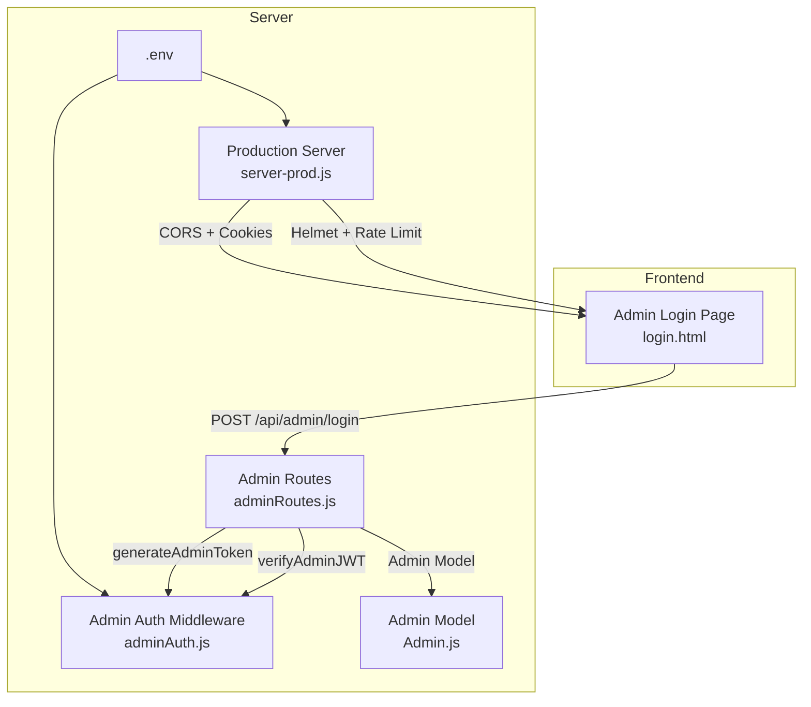
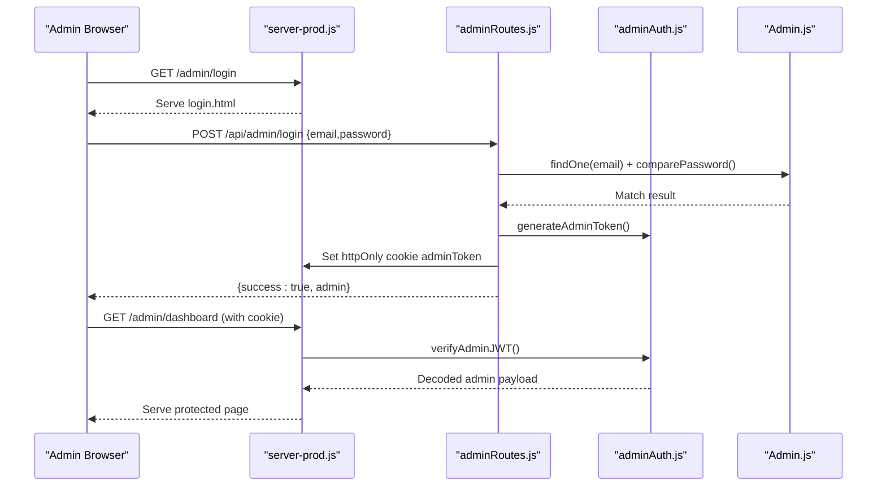
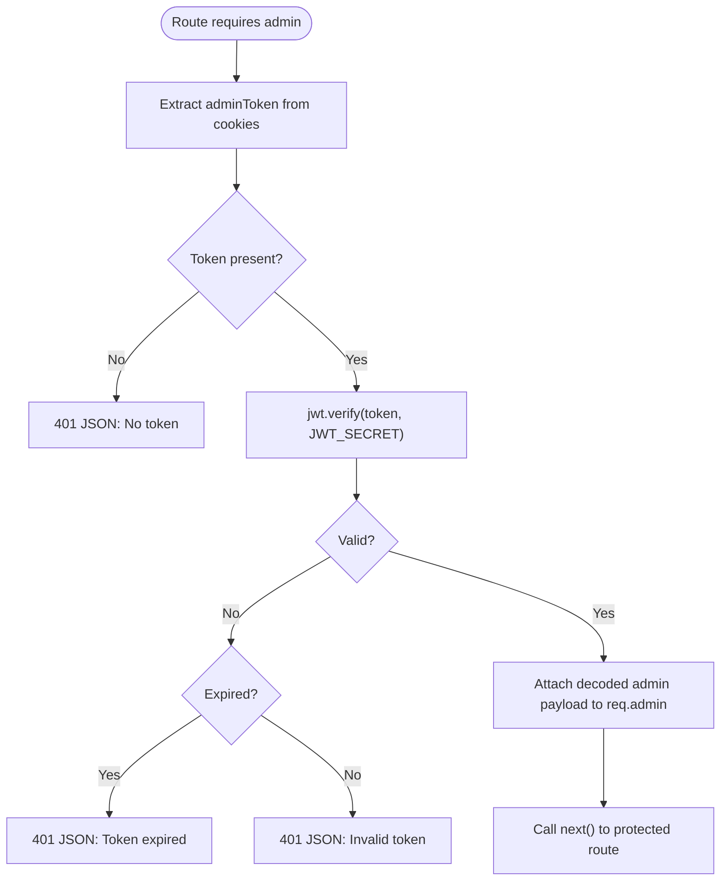
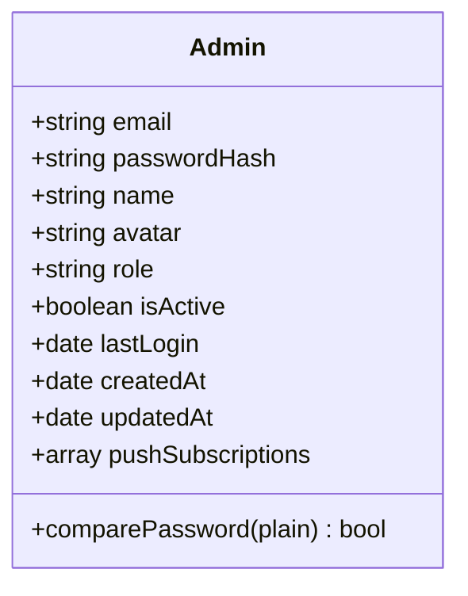
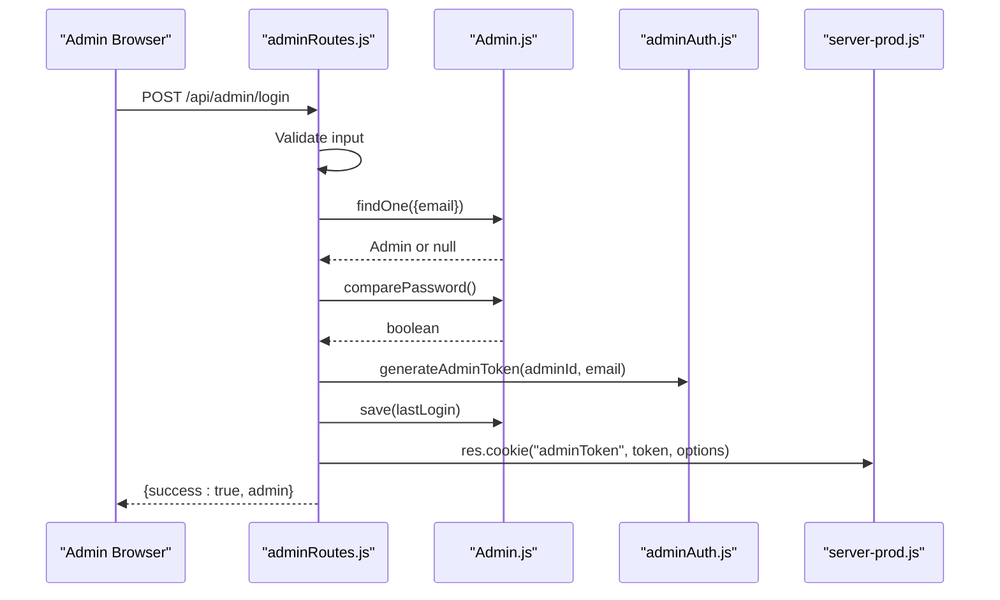
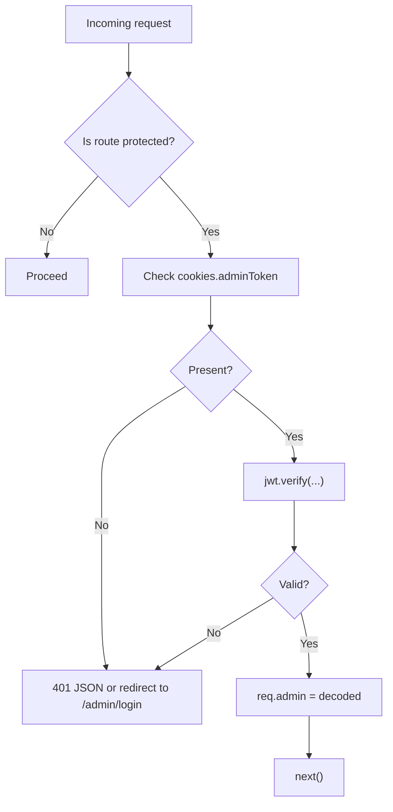
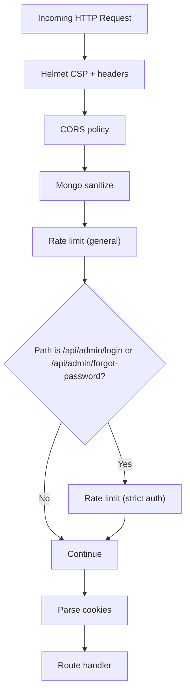
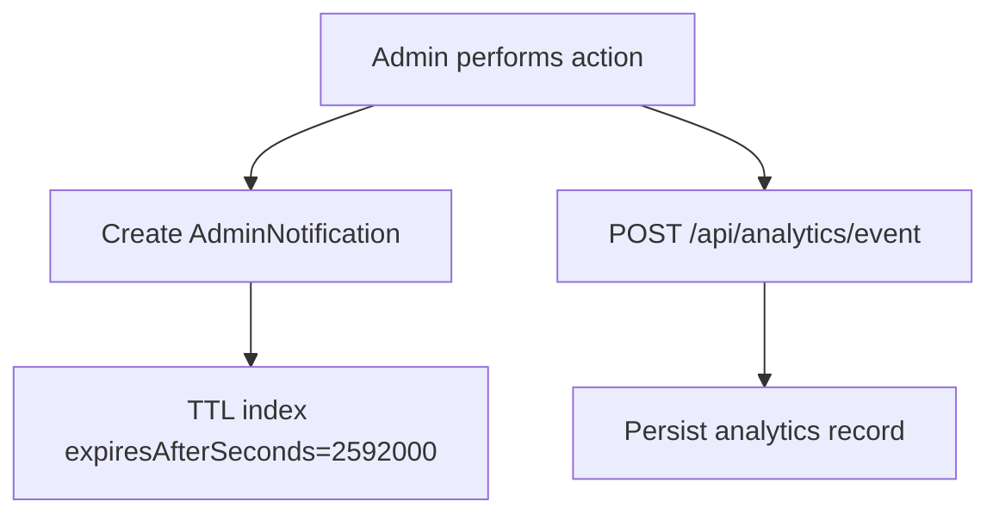
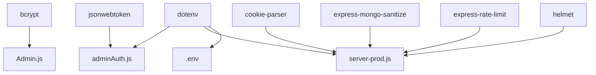

# Authentication & Security

<cite>
**Referenced Files in This Document**
- [adminAuth.js](file://server/middleware/adminAuth.js)
- [adminRoutes.js](file://server/routes/adminRoutes.js)
- [Admin.js](file://server/models/Admin.js)
- [server-prod.js](file://server-prod.js)
- [login.html](file://admin/login.html)
- [.env](file://.env)
- [seed-admin.js](file://seed-admin.js)
- [package.json](file://package.json)
- [server.js](file://server.js)
- [AdminSettings.js](file://server/models/AdminSettings.js)
- [AdminNotification.js](file://server/models/AdminNotification.js)
- [notificationService.js](file://server/services/notificationService.js)
</cite>

## Table of Contents
1. [Introduction](#introduction)
2. [Project Structure](#project-structure)
3. [Core Components](#core-components)
4. [Architecture Overview](#architecture-overview)
5. [Detailed Component Analysis](#detailed-component-analysis)
6. [Dependency Analysis](#dependency-analysis)
7. [Performance Considerations](#performance-considerations)
8. [Troubleshooting Guide](#troubleshooting-guide)
9. [Conclusion](#conclusion)
10. [Appendices](#appendices)

## Introduction
This document explains the admin authentication and security system for the Emerald Pearland Events booking platform. It covers JWT-based authentication (token generation, validation, and session lifecycle), the admin user model with password hashing and roles, login workflow, middleware protections, and security hardening. It also includes best practices for token storage/transmission, rate limiting, audit logging, security headers, and protection against common attacks.

## Project Structure
The authentication and security system spans middleware, routes, models, and server initialization:

- Middleware: JWT verification and admin page guards
- Routes: Login/logout, protected endpoints, and admin-only actions
- Models: Admin user schema with password hashing and roles
- Server: Rate limiting, security headers, and production-grade middleware
- Frontend: Admin login page that submits credentials to the backend

**Diagram sources**
- [login.html](file://admin/login.html#L720-L795)
- [adminAuth.js](file://server/middleware/adminAuth.js#L3-L53)
- [adminRoutes.js](file://server/routes/adminRoutes.js#L59-L152)
- [Admin.js](file://server/models/Admin.js#L4-L67)
- [server-prod.js](file://server-prod.js#L25-L101)
- [.env](file://.env#L5-L10)

**Section sources**
- [adminAuth.js](file://server/middleware/adminAuth.js#L1-L56)
- [adminRoutes.js](file://server/routes/adminRoutes.js#L1-L152)
- [Admin.js](file://server/models/Admin.js#L1-L70)
- [server-prod.js](file://server-prod.js#L25-L101)
- [login.html](file://admin/login.html#L720-L795)
- [.env](file://.env#L5-L10)

## Core Components
- JWT middleware: Extracts and verifies the httpOnly cookie token; redirects unauthenticated users for page routes.
- Admin routes: Handles login, logout, protected endpoints, and admin-specific actions.
- Admin model: Defines schema, password hashing via bcrypt, and password comparison method.
- Production server: Applies Helmet security headers, rate limiting, and CORS policies.

Key responsibilities:
- Token generation and signing with secret from environment
- Secure cookie configuration (httpOnly, secure, sameSite strict)
- Rate limiting for authentication endpoints
- Security headers and CSP via Helmet

**Section sources**
- [adminAuth.js](file://server/middleware/adminAuth.js#L3-L53)
- [adminRoutes.js](file://server/routes/adminRoutes.js#L59-L152)
- [Admin.js](file://server/models/Admin.js#L52-L67)
- [server-prod.js](file://server-prod.js#L44-L101)
- [.env](file://.env#L8-L8)

## Architecture Overview
The system uses a layered approach:
- Presentation: Admin login page posts credentials to the backend
- Application: Express routes handle authentication and protect downstream endpoints
- Persistence: Mongoose model stores admin records with hashed passwords
- Security: Middleware enforces JWT verification and applies rate limits and headers

**Diagram sources**
- [login.html](file://admin/login.html#L750-L776)
- [server-prod.js](file://server-prod.js#L160-L167)
- [adminRoutes.js](file://server/routes/adminRoutes.js#L59-L152)
- [adminAuth.js](file://server/middleware/adminAuth.js#L3-L53)
- [Admin.js](file://server/models/Admin.js#L64-L67)

## Detailed Component Analysis

### JWT Middleware and Session Management
- Token extraction: Reads the httpOnly cookie named adminToken
- Verification: Uses jsonwebtoken with secret from environment
- Expiration handling: Distinguishes expired vs invalid tokens
- Page guard: Redirects to login when no token or invalid
- Token generation: Creates signed JWT with 24-hour expiry

**Diagram sources**
- [adminAuth.js](file://server/middleware/adminAuth.js#L3-L31)

**Section sources**
- [adminAuth.js](file://server/middleware/adminAuth.js#L3-L53)

### Admin User Model and Password Hashing
- Schema fields: email, passwordHash, name, avatar, role, isActive, lastLogin, timestamps, pushSubscriptions
- Pre-save hook: Automatically hashes password using bcrypt with salt rounds
- Instance method: comparePassword to verify plaintext against stored hash

**Diagram sources**
- [Admin.js](file://server/models/Admin.js#L4-L67)

**Section sources**
- [Admin.js](file://server/models/Admin.js#L52-L67)

### Login Workflow and Token Issuance
- Input validation: Requires email and password
- Lookup: Finds admin by normalized email
- Credential verification: Uses comparePassword
- Token creation: generateAdminToken with 24h expiry
- Session cookie: Sets httpOnly, secure (when production), sameSite strict, 24h maxAge
- Post-login update: Updates lastLogin timestamp

**Diagram sources**
- [adminRoutes.js](file://server/routes/adminRoutes.js#L59-L152)
- [Admin.js](file://server/models/Admin.js#L64-L67)
- [adminAuth.js](file://server/middleware/adminAuth.js#L47-L53)
- [server-prod.js](file://server-prod.js#L114-L119)

**Section sources**
- [adminRoutes.js](file://server/routes/adminRoutes.js#L59-L152)
- [Admin.js](file://server/models/Admin.js#L52-L67)
- [adminAuth.js](file://server/middleware/adminAuth.js#L47-L53)
- [server-prod.js](file://server-prod.js#L114-L119)

### Admin Middleware Protection
- verifyAdminJWT: Enforces JWT on API routes; returns JSON error on failure
- verifyAdminPage: Enforces JWT on admin HTML pages; redirects to login on failure
- generateAdminToken: Produces signed JWT with expiry

**Diagram sources**
- [adminAuth.js](file://server/middleware/adminAuth.js#L3-L45)

**Section sources**
- [adminAuth.js](file://server/middleware/adminAuth.js#L3-L45)

### Protected Routes and Authorization
- Protected endpoints: Many routes under /api/admin are guarded by verifyAdminJWT
- Example protected routes: /api/admin/me, /api/admin/bookings, /api/admin/analytics, etc.
- Authorization model: Roles are defined in the Admin schema (super_admin, admin, manager). While the schema defines roles, enforcement of role-based access control is not implemented in the provided middleware. Administrators can access protected routes; role checks are not enforced at middleware level.

Note: The current middleware does not inspect role claims; all logged-in admins can access protected routes. To enforce RBAC, add role checks in middleware or route handlers.

**Section sources**
- [adminRoutes.js](file://server/routes/adminRoutes.js#L154-L168)
- [Admin.js](file://server/models/Admin.js#L24-L28)

### Security Hardening and Rate Limiting
- Helmet: Applies Content-Security-Policy and other security headers
- CORS: Configured origins and credentials support
- Rate limiting:
  - General limiter: 1000 requests per 15 minutes per IP
  - Authentication limiter: 20 requests per 15 minutes per IP for /api/admin/login and /api/admin/forgot-password
- Cookie security: httpOnly, secure (production), sameSite strict
- NoSQL injection prevention: express-mongo-sanitize
- Request logging: Morgan in production

**Diagram sources**
- [server-prod.js](file://server-prod.js#L44-L101)
- [server-prod.js](file://server-prod.js#L313-L321)

**Section sources**
- [server-prod.js](file://server-prod.js#L44-L101)
- [server-prod.js](file://server-prod.js#L313-L321)

### Audit Logging and Tracking
- Analytics endpoint: Logs eventType, bookingId, userAgent, IP address, timestamp
- Admin notifications: Automatic creation of notifications for certain admin actions (e.g., booking updates, payments)
- Notification lifecycle: Automatic cleanup after 30 days via TTL index

**Diagram sources**
- [adminRoutes.js](file://server/routes/adminRoutes.js#L273-L277)
- [AdminNotification.js](file://server/models/AdminNotification.js#L36-L37)

**Section sources**
- [adminRoutes.js](file://server/routes/adminRoutes.js#L271-L307)
- [AdminNotification.js](file://server/models/AdminNotification.js#L3-L40)

### Security Headers Implementation
- Helmet applied with CSP directives for default, script, style, font, image, media, and connect sources
- CSP allows self and specific CDNs; restricts inline scripts and eval by default

**Section sources**
- [server-prod.js](file://server-prod.js#L44-L58)

### Token Storage, Transmission, and Rotation Best Practices
- Storage: httpOnly cookie prevents XSS theft
- Transmission: secure flag enabled in production
- Rotation: No refresh token mechanism; consider implementing refresh endpoints and token rotation for enhanced security
- Rotation recommendation: Issue short-lived access tokens and long-lived refresh tokens; store refresh tokens securely and invalidate on logout

[No sources needed since this section provides general guidance]

### Admin Seed and Credentials
- Seed script creates or updates an admin account with a plaintext password; the model’s pre-save hook ensures bcrypt hashing
- Default credentials are printed to console during seeding

**Section sources**
- [seed-admin.js](file://seed-admin.js#L22-L44)

## Dependency Analysis
External libraries and their roles:
- jsonwebtoken: JWT signing and verification
- bcrypt: Password hashing and verification
- helmet: Security headers and CSP
- express-rate-limit: Request throttling
- express-mongo-sanitize: NoSQL injection prevention
- cookie-parser: Cookie parsing
- dotenv: Environment variable loading

**Diagram sources**
- [package.json](file://package.json#L25-L46)
- [adminAuth.js](file://server/middleware/adminAuth.js#L1-L1)
- [Admin.js](file://server/models/Admin.js#L2-L2)
- [server-prod.js](file://server-prod.js#L44-L93)
- [.env](file://.env#L5-L10)

**Section sources**
- [package.json](file://package.json#L25-L46)
- [adminAuth.js](file://server/middleware/adminAuth.js#L1-L1)
- [Admin.js](file://server/models/Admin.js#L2-L2)
- [server-prod.js](file://server-prod.js#L44-L93)
- [.env](file://.env#L5-L10)

## Performance Considerations
- Token verification is lightweight; ensure JWT_SECRET is strong and consistent
- bcrypt cost is set by library defaults; hashing occurs on write paths (login and password changes)
- Rate limiting reduces brute-force attempts and protects CPU-intensive bcrypt comparisons
- Helmet and compression improve transport efficiency and security posture

[No sources needed since this section provides general guidance]

## Troubleshooting Guide
Common issues and resolutions:
- Invalid or expired token
  - Symptom: 401 responses with “Invalid or expired token” or “Token expired”
  - Cause: Missing cookie, tampered token, or expiry exceeded
  - Fix: Re-authenticate to obtain a new token; ensure client persists httpOnly cookie correctly
  - Section sources
    - [adminAuth.js](file://server/middleware/adminAuth.js#L19-L30)

- No authentication token
  - Symptom: 401 JSON indicating no token
  - Cause: Client did not send adminToken cookie
  - Fix: Ensure login sets the cookie and subsequent requests include credentials
  - Section sources
    - [adminAuth.js](file://server/middleware/adminAuth.js#L8-L13)

- Login fails with invalid credentials
  - Symptom: 401 JSON with invalid email or password
  - Cause: Incorrect email/password combination
  - Fix: Verify credentials; ensure email normalization and bcrypt comparison
  - Section sources
    - [adminRoutes.js](file://server/routes/adminRoutes.js#L80-L101)

- Too many authentication attempts
  - Symptom: 429 responses for login/forgot-password
  - Cause: Exceeded rate limit (20 per 15 minutes)
  - Fix: Wait for cooldown; consider IP-based mitigation or CAPTCHA for high-risk scenarios
  - Section sources
    - [server-prod.js](file://server-prod.js#L313-L321)

- Token not persisted across sessions
  - Symptom: Redirect to login after reload
  - Cause: Missing httpOnly cookie or SameSite/CORS misconfiguration
  - Fix: Confirm cookie flags and CORS credentials are enabled; ensure same-origin usage
  - Section sources
    - [server-prod.js](file://server-prod.js#L114-L119)
    - [server-prod.js](file://server-prod.js#L61-L86)

- Role-based access control not enforced
  - Symptom: All admins can access protected routes regardless of role
  - Cause: Middleware does not check role claims
  - Fix: Add role checks in middleware or route handlers
  - Section sources
    - [adminAuth.js](file://server/middleware/adminAuth.js#L3-L45)
    - [Admin.js](file://server/models/Admin.js#L24-L28)

- Push notifications not delivered
  - Symptom: Warnings about missing VAPID keys or failed sends
  - Cause: Missing VAPID_PUBLIC_KEY/VAPID_PRIVATE_KEY in environment
  - Fix: Configure VAPID keys; ensure subscriptions are valid and cleaned up on failures
  - Section sources
    - [notificationService.js](file://server/services/notificationService.js#L5-L14)
    - [notificationService.js](file://server/services/notificationService.js#L44-L60)
    - [.env](file://.env#L48-L50)

## Conclusion
The system implements a robust JWT-based admin authentication flow with secure cookie handling, bcrypt password hashing, and production-grade security middleware. While role-based access control is not enforced at the middleware level, the foundation is strong for extending to fine-grained permissions. Additional improvements include refresh token rotation, stricter CSRF protections, and optional CSRF tokens for state-changing requests.

## Appendices

### Environment Variables
- JWT_SECRET: Secret used to sign JWTs
- VAPID_PUBLIC_KEY / VAPID_PRIVATE_KEY: Web Push VAPID keys for notifications
- MONGODB_URI: Database connection string
- EMAIL_USER / EMAIL_PASSWORD / ADMIN_EMAIL: Email configuration
- REACT_APP_API_URL: Frontend base URL

**Section sources**
- [.env](file://.env#L8-L8)
- [.env](file://.env#L48-L50)
- [.env](file://.env#L16-L16)
- [.env](file://.env#L24-L27)
- [.env](file://.env#L45-L46)

### Admin Settings and Notifications
- AdminSettings model: Stores business-wide settings and preferences
- AdminNotification model: Stores admin alerts with automatic cleanup after 30 days

**Section sources**
- [AdminSettings.js](file://server/models/AdminSettings.js#L3-L53)
- [AdminNotification.js](file://server/models/AdminNotification.js#L3-L40)