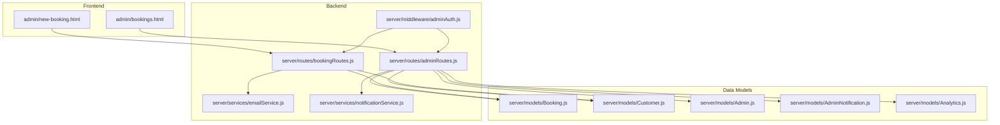
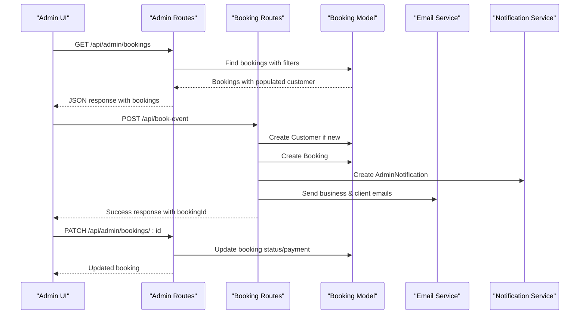
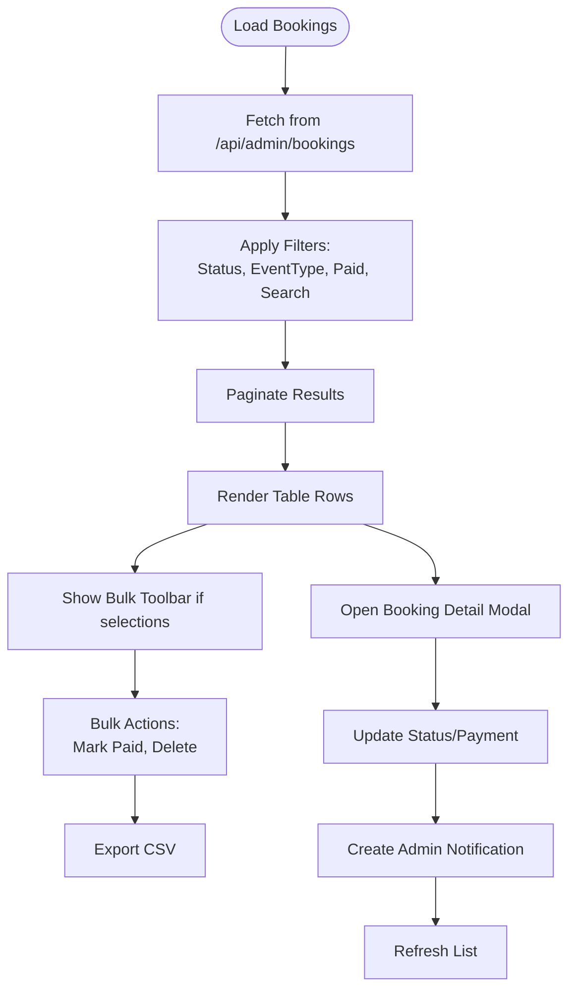
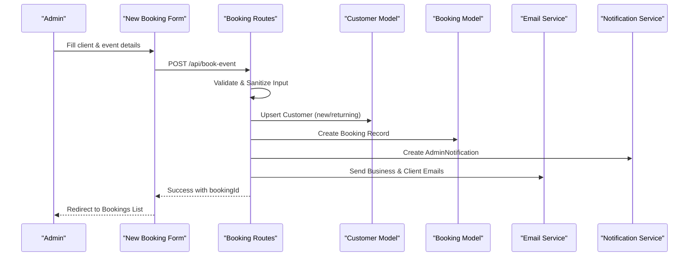
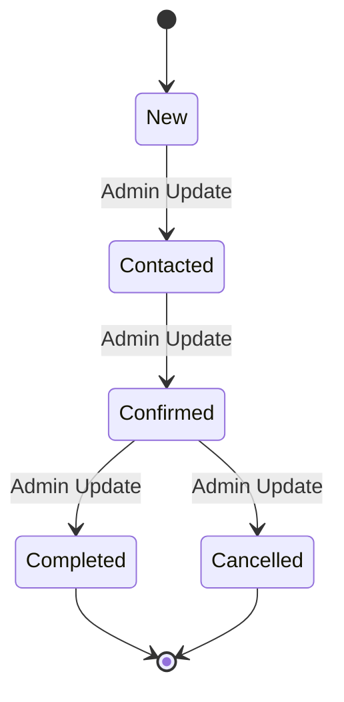
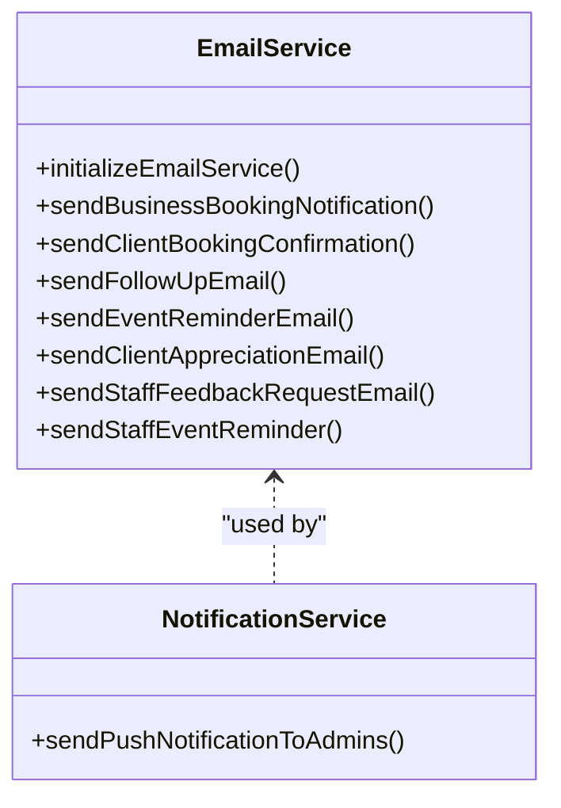
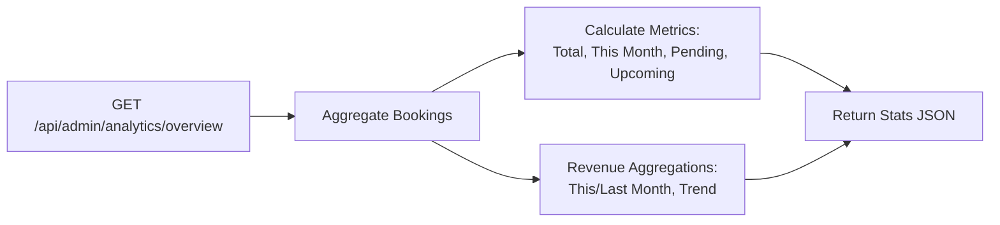
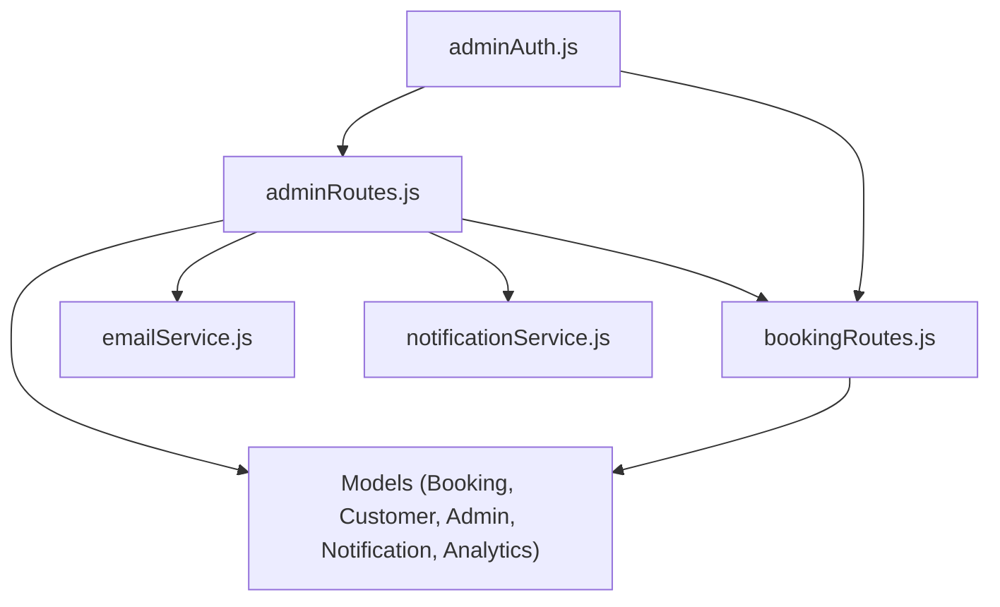

# Booking Management Interface

<cite>
**Referenced Files in This Document**
- [admin/bookings.html](file://admin/bookings.html)
- [admin/new-booking.html](file://admin/new-booking.html)
- [server/models/Booking.js](file://server/models/Booking.js)
- [server/models/Customer.js](file://server/models/Customer.js)
- [server/models/Admin.js](file://server/models/Admin.js)
- [server/models/AdminNotification.js](file://server/models/AdminNotification.js)
- [server/models/Analytics.js](file://server/models/Analytics.js)
- [server/routes/bookingRoutes.js](file://server/routes/bookingRoutes.js)
- [server/routes/adminRoutes.js](file://server/routes/adminRoutes.js)
- [server/services/emailService.js](file://server/services/emailService.js)
- [server/services/notificationService.js](file://server/services/notificationService.js)
- [server/middleware/adminAuth.js](file://server/middleware/adminAuth.js)
</cite>

## Table of Contents
1. [Introduction](#introduction)
2. [Project Structure](#project-structure)
3. [Core Components](#core-components)
4. [Architecture Overview](#architecture-overview)
5. [Detailed Component Analysis](#detailed-component-analysis)
6. [Dependency Analysis](#dependency-analysis)
7. [Performance Considerations](#performance-considerations)
8. [Troubleshooting Guide](#troubleshooting-guide)
9. [Conclusion](#conclusion)

## Introduction
This document provides comprehensive documentation for the admin booking management interface. It covers the real-time booking dashboard with filtering and sorting, the booking creation workflow, status management with notifications and history, client communication tools, search and filter functionality, bulk operations, export capabilities, analytics integration, and user workflows for approvals, rescheduling, cancellations, and follow-ups.

## Project Structure
The booking management system consists of:
- Frontend admin pages for dashboard, booking listing, and new booking form
- Backend APIs for bookings, clients, analytics, and notifications
- Data models for bookings, customers, admins, notifications, and analytics
- Services for email delivery and push notifications
- Authentication middleware for admin access

**Diagram sources**
- [admin/bookings.html](file://admin/bookings.html#L1-L2319)
- [admin/new-booking.html](file://admin/new-booking.html#L1-L1733)
- [server/routes/adminRoutes.js](file://server/routes/adminRoutes.js#L1-L1160)
- [server/routes/bookingRoutes.js](file://server/routes/bookingRoutes.js#L1-L356)
- [server/middleware/adminAuth.js](file://server/middleware/adminAuth.js#L1-L56)
- [server/services/emailService.js](file://server/services/emailService.js#L1-L467)
- [server/services/notificationService.js](file://server/services/notificationService.js#L1-L78)
- [server/models/Booking.js](file://server/models/Booking.js#L1-L169)
- [server/models/Customer.js](file://server/models/Customer.js#L1-L93)
- [server/models/Admin.js](file://server/models/Admin.js#L1-L70)
- [server/models/AdminNotification.js](file://server/models/AdminNotification.js#L1-L40)
- [server/models/Analytics.js](file://server/models/Analytics.js#L1-L41)

**Section sources**
- [admin/bookings.html](file://admin/bookings.html#L1-L2319)
- [admin/new-booking.html](file://admin/new-booking.html#L1-L1733)
- [server/routes/adminRoutes.js](file://server/routes/adminRoutes.js#L1-L1160)
- [server/routes/bookingRoutes.js](file://server/routes/bookingRoutes.js#L1-L356)
- [server/middleware/adminAuth.js](file://server/middleware/adminAuth.js#L1-L56)
- [server/services/emailService.js](file://server/services/emailService.js#L1-L467)
- [server/services/notificationService.js](file://server/services/notificationService.js#L1-L78)
- [server/models/Booking.js](file://server/models/Booking.js#L1-L169)
- [server/models/Customer.js](file://server/models/Customer.js#L1-L93)
- [server/models/Admin.js](file://server/models/Admin.js#L1-L70)
- [server/models/AdminNotification.js](file://server/models/AdminNotification.js#L1-L40)
- [server/models/Analytics.js](file://server/models/Analytics.js#L1-L41)

## Core Components
- Real-time booking dashboard with filtering, sorting, pagination, and bulk actions
- New booking form with client details, event information, and validation
- Booking status management with state transitions and notifications
- Client communication tools including email templates and WhatsApp shortcuts
- Search and filter functionality across bookings
- Bulk operations (mark paid, delete) and CSV export
- Analytics integration and revenue tracking
- Admin authentication and push notification support

**Section sources**
- [admin/bookings.html](file://admin/bookings.html#L1430-L2319)
- [admin/new-booking.html](file://admin/new-booking.html#L1264-L1508)
- [server/routes/adminRoutes.js](file://server/routes/adminRoutes.js#L174-L442)
- [server/routes/bookingRoutes.js](file://server/routes/bookingRoutes.js#L121-L285)
- [server/models/Booking.js](file://server/models/Booking.js#L7-L139)
- [server/models/AdminNotification.js](file://server/models/AdminNotification.js#L3-L37)
- [server/services/emailService.js](file://server/services/emailService.js#L127-L250)
- [server/services/notificationService.js](file://server/services/notificationService.js#L16-L75)

## Architecture Overview
The system follows a layered architecture:
- Presentation layer: HTML pages for admin dashboard and forms
- API layer: Express routes for admin and booking operations
- Service layer: Email and push notification services
- Data layer: Mongoose models with indexes and population

**Diagram sources**
- [admin/bookings.html](file://admin/bookings.html#L1765-L1805)
- [server/routes/adminRoutes.js](file://server/routes/adminRoutes.js#L174-L291)
- [server/routes/bookingRoutes.js](file://server/routes/bookingRoutes.js#L121-L285)
- [server/models/Booking.js](file://server/models/Booking.js#L142-L168)
- [server/services/emailService.js](file://server/services/emailService.js#L127-L250)
- [server/services/notificationService.js](file://server/services/notificationService.js#L16-L75)

## Detailed Component Analysis

### Real-time Booking Dashboard
The dashboard provides:
- Filtering by status, event type, and payment status
- Search by client name, location, or booking reference
- Pagination with configurable page size
- Bulk selection and actions (mark paid, delete)
- Export to CSV of filtered results
- Highlighting of newly created or recently updated bookings

**Diagram sources**
- [admin/bookings.html](file://admin/bookings.html#L1765-L1950)
- [server/routes/adminRoutes.js](file://server/routes/adminRoutes.js#L174-L217)

**Section sources**
- [admin/bookings.html](file://admin/bookings.html#L1433-L1506)
- [admin/bookings.html](file://admin/bookings.html#L1807-L1863)
- [admin/bookings.html](file://admin/bookings.html#L1907-L1950)
- [admin/bookings.html](file://admin/bookings.html#L2270-L2290)
- [server/routes/adminRoutes.js](file://server/routes/adminRoutes.js#L174-L217)

### New Booking Creation Workflow
The new booking form captures:
- Client information (name, email, phone)
- Event details (type, date, duration, location, guests)
- Budget range and special requests
- Usher requirements with conditional count field
- Submission via API with validation and sanitization

**Diagram sources**
- [admin/new-booking.html](file://admin/new-booking.html#L1264-L1508)
- [server/routes/bookingRoutes.js](file://server/routes/bookingRoutes.js#L121-L285)
- [server/models/Customer.js](file://server/models/Customer.js#L7-L79)
- [server/models/Booking.js](file://server/models/Booking.js#L7-L139)
- [server/services/emailService.js](file://server/services/emailService.js#L127-L250)
- [server/services/notificationService.js](file://server/services/notificationService.js#L16-L75)

**Section sources**
- [admin/new-booking.html](file://admin/new-booking.html#L1264-L1508)
- [server/routes/bookingRoutes.js](file://server/routes/bookingRoutes.js#L41-L88)
- [server/routes/bookingRoutes.js](file://server/routes/bookingRoutes.js#L121-L285)
- [server/models/Customer.js](file://server/models/Customer.js#L7-L79)
- [server/models/Booking.js](file://server/models/Booking.js#L7-L139)

### Booking Status Management
Status transitions are managed through:
- Editable status dropdown in booking detail modal
- Separate payment update endpoint to trigger notifications
- Admin notifications for system updates and payment changes
- Staff assignment with supervisor and team members
- Post-event actions for client appreciation and staff feedback

**Diagram sources**
- [admin/bookings.html](file://admin/bookings.html#L1972-L2111)
- [server/routes/adminRoutes.js](file://server/routes/adminRoutes.js#L246-L334)
- [server/models/Booking.js](file://server/models/Booking.js#L97-L101)

**Section sources**
- [admin/bookings.html](file://admin/bookings.html#L1972-L2111)
- [server/routes/adminRoutes.js](file://server/routes/adminRoutes.js#L246-L334)
- [server/models/AdminNotification.js](file://server/models/AdminNotification.js#L3-L37)

### Client Communication Tools
Integrated communication includes:
- Email templates for business notifications, client confirmations, follow-ups, reminders, appreciation, and staff feedback
- WhatsApp message generation for quick client contact
- Staff feedback request emails with customizable messages
- Push notifications to admin devices for new bookings

**Diagram sources**
- [server/services/emailService.js](file://server/services/emailService.js#L9-L467)
- [server/services/notificationService.js](file://server/services/notificationService.js#L16-L75)

**Section sources**
- [server/services/emailService.js](file://server/services/emailService.js#L127-L250)
- [server/services/emailService.js](file://server/services/emailService.js#L255-L336)
- [server/services/emailService.js](file://server/services/emailService.js#L341-L455)
- [server/routes/bookingRoutes.js](file://server/routes/bookingRoutes.js#L96-L102)
- [server/services/notificationService.js](file://server/services/notificationService.js#L16-L75)

### Analytics Integration
Analytics include:
- Monthly revenue trends and projections
- Pending confirmations and upcoming events
- Dashboard counters with animated transitions
- Chart.js integration for revenue visualization

**Diagram sources**
- [server/routes/adminRoutes.js](file://server/routes/adminRoutes.js#L448-L560)
- [server/models/Analytics.js](file://server/models/Analytics.js#L7-L35)

**Section sources**
- [admin/new-booking.html](file://admin/new-booking.html#L1577-L1649)
- [server/routes/adminRoutes.js](file://server/routes/adminRoutes.js#L448-L560)
- [server/models/Analytics.js](file://server/models/Analytics.js#L7-L35)

## Dependency Analysis
The system exhibits clear separation of concerns:
- Admin routes depend on booking routes for public endpoints
- Booking routes depend on customer and booking models
- Email and notification services are reusable across flows
- Middleware enforces authentication for protected routes

**Diagram sources**
- [server/routes/adminRoutes.js](file://server/routes/adminRoutes.js#L1-L1160)
- [server/routes/bookingRoutes.js](file://server/routes/bookingRoutes.js#L1-L356)
- [server/middleware/adminAuth.js](file://server/middleware/adminAuth.js#L1-L56)
- [server/services/emailService.js](file://server/services/emailService.js#L1-L467)
- [server/services/notificationService.js](file://server/services/notificationService.js#L1-L78)
- [server/models/Booking.js](file://server/models/Booking.js#L1-L169)
- [server/models/Customer.js](file://server/models/Customer.js#L1-L93)
- [server/models/Admin.js](file://server/models/Admin.js#L1-L70)
- [server/models/AdminNotification.js](file://server/models/AdminNotification.js#L1-L40)
- [server/models/Analytics.js](file://server/models/Analytics.js#L1-L41)

**Section sources**
- [server/routes/adminRoutes.js](file://server/routes/adminRoutes.js#L1-L1160)
- [server/routes/bookingRoutes.js](file://server/routes/bookingRoutes.js#L1-L356)
- [server/middleware/adminAuth.js](file://server/middleware/adminAuth.js#L1-L56)

## Performance Considerations
- Database indexes on frequently queried fields (customerId, eventDate, status, createdAt)
- Population of related documents only when needed
- Pagination to limit result sets
- Efficient aggregation queries for analytics
- Client-side debouncing for search input
- Minimal DOM updates during bulk operations

## Troubleshooting Guide
Common issues and resolutions:
- Authentication failures: Verify JWT token presence and expiration
- Email service errors: Check BREVO API key configuration
- Push notification failures: Confirm VAPID keys and subscription validity
- Booking validation errors: Review input sanitization and validation rules
- Notification cleanup: Automatic expiry after 30 days

**Section sources**
- [server/middleware/adminAuth.js](file://server/middleware/adminAuth.js#L3-L31)
- [server/services/emailService.js](file://server/services/emailService.js#L9-L27)
- [server/services/notificationService.js](file://server/services/notificationService.js#L5-L14)
- [server/routes/bookingRoutes.js](file://server/routes/bookingRoutes.js#L41-L88)
- [server/models/AdminNotification.js](file://server/models/AdminNotification.js#L36-L37)

## Conclusion
The admin booking management interface provides a comprehensive solution for managing bookings with real-time updates, robust filtering, efficient bulk operations, integrated communication tools, and analytics. The modular architecture ensures maintainability and extensibility for future enhancements.