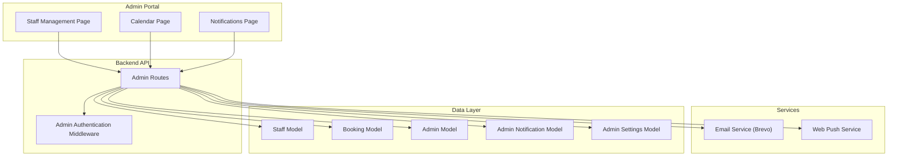
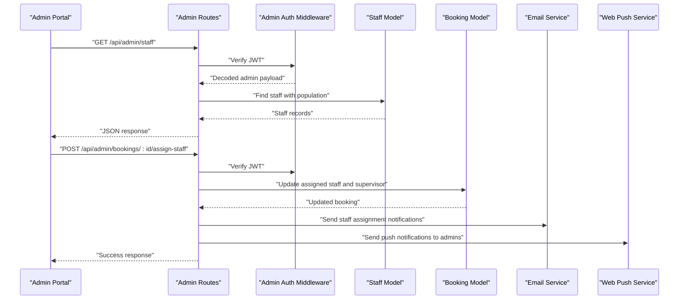
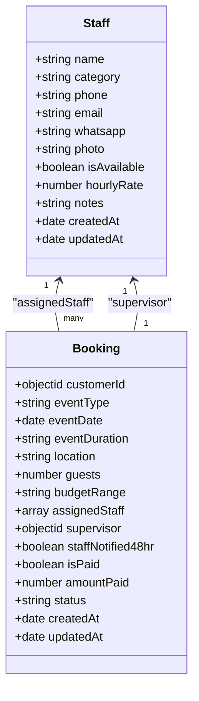
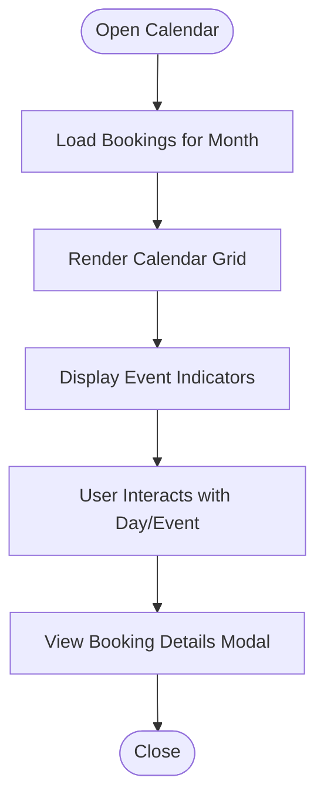
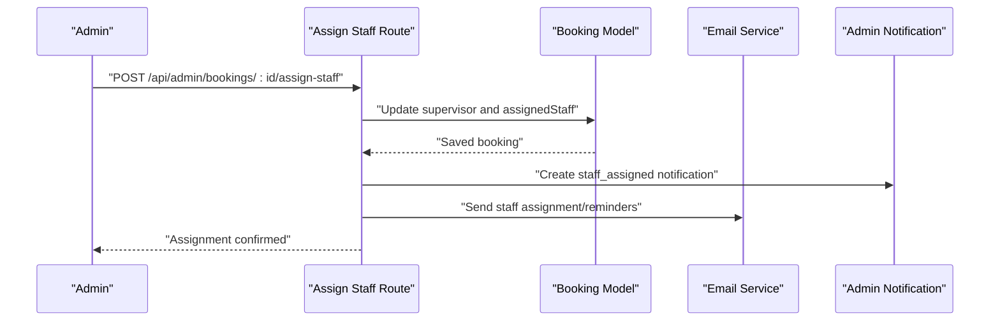
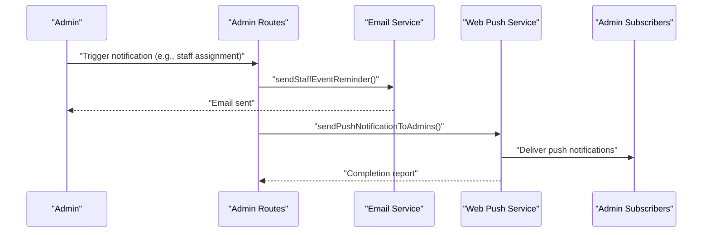
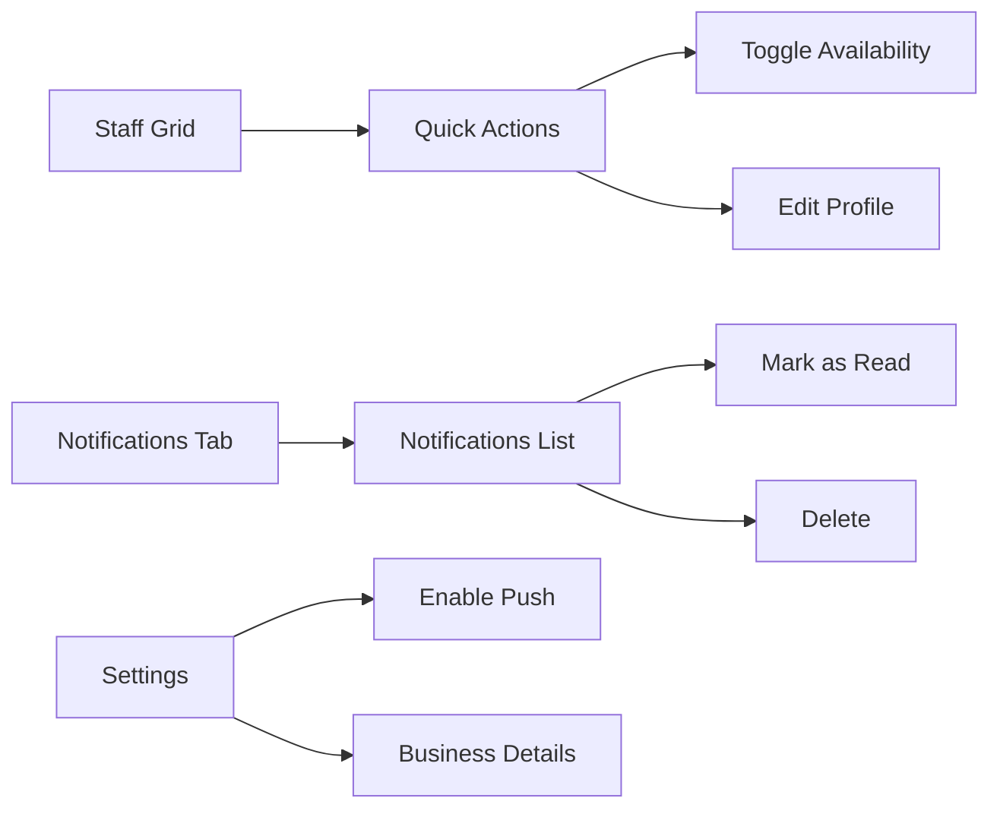
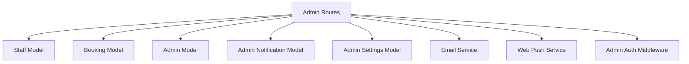

# Staff Coordination System

<cite>
**Referenced Files in This Document**
- [admin/staff.html](file://admin/staff.html)
- [admin/calendar.html](file://admin/calendar.html)
- [admin/notifications.html](file://admin/notifications.html)
- [server/models/Staff.js](file://server/models/Staff.js)
- [server/models/Booking.js](file://server/models/Booking.js)
- [server/models/Admin.js](file://server/models/Admin.js)
- [server/models/AdminNotification.js](file://server/models/AdminNotification.js)
- [server/models/AdminSettings.js](file://server/models/AdminSettings.js)
- [server/services/notificationService.js](file://server/services/notificationService.js)
- [server/services/emailService.js](file://server/services/emailService.js)
- [server/routes/adminRoutes.js](file://server/routes/adminRoutes.js)
- [server/middleware/adminAuth.js](file://server/middleware/adminAuth.js)
- [admin/push-client.js](file://admin/push-client.js)
</cite>

## Table of Contents
1. [Introduction](#introduction)
2. [Project Structure](#project-structure)
3. [Core Components](#core-components)
4. [Architecture Overview](#architecture-overview)
5. [Detailed Component Analysis](#detailed-component-analysis)
6. [Dependency Analysis](#dependency-analysis)
7. [Performance Considerations](#performance-considerations)
8. [Troubleshooting Guide](#troubleshooting-guide)
9. [Conclusion](#conclusion)

## Introduction
This document describes the staff coordination and management system for Emerald Pearland Events. It covers staff profile management, scheduling and calendar integration, staff assignment workflows, notification mechanisms (push, email, and internal communications), performance tracking capabilities, and administrative tools for team coordination. The system integrates a modern admin portal with robust backend APIs, MongoDB models, and notification services to streamline staff onboarding, availability management, workload distribution, and communication across the organization.

## Project Structure
The system comprises:
- Admin portal pages for staff management, calendar, and notifications
- Backend API routes for staff CRUD, booking management, and admin operations
- Mongoose models for staff, bookings, admins, notifications, and settings
- Services for email delivery and web push notifications
- Middleware for admin authentication and JWT verification
- Frontend push client for enabling browser push notifications

**Diagram sources**
- [admin/staff.html](file://admin/staff.html#L1-L800)
- [admin/calendar.html](file://admin/calendar.html#L1-L800)
- [admin/notifications.html](file://admin/notifications.html#L1-L800)
- [server/routes/adminRoutes.js](file://server/routes/adminRoutes.js#L1-L1160)
- [server/middleware/adminAuth.js](file://server/middleware/adminAuth.js#L1-L56)
- [server/models/Staff.js](file://server/models/Staff.js#L1-L57)
- [server/models/Booking.js](file://server/models/Booking.js#L1-L169)
- [server/models/Admin.js](file://server/models/Admin.js#L1-L70)
- [server/models/AdminNotification.js](file://server/models/AdminNotification.js#L1-L40)
- [server/models/AdminSettings.js](file://server/models/AdminSettings.js#L1-L56)
- [server/services/emailService.js](file://server/services/emailService.js#L1-L467)
- [server/services/notificationService.js](file://server/services/notificationService.js#L1-L78)

**Section sources**
- [admin/staff.html](file://admin/staff.html#L1-L800)
- [admin/calendar.html](file://admin/calendar.html#L1-L800)
- [admin/notifications.html](file://admin/notifications.html#L1-L800)
- [server/routes/adminRoutes.js](file://server/routes/adminRoutes.js#L1-L1160)

## Core Components
- Staff model: Stores staff profiles, roles, contact info, availability, hourly rate, and notes.
- Booking model: Manages event bookings, assigned staff, supervisors, and status tracking.
- Admin model: Handles admin accounts, roles, and push subscription storage.
- Admin notification model: Centralized notifications for admin actions and system events.
- Admin settings model: Business-wide settings including notifications preferences.
- Email service: Sends business notifications, client confirmations, reminders, and internal staff feedback requests.
- Web push service: Distributes push notifications to subscribed admins.
- Admin routes: Provide endpoints for staff CRUD, booking management, staff assignment, analytics, and settings.
- Admin authentication middleware: Protects routes and manages JWT lifecycle.
- Admin portal pages: Staff grid, calendar view, and notifications interface.

**Section sources**
- [server/models/Staff.js](file://server/models/Staff.js#L1-L57)
- [server/models/Booking.js](file://server/models/Booking.js#L1-L169)
- [server/models/Admin.js](file://server/models/Admin.js#L1-L70)
- [server/models/AdminNotification.js](file://server/models/AdminNotification.js#L1-L40)
- [server/models/AdminSettings.js](file://server/models/AdminSettings.js#L1-L56)
- [server/services/emailService.js](file://server/services/emailService.js#L1-L467)
- [server/services/notificationService.js](file://server/services/notificationService.js#L1-L78)
- [server/routes/adminRoutes.js](file://server/routes/adminRoutes.js#L1-L1160)
- [server/middleware/adminAuth.js](file://server/middleware/adminAuth.js#L1-L56)
- [admin/staff.html](file://admin/staff.html#L1-L800)
- [admin/calendar.html](file://admin/calendar.html#L1-L800)
- [admin/notifications.html](file://admin/notifications.html#L1-L800)

## Architecture Overview
The system follows a layered architecture:
- Presentation layer: Admin portal pages (HTML/CSS/JS) with responsive design and dark mode support.
- API layer: Express routes handling staff, booking, notification, and settings operations.
- Service layer: Email and web push notification services integrated with third-party providers.
- Data layer: Mongoose models with indexes for efficient queries.
- Security layer: JWT-based authentication with cookie-based sessions and middleware protection.

**Diagram sources**
- [server/routes/adminRoutes.js](file://server/routes/adminRoutes.js#L633-L1077)
- [server/middleware/adminAuth.js](file://server/middleware/adminAuth.js#L1-L56)
- [server/models/Staff.js](file://server/models/Staff.js#L1-L57)
- [server/models/Booking.js](file://server/models/Booking.js#L1-L169)
- [server/services/emailService.js](file://server/services/emailService.js#L1-L467)
- [server/services/notificationService.js](file://server/services/notificationService.js#L1-L78)

## Detailed Component Analysis

### Staff Profile Management
The staff module supports:
- Personnel registration: Name, category, phone, optional email/WhatsApp, photo, notes.
- Role assignments: Categorization and role-based filtering.
- Availability tracking: Toggle availability flag per staff member.
- Hourly rate and notes: Compensation and administrative notes.
- Integration with bookings: Staff can be linked to multiple bookings.

**Diagram sources**
- [server/models/Staff.js](file://server/models/Staff.js#L1-L57)
- [server/models/Booking.js](file://server/models/Booking.js#L1-L169)

**Section sources**
- [server/models/Staff.js](file://server/models/Staff.js#L1-L57)
- [server/routes/adminRoutes.js](file://server/routes/adminRoutes.js#L633-L712)

### Staff Scheduling and Calendar Integration
The calendar page provides:
- Monthly grid view with days and event indicators.
- Legend for event types.
- Responsive design and dark mode support.
- Integration with bookings for event rendering.

**Diagram sources**
- [admin/calendar.html](file://admin/calendar.html#L1-L800)
- [server/models/Booking.js](file://server/models/Booking.js#L1-L169)

**Section sources**
- [admin/calendar.html](file://admin/calendar.html#L1-L800)
- [server/models/Booking.js](file://server/models/Booking.js#L1-L169)

### Staff Assignment Workflows
The assignment workflow enables:
- Selecting a supervisor and team members for a booking.
- Persisting assignments and generating admin notifications.
- Sending staff-specific reminders and feedback requests.

**Diagram sources**
- [server/routes/adminRoutes.js](file://server/routes/adminRoutes.js#L1041-L1077)
- [server/services/emailService.js](file://server/services/emailService.js#L380-L455)
- [server/models/AdminNotification.js](file://server/models/AdminNotification.js#L1-L40)

**Section sources**
- [server/routes/adminRoutes.js](file://server/routes/adminRoutes.js#L1041-L1077)
- [server/services/emailService.js](file://server/services/emailService.js#L380-L455)
- [server/models/AdminNotification.js](file://server/models/AdminNotification.js#L1-L40)

### Staff Notification System
The notification system includes:
- Push notifications: Browser push via Web Push protocol with VAPID keys.
- Email alerts: Automated emails for bookings, reminders, and internal feedback.
- Admin notifications: Centralized notification feed for admin actions.

**Diagram sources**
- [server/routes/adminRoutes.js](file://server/routes/adminRoutes.js#L1041-L1077)
- [server/services/emailService.js](file://server/services/emailService.js#L380-L455)
- [server/services/notificationService.js](file://server/services/notificationService.js#L1-L78)
- [admin/push-client.js](file://admin/push-client.js#L1-L165)

**Section sources**
- [server/services/emailService.js](file://server/services/emailService.js#L1-L467)
- [server/services/notificationService.js](file://server/services/notificationService.js#L1-L78)
- [admin/push-client.js](file://admin/push-client.js#L1-L165)
- [server/models/Admin.js](file://server/models/Admin.js#L1-L70)

### Staff Communication Tools and Admin Interface
The admin interface provides:
- Staff grid with quick availability toggles and actions.
- Notifications tab for system and payment-related alerts.
- Settings for enabling push notifications and configuring business details.

**Diagram sources**
- [admin/staff.html](file://admin/staff.html#L1-L800)
- [admin/notifications.html](file://admin/notifications.html#L1-L800)
- [server/routes/adminRoutes.js](file://server/routes/adminRoutes.js#L773-L809)

**Section sources**
- [admin/staff.html](file://admin/staff.html#L1-L800)
- [admin/notifications.html](file://admin/notifications.html#L1-L800)
- [server/routes/adminRoutes.js](file://server/routes/adminRoutes.js#L773-L809)

### Staff Performance Metrics, Ratings, and Evaluation Tracking
The system supports:
- Staff availability and hourly rate tracking.
- Booking-based workload distribution.
- Admin notes and internal feedback requests.
- Analytics endpoints for revenue and upcoming events.

Note: Formal rating and evaluation entities are not present in the current models. They can be introduced by extending the Staff model with rating arrays and adding evaluation routes.

**Section sources**
- [server/models/Staff.js](file://server/models/Staff.js#L1-L57)
- [server/models/Booking.js](file://server/models/Booking.js#L1-L169)
- [server/routes/adminRoutes.js](file://server/routes/adminRoutes.js#L448-L560)

### Staff Onboarding, Training Management, and Professional Development
Current capabilities:
- Staff registration with category and notes.
- Optional photo and contact info.
- Integration with bookings for practical onboarding.

Recommendations:
- Add training records and certifications to the Staff model.
- Introduce a dedicated training module with completion tracking.
- Link training records to bookings for compliance and skill verification.

**Section sources**
- [server/models/Staff.js](file://server/models/Staff.js#L1-L57)
- [server/routes/adminRoutes.js](file://server/routes/adminRoutes.js#L655-L688)

### Staff Availability Management, Leave Tracking, and Workload Balancing
Current capabilities:
- Availability toggle per staff member.
- Supervisor assignment to coordinate teams.
- Booking-based workload visualization.

Recommendations:
- Add leave types and leave requests with approval workflows.
- Implement workload balancing algorithms considering availability, rates, and skill categories.
- Provide reporting dashboards for utilization and coverage.

**Section sources**
- [server/models/Staff.js](file://server/models/Staff.js#L1-L57)
- [server/models/Booking.js](file://server/models/Booking.js#L1-L169)
- [server/routes/adminRoutes.js](file://server/routes/adminRoutes.js#L1041-L1077)

## Dependency Analysis
The system exhibits clear separation of concerns:
- Routes depend on models and services.
- Services rely on third-party SDKs and environment configurations.
- Middleware enforces authentication and authorization.
- Admin portal pages consume API endpoints.

**Diagram sources**
- [server/routes/adminRoutes.js](file://server/routes/adminRoutes.js#L1-L1160)
- [server/middleware/adminAuth.js](file://server/middleware/adminAuth.js#L1-L56)
- [server/models/Staff.js](file://server/models/Staff.js#L1-L57)
- [server/models/Booking.js](file://server/models/Booking.js#L1-L169)
- [server/models/Admin.js](file://server/models/Admin.js#L1-L70)
- [server/models/AdminNotification.js](file://server/models/AdminNotification.js#L1-L40)
- [server/models/AdminSettings.js](file://server/models/AdminSettings.js#L1-L56)
- [server/services/emailService.js](file://server/services/emailService.js#L1-L467)
- [server/services/notificationService.js](file://server/services/notificationService.js#L1-L78)

**Section sources**
- [server/routes/adminRoutes.js](file://server/routes/adminRoutes.js#L1-L1160)
- [server/middleware/adminAuth.js](file://server/middleware/adminAuth.js#L1-L56)

## Performance Considerations
- Database indexing: Booking schema includes indexes on customer, event date, status, and creation time to optimize queries.
- Population strategies: Routes populate related documents (customer, staff) selectively to avoid heavy payloads.
- Push notification cleanup: Expired push subscriptions are pruned automatically to reduce failures.
- Pagination: Booking listing endpoints support pagination to manage large datasets efficiently.

[No sources needed since this section provides general guidance]

## Troubleshooting Guide
Common issues and resolutions:
- Missing VAPID keys: Web push initialization logs warnings when keys are absent; configure environment variables to enable push notifications.
- Email service disabled: Brevo API key absence disables email features; ensure proper configuration.
- Authentication errors: Invalid or expired tokens result in 401 responses; re-authenticate and refresh tokens.
- Push subscription invalidation: Expired subscriptions are removed automatically; re-enable push on the client.
- Staff availability toggles: Ensure availability updates are persisted and reflected in the UI.

**Section sources**
- [server/services/notificationService.js](file://server/services/notificationService.js#L1-L78)
- [server/services/emailService.js](file://server/services/emailService.js#L1-L467)
- [server/middleware/adminAuth.js](file://server/middleware/adminAuth.js#L1-L56)
- [admin/push-client.js](file://admin/push-client.js#L1-L165)

## Conclusion
The staff coordination system provides a comprehensive foundation for managing staff profiles, scheduling, assignments, and communications. It leverages modern web technologies, robust backend APIs, and integrated notification channels to support efficient team coordination. Future enhancements can introduce formal performance ratings, structured training management, and advanced workload balancing to further strengthen operational excellence.