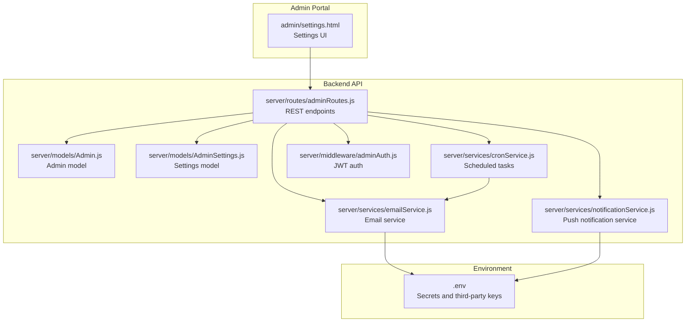
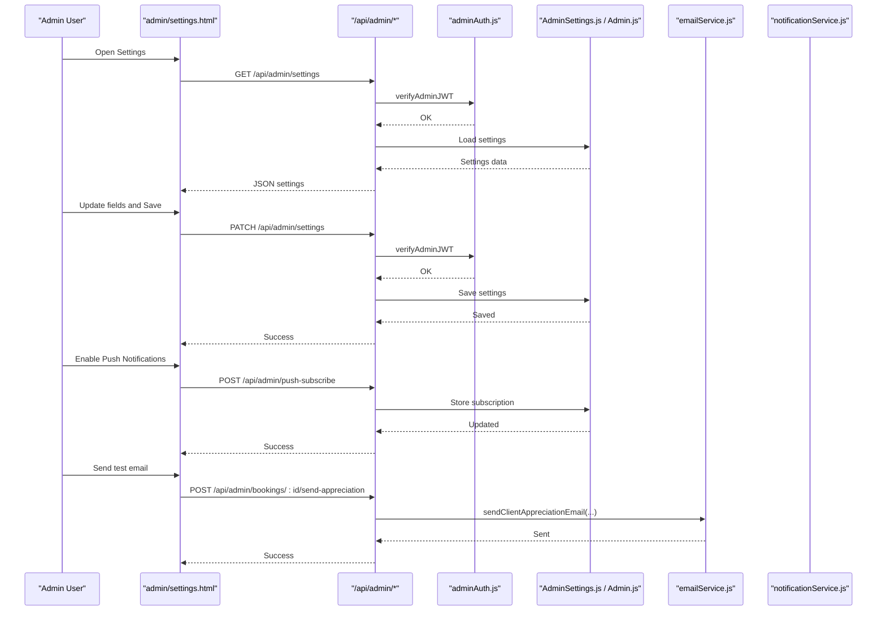
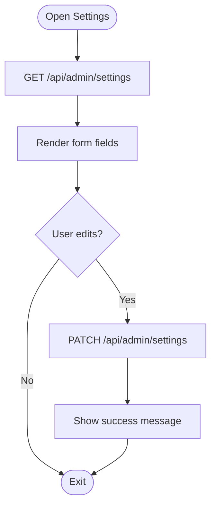
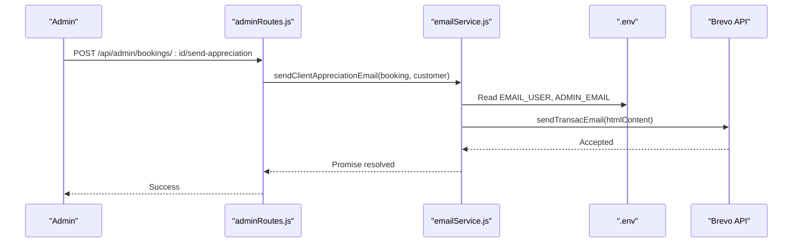
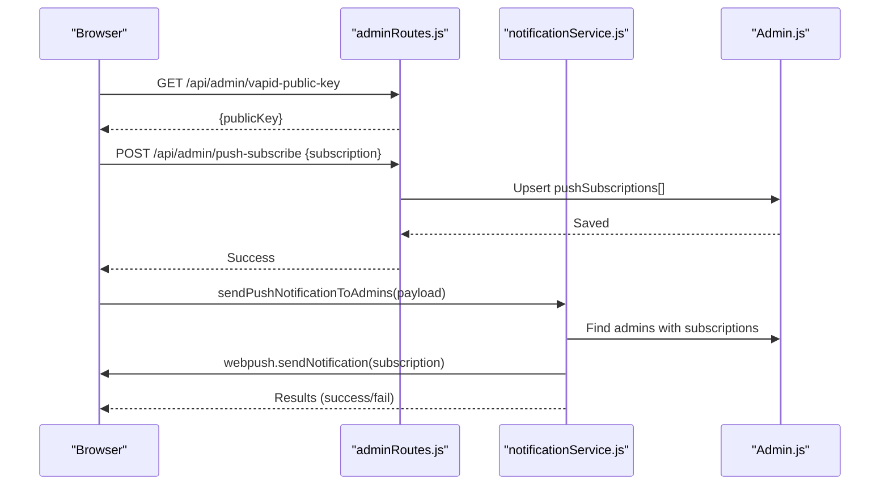
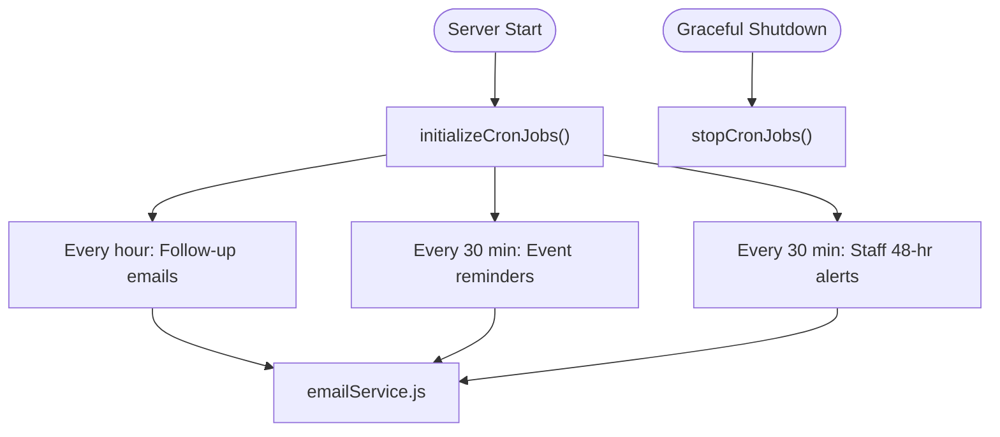
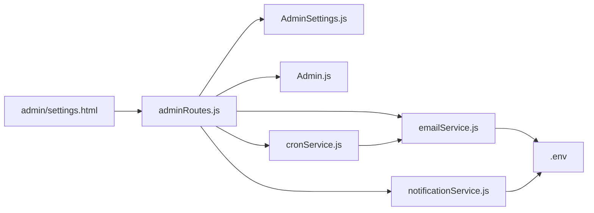

# System Settings & Configuration

<cite>
**Referenced Files in This Document**
- [settings.html](file://admin/settings.html)
- [AdminSettings.js](file://server/models/AdminSettings.js)
- [.env](file://.env)
- [emailService.js](file://server/services/emailService.js)
- [notificationService.js](file://server/services/notificationService.js)
- [cronService.js](file://server/services/cronService.js)
- [adminRoutes.js](file://server/routes/adminRoutes.js)
- [adminAuth.js](file://server/middleware/adminAuth.js)
- [Admin.js](file://server/models/Admin.js)
- [test-email.js](file://test-email.js)
</cite>

## Table of Contents
1. [Introduction](#introduction)
2. [Project Structure](#project-structure)
3. [Core Components](#core-components)
4. [Architecture Overview](#architecture-overview)
5. [Detailed Component Analysis](#detailed-component-analysis)
6. [Dependency Analysis](#dependency-analysis)
7. [Performance Considerations](#performance-considerations)
8. [Troubleshooting Guide](#troubleshooting-guide)
9. [Conclusion](#conclusion)
10. [Appendices](#appendices)

## Introduction
This document explains how to configure and manage system settings for the administrative portal. It covers branding and display preferences, email templates and delivery, notification preferences (including browser push), third-party integrations (Brevo, Twilio, Google), and operational maintenance features such as scheduled email tasks. It also provides best practices for security, performance, and troubleshooting.

## Project Structure
The settings and configuration surface is implemented as:
- Frontend: A dedicated settings page that loads and saves configuration to backend APIs.
- Backend: Express routes protected by JWT middleware, backed by Mongoose models and services for email, push notifications, and scheduling.

**Diagram sources**
- [settings.html](file://admin/settings.html#L842-L1107)
- [adminRoutes.js](file://server/routes/adminRoutes.js#L753-L800)
- [Admin.js](file://server/models/Admin.js#L1-L70)
- [AdminSettings.js](file://server/models/AdminSettings.js#L1-L56)
- [emailService.js](file://server/services/emailService.js#L1-L467)
- [notificationService.js](file://server/services/notificationService.js#L1-L78)
- [cronService.js](file://server/services/cronService.js#L1-L185)
- [adminAuth.js](file://server/middleware/adminAuth.js#L1-L56)
- [.env](file://.env#L1-L51)

**Section sources**
- [settings.html](file://admin/settings.html#L842-L1107)
- [adminRoutes.js](file://server/routes/adminRoutes.js#L753-L800)
- [AdminSettings.js](file://server/models/AdminSettings.js#L1-L56)
- [.env](file://.env#L1-L51)

## Core Components
- Settings model: Stores business info, social links, notification toggles, and display preferences.
- Admin model: Stores admin credentials, roles, and push notification subscriptions.
- Email service: Integrates with Brevo/Sendinblue and supports fallback SMTP; includes multiple templated emails.
- Push notification service: Web Push via VAPID keys for browser alerts.
- Cron service: Automated follow-ups, reminders, and staff alerts.
- Admin routes: Provide settings CRUD, push subscription management, and JWT-protected endpoints.
- Authentication middleware: Protects routes with signed cookies and JWT verification.

**Section sources**
- [AdminSettings.js](file://server/models/AdminSettings.js#L1-L56)
- [Admin.js](file://server/models/Admin.js#L1-L70)
- [emailService.js](file://server/services/emailService.js#L1-L467)
- [notificationService.js](file://server/services/notificationService.js#L1-L78)
- [cronService.js](file://server/services/cronService.js#L1-L185)
- [adminRoutes.js](file://server/routes/adminRoutes.js#L22-L800)
- [adminAuth.js](file://server/middleware/adminAuth.js#L1-L56)

## Architecture Overview
The settings UI communicates with backend routes that enforce JWT authentication and persist data to MongoDB. Services encapsulate third-party integrations and scheduled tasks.

**Diagram sources**
- [settings.html](file://admin/settings.html#L1215-L1295)
- [adminRoutes.js](file://server/routes/adminRoutes.js#L22-L800)
- [adminAuth.js](file://server/middleware/adminAuth.js#L1-L56)
- [AdminSettings.js](file://server/models/AdminSettings.js#L1-L56)
- [Admin.js](file://server/models/Admin.js#L1-L70)
- [emailService.js](file://server/services/emailService.js#L338-L378)
- [notificationService.js](file://server/services/notificationService.js#L16-L75)

## Detailed Component Analysis

### Settings UI and API
- The settings page exposes:
  - Business information (name, email, phone, address, currency, timezone).
  - Social media handles and links (Instagram, Facebook, Behold feed).
  - Notification preferences (email on new bookings, WhatsApp reminders, payment notifications).
  - Display preferences (dark mode, items per page).
  - Admin profile updates and password change.
- The frontend loads settings via GET and persists via PATCH.
- Push notification enablement uses a VAPID public key and stores subscription objects per admin.

**Diagram sources**
- [settings.html](file://admin/settings.html#L1215-L1295)
- [adminRoutes.js](file://server/routes/adminRoutes.js#L753-L800)

**Section sources**
- [settings.html](file://admin/settings.html#L900-L1098)
- [adminRoutes.js](file://server/routes/adminRoutes.js#L753-L800)

### Settings Model
- Stores business branding, contact info, social URLs, notification toggles, dark mode preference, and profile image.
- Provides defaults for sensible out-of-the-box behavior.

**Section sources**
- [AdminSettings.js](file://server/models/AdminSettings.js#L1-L56)

### Environment Variables and Third-Party Integrations
- Email (Brevo): API key enables transactional emails; fallback SMTP credentials are used for development.
- Google Analytics 4: Measurement ID for GA4.
- Twilio: Account SID, Auth Token, WhatsApp number, and business number for SMS/WhatsApp.
- Frontend: API base URL and WhatsApp number.
- Web Push: VAPID public/private keys for browser push notifications.

**Section sources**
- [.env](file://.env#L1-L51)

### Email Template Management and Delivery
- Email service initializes with Brevo SDK when API key is present; otherwise logs a warning and disables email delivery.
- Multiple templated emails are included:
  - Business notification on new booking.
  - Client confirmation email.
  - Follow-up email (~24 hours after booking).
  - Event reminder (48 hours prior).
  - Client appreciation and feedback email.
  - Staff feedback request email.
  - Staff 48-hour pre-event reminder.
- The service formats booking details into HTML tables and constructs branded templates with dynamic content.
- Testing script demonstrates initialization and sending a business notification email.

**Diagram sources**
- [adminRoutes.js](file://server/routes/adminRoutes.js#L336-L365)
- [emailService.js](file://server/services/emailService.js#L295-L336)
- [.env](file://.env#L24-L27)

**Section sources**
- [emailService.js](file://server/services/emailService.js#L1-L467)
- [test-email.js](file://test-email.js#L1-L34)

### Notification Preferences and Push Notifications
- Notification preferences include toggles for new booking emails and WhatsApp reminders.
- Browser push notifications:
  - Public key retrieval endpoint for clients.
  - Subscription storage per admin.
  - Server-side push dispatch with VAPID keys.
  - Automatic cleanup of invalid/expired subscriptions.

**Diagram sources**
- [adminRoutes.js](file://server/routes/adminRoutes.js#L22-L57)
- [notificationService.js](file://server/services/notificationService.js#L16-L75)
- [Admin.js](file://server/models/Admin.js#L45-L48)

**Section sources**
- [settings.html](file://admin/settings.html#L977-L994)
- [adminRoutes.js](file://server/routes/adminRoutes.js#L22-L57)
- [notificationService.js](file://server/services/notificationService.js#L1-L78)
- [Admin.js](file://server/models/Admin.js#L1-L70)

### Scheduled Email Tasks (Cron)
- Automated tasks run periodically:
  - Follow-up email (~24 hours after booking).
  - Event reminder (48 hours before event).
  - 48-hour pre-event alert to assigned staff (supervisor and team).
- Jobs are initialized at startup and stopped gracefully on shutdown.

**Diagram sources**
- [cronService.js](file://server/services/cronService.js#L21-L164)
- [emailService.js](file://server/services/emailService.js#L127-L455)

**Section sources**
- [cronService.js](file://server/services/cronService.js#L1-L185)

### Authentication and Security
- JWT-based admin session stored in an httpOnly cookie.
- Token generation and verification use a secret from environment variables.
- Routes enforce JWT protection; page-level middleware redirects unauthenticated users.

**Section sources**
- [adminAuth.js](file://server/middleware/adminAuth.js#L1-L56)
- [adminRoutes.js](file://server/routes/adminRoutes.js#L59-L152)

## Dependency Analysis
- Settings UI depends on admin routes for data persistence.
- Admin routes depend on models for data access and services for integrations.
- Email and push services depend on environment variables for credentials.
- Cron service depends on email service and models for data access.

**Diagram sources**
- [settings.html](file://admin/settings.html#L1215-L1295)
- [adminRoutes.js](file://server/routes/adminRoutes.js#L753-L800)
- [AdminSettings.js](file://server/models/AdminSettings.js#L1-L56)
- [Admin.js](file://server/models/Admin.js#L1-L70)
- [emailService.js](file://server/services/emailService.js#L1-L467)
- [notificationService.js](file://server/services/notificationService.js#L1-L78)
- [cronService.js](file://server/services/cronService.js#L1-L185)
- [.env](file://.env#L1-L51)

**Section sources**
- [adminRoutes.js](file://server/routes/adminRoutes.js#L1-L1160)

## Performance Considerations
- Email throughput: Brevo is rate-limited; batch operations and retries should be considered for bulk notifications.
- Push notifications: Excessive pushes can degrade user experience; throttle and batch where appropriate.
- Cron jobs: Keep intervals reasonable to avoid database spikes; ensure proper indexing on date and status fields.
- Environment caching: Load environment variables once at startup; avoid frequent re-reads.

## Troubleshooting Guide
- Email not sending:
  - Confirm BREVO_API_KEY is set in environment; otherwise email service remains disabled.
  - Verify fallback SMTP credentials for development.
  - Use the test script to validate initialization and delivery.
- Push notifications not received:
  - Ensure VAPID_PUBLIC_KEY and VAPID_PRIVATE_KEY are configured.
  - Confirm the browser has granted permission and a subscription exists for the admin.
  - Check server logs for warnings about missing keys or failed sends.
- Cron tasks not firing:
  - Verify server started successfully and cron jobs initialized.
  - Check logs for errors in follow-up, reminder, or staff alert jobs.
- Authentication failures:
  - Ensure JWT_SECRET is set and cookies are accepted by the browser.
  - Verify httpOnly cookie is being sent with requests.

**Section sources**
- [emailService.js](file://server/services/emailService.js#L9-L27)
- [test-email.js](file://test-email.js#L1-L34)
- [notificationService.js](file://server/services/notificationService.js#L5-L14)
- [cronService.js](file://server/services/cronService.js#L21-L164)
- [adminAuth.js](file://server/middleware/adminAuth.js#L16-L31)

## Conclusion
The system provides a comprehensive configuration surface for branding, notifications, and integrations, with robust services for email, push, and scheduled tasks. Administrators should focus on securing secrets, validating third-party credentials, and monitoring scheduled jobs to maintain reliability and performance.

## Appendices

### Best Practices
- Security
  - Rotate JWT_SECRET and Brevo API keys regularly.
  - Restrict access to admin routes using HTTPS and secure cookies.
  - Limit admin roles and enforce least privilege.
- Performance
  - Monitor email deliverability and adjust retry/backoff policies.
  - Tune cron intervals based on workload and database capacity.
  - Use environment-specific configurations (development vs production).
- Maintenance
  - Back up MongoDB collections regularly.
  - Validate environment variables at startup.
  - Keep dependencies updated and monitor for vulnerabilities.

### Configuration Checklist
- Email
  - BREVO_API_KEY configured for production.
  - EMAIL_USER and EMAIL_PASSWORD for SMTP fallback.
  - ADMIN_EMAIL for outbound replies.
- Push
  - VAPID_PUBLIC_KEY and VAPID_PRIVATE_KEY configured.
- Integrations
  - TWILIO_ACCOUNT_SID, TWILIO_AUTH_TOKEN, TWILIO_WHATSAPP_NUMBER, BUSINESS_WHATSAPP_NUMBER.
  - GA4_MEASUREMENT_ID.
- Frontend
  - REACT_APP_API_URL and REACT_APP_WHATSAPP_NUMBER.

**Section sources**
- [.env](file://.env#L1-L51)