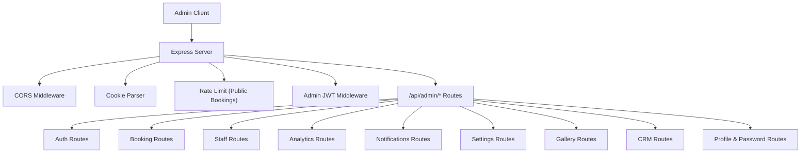
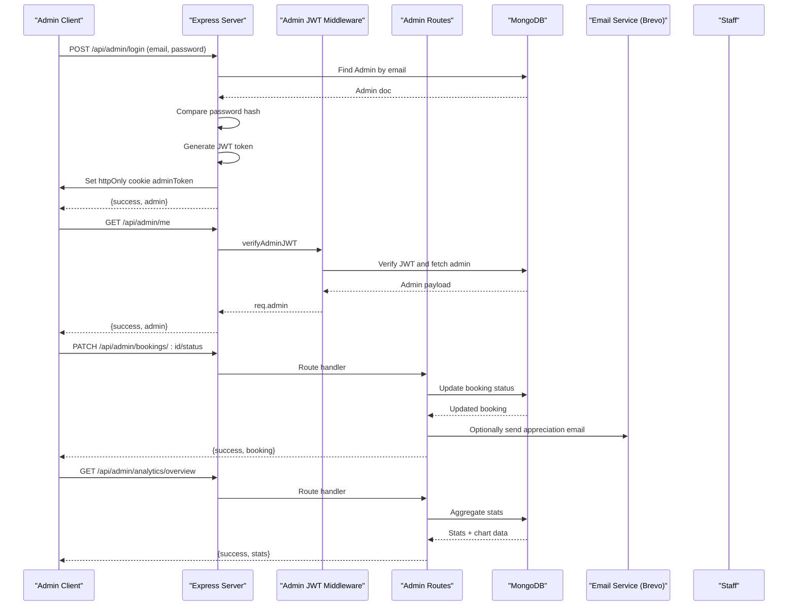
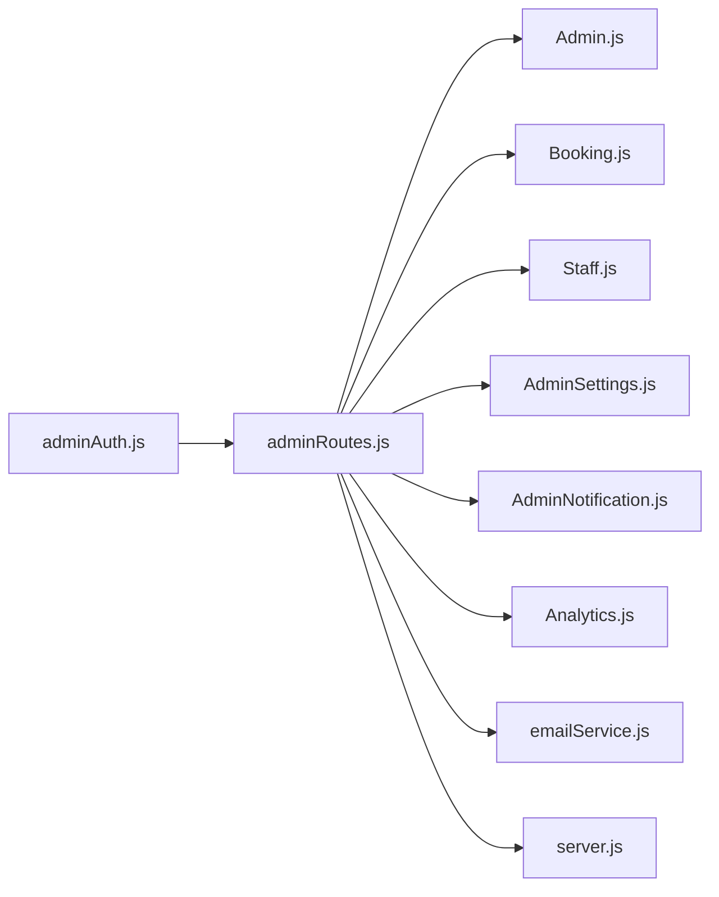

# Admin Management APIs

<cite>
**Referenced Files in This Document**
- [server.js](file://server.js)
- [.env](file://.env)
- [server/routes/adminRoutes.js](file://server/routes/adminRoutes.js)
- [server/middleware/adminAuth.js](file://server/middleware/adminAuth.js)
- [server/models/Admin.js](file://server/models/Admin.js)
- [server/models/Booking.js](file://server/models/Booking.js)
- [server/models/Staff.js](file://server/models/Staff.js)
- [server/models/AdminSettings.js](file://server/models/AdminSettings.js)
- [server/models/AdminNotification.js](file://server/models/AdminNotification.js)
- [server/models/Analytics.js](file://server/models/Analytics.js)
- [server/services/emailService.js](file://server/services/emailService.js)
</cite>

## Table of Contents
1. [Introduction](#introduction)
2. [Project Structure](#project-structure)
3. [Core Components](#core-components)
4. [Architecture Overview](#architecture-overview)
5. [Detailed Component Analysis](#detailed-component-analysis)
6. [Dependency Analysis](#dependency-analysis)
7. [Performance Considerations](#performance-considerations)
8. [Troubleshooting Guide](#troubleshooting-guide)
9. [Conclusion](#conclusion)
10. [Appendices](#appendices)

## Introduction
This document provides comprehensive API documentation for the admin-only management endpoints powering the Emerald Pearland Events booking platform. It covers admin authentication (JWT-based), booking management, staff management, analytics, admin user management, and operational integrations. It includes authentication requirements, authorization levels, request/response schemas, error codes, examples, security considerations, rate limiting, and troubleshooting guidance.

## Project Structure
The admin API is mounted under /api/admin and protected by JWT cookies. Authentication middleware verifies the token stored in the httpOnly adminToken cookie. Routes are organized by domain: authentication, bookings, staff, analytics, notifications, settings, gallery, CRM, and profile/password.

**Diagram sources**
- [server.js](file://server.js#L47-L121)
- [server/routes/adminRoutes.js](file://server/routes/adminRoutes.js#L1-L1160)
- [server/middleware/adminAuth.js](file://server/middleware/adminAuth.js#L1-L56)

**Section sources**
- [server.js](file://server.js#L35-L547)
- [server/routes/adminRoutes.js](file://server/routes/adminRoutes.js#L1-L1160)

## Core Components
- Admin authentication: JWT token generation and verification via httpOnly cookie adminToken.
- Booking management: listing, filtering, retrieving, updating status/payment, assigning staff, messaging staff, and deletion.
- Staff management: listing, adding, updating availability/rates, and assignment to bookings.
- Analytics: revenue overview, trends, and projections.
- Notifications: CRUD operations for admin notifications.
- Settings: business settings persistence.
- Gallery: CRUD operations for media items.
- CRM: customer listing, creation, and deletion.
- Profile and password: admin profile updates and password change.

**Section sources**
- [server/middleware/adminAuth.js](file://server/middleware/adminAuth.js#L1-L56)
- [server/routes/adminRoutes.js](file://server/routes/adminRoutes.js#L1-L1160)
- [server/models/Admin.js](file://server/models/Admin.js#L1-L70)
- [server/models/Booking.js](file://server/models/Booking.js#L1-L169)
- [server/models/Staff.js](file://server/models/Staff.js#L1-L57)
- [server/models/AdminSettings.js](file://server/models/AdminSettings.js#L1-L56)
- [server/models/AdminNotification.js](file://server/models/AdminNotification.js#L1-L40)
- [server/models/Analytics.js](file://server/models/Analytics.js#L1-L41)

## Architecture Overview
The admin API is a RESTful Express service secured by JWT cookies. It integrates with MongoDB for persistence and external services for email (Brevo) and optional WhatsApp via Twilio.

**Diagram sources**
- [server.js](file://server.js#L546-L547)
- [server/middleware/adminAuth.js](file://server/middleware/adminAuth.js#L3-L31)
- [server/routes/adminRoutes.js](file://server/routes/adminRoutes.js#L59-L143)
- [server/services/emailService.js](file://server/services/emailService.js#L29-L53)

## Detailed Component Analysis

### Authentication and Session Management
- Endpoint: POST /api/admin/login
  - Purpose: Authenticate admin and issue JWT in httpOnly cookie adminToken.
  - Authentication: None (login).
  - Authorization: None.
  - Request: { email, password }.
  - Response: { success, message, admin: { id, email, name, role, avatar } }.
  - Cookies: adminToken (httpOnly, secure in production, sameSite strict, 24h).
  - Errors: 400 invalid input, 401 invalid credentials, 500 server error.
- Endpoint: POST /api/admin/logout
  - Purpose: Clear adminToken cookie.
  - Authentication: None.
  - Authorization: None.
  - Response: { success, message }.
- Endpoint: GET /api/admin/me
  - Purpose: Fetch current admin profile.
  - Authentication: JWT required (adminToken cookie).
  - Authorization: Admin required.
  - Response: { success, admin } (without passwordHash).
  - Errors: 401 invalid/expired token, 500 server error.

Security considerations:
- JWT stored in httpOnly cookie to mitigate XSS.
- Secure flag enabled in production environments.
- SameSite strict for CSRF protection.
- Token expiry 24h.

**Section sources**
- [server/routes/adminRoutes.js](file://server/routes/adminRoutes.js#L59-L152)
- [server/middleware/adminAuth.js](file://server/middleware/adminAuth.js#L3-L31)
- [server/models/Admin.js](file://server/models/Admin.js#L1-L70)
- [.env](file://.env#L8)

### Booking Management
Endpoints:
- GET /api/admin/bookings
  - Purpose: List bookings with filtering and pagination.
  - Query params: status, eventType, search, page, limit.
  - Response: { success, bookings[], pagination: { total, pages, currentPage } }.
  - Errors: 500 server error.
- GET /api/admin/bookings/:id
  - Purpose: Retrieve a booking with populated customer, assigned staff, and admin notes.
  - Path param: id.
  - Response: { success, booking }.
  - Errors: 404 not found, 500 server error.
- PATCH /api/admin/bookings/:id
  - Purpose: Update status, isPaid, assignedStaff, and append admin notes.
  - Path param: id.
  - Request: { status?, isPaid?, notes?, assignedStaff? }.
  - Response: { success, message, booking }.
  - Errors: 404 not found, 500 server error.
- PATCH /api/admin/bookings/:id/pay
  - Purpose: Update payment fields isPaid and amountPaid.
  - Path param: id.
  - Request: { isPaid?, amountPaid? }.
  - Response: { success, message, booking }.
  - Errors: 404 not found, 500 server error.
- POST /api/admin/bookings/:id/send-appreciation
  - Purpose: Send appreciation email to client via emailService.
  - Path param: id.
  - Response: { success, message }.
  - Errors: 404 not found, 500 server error (SMTP/Brevo misconfigured).
- POST /api/admin/bookings/:id/message-staff
  - Purpose: Send feedback request email to selected staff members.
  - Path param: id.
  - Request: { customMessage, staffIds[] }.
  - Response: { success, message }.
  - Errors: 400 invalid input, 404 not found, 500 server error.
- DELETE /api/admin/bookings/:id
  - Purpose: Delete a booking.
  - Path param: id.
  - Response: { success, message }.
  - Errors: 404 not found, 500 server error.

Bulk operations:
- Assign staff to a booking: POST /api/admin/bookings/:id/assign-staff with { supervisorId?, staffIds? }.

Admin dashboard integration examples:
- Paginated listing with filters for quick triage.
- Inline status updates with admin notes appended automatically.
- Bulk staff messaging to collect feedback post-event.

**Section sources**
- [server/routes/adminRoutes.js](file://server/routes/adminRoutes.js#L174-L442)
- [server/routes/adminRoutes.js](file://server/routes/adminRoutes.js#L1041-L1077)
- [server/routes/adminRoutes.js](file://server/routes/adminRoutes.js#L293-L334)
- [server/routes/adminRoutes.js](file://server/routes/adminRoutes.js#L336-L365)
- [server/routes/adminRoutes.js](file://server/routes/adminRoutes.js#L367-L418)
- [server/models/Booking.js](file://server/models/Booking.js#L1-L169)
- [server/services/emailService.js](file://server/services/emailService.js#L29-L53)

### Staff Management
Endpoints:
- GET /api/admin/staff
  - Purpose: List staff with optional category filter.
  - Query params: category.
  - Response: { success, staff[] }.
- POST /api/admin/staff
  - Purpose: Add a new staff member.
  - Request: { name, category, email?, phone, whatsapp?, bio?, photo? }.
  - Response: { success, message, staff }.
  - Errors: 400 missing required fields, 500 server error.
- PATCH /api/admin/staff/:id
  - Purpose: Update staff details (including availability, rates, contact info).
  - Path param: id.
  - Request: { name?, category?, email?, phone?, whatsapp?, notes?, isAvailable?, hourlyRate?, photo? }.
  - Response: { success, message, staff }.
  - Errors: 404 not found, 500 server error.
- DELETE /api/admin/staff/:id
  - Purpose: Remove a staff member.
  - Path param: id.
  - Response: { success, message }.
  - Errors: 404 not found, 500 server error.

Staff availability and performance:
- Availability toggled via isAvailable.
- Hourly rate tracked via hourlyRate.
- Assigned bookings tracked via assignedBookings array.

**Section sources**
- [server/routes/adminRoutes.js](file://server/routes/adminRoutes.js#L633-L712)
- [server/models/Staff.js](file://server/models/Staff.js#L1-L57)

### Analytics Endpoints
Endpoints:
- GET /api/admin/analytics/overview
  - Purpose: Revenue overview, booking counts, pending confirmations, upcoming events, and 6-month revenue trend.
  - Response: { success, stats: { totalBookings, totalBookingsThisMonth, bookingChangePercent, pendingConfirmations, upcomingEventsThisWeek, revenue, revenueChangePercent, projectedRevenue, chartData: { labels[], revenue[] } } }.
  - Errors: 500 server error.

Integration examples:
- Dashboard widgets for revenue vs. last month, weekly upcoming events, and projected revenue.
- Chart.js consumption of labels and revenue arrays.

**Section sources**
- [server/routes/adminRoutes.js](file://server/routes/adminRoutes.js#L448-L560)
- [server/models/Analytics.js](file://server/models/Analytics.js#L1-L41)

### Notifications
Endpoints:
- GET /api/admin/notifications
  - Purpose: List notifications with optional unread filter.
  - Query params: unreadOnly.
  - Response: { success, notifications[], unreadCount }.
- PATCH /api/admin/notifications/:id/read
  - Purpose: Mark a notification as read.
  - Path param: id.
  - Response: { success, notification }.
- DELETE /api/admin/notifications/:id
  - Purpose: Delete a notification.
  - Path param: id.
  - Response: { success, message }.
  - Errors: 404 not found, 500 server error.

**Section sources**
- [server/routes/adminRoutes.js](file://server/routes/adminRoutes.js#L562-L631)
- [server/models/AdminNotification.js](file://server/models/AdminNotification.js#L1-L40)

### Settings
Endpoints:
- GET /api/admin/settings
  - Purpose: Retrieve admin settings (create default if missing).
  - Response: { success, settings }.
- PATCH /api/admin/settings
  - Purpose: Update business settings (e.g., businessName, businessPhone, businessEmail, businessAddress, notifyOnNewBooking, notifyOnWhatsApp, darkMode, instagramHandle, instagramUrl, facebookUrl, beholdfeedId, profileImage).
  - Request: Partial settings object.
  - Response: { success, message, settings }.
  - Errors: 500 server error.

**Section sources**
- [server/routes/adminRoutes.js](file://server/routes/adminRoutes.js#L753-L809)
- [server/models/AdminSettings.js](file://server/models/AdminSettings.js#L1-L56)

### Gallery
Endpoints:
- GET /api/admin/gallery
  - Purpose: List gallery items ordered by order and uploadedAt.
  - Response: { success, gallery[] }.
- POST /api/admin/gallery/upload
  - Purpose: Upload a new gallery item.
  - Request: { filename?, url, eventType?, caption? }.
  - Response: { success, message, item }.
  - Errors: 400 missing url, 500 server error.
- PATCH /api/admin/gallery/:id
  - Purpose: Update order, caption, or eventType.
  - Path param: id.
  - Request: { order?, caption?, eventType? }.
  - Response: { success, item }.
  - Errors: 404 not found, 500 server error.
- DELETE /api/admin/gallery/:id
  - Purpose: Delete a gallery item.
  - Path param: id.
  - Response: { success, message }.
  - Errors: 404 not found, 500 server error.

**Section sources**
- [server/routes/adminRoutes.js](file://server/routes/adminRoutes.js#L939-L1007)

### CRM (Customers)
Endpoints:
- GET /api/admin/customers
  - Purpose: List all customers.
  - Response: { success, customers[] }.
- POST /api/admin/customers
  - Purpose: Create a new customer.
  - Request: { name, email, phone, location, tags?, notes? }.
  - Response: { success, customer }.
  - Errors: 400 duplicate email/phone, 500 server error.
- DELETE /api/admin/customers/:id
  - Purpose: Delete a customer.
  - Path param: id.
  - Response: { success, message }.
  - Errors: 500 server error.

**Section sources**
- [server/routes/adminRoutes.js](file://server/routes/adminRoutes.js#L1117-L1157)

### Profile and Password
Endpoints:
- GET /api/admin/profile
  - Purpose: Fetch admin profile.
  - Response: { success, profile }.
- PATCH /api/admin/profile
  - Purpose: Update name and/or email.
  - Request: { name?, email? }.
  - Response: { success, message, profile }.
  - Errors: 404 not found, 400 duplicate email, 500 server error.
- POST /api/admin/change-password
  - Purpose: Change admin password.
  - Request: { currentPassword, newPassword }.
  - Response: { success, message }.
  - Errors: 400 invalid input, 401 incorrect current password, 404 not found, 500 server error.

**Section sources**
- [server/routes/adminRoutes.js](file://server/routes/adminRoutes.js#L815-L933)
- [server/models/Admin.js](file://server/models/Admin.js#L64-L67)

## Dependency Analysis
- Authentication depends on JWT and environment secret.
- Admin routes depend on models for Admin, Booking, Staff, AdminSettings, AdminNotification, Analytics, Gallery, Testimonial, and Customer.
- Email service integrates with Brevo SDK and environment variables.
- Rate limiting applies to public booking endpoints; admin endpoints are not rate-limited in the provided code.

**Diagram sources**
- [server/middleware/adminAuth.js](file://server/middleware/adminAuth.js#L1-L56)
- [server/routes/adminRoutes.js](file://server/routes/adminRoutes.js#L1-L1160)
- [server.js](file://server.js#L35-L36)

**Section sources**
- [server/middleware/adminAuth.js](file://server/middleware/adminAuth.js#L1-L56)
- [server/routes/adminRoutes.js](file://server/routes/adminRoutes.js#L1-L1160)
- [server.js](file://server.js#L35-L36)

## Performance Considerations
- Pagination: Booking listing supports page and limit parameters to control payload size.
- Indexes: Booking schema includes indexes on customerId, eventDate, status, and createdAt for efficient queries.
- Aggregation: Analytics overview uses aggregation pipeline to compute revenue and trends efficiently.
- Email batching: Messaging staff iterates and sends emails; consider queuing for large batches.

[No sources needed since this section provides general guidance]

## Troubleshooting Guide
Common issues and resolutions:
- Authentication failures:
  - Missing or expired adminToken cookie: re-login to obtain a new token.
  - Invalid/expired token: re-authenticate; token expires after 24h.
- Email delivery:
  - BREVO API key missing: configure BREVO_API_KEY; otherwise email operations will fail.
  - SMTP credentials missing: configure EMAIL_USER and EMAIL_PASSWORD for development.
- Staff messaging:
  - Selected staff lack valid email addresses: ensure staff records have email; operation logs successes/failures.
- Notifications:
  - Expire after 30 days: older notifications are automatically pruned.

**Section sources**
- [server/middleware/adminAuth.js](file://server/middleware/adminAuth.js#L19-L31)
- [server/routes/adminRoutes.js](file://server/routes/adminRoutes.js#L336-L418)
- [server/services/emailService.js](file://server/services/emailService.js#L9-L27)
- [server/models/AdminNotification.js](file://server/models/AdminNotification.js#L36-L37)

## Conclusion
The admin API provides a robust, JWT-secured interface for managing bookings, staff, analytics, notifications, settings, gallery, CRM, and admin profiles. It emphasizes operational efficiency with pagination, aggregation, and email automation while maintaining security through httpOnly cookies and strict token handling.

[No sources needed since this section summarizes without analyzing specific files]

## Appendices

### Security Considerations
- Use HTTPS in production to protect cookies.
- Rotate JWT_SECRET regularly.
- Enforce role-based access where applicable (super_admin, admin, manager).
- Monitor rate limits for public endpoints; consider rate limiting for admin endpoints if needed.

**Section sources**
- [server/middleware/adminAuth.js](file://server/middleware/adminAuth.js#L16-L17)
- [server/models/Admin.js](file://server/models/Admin.js#L24-L28)
- [server.js](file://server.js#L115-L121)

### Rate Limiting
- Public booking endpoints: 15 requests per 15 minutes.
- Admin endpoints: No explicit rate limiting in the provided code.

**Section sources**
- [server.js](file://server.js#L115-L121)

### Environment Variables
- JWT_SECRET: Used to sign JWT tokens.
- BREVO_API_KEY: Required for email service.
- EMAIL_USER, EMAIL_PASSWORD: SMTP fallback for development.
- MONGODB_URI: Database connection string.
- VAPID_PUBLIC_KEY, VAPID_PRIVATE_KEY: Web push keys.

**Section sources**
- [.env](file://.env#L8-L51)