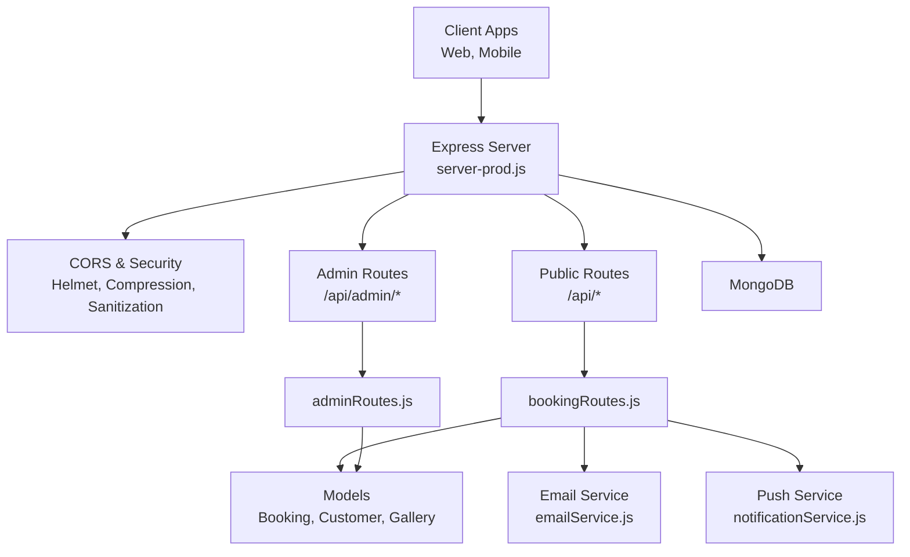
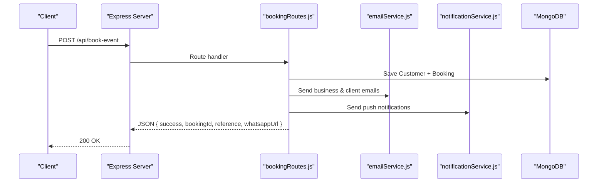
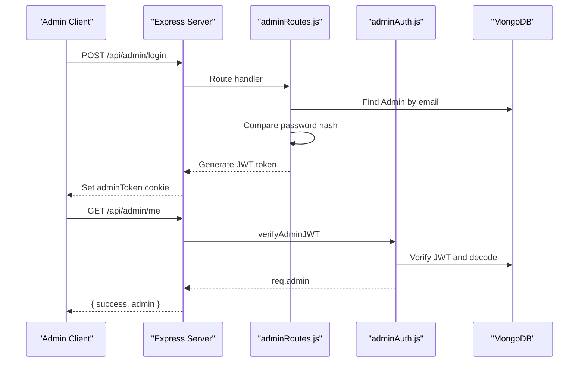
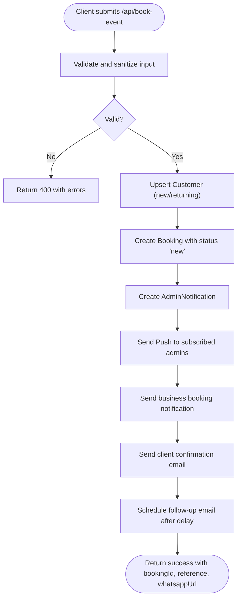
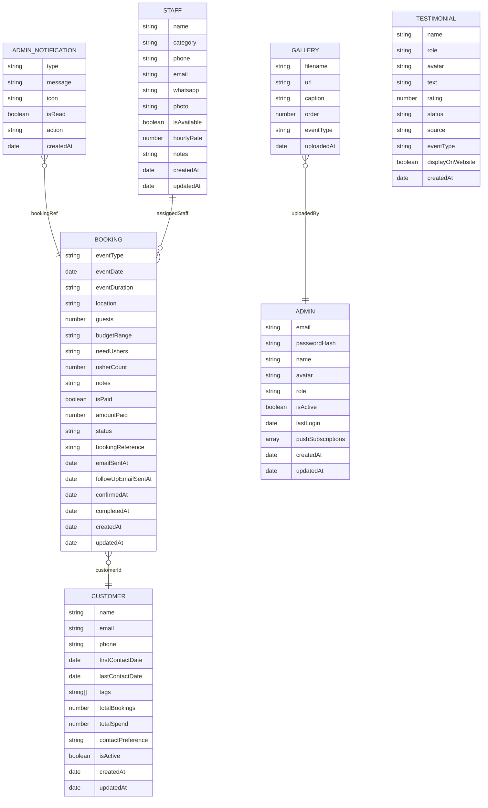
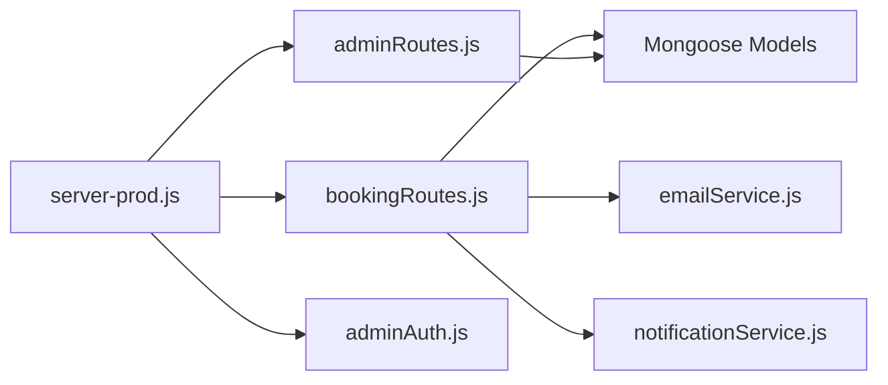

# Backend API Reference

<cite>
**Referenced Files in This Document**
- [server-prod.js](file://server-prod.js)
- [bookingRoutes.js](file://server/routes/bookingRoutes.js)
- [adminRoutes.js](file://server/routes/adminRoutes.js)
- [adminAuth.js](file://server/middleware/adminAuth.js)
- [emailService.js](file://server/services/emailService.js)
- [notificationService.js](file://server/services/notificationService.js)
- [Booking.js](file://server/models/Booking.js)
- [Customer.js](file://server/models/Customer.js)
- [Admin.js](file://server/models/Admin.js)
- [AdminNotification.js](file://server/models/AdminNotification.js)
- [Staff.js](file://server/models/Staff.js)
- [Gallery.js](file://server/models/Gallery.js)
- [Testimonial.js](file://server/models/Testimonial.js)
- [package.json](file://package.json)
</cite>

## Table of Contents
1. [Introduction](#introduction)
2. [Project Structure](#project-structure)
3. [Core Components](#core-components)
4. [Architecture Overview](#architecture-overview)
5. [Detailed Component Analysis](#detailed-component-analysis)
6. [Dependency Analysis](#dependency-analysis)
7. [Performance Considerations](#performance-considerations)
8. [Troubleshooting Guide](#troubleshooting-guide)
9. [Conclusion](#conclusion)
10. [Appendices](#appendices)

## Introduction
This document provides a comprehensive API reference for the Emerald Pearland Events backend. It covers:
- Public endpoints for client booking submissions, booking status retrieval, and public gallery access
- Admin endpoints requiring JWT authentication for booking management, staff coordination, analytics reporting, and system administration
- Request/response schemas, authentication requirements, error codes, validation rules, and security measures
- Practical usage examples with curl and JavaScript fetch
- Rate limiting, input validation, and troubleshooting guidance

## Project Structure
The backend is an Express.js application with:
- Routes under server/routes for public and admin APIs
- Middleware for admin JWT verification and generation
- Services for email and push notifications
- Mongoose models for domain entities
- A single server entry point mounting all routes and middleware

**Diagram sources**
- [server-prod.js](file://server-prod.js#L24-L127)
- [bookingRoutes.js](file://server/routes/bookingRoutes.js#L1-L356)
- [adminRoutes.js](file://server/routes/adminRoutes.js#L1-L1160)
- [emailService.js](file://server/services/emailService.js#L1-L467)
- [notificationService.js](file://server/services/notificationService.js#L1-L78)

**Section sources**
- [server-prod.js](file://server-prod.js#L24-L127)

## Core Components
- Express server with security middleware (Helmet, CORS, compression, sanitization)
- Public booking and gallery endpoints
- Admin authentication and protected endpoints
- Email and push notification services
- Mongoose models for bookings, customers, admins, notifications, staff, gallery, testimonials

**Section sources**
- [server-prod.js](file://server-prod.js#L44-L101)
- [bookingRoutes.js](file://server/routes/bookingRoutes.js#L1-L356)
- [adminRoutes.js](file://server/routes/adminRoutes.js#L1-L1160)
- [emailService.js](file://server/services/emailService.js#L1-L467)
- [notificationService.js](file://server/services/notificationService.js#L1-L78)
- [Booking.js](file://server/models/Booking.js#L1-L169)
- [Customer.js](file://server/models/Customer.js#L1-L93)
- [Admin.js](file://server/models/Admin.js#L1-L70)
- [AdminNotification.js](file://server/models/AdminNotification.js#L1-L40)
- [Staff.js](file://server/models/Staff.js#L1-L57)
- [Gallery.js](file://server/models/Gallery.js#L1-L38)
- [Testimonial.js](file://server/models/Testimonial.js#L1-L51)

## Architecture Overview
High-level API flow:
- Public clients submit bookings and view the public gallery
- Admins authenticate via JWT and manage bookings, staff, analytics, and settings
- Email and push notifications are triggered during booking lifecycle

**Diagram sources**
- [server-prod.js](file://server-prod.js#L235-L254)
- [bookingRoutes.js](file://server/routes/bookingRoutes.js#L121-L285)
- [emailService.js](file://server/services/emailService.js#L127-L250)
- [notificationService.js](file://server/services/notificationService.js#L16-L75)

## Detailed Component Analysis

### Public Endpoints

#### POST /api/book-event
- Purpose: Submit a new booking inquiry
- Authentication: None
- Rate limiting: Yes (15 requests per 15 minutes per IP)
- Validation rules:
  - fullName: required, minimum length 2
  - phone: required, international or local Kenyan format
  - email: required, valid email
  - eventType: required, one of predefined values
  - eventDate: required, must be in the future
  - eventDuration: required
  - location: required, minimum length 2
  - guestCount: required, minimum 1
  - budgetRange: required, one of predefined ranges
  - needUshers: "Yes", "No", or "Not specified"
  - usherCount: present only if needUshers is "Yes"
  - specialRequests: optional
- Input sanitization: Trims and removes angle brackets
- Response:
  - success: boolean
  - message: string
  - bookingId: ObjectId
  - bookingReference: string
  - whatsappUrl: string (pre-encoded)
  - timestamp: ISO date
- Errors:
  - 400: Validation failed with array of errors
  - 500: Server error
- Security:
  - Rate limit enforced
  - Input sanitized
  - Emails sent asynchronously; failure does not block response
- Example curl:
  - curl -X POST https://yoursite.com/api/book-event -H "Content-Type: application/json" -d '{"fullName":"John Doe","phone":"+254700123456","email":"john@example.com","eventType":"Wedding","eventDate":"2026-01-01","eventDuration":"4 hours","location":"Nairobi","guestCount":100,"budgetRange":"KES 250,000 – 500,000","needUshers":"Yes","usherCount":4,"specialRequests":"Balcony seating"}'
- Example fetch:
  - fetch("https://yoursite.com/api/book-event", { method: "POST", headers: {"Content-Type": "application/json"}, body: JSON.stringify({...}) }).then(r=>r.json())

**Section sources**
- [bookingRoutes.js](file://server/routes/bookingRoutes.js#L18-L24)
- [bookingRoutes.js](file://server/routes/bookingRoutes.js#L41-L88)
- [bookingRoutes.js](file://server/routes/bookingRoutes.js#L121-L285)
- [server-prod.js](file://server-prod.js#L313-L322)

#### GET /api/booking/:bookingId
- Purpose: Retrieve booking details (admin-only endpoint in routes file; public access documented here)
- Authentication: None
- Response:
  - success: boolean
  - booking: populated booking object with customer
- Errors:
  - 404: Booking not found
  - 500: Error retrieving booking

**Section sources**
- [bookingRoutes.js](file://server/routes/bookingRoutes.js#L290-L312)

#### PATCH /api/booking/:bookingId/status
- Purpose: Update booking status (admin-only endpoint in routes file; public access documented here)
- Authentication: None
- Request body:
  - status: one of ["new","contacted","confirmed","completed","cancelled"]
- Response:
  - success: boolean
  - message: string
  - booking: updated booking object
- Errors:
  - 400: Invalid status
  - 404: Booking not found
  - 500: Error updating booking

**Section sources**
- [bookingRoutes.js](file://server/routes/bookingRoutes.js#L317-L353)

#### GET /api/gallery
- Purpose: Fetch public gallery items
- Authentication: None
- Response:
  - success: boolean
  - gallery: array of gallery items sorted by order and upload time
- Errors:
  - 500: Error fetching gallery

**Section sources**
- [bookingRoutes.js](file://server/routes/bookingRoutes.js#L107-L115)
- [server-prod.js](file://server-prod.js#L257-L265)

### Admin Endpoints (JWT Required)

#### Authentication Flow
- Login: POST /api/admin/login
  - Request body: { email, password }
  - Response: { success, message, admin: { id, email, name, role, avatar } }
  - Sets httpOnly cookie "adminToken" with 24h expiry
  - Errors: 400 (missing fields), 401 (invalid credentials), 500 (server error)
- Logout: POST /api/admin/logout
  - Clears adminToken cookie
  - Response: { success, message }
- Who Am I: GET /api/admin/me
  - Requires adminToken cookie
  - Response: { success, admin }
- Protected routes: All /api/admin/* require adminToken cookie

**Diagram sources**
- [adminRoutes.js](file://server/routes/adminRoutes.js#L59-L143)
- [adminAuth.js](file://server/middleware/adminAuth.js#L3-L31)

**Section sources**
- [adminRoutes.js](file://server/routes/adminRoutes.js#L59-L143)
- [adminAuth.js](file://server/middleware/adminAuth.js#L3-L31)

#### Booking Management
- GET /api/admin/bookings
  - Query params: status, eventType, search, page, limit
  - Response: { success, bookings[], pagination: { total, pages, currentPage } }
- GET /api/admin/bookings/:id
  - Response: { success, booking } with populated customer and assigned staff
- PATCH /api/admin/bookings/:id
  - Request body: { status, isPaid, notes, assignedStaff }
  - Response: { success, message, booking }
- PATCH /api/admin/bookings/:id/pay
  - Request body: { amountPaid, isPaid }
  - Response: { success, message, booking }
- POST /api/admin/bookings/:id/send-appreciation
  - Sends appreciation email to client
  - Response: { success, message }
- POST /api/admin/bookings/:id/message-staff
  - Request body: { customMessage, staffIds[] }
  - Response: { success, message }
- DELETE /api/admin/bookings/:id
  - Response: { success, message }

**Section sources**
- [adminRoutes.js](file://server/routes/adminRoutes.js#L174-L442)

#### Analytics Reporting
- GET /api/admin/analytics/overview
  - Response includes totals, monthly counts, pending confirmations, upcoming events, revenue, projected revenue, and chart data

**Section sources**
- [adminRoutes.js](file://server/routes/adminRoutes.js#L448-L560)

#### Notifications
- GET /api/admin/notifications?unreadOnly=false
  - Response: { success, notifications[], unreadCount }
- PATCH /api/admin/notifications/:id/read
  - Response: { success, notification }
- DELETE /api/admin/notifications/:id
  - Response: { success, message }

**Section sources**
- [adminRoutes.js](file://server/routes/adminRoutes.js#L562-L631)

#### Staff Management
- GET /api/admin/staff?category=
  - Response: { success, staff[] }
- POST /api/admin/staff
  - Request body: { name, category, email, phone, whatsapp, bio, photo }
  - Response: { success, message, staff }
- DELETE /api/admin/staff/:id
  - Response: { success, message }

**Section sources**
- [adminRoutes.js](file://server/routes/adminRoutes.js#L633-L712)

#### Gallery and Testimonials
- GET /api/admin/gallery
  - Response: { success, gallery[] }
- GET /api/admin/testimonials?status=
  - Response: { success, testimonials[] }

**Section sources**
- [adminRoutes.js](file://server/routes/adminRoutes.js#L714-L751)

#### Settings
- GET /api/admin/settings
  - Response: { success, settings }
- PATCH /api/admin/settings
  - Request body: businessName, businessPhone, businessEmail, businessAddress, notifyOnNewBooking, notifyOnWhatsApp, darkMode, instagramHandle, instagramUrl, facebookUrl, beholdfeedId, profileImage
  - Response: { success, message }

**Section sources**
- [adminRoutes.js](file://server/routes/adminRoutes.js#L753-L800)

#### Push Notifications (Admin)
- GET /api/admin/vapid-public-key
  - Response: { success, publicKey }
- POST /api/admin/push-subscribe
  - Request body: { subscription }
  - Response: { success, message }

**Section sources**
- [adminRoutes.js](file://server/routes/adminRoutes.js#L22-L57)

### Booking Workflow API
The booking workflow spans client submission, internal notifications, client confirmations, follow-ups, and staff reminders.

**Diagram sources**
- [bookingRoutes.js](file://server/routes/bookingRoutes.js#L121-L285)
- [emailService.js](file://server/services/emailService.js#L127-L250)
- [notificationService.js](file://server/services/notificationService.js#L16-L75)

**Section sources**
- [bookingRoutes.js](file://server/routes/bookingRoutes.js#L121-L285)

### Data Models

**Diagram sources**
- [Booking.js](file://server/models/Booking.js#L7-L169)
- [Customer.js](file://server/models/Customer.js#L7-L93)
- [Admin.js](file://server/models/Admin.js#L4-L70)
- [Staff.js](file://server/models/Staff.js#L3-L57)
- [AdminNotification.js](file://server/models/AdminNotification.js#L3-L40)
- [Gallery.js](file://server/models/Gallery.js#L3-L38)
- [Testimonial.js](file://server/models/Testimonial.js#L3-L51)

## Dependency Analysis
- Express server mounts:
  - Public routes: /api/*
  - Admin routes: /api/admin/*
- Middleware:
  - Security: Helmet, CORS, compression, mongo sanitize, rate limit
  - Admin JWT: verifyAdminJWT validates httpOnly cookie
- Services:
  - Email via Brevo SDK
  - Push via web-push with VAPID keys
- Models:
  - Booking, Customer, Admin, Staff, AdminNotification, Gallery, Testimonial

**Diagram sources**
- [server-prod.js](file://server-prod.js#L235-L254)
- [bookingRoutes.js](file://server/routes/bookingRoutes.js#L1-L356)
- [adminRoutes.js](file://server/routes/adminRoutes.js#L1-L1160)
- [adminAuth.js](file://server/middleware/adminAuth.js#L1-L56)
- [emailService.js](file://server/services/emailService.js#L1-L467)
- [notificationService.js](file://server/services/notificationService.js#L1-L78)

**Section sources**
- [server-prod.js](file://server-prod.js#L235-L254)
- [package.json](file://package.json#L25-L46)

## Performance Considerations
- Rate limiting:
  - General: 1000 requests per 15 minutes per IP
  - Auth/admin: 20 requests per 15 minutes per IP
  - Booking endpoint: 15 requests per 15 minutes per IP
- Compression: Gzip/Brotli enabled
- Security headers: Helmet CSP and security policies
- Database indexing: Composite indexes on Booking and Customer collections for frequent queries
- Asynchronous operations: Email and push notifications are fire-and-forget to avoid blocking responses

**Section sources**
- [server-prod.js](file://server-prod.js#L95-L101)
- [server-prod.js](file://server-prod.js#L313-L322)
- [bookingRoutes.js](file://server/routes/bookingRoutes.js#L18-L24)
- [Booking.js](file://server/models/Booking.js#L150-L166)
- [Customer.js](file://server/models/Customer.js#L87-L91)

## Troubleshooting Guide
- Authentication failures:
  - 401 No token or invalid/expired token
  - Ensure adminToken cookie is present and not expired
- Email delivery issues:
  - BREVO API key missing disables email service
  - Confirm environment variables and SMTP configuration
- Push notifications:
  - VAPID keys required; missing keys disable push
  - Subscriptions may be cleaned up if endpoints become invalid
- Database connectivity:
  - MONGODB_URI must be set; server exits on connection failure
- CORS errors:
  - Ensure frontend origin is whitelisted in CORS configuration
- Rate limiting:
  - Exceeded limits return 429-like messages; wait before retrying

**Section sources**
- [adminAuth.js](file://server/middleware/adminAuth.js#L8-L31)
- [emailService.js](file://server/services/emailService.js#L9-L27)
- [notificationService.js](file://server/services/notificationService.js#L5-L14)
- [server-prod.js](file://server-prod.js#L107-L127)
- [server-prod.js](file://server-prod.js#L60-L86)
- [server-prod.js](file://server-prod.js#L95-L101)

## Conclusion
The backend provides a robust, production-ready API for event booking and admin management. It emphasizes security (JWT, Helmet, sanitization), reliability (asynchronous notifications), and scalability (rate limiting, compression). The documentation above should enable seamless integration for clients and administrators.

## Appendices

### API Summary Table
- Public
  - POST /api/book-event (authentication: none)
  - GET /api/booking/:bookingId (authentication: none)
  - PATCH /api/booking/:bookingId/status (authentication: none)
  - GET /api/gallery (authentication: none)
- Admin (authentication: JWT via adminToken cookie)
  - POST /api/admin/login
  - POST /api/admin/logout
  - GET /api/admin/me
  - GET /api/admin/bookings
  - GET /api/admin/bookings/:id
  - PATCH /api/admin/bookings/:id
  - PATCH /api/admin/bookings/:id/pay
  - POST /api/admin/bookings/:id/send-appreciation
  - POST /api/admin/bookings/:id/message-staff
  - DELETE /api/admin/bookings/:id
  - GET /api/admin/analytics/overview
  - GET /api/admin/notifications
  - PATCH /api/admin/notifications/:id/read
  - DELETE /api/admin/notifications/:id
  - GET /api/admin/staff
  - POST /api/admin/staff
  - DELETE /api/admin/staff/:id
  - GET /api/admin/gallery
  - GET /api/admin/testimonials
  - GET /api/admin/settings
  - PATCH /api/admin/settings
  - GET /api/admin/vapid-public-key
  - POST /api/admin/push-subscribe

### Example Usage

- curl: Submit booking
  - curl -X POST https://yoursite.com/api/book-event -H "Content-Type: application/json" -d '{"fullName":"Jane Doe","phone":"0712345678","email":"jane@example.com","eventType":"Anniversary","eventDate":"2026-02-14","eventDuration":"5 hours","location":"Mombasa","guestCount":80,"budgetRange":"KES 100,000 – 250,000","needUshers":"No","specialRequests":"Garden venue"}'

- JavaScript fetch: Submit booking
  - fetch("https://yoursite.com/api/book-event", { method: "POST", headers: {"Content-Type": "application/json"}, body: JSON.stringify({fullName:"Jane Doe",phone:"0712345678",email:"jane@example.com",eventType:"Anniversary",eventDate:"2026-02-14",eventDuration:"5 hours",location:"Mombasa",guestCount:80,budgetRange:"KES 100,000 – 250,000",needUshers:"No"}) }).then(r=>r.json()).then(console.log);

- curl: Admin login
  - curl -c cookies.txt -X POST https://yoursite.com/api/admin/login -H "Content-Type: application/json" -d '{"email":"admin@site.com","password":"your_password"}'

- curl: Get admin bookings (after login)
  - curl -b cookies.txt https://yoursite.com/api/admin/bookings?page=1&limit=20