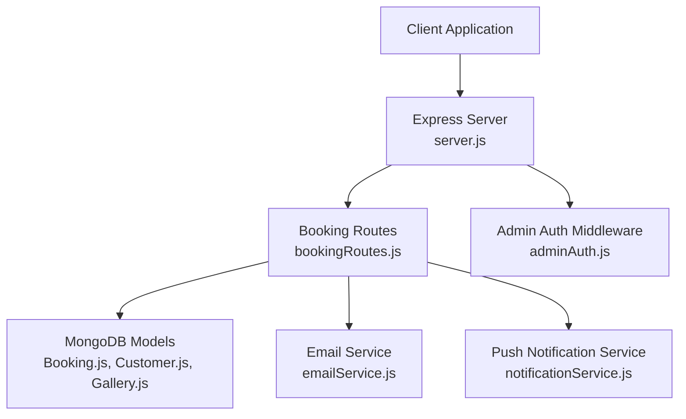
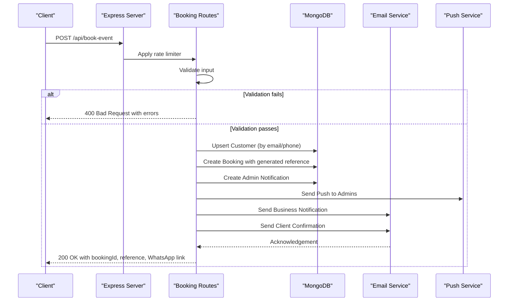
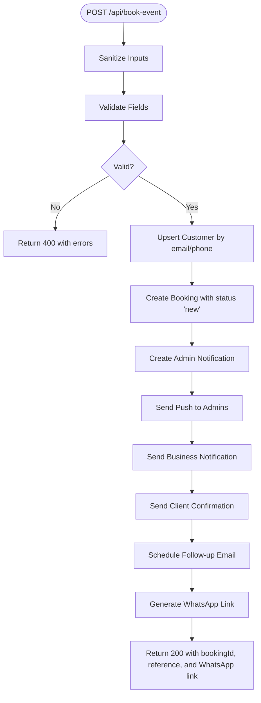
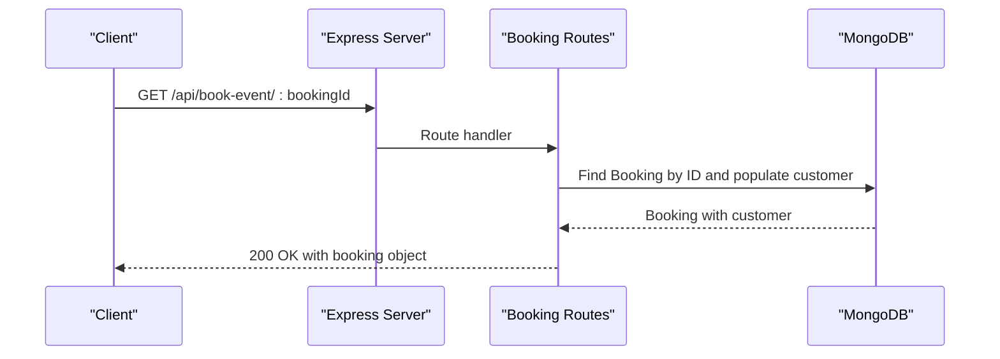
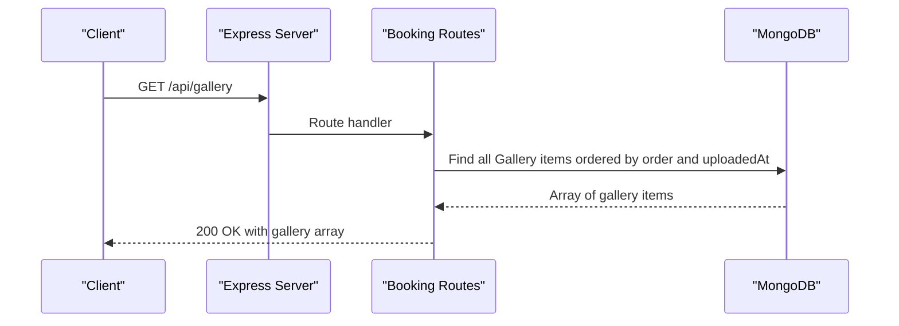
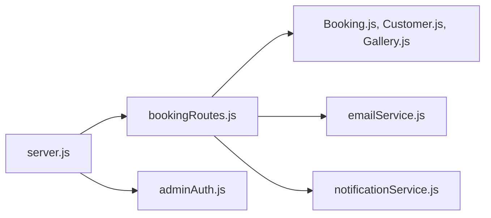

# Client Booking APIs

<cite>
**Referenced Files in This Document**
- [server.js](file://server.js)
- [bookingRoutes.js](file://server/routes/bookingRoutes.js)
- [emailService.js](file://server/services/emailService.js)
- [notificationService.js](file://server/services/notificationService.js)
- [Booking.js](file://server/models/Booking.js)
- [Customer.js](file://server/models/Customer.js)
- [Gallery.js](file://server/models/Gallery.js)
- [adminAuth.js](file://server/middleware/adminAuth.js)
</cite>

## Table of Contents
1. [Introduction](#introduction)
2. [Project Structure](#project-structure)
3. [Core Components](#core-components)
4. [Architecture Overview](#architecture-overview)
5. [Detailed Component Analysis](#detailed-component-analysis)
6. [Dependency Analysis](#dependency-analysis)
7. [Performance Considerations](#performance-considerations)
8. [Troubleshooting Guide](#troubleshooting-guide)
9. [Conclusion](#conclusion)
10. [Appendices](#appendices)

## Introduction
This document provides comprehensive API documentation for client-facing booking endpoints. It covers:
- POST /api/book-event: main booking submission endpoint with validation, sanitization, customer creation/update, and response formats
- GET /api/book-event/:bookingId: booking retrieval endpoint for status checking
- GET /api/gallery: public gallery endpoint for accessing event photos

It includes request/response schemas, validation requirements, error handling, security measures, rate limiting, input sanitization against XSS, the complete booking workflow, troubleshooting guidance, and integration examples.

## Project Structure
The booking APIs are implemented under the Express server with modular routing and services:
- API entry point and middleware configuration in server.js
- Public booking endpoints in server/routes/bookingRoutes.js
- Email delivery via server/services/emailService.js (Brevo SDK)
- Push notifications via server/services/notificationService.js (Web Push)
- Data models for Booking, Customer, and Gallery in server/models/
- Admin JWT authentication middleware in server/middleware/adminAuth.js

**Diagram sources**
- [server.js](file://server.js#L32-L544)
- [bookingRoutes.js](file://server/routes/bookingRoutes.js#L1-L356)
- [emailService.js](file://server/services/emailService.js#L1-L467)
- [notificationService.js](file://server/services/notificationService.js#L1-L77)
- [Booking.js](file://server/models/Booking.js#L1-L169)
- [Customer.js](file://server/models/Customer.js#L1-L93)
- [Gallery.js](file://server/models/Gallery.js#L1-L38)
- [adminAuth.js](file://server/middleware/adminAuth.js#L1-L56)

**Section sources**
- [server.js](file://server.js#L32-L544)

## Core Components
- Rate limiter: Prevents spam by limiting POST /api/book-event to a fixed number of requests per window
- Validation: Server-side checks for required fields and logical constraints
- Input sanitization: Removes potentially dangerous characters to mitigate XSS
- Customer lifecycle: Creates or updates customer records based on email/phone
- Booking lifecycle: Creates booking records, generates reference, and sets initial status
- Notifications: Sends business notifications, client confirmations, and delayed follow-ups
- Push notifications: Immediate push to admin devices upon new booking
- Public gallery: Exposes curated gallery items to clients

**Section sources**
- [bookingRoutes.js](file://server/routes/bookingRoutes.js#L18-L285)
- [emailService.js](file://server/services/emailService.js#L9-L27)
- [notificationService.js](file://server/services/notificationService.js#L1-L77)
- [Booking.js](file://server/models/Booking.js#L7-L169)
- [Customer.js](file://server/models/Customer.js#L7-L93)
- [Gallery.js](file://server/models/Gallery.js#L3-L38)

## Architecture Overview
The booking workflow integrates client requests, validation, persistence, and communication channels.

**Diagram sources**
- [bookingRoutes.js](file://server/routes/bookingRoutes.js#L121-L285)
- [emailService.js](file://server/services/emailService.js#L127-L219)
- [notificationService.js](file://server/services/notificationService.js#L16-L75)
- [Booking.js](file://server/models/Booking.js#L142-L148)
- [Customer.js](file://server/models/Customer.js#L82-L85)

## Detailed Component Analysis

### POST /api/book-event
Purpose: Submit a new booking request from clients.

- Endpoint: POST /api/book-event
- Authentication: None required for clients
- Rate limiting: Enabled globally for this endpoint
- Request body schema:
  - fullName: string, required, minimum length 2
  - phone: string, required, validated as Kenyan/international format
  - email: string, required, validated as email
  - eventType: string, required, enum from model
  - eventDate: date, required, must be in the future
  - eventDuration: string, required
  - location: string, required, minimum length 2
  - guestCount: integer, required, minimum 1
  - budgetRange: string, required, enum from model
  - needUshers: string, enum ['Yes','No','Not specified'], default 'Not specified'
  - usherCount: integer, optional, required if needUshers is 'Yes'
  - specialRequests: string, optional
- Validation rules:
  - Presence and length checks for names and locations
  - Phone format validation
  - Email format validation
  - Future event date constraint
  - Enum constraints for eventType and budgetRange
  - Conditional validation for usherCount
- Input sanitization:
  - Trims and strips angle brackets from strings to mitigate XSS
  - Guest count parsed to integer
- Processing steps:
  1. Validate input and return 400 with errors if invalid
  2. Find existing customer by email or phone; otherwise create new
  3. Create booking with status 'new' and generated bookingReference
  4. Create admin notification and send push to subscribed admins
  5. Send business notification email
  6. Send client confirmation email
  7. Schedule delayed follow-up email after a short delay
  8. Generate WhatsApp URL for quick client contact
  9. Return success response with bookingId, bookingReference, and WhatsApp link
- Response schema:
  - success: boolean
  - message: string
  - bookingId: ObjectId
  - bookingReference: string
  - whatsappUrl: string
  - timestamp: ISO date string
- Error responses:
  - 400: Validation failed with array of error messages
  - 500: Server error with optional error details in development
- Security measures:
  - Rate limiting to prevent abuse
  - XSS sanitization via trimming and character removal
  - Email content sanitized via HTML escaping in templates
  - CORS configured for allowed origins
- Practical examples:
  - Successful submission returns bookingId and bookingReference for status checking
  - Validation failure returns structured errors for client-side correction

**Diagram sources**
- [bookingRoutes.js](file://server/routes/bookingRoutes.js#L121-L285)
- [emailService.js](file://server/services/emailService.js#L127-L219)
- [notificationService.js](file://server/services/notificationService.js#L16-L75)

**Section sources**
- [bookingRoutes.js](file://server/routes/bookingRoutes.js#L121-L285)
- [Booking.js](file://server/models/Booking.js#L7-L169)
- [Customer.js](file://server/models/Customer.js#L7-L93)
- [emailService.js](file://server/services/emailService.js#L127-L219)
- [notificationService.js](file://server/services/notificationService.js#L16-L75)

### GET /api/book-event/:bookingId
Purpose: Retrieve booking details for status checking.

- Endpoint: GET /api/book-event/:bookingId
- Authentication: None required for clients
- Path parameter:
  - bookingId: ObjectId of the booking
- Response schema:
  - success: boolean
  - booking: populated booking object including customer details
- Error responses:
  - 404: Booking not found
  - 500: Error retrieving booking

**Diagram sources**
- [bookingRoutes.js](file://server/routes/bookingRoutes.js#L290-L312)

**Section sources**
- [bookingRoutes.js](file://server/routes/bookingRoutes.js#L290-L312)
- [Booking.js](file://server/models/Booking.js#L157-L166)

### GET /api/gallery
Purpose: Access public event photos.

- Endpoint: GET /api/gallery
- Authentication: None required for clients
- Response schema:
  - success: boolean
  - gallery: array of gallery items sorted by order and upload time
- Gallery item schema:
  - filename: string
  - url: string
  - caption: string
  - order: number
  - eventType: string or null
  - uploadedAt: date
- Error responses:
  - 500: Error fetching gallery

**Diagram sources**
- [bookingRoutes.js](file://server/routes/bookingRoutes.js#L107-L115)
- [Gallery.js](file://server/models/Gallery.js#L3-L38)

**Section sources**
- [bookingRoutes.js](file://server/routes/bookingRoutes.js#L107-L115)
- [Gallery.js](file://server/models/Gallery.js#L3-L38)

## Dependency Analysis
- Express server initializes CORS, cookies, rate limiter, and routes
- Booking routes depend on:
  - Models: Booking, Customer, Gallery
  - Services: emailService, notificationService
  - Middleware: rateLimit
- Email service depends on Brevo SDK and environment configuration
- Push service depends on Web Push and VAPID keys
- Admin authentication middleware secures admin endpoints

**Diagram sources**
- [server.js](file://server.js#L32-L544)
- [bookingRoutes.js](file://server/routes/bookingRoutes.js#L1-L356)
- [emailService.js](file://server/services/emailService.js#L1-L467)
- [notificationService.js](file://server/services/notificationService.js#L1-L77)
- [Booking.js](file://server/models/Booking.js#L1-L169)
- [Customer.js](file://server/models/Customer.js#L1-L93)
- [Gallery.js](file://server/models/Gallery.js#L1-L38)
- [adminAuth.js](file://server/middleware/adminAuth.js#L1-L56)

**Section sources**
- [server.js](file://server.js#L32-L544)
- [bookingRoutes.js](file://server/routes/bookingRoutes.js#L1-L356)

## Performance Considerations
- Rate limiting: Prevents abuse and ensures fair resource usage
- Database indexing: Booking and Customer schemas include indexes for frequent queries
- Asynchronous operations: Email and push notifications are fire-and-forget to avoid blocking responses
- Payload limits: Body parser configured with large payload support for potential media uploads

[No sources needed since this section provides general guidance]

## Troubleshooting Guide
Common validation failures and resolutions:
- Full Name too short: Ensure at least 2 characters
- Invalid Phone Number: Use accepted formats (+254, 0, or 722XXXXXXX)
- Invalid Email Address: Ensure correct email format
- Event Date in Past: Choose a future date
- Event Duration Missing: Provide duration string
- Location Too Short: Provide at least 2 characters
- Guest Count Less Than 1: Set to minimum 1
- Budget Range Missing: Select a valid range from enum
- Usher Count Required: Provide count when needUshers is 'Yes'

Rate limiting:
- If receiving "Too many booking requests", wait until the next window or reduce submission frequency

Email delivery:
- Ensure BREVO API key is configured; otherwise email service is disabled
- Confirm EMAIL_USER and ADMIN_EMAIL are set for proper sender/receiver configuration

Push notifications:
- Ensure VAPID_PUBLIC_KEY and VAPID_PRIVATE_KEY are configured for push notifications

XSS prevention:
- Input is sanitized by trimming and removing angle brackets; avoid injecting HTML in fields

**Section sources**
- [bookingRoutes.js](file://server/routes/bookingRoutes.js#L41-L88)
- [bookingRoutes.js](file://server/routes/bookingRoutes.js#L18-L24)
- [emailService.js](file://server/services/emailService.js#L9-L27)
- [notificationService.js](file://server/services/notificationService.js#L6-L14)

## Conclusion
The client booking APIs provide a robust, secure, and scalable foundation for event bookings. They enforce strict validation, sanitize inputs, manage customer and booking lifecycles, and integrate email and push notifications. The public gallery endpoint offers easy access to event photos. Proper configuration of environment variables ensures reliable operation of email and push services.

[No sources needed since this section summarizes without analyzing specific files]

## Appendices

### Request/Response Schemas

- POST /api/book-event (Request)
  - fullName: string
  - phone: string
  - email: string
  - eventType: enum string
  - eventDate: date
  - eventDuration: string
  - location: string
  - guestCount: integer
  - budgetRange: enum string
  - needUshers: enum string
  - usherCount: integer (optional)
  - specialRequests: string (optional)

- POST /api/book-event (Response)
  - success: boolean
  - message: string
  - bookingId: ObjectId
  - bookingReference: string
  - whatsappUrl: string
  - timestamp: ISO date string

- GET /api/book-event/:bookingId (Response)
  - success: boolean
  - booking: populated booking object

- GET /api/gallery (Response)
  - success: boolean
  - gallery: array of gallery items

**Section sources**
- [bookingRoutes.js](file://server/routes/bookingRoutes.js#L121-L285)
- [bookingRoutes.js](file://server/routes/bookingRoutes.js#L290-L312)
- [bookingRoutes.js](file://server/routes/bookingRoutes.js#L107-L115)
- [Booking.js](file://server/models/Booking.js#L7-L169)
- [Gallery.js](file://server/models/Gallery.js#L3-L38)

### Security Measures
- Rate limiting on booking submissions
- Input sanitization (trimming and bracket removal)
- Email content escaping in templates
- CORS configuration for allowed origins
- Admin endpoints protected by JWT cookies

**Section sources**
- [bookingRoutes.js](file://server/routes/bookingRoutes.js#L18-L24)
- [bookingRoutes.js](file://server/routes/bookingRoutes.js#L90-L94)
- [server.js](file://server.js#L49-L72)
- [adminAuth.js](file://server/middleware/adminAuth.js#L3-L31)

### Integration Examples
- Client integration:
  - Submit booking form to POST /api/book-event with required fields
  - On success, store bookingId and bookingReference for status checking
  - Redirect client to whatsappUrl for immediate contact
- Status checking:
  - Poll GET /api/book-event/:bookingId to retrieve booking details
- Gallery integration:
  - Fetch GET /api/gallery to display event photos

[No sources needed since this section provides general guidance]