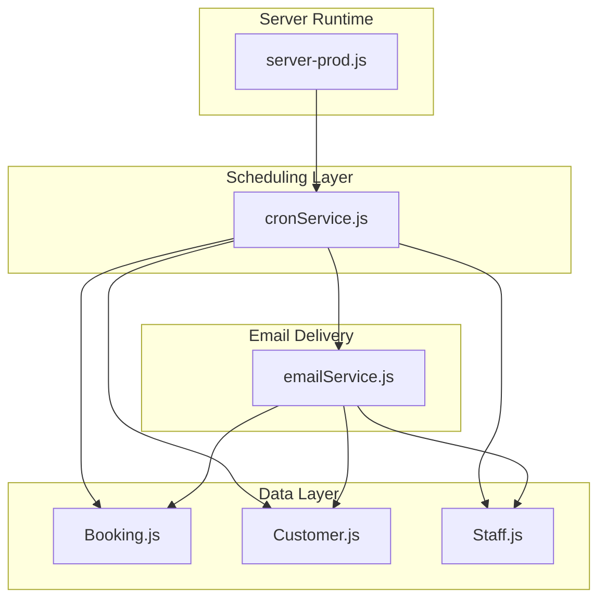
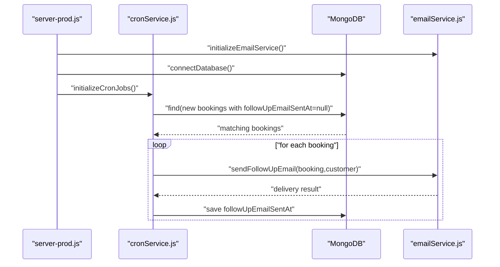
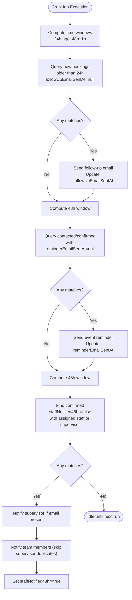
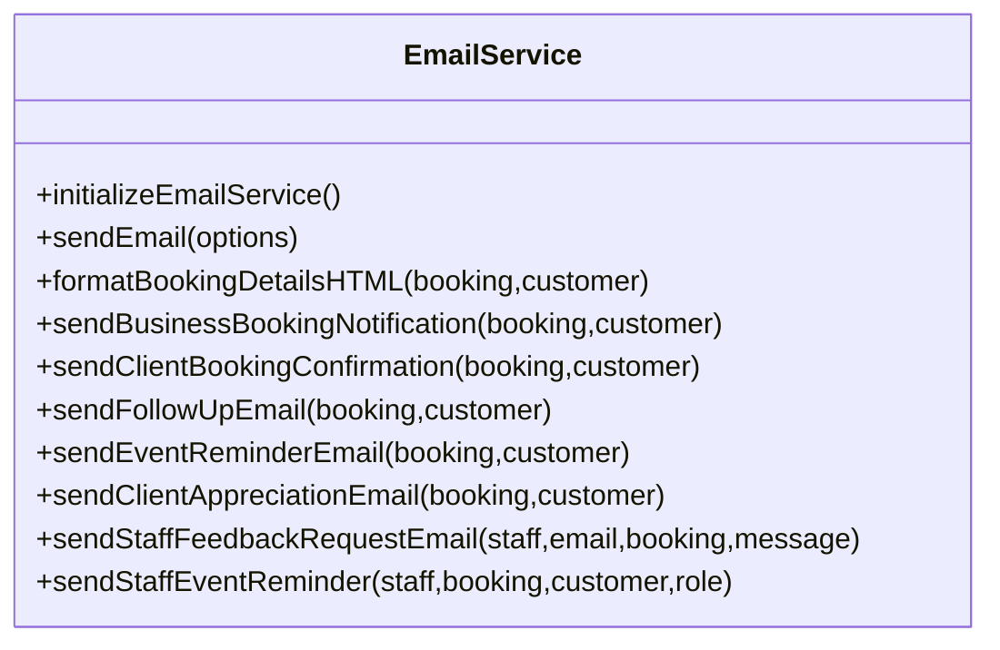
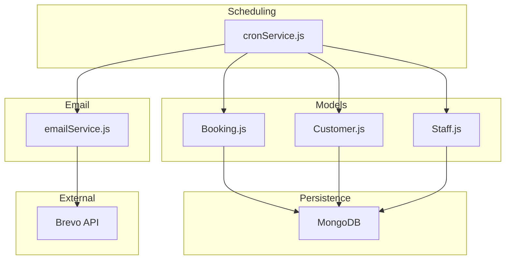
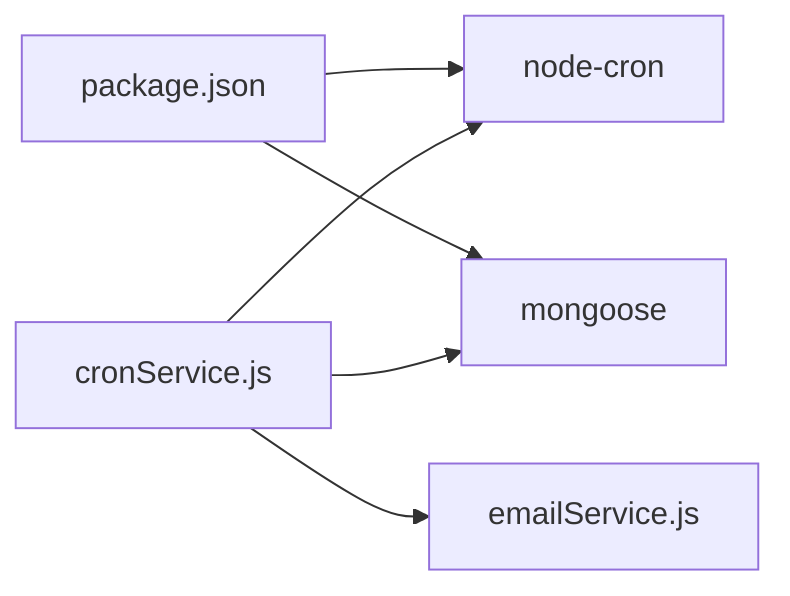

# Automated Workflow System

<cite>
**Referenced Files in This Document**
- [cronService.js](file://server/services/cronService.js)
- [emailService.js](file://server/services/emailService.js)
- [Booking.js](file://server/models/Booking.js)
- [Customer.js](file://server/models/Customer.js)
- [Staff.js](file://server/models/Staff.js)
- [server-prod.js](file://server-prod.js)
- [.env](file://.env)
- [package.json](file://package.json)
- [implementation_plan.md.resolved](file://implementation_plan.md.resolved)
- [task.md.resolved](file://task.md.resolved)
</cite>

## Table of Contents
1. [Introduction](#introduction)
2. [Project Structure](#project-structure)
3. [Core Components](#core-components)
4. [Architecture Overview](#architecture-overview)
5. [Detailed Component Analysis](#detailed-component-analysis)
6. [Dependency Analysis](#dependency-analysis)
7. [Performance Considerations](#performance-considerations)
8. [Troubleshooting Guide](#troubleshooting-guide)
9. [Conclusion](#conclusion)
10. [Appendices](#appendices)

## Introduction
This document describes the automated workflow system that powers scheduled email communications for event bookings. The system is built on node-cron and integrates with a Brevo-based email service and a MongoDB-backed booking management system. It orchestrates four primary workflows:
- 24-hour follow-up emails to new bookings
- 48-hour event reminders to customers
- 48-hour pre-event notifications to assigned staff and supervisors
- Administrative follow-ups and feedback collection (via email templates)

The documentation covers cron syntax, timing precision, timezone handling, conditional triggers, database operations, error handling, logging, configuration guidelines, testing strategies, monitoring, and performance optimization.

## Project Structure
The automated workflow system spans three main areas:
- Scheduling and orchestration: server/services/cronService.js
- Email delivery: server/services/emailService.js
- Data models: server/models/Booking.js, server/models/Customer.js, server/models/Staff.js
- Server bootstrap and lifecycle: server-prod.js
- Environment configuration: .env
- Dependencies: package.json

**Diagram sources**
- [server-prod.js](file://server-prod.js#L368-L419)
- [cronService.js](file://server/services/cronService.js#L1-L185)
- [emailService.js](file://server/services/emailService.js#L1-L467)
- [Booking.js](file://server/models/Booking.js#L1-L169)
- [Customer.js](file://server/models/Customer.js#L1-L93)
- [Staff.js](file://server/models/Staff.js#L1-L57)

**Section sources**
- [server-prod.js](file://server-prod.js#L368-L419)
- [cronService.js](file://server/services/cronService.js#L1-L185)
- [emailService.js](file://server/services/emailService.js#L1-L467)
- [Booking.js](file://server/models/Booking.js#L1-L169)
- [Customer.js](file://server/models/Customer.js#L1-L93)
- [Staff.js](file://server/models/Staff.js#L1-L57)

## Core Components
- Cron orchestration service: schedules and executes three recurring tasks with distinct cadences and triggers.
- Email service: initializes Brevo SDK and sends templated HTML emails to customers, supervisors, and staff.
- Data models: Booking, Customer, and Staff define the domain and persistence for workflow triggers and recipients.

Key responsibilities:
- Cron jobs query the database for records meeting temporal and status conditions, then trigger email sends and update status flags.
- Email service encapsulates sender identity, reply-to handling, and HTML formatting.
- Models define indexes and populated defaults to optimize scheduling queries and reduce round-trips.

**Section sources**
- [cronService.js](file://server/services/cronService.js#L11-L185)
- [emailService.js](file://server/services/emailService.js#L9-L53)
- [Booking.js](file://server/models/Booking.js#L7-L169)
- [Customer.js](file://server/models/Customer.js#L7-L93)
- [Staff.js](file://server/models/Staff.js#L3-L57)

## Architecture Overview
The system initializes the email service, connects to MongoDB, and starts cron jobs during server startup. Each cron job runs at a fixed cadence, scans for eligible records, sends targeted emails, and persists status updates.

**Diagram sources**
- [server-prod.js](file://server-prod.js#L368-L419)
- [cronService.js](file://server/services/cronService.js#L21-L57)
- [emailService.js](file://server/services/emailService.js#L9-L53)

## Detailed Component Analysis

### Cron Orchestration Service
The orchestration service defines three scheduled tasks:
- Follow-up job: runs every hour; targets new bookings older than 24 hours without a follow-up email flag.
- Event reminder job: runs every 30 minutes; targets confirmed/contacted bookings within a tight 1-hour window around the 48-hour mark.
- Staff 48-hour alert job: runs every 30 minutes; targets confirmed bookings with assigned staff or supervisors, ensuring notifications are sent once per booking.

**Diagram sources**
- [cronService.js](file://server/services/cronService.js#L27-L161)

**Section sources**
- [cronService.js](file://server/services/cronService.js#L11-L185)

### Email Service
The email service initializes the Brevo SDK using an API key from environment variables and exposes functions to send templated HTML emails. It supports:
- Sender identity and reply-to configuration
- Formatting booking details into HTML tables
- Multiple email templates for follow-ups, reminders, staff alerts, and feedback

**Diagram sources**
- [emailService.js](file://server/services/emailService.js#L9-L467)

**Section sources**
- [emailService.js](file://server/services/emailService.js#L9-L467)

### Data Models and Triggers
The workflow relies on specific fields and indexes to drive conditional triggers and efficient queries:
- Booking: status, eventDate, staffNotified48hr, followUpEmailSentAt, reminderEmailSentAt, assignedStaff, supervisor
- Customer: populated by default on booking queries
- Staff: email presence determines whether to notify

Indexes on eventDate, status, and customerId improve query performance for scheduled scans.

**Section sources**
- [Booking.js](file://server/models/Booking.js#L7-L169)
- [Customer.js](file://server/models/Customer.js#L7-L93)
- [Staff.js](file://server/models/Staff.js#L3-L57)

### Workflow Scenarios

#### Late Booking Follow-ups
- Trigger: new bookings older than 24 hours with followUpEmailSentAt unset
- Action: send a follow-up email and set followUpEmailSentAt
- Outcome: reduces risk of losing new leads due to delayed manual follow-ups

**Section sources**
- [cronService.js](file://server/services/cronService.js#L30-L57)
- [Booking.js](file://server/models/Booking.js#L115-L118)

#### 48-Hour Event Reminders
- Trigger: contacted/confirmed bookings whose eventDate falls within a 1-hour window around the 48-hour mark
- Action: send a reminder email and set reminderEmailSentAt
- Outcome: improves customer engagement and reduces no-shows

**Section sources**
- [cronService.js](file://server/services/cronService.js#L62-L94)
- [Booking.js](file://server/models/Booking.js#L119-L122)

#### Staff Assignment Notifications
- Trigger: confirmed bookings with assigned staff or supervisors, and staffNotified48hr=false
- Action: notify supervisor first, then team members (skipping duplicates), then set staffNotified48hr
- Outcome: ensures timely awareness and reduces last-minute coordination failures

**Section sources**
- [cronService.js](file://server/services/cronService.js#L101-L161)
- [Booking.js](file://server/models/Booking.js#L85-L88)

#### Administrative Follow-ups and Feedback Collection
- Templates exist for client appreciation and staff feedback requests
- These can be triggered manually or extended to integrate with administrative workflows

**Section sources**
- [emailService.js](file://server/services/emailService.js#L295-L378)

## Architecture Overview

**Diagram sources**
- [cronService.js](file://server/services/cronService.js#L1-L185)
- [emailService.js](file://server/services/emailService.js#L1-L467)
- [Booking.js](file://server/models/Booking.js#L1-L169)
- [Customer.js](file://server/models/Customer.js#L1-L93)
- [Staff.js](file://server/models/Staff.js#L1-L57)

## Detailed Component Analysis

### Cron Job Configuration and Timing Precision
- Follow-up job: runs hourly using a minute-level schedule
- Event reminder and staff alert jobs: run every 30 minutes using a minutes-and-hours schedule
- Precision: jobs execute at the start of the minute/half-hour boundary; the 1-hour window for reminders ensures deterministic matching around the 48-hour threshold

Operational notes:
- Jobs are initialized on server start and stopped gracefully on SIGINT
- Each job logs execution timestamps and outcomes

**Section sources**
- [cronService.js](file://server/services/cronService.js#L27-L161)
- [server-prod.js](file://server-prod.js#L404-L410)

### Conditional Triggers and Business Logic
- New booking follow-ups depend on status=new and creation time older than 24 hours
- Event reminders depend on status in [contacted, confirmed] and eventDate falling within a 1-hour band around the 48-hour mark
- Staff notifications depend on confirmed status, presence of assigned staff or supervisor, and absence of prior notification flag

These conditions minimize redundant emails and ensure relevance.

**Section sources**
- [cronService.js](file://server/services/cronService.js#L33-L74)
- [cronService.js](file://server/services/cronService.js#L110-L118)

### Database Operations and Status Updates
- Queries use populate to fetch customer and staff details efficiently
- After successful email delivery, the system updates the corresponding timestamp or boolean flags on the Booking document
- Indexes on eventDate, status, and customerId improve query performance

**Section sources**
- [Booking.js](file://server/models/Booking.js#L150-L166)
- [cronService.js](file://server/services/cronService.js#L37-L44)
- [cronService.js](file://server/services/cronService.js#L79-L82)
- [cronService.js](file://server/services/cronService.js#L150-L152)

### Integration with Email Service
- Brevo SDK is initialized from environment variables
- Email sending is guarded: if the API key is missing, the service logs a warning and prevents email dispatch
- Reply-to and sender identity are standardized across templates

**Section sources**
- [emailService.js](file://server/services/emailService.js#L9-L27)
- [emailService.js](file://server/services/emailService.js#L32-L53)
- [.env](file://.env#L20-L27)

### Timezone Handling
- The application sets a specific timezone in a non-cron email formatting function
- Cron jobs compute time windows using local Date arithmetic
- Recommendation: align cron timezone with business timezone and consider explicit timezone configuration for consistent cross-server deployments

**Section sources**
- [server.js](file://server.js#L271-L272)
- [cronService.js](file://server/services/cronService.js#L62-L94)

## Dependency Analysis

**Diagram sources**
- [package.json](file://package.json#L25-L46)
- [cronService.js](file://server/services/cronService.js#L1-L5)
- [emailService.js](file://server/services/emailService.js#L5-L27)

**Section sources**
- [package.json](file://package.json#L25-L46)
- [cronService.js](file://server/services/cronService.js#L1-L5)
- [emailService.js](file://server/services/emailService.js#L5-L27)

## Performance Considerations
- Query indexes: eventDate, status, customerId on Booking; email, phone, tags on Customer; category on Staff
- Population: booking queries populate customer and staff to avoid N+1 lookups
- Batch updates: each job iterates matched records and updates flags individually; for very high volume, consider batching or aggregation pipeline updates
- Email throughput: Brevo API rate limits apply; monitor delivery metrics and consider backoff strategies if needed
- Logging: verbose logging aids debugging but can impact I/O; adjust log levels in production

[No sources needed since this section provides general guidance]

## Troubleshooting Guide
Common issues and resolutions:
- Missing Brevo API key: email service logs a warning and refuses to send; ensure BREVO_API_KEY is set in .env
- No emails sent: verify cron job initialization and that records meet status and time-window criteria
- Duplicate notifications: staffNotified48hr flag prevents re-sends; check for partial failures in the loop
- Database connectivity: ensure MONGODB_URI is reachable and credentials are correct
- Graceful shutdown: SIGINT stops cron jobs cleanly; verify logs indicate jobs were stopped

**Section sources**
- [emailService.js](file://server/services/emailService.js#L13-L16)
- [server-prod.js](file://server-prod.js#L404-L410)
- [cronService.js](file://server/services/cronService.js#L169-L175)

## Conclusion
The automated workflow system leverages node-cron to reliably orchestrate customer and staff communications around booking lifecycle events. By combining precise temporal triggers, robust database modeling, and a Brevo-powered email service, it minimizes manual intervention while maintaining reliability. With proper configuration, monitoring, and operational safeguards, the system scales to support high-volume event operations.

[No sources needed since this section summarizes without analyzing specific files]

## Appendices

### Cron Syntax Reference
- Hourly: minute=0
- Every 30 minutes: minutes interval
- Standard cron fields: minute, hour, day of month, month, day of week

**Section sources**
- [cronService.js](file://server/services/cronService.js#L27-L94)

### Configuration Guidelines
- Development vs Production:
  - Development: BREVO_API_KEY optional; Gmail SMTP can be used for local testing
  - Production: BREVO_API_KEY mandatory; configure MONGODB_URI and environment-specific ports
- Environment variables:
  - BREVO_API_KEY, EMAIL_USER, EMAIL_PASSWORD, ADMIN_EMAIL
  - MONGODB_URI, PORT, NODE_ENV
- Admin dashboard and workflows:
  - Additional admin routes and models are proposed in the implementation plan

**Section sources**
- [.env](file://.env#L20-L27)
- [implementation_plan.md.resolved](file://implementation_plan.md.resolved#L24-L92)

### Testing Strategies for Scheduled Tasks
- Unit-like checks:
  - Verify cron job initialization and graceful shutdown
  - Simulate record states (new, contacted, confirmed) and time windows
- Integration tests:
  - Seed test bookings with varying statuses and dates
  - Confirm email templates render and flags update
- Operational checks:
  - Monitor server logs for cron execution timestamps
  - Validate Brevo delivery receipts and retries

**Section sources**
- [task.md.resolved](file://task.md.resolved#L146-L166)

### Monitoring and Observability
- Logs: inspect server logs for cron execution entries and error messages
- Metrics: track email delivery success/failure rates via Brevo dashboard
- Health checks: use the health endpoint to confirm server availability
- Alerts: configure external monitoring to notify on cron job failures or email delivery drops

**Section sources**
- [server.js](file://server.js#L539-L541)
- [server-prod.js](file://server-prod.js#L385-L402)