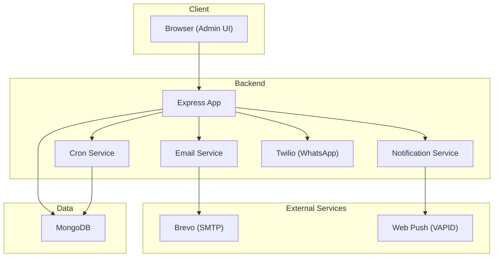
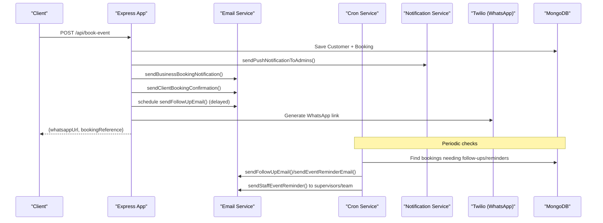
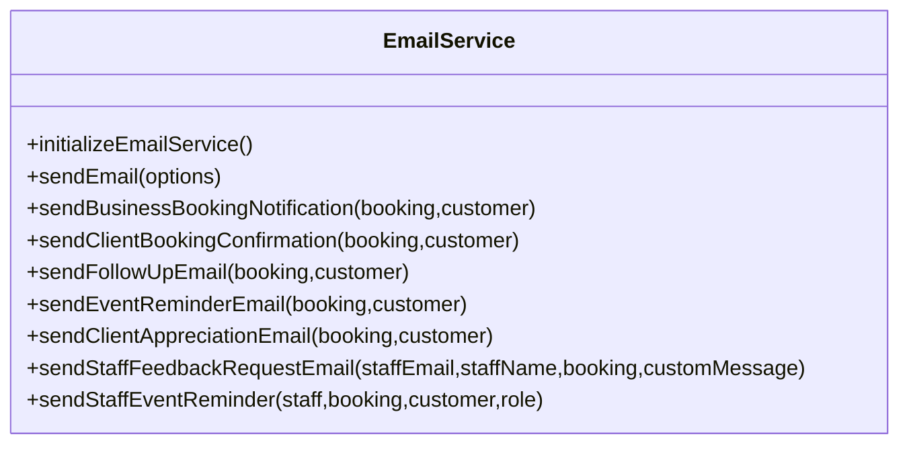
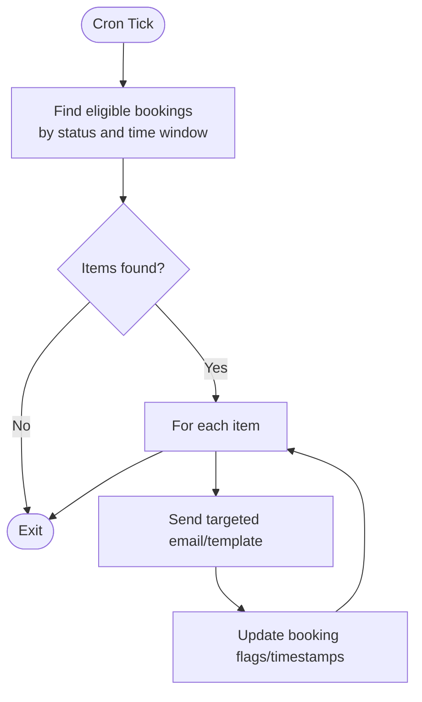
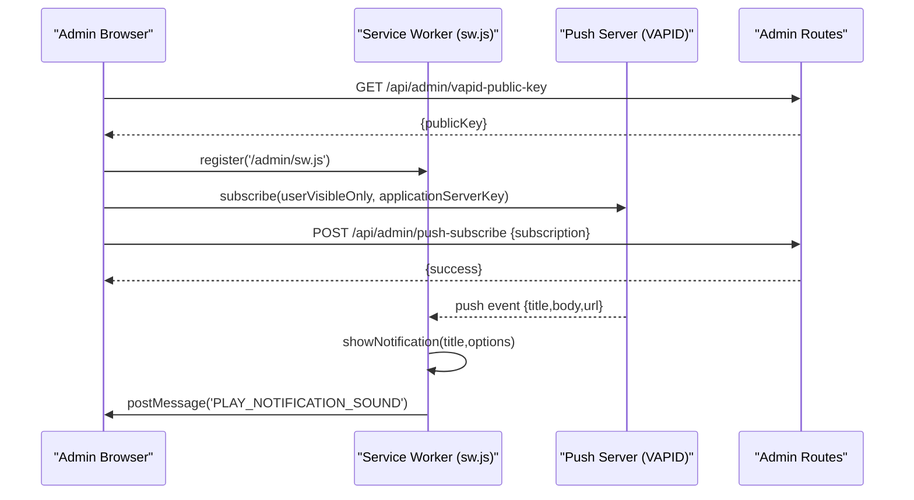
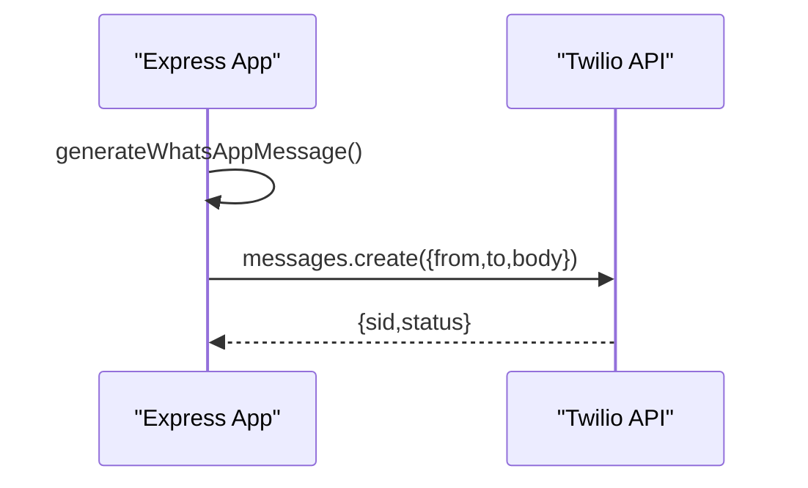
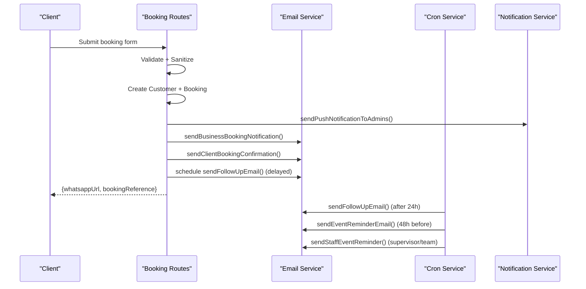
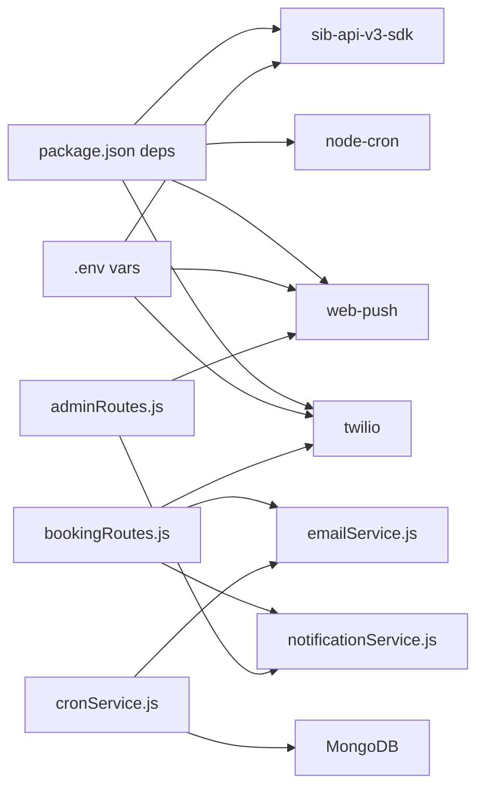

# Communication & Automation

<cite>
**Referenced Files in This Document**
- [emailService.js](file://server/services/emailService.js)
- [cronService.js](file://server/services/cronService.js)
- [notificationService.js](file://server/services/notificationService.js)
- [sw.js](file://admin/sw.js)
- [push-client.js](file://admin/push-client.js)
- [.env](file://.env)
- [server.js](file://server.js)
- [bookingRoutes.js](file://server/routes/bookingRoutes.js)
- [adminRoutes.js](file://server/routes/adminRoutes.js)
- [Booking.js](file://server/models/Booking.js)
- [Admin.js](file://server/models/Admin.js)
- [package.json](file://package.json)
</cite>

## Table of Contents
1. [Introduction](#introduction)
2. [Project Structure](#project-structure)
3. [Core Components](#core-components)
4. [Architecture Overview](#architecture-overview)
5. [Detailed Component Analysis](#detailed-component-analysis)
6. [Dependency Analysis](#dependency-analysis)
7. [Performance Considerations](#performance-considerations)
8. [Troubleshooting Guide](#troubleshooting-guide)
9. [Conclusion](#conclusion)
10. [Appendices](#appendices)

## Introduction
This document explains the communication and automation systems powering Emerald Pearland Events. It covers:
- Brevo-powered email automation with seven pre-built templates for bookings, follow-ups, reminders, and staff notifications
- Cron-driven workflows for automated client follow-ups, 48-hour event reminders, and staff assignments
- Real-time admin push notifications via web-push protocol with service worker and subscription management
- WhatsApp integration through Twilio for instant client communication
- Configuration requirements, customization options, delivery tracking, and monitoring approaches

## Project Structure
The communication stack spans backend services, cron scheduling, admin frontend, and external integrations:
- Email automation: server/services/emailService.js
- Cron scheduling: server/services/cronService.js
- Push notifications: server/services/notificationService.js + admin/sw.js + admin/push-client.js
- WhatsApp: Twilio integration in server.js
- Admin routes: server/routes/adminRoutes.js
- Booking pipeline: server/routes/bookingRoutes.js
- Models: server/models/Booking.js, server/models/Admin.js
- Environment: .env
- Dependencies: package.json

**Diagram sources**
- [emailService.js](file://server/services/emailService.js#L1-L467)
- [cronService.js](file://server/services/cronService.js#L1-L185)
- [notificationService.js](file://server/services/notificationService.js#L1-L78)
- [server.js](file://server.js#L496-L519)
- [bookingRoutes.js](file://server/routes/bookingRoutes.js#L1-L356)
- [adminRoutes.js](file://server/routes/adminRoutes.js#L1-L800)
- [Booking.js](file://server/models/Booking.js#L1-L169)
- [Admin.js](file://server/models/Admin.js#L1-L70)

**Section sources**
- [emailService.js](file://server/services/emailService.js#L1-L467)
- [cronService.js](file://server/services/cronService.js#L1-L185)
- [notificationService.js](file://server/services/notificationService.js#L1-L78)
- [server.js](file://server.js#L496-L519)
- [bookingRoutes.js](file://server/routes/bookingRoutes.js#L1-L356)
- [adminRoutes.js](file://server/routes/adminRoutes.js#L1-L800)
- [Booking.js](file://server/models/Booking.js#L1-L169)
- [Admin.js](file://server/models/Admin.js#L1-L70)
- [package.json](file://package.json#L25-L46)

## Core Components
- Email automation service (Brevo): Initializes the SDK, sends transactional emails, and renders seven HTML templates for:
  - Business notification
  - Client booking confirmation
  - Follow-up
  - 48-hour event reminder
  - Client appreciation & feedback
  - Internal staff feedback request
  - 48-hour staff event reminder
- Cron job scheduler: Runs three recurring tasks to send follow-ups, reminders, and staff alerts based on booking state and timing windows.
- Push notification service (web-push): Sends VAPID-secured push notifications to subscribed admin devices, with automatic cleanup of stale subscriptions.
- WhatsApp integration (Twilio): Generates and sends instant WhatsApp messages for client onboarding and coordination.
- Admin subscription flow: Service worker handles push notifications; client-side script manages subscription lifecycle and sound playback.

**Section sources**
- [emailService.js](file://server/services/emailService.js#L9-L27)
- [cronService.js](file://server/services/cronService.js#L21-L164)
- [notificationService.js](file://server/services/notificationService.js#L5-L14)
- [server.js](file://server.js#L496-L519)
- [bookingRoutes.js](file://server/routes/bookingRoutes.js#L226-L256)
- [adminRoutes.js](file://server/routes/adminRoutes.js#L22-L57)
- [sw.js](file://admin/sw.js#L1-L51)
- [push-client.js](file://admin/push-client.js#L49-L97)

## Architecture Overview
The system orchestrates communication across channels during the booking lifecycle:
- On booking submission, the backend creates records, triggers immediate client confirmation and delayed follow-up, notifies admins via push, and emails business and client.
- Cron jobs periodically check booking states and send reminders and staff alerts.
- Push notifications are delivered to subscribed admin devices; WhatsApp links are generated for instant client engagement.

**Diagram sources**
- [bookingRoutes.js](file://server/routes/bookingRoutes.js#L121-L285)
- [emailService.js](file://server/services/emailService.js#L127-L156)
- [emailService.js](file://server/services/emailService.js#L161-L219)
- [emailService.js](file://server/services/emailService.js#L224-L250)
- [emailService.js](file://server/services/emailService.js#L255-L290)
- [emailService.js](file://server/services/emailService.js#L341-L378)
- [emailService.js](file://server/services/emailService.js#L383-L455)
- [cronService.js](file://server/services/cronService.js#L27-L57)
- [cronService.js](file://server/services/cronService.js#L62-L94)
- [cronService.js](file://server/services/cronService.js#L101-L161)
- [notificationService.js](file://server/services/notificationService.js#L16-L75)
- [server.js](file://server.js#L496-L519)

## Detailed Component Analysis

### Email Automation Service (Brevo)
- Initialization: Loads BREVO_API_KEY and configures the SDK; logs warnings if missing.
- Sender identity: Uses configurable sender name and email from environment.
- Template rendering: Seven dedicated functions produce branded HTML emails with dynamic booking/customer data.
- Delivery: Sends via Brevo’s TransactionalEmailsApi; reply-to support for feedback loops.

**Diagram sources**
- [emailService.js](file://server/services/emailService.js#L9-L27)
- [emailService.js](file://server/services/emailService.js#L32-L53)
- [emailService.js](file://server/services/emailService.js#L127-L156)
- [emailService.js](file://server/services/emailService.js#L161-L219)
- [emailService.js](file://server/services/emailService.js#L224-L250)
- [emailService.js](file://server/services/emailService.js#L255-L290)
- [emailService.js](file://server/services/emailService.js#L295-L336)
- [emailService.js](file://server/services/emailService.js#L341-L378)
- [emailService.js](file://server/services/emailService.js#L383-L455)

**Section sources**
- [emailService.js](file://server/services/emailService.js#L9-L27)
- [emailService.js](file://server/services/emailService.js#L32-L53)
- [emailService.js](file://server/services/emailService.js#L127-L156)
- [emailService.js](file://server/services/emailService.js#L161-L219)
- [emailService.js](file://server/services/emailService.js#L224-L250)
- [emailService.js](file://server/services/emailService.js#L255-L290)
- [emailService.js](file://server/services/emailService.js#L295-L336)
- [emailService.js](file://server/services/emailService.js#L341-L378)
- [emailService.js](file://server/services/emailService.js#L383-L455)

### Cron Job Scheduling System
- Jobs:
  - Follow-up: Hourly scan for new bookings older than 24 hours without follow-up email.
  - Event reminder: Every 30 minutes for bookings within the 48-hour window.
  - Staff 48-hour alert: Every 30 minutes for confirmed bookings with assigned staff/supervisor.
- Persistence: Updates booking timestamps and flags to avoid duplicate sends.
- Robustness: Per-item try/catch to continue processing unaffected records.

**Diagram sources**
- [cronService.js](file://server/services/cronService.js#L27-L57)
- [cronService.js](file://server/services/cronService.js#L62-L94)
- [cronService.js](file://server/services/cronService.js#L101-L161)

**Section sources**
- [cronService.js](file://server/services/cronService.js#L21-L164)
- [Booking.js](file://server/models/Booking.js#L85-L122)

### Push Notification System (Web-Push)
- VAPID configuration: Loaded from environment; if missing, push is disabled with a warning.
- Admin subscriptions: Stored per admin; validated and pruned on send failures (404/410).
- Service worker: Handles push events, displays notifications, opens admin URLs, and triggers sound playback.
- Client script: Registers SW, requests permission, obtains VAPID public key, subscribes, and persists subscription.

**Diagram sources**
- [notificationService.js](file://server/services/notificationService.js#L5-L14)
- [notificationService.js](file://server/services/notificationService.js#L16-L75)
- [adminRoutes.js](file://server/routes/adminRoutes.js#L22-L57)
- [sw.js](file://admin/sw.js#L1-L51)
- [push-client.js](file://admin/push-client.js#L49-L97)

**Section sources**
- [notificationService.js](file://server/services/notificationService.js#L5-L14)
- [notificationService.js](file://server/services/notificationService.js#L16-L75)
- [adminRoutes.js](file://server/routes/adminRoutes.js#L22-L57)
- [sw.js](file://admin/sw.js#L1-L51)
- [push-client.js](file://admin/push-client.js#L49-L97)
- [Admin.js](file://server/models/Admin.js#L45-L48)

### WhatsApp Integration (Twilio)
- Configuration: Requires Twilio Account SID, Auth Token, and WhatsApp number in environment.
- Message generation: Encodes a preformatted message including booking reference and event details.
- Delivery: Sends via Twilio Messages API to whatsapp: recipient; logs success/failure.

**Diagram sources**
- [server.js](file://server.js#L496-L519)
- [bookingRoutes.js](file://server/routes/bookingRoutes.js#L96-L102)

**Section sources**
- [server.js](file://server.js#L496-L519)
- [bookingRoutes.js](file://server/routes/bookingRoutes.js#L96-L102)
- [.env](file://.env#L36-L41)

### Automated Workflows: Booking Journey
- Immediate actions on submit:
  - Create customer and booking records
  - Create admin notification
  - Send push to subscribed admins
  - Send business notification and client confirmation email
  - Schedule delayed follow-up email
- Post-submit client experience:
  - Receive confirmation email with booking reference and quick-connect WhatsApp link
- Automated follow-ups:
  - Cron-triggered follow-up ~24 hours after booking
  - 48-hour reminder to clients
  - 48-hour staff alert to supervisors and team members
- Feedback loop:
  - Post-event appreciation email with reply-to for client feedback

**Diagram sources**
- [bookingRoutes.js](file://server/routes/bookingRoutes.js#L121-L285)
- [emailService.js](file://server/services/emailService.js#L127-L156)
- [emailService.js](file://server/services/emailService.js#L161-L219)
- [emailService.js](file://server/services/emailService.js#L224-L250)
- [emailService.js](file://server/services/emailService.js#L255-L290)
- [emailService.js](file://server/services/emailService.js#L383-L455)
- [cronService.js](file://server/services/cronService.js#L27-L57)
- [cronService.js](file://server/services/cronService.js#L62-L94)
- [cronService.js](file://server/services/cronService.js#L101-L161)
- [notificationService.js](file://server/services/notificationService.js#L16-L75)

**Section sources**
- [bookingRoutes.js](file://server/routes/bookingRoutes.js#L121-L285)
- [cronService.js](file://server/services/cronService.js#L21-L164)
- [emailService.js](file://server/services/emailService.js#L127-L156)
- [emailService.js](file://server/services/emailService.js#L161-L219)
- [emailService.js](file://server/services/emailService.js#L224-L250)
- [emailService.js](file://server/services/emailService.js#L255-L290)
- [emailService.js](file://server/services/emailService.js#L383-L455)
- [notificationService.js](file://server/services/notificationService.js#L16-L75)

## Dependency Analysis
- External libraries:
  - Brevo SDK for email
  - node-cron for scheduling
  - web-push for push notifications
  - twilio for WhatsApp
- Environment variables:
  - BREVO_API_KEY, EMAIL_USER, EMAIL_PASSWORD, ADMIN_EMAIL
  - VAPID_PUBLIC_KEY, VAPID_PRIVATE_KEY
  - TWILIO_ACCOUNT_SID, TWILIO_AUTH_TOKEN, TWILIO_WHATSAPP_NUMBER
- Model dependencies:
  - Booking tracks status, timestamps, and automation flags
  - Admin stores pushSubscriptions for notification delivery

**Diagram sources**
- [package.json](file://package.json#L25-L46)
- [.env](file://.env#L22-L50)
- [bookingRoutes.js](file://server/routes/bookingRoutes.js#L7-L8)
- [cronService.js](file://server/services/cronService.js#L1-L5)
- [notificationService.js](file://server/services/notificationService.js#L1-L3)
- [adminRoutes.js](file://server/routes/adminRoutes.js#L22-L57)

**Section sources**
- [package.json](file://package.json#L25-L46)
- [.env](file://.env#L22-L50)
- [bookingRoutes.js](file://server/routes/bookingRoutes.js#L7-L8)
- [cronService.js](file://server/services/cronService.js#L1-L5)
- [notificationService.js](file://server/services/notificationService.js#L1-L3)
- [adminRoutes.js](file://server/routes/adminRoutes.js#L22-L57)

## Performance Considerations
- Email throughput: Brevo’s transactional limits apply; batch operations and retries should be considered for high volume.
- Cron cadence: 30-minute intervals balance responsiveness and resource usage; adjust based on peak load.
- Push delivery: web-push is efficient; prune stale subscriptions to reduce failures.
- Database indexing: Booking schema includes indexes on eventDate, status, and createdAt to optimize cron queries.

[No sources needed since this section provides general guidance]

## Troubleshooting Guide
- Missing BREVO_API_KEY:
  - Symptom: Email service disabled, warnings logged.
  - Action: Set BREVO_API_KEY and restart.
- Missing VAPID keys:
  - Symptom: Push notifications disabled with warnings.
  - Action: Generate VAPID keys and set VAPID_PUBLIC_KEY/VAPID_PRIVATE_KEY.
- Twilio not configured:
  - Symptom: WhatsApp messages skipped with warnings.
  - Action: Set TWILIO_ACCOUNT_SID, TWILIO_AUTH_TOKEN, TWILIO_WHATSAPP_NUMBER.
- Subscription cleanup:
  - Behavior: Expired subscriptions (404/410) are removed automatically; transient errors are retried.
- Cron job errors:
  - Behavior: Per-item errors are caught and logged; cron continues processing.
- Delivery tracking:
  - Brevo: Use Brevo dashboard to monitor deliverability and bounces.
  - Twilio: Use Twilio Console to check message status and logs.
  - Push: Monitor server logs for success/failure counts and subscription pruning.

**Section sources**
- [emailService.js](file://server/services/emailService.js#L13-L26)
- [notificationService.js](file://server/services/notificationService.js#L12-L14)
- [notificationService.js](file://server/services/notificationService.js#L49-L60)
- [server.js](file://server.js#L499-L502)
- [cronService.js](file://server/services/cronService.js#L46-L48)
- [cronService.js](file://server/services/cronService.js#L83-L85)
- [cronService.js](file://server/services/cronService.js#L130-L132)
- [cronService.js](file://server/services/cronService.js#L144-L146)

## Conclusion
The communication and automation systems integrate Brevo email, Twilio WhatsApp, and web-push notifications with robust cron scheduling. The design emphasizes reliability, scalability, and admin visibility through push alerts and database-backed state tracking. Proper environment configuration and monitoring ensure consistent delivery across channels.

[No sources needed since this section summarizes without analyzing specific files]

## Appendices

### Configuration Requirements
- Brevo (Email):
  - BREVO_API_KEY
  - EMAIL_USER, EMAIL_PASSWORD, ADMIN_EMAIL
- Web Push (Push Notifications):
  - VAPID_PUBLIC_KEY, VAPID_PRIVATE_KEY
- Twilio (WhatsApp):
  - TWILIO_ACCOUNT_SID, TWILIO_AUTH_TOKEN, TWILIO_WHATSAPP_NUMBER
- Frontend:
  - REACT_APP_API_URL, REACT_APP_WHATSAPP_NUMBER

**Section sources**
- [.env](file://.env#L22-L50)

### Template Customization Options
- Email templates accept dynamic booking and customer data; customize HTML/CSS within template functions.
- Reply-to handling supports feedback collection via client appreciation emails.
- Staff templates include role badges and event metadata for clarity.

**Section sources**
- [emailService.js](file://server/services/emailService.js#L127-L156)
- [emailService.js](file://server/services/emailService.js#L161-L219)
- [emailService.js](file://server/services/emailService.js#L224-L250)
- [emailService.js](file://server/services/emailService.js#L255-L290)
- [emailService.js](file://server/services/emailService.js#L295-L336)
- [emailService.js](file://server/services/emailService.js#L341-L378)
- [emailService.js](file://server/services/emailService.js#L383-L455)

### Delivery Tracking Mechanisms
- Brevo: Use dashboard to track deliveries, opens, clicks, and bounces.
- Twilio: Use Console to inspect message status and logs.
- Push: Monitor server logs for success/failure metrics and subscription pruning.

**Section sources**
- [emailService.js](file://server/services/emailService.js#L52-L53)
- [server.js](file://server.js#L513-L518)
- [notificationService.js](file://server/services/notificationService.js#L70-L75)