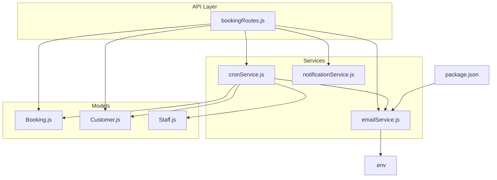
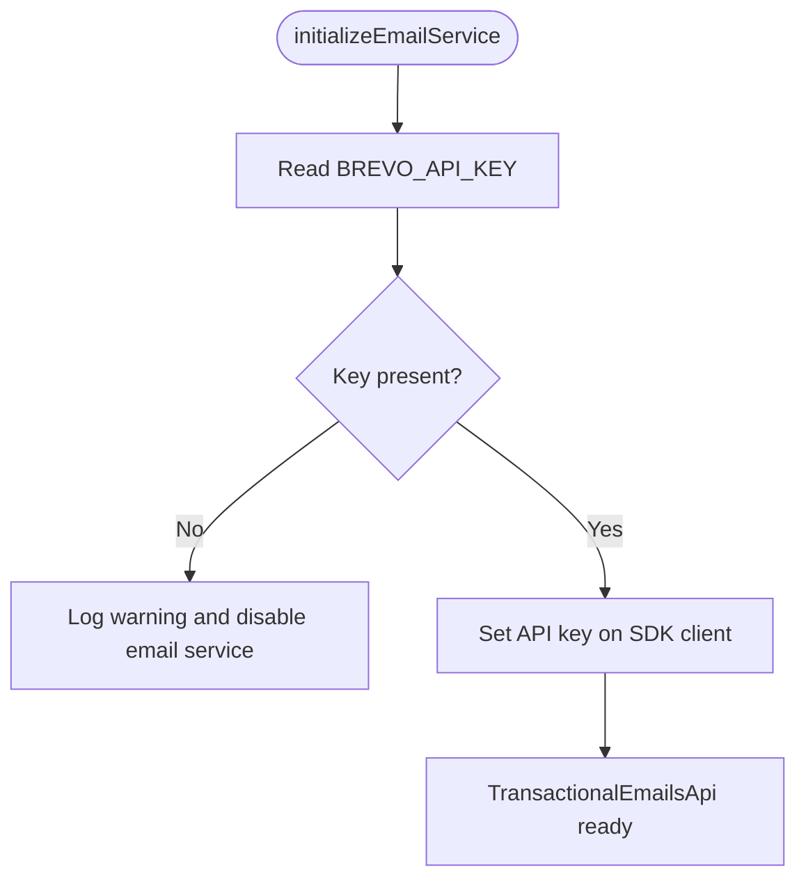
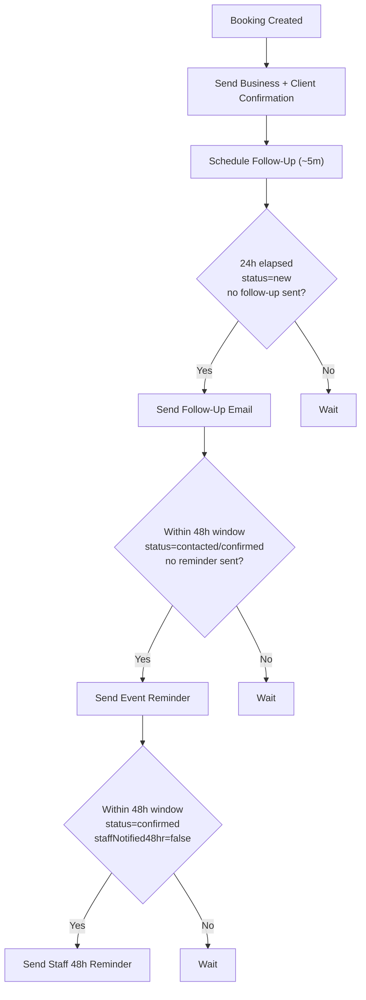
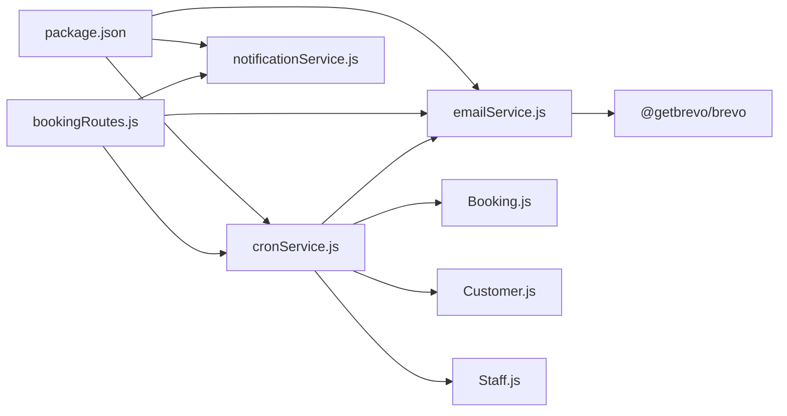
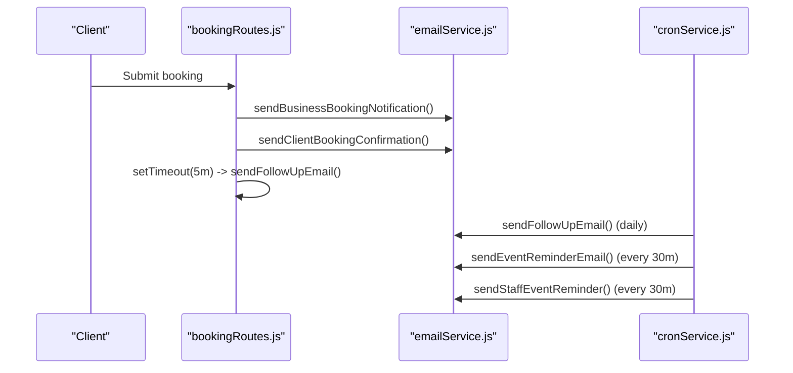

# Email Automation Service

<cite>
**Referenced Files in This Document**
- [emailService.js](file://server/services/emailService.js)
- [.env](file://.env)
- [package.json](file://package.json)
- [Booking.js](file://server/models/Booking.js)
- [Customer.js](file://server/models/Customer.js)
- [Staff.js](file://server/models/Staff.js)
- [bookingRoutes.js](file://server/routes/bookingRoutes.js)
- [cronService.js](file://server/services/cronService.js)
- [notificationService.js](file://server/services/notificationService.js)
- [server-prod.js](file://server-prod.js)
- [test-email.js](file://test-email.js)
</cite>

## Table of Contents
1. [Introduction](#introduction)
2. [Project Structure](#project-structure)
3. [Core Components](#core-components)
4. [Architecture Overview](#architecture-overview)
5. [Detailed Component Analysis](#detailed-component-analysis)
6. [Dependency Analysis](#dependency-analysis)
7. [Performance Considerations](#performance-considerations)
8. [Troubleshooting Guide](#troubleshooting-guide)
9. [Conclusion](#conclusion)
10. [Appendices](#appendices)

## Introduction
This document describes the Brevo (formerly Sendinblue) email automation service integrated into the Emerald Pearland Events booking system. It covers the seven pre-built email templates for bookings, follow-ups, reminders, staff assignments, feedback, and administrative alerts. It explains the Brevo API integration setup, template management, delivery tracking, workflow orchestration, conditional logic, recipient segmentation, automated scheduling, customization, dynamic content injection, brand consistency, configuration examples, troubleshooting, analytics, unsubscribe management, GDPR compliance, and end-to-end booking lifecycle workflows.

## Project Structure
The email automation spans several modules:
- Email service module initializes and sends Brevo transactions
- Routes handle booking creation and trigger immediate and delayed emails
- Cron service schedules follow-ups, reminders, and staff alerts
- Models define booking, customer, and staff data structures
- Environment variables configure Brevo API key and sender credentials
- Notification service handles admin push notifications (complementary to email)



**Diagram sources**
- [bookingRoutes.js](file://server/routes/bookingRoutes.js#L1-L356)
- [emailService.js](file://server/services/emailService.js#L1-L467)
- [cronService.js](file://server/services/cronService.js#L1-L185)
- [notificationService.js](file://server/services/notificationService.js#L1-L78)
- [Booking.js](file://server/models/Booking.js#L1-L169)
- [Customer.js](file://server/models/Customer.js#L1-L93)
- [Staff.js](file://server/models/Staff.js#L1-L57)
- [.env](file://.env#L1-L51)
- [package.json](file://package.json#L1-L56)

**Section sources**
- [bookingRoutes.js](file://server/routes/bookingRoutes.js#L1-L356)
- [emailService.js](file://server/services/emailService.js#L1-L467)
- [cronService.js](file://server/services/cronService.js#L1-L185)
- [notificationService.js](file://server/services/notificationService.js#L1-L78)
- [Booking.js](file://server/models/Booking.js#L1-L169)
- [Customer.js](file://server/models/Customer.js#L1-L93)
- [Staff.js](file://server/models/Staff.js#L1-L57)
- [.env](file://.env#L1-L51)
- [package.json](file://package.json#L1-L56)

## Core Components
- Brevo email transport initialization and send wrapper
- Seven email templates:
  - Business notification
  - Client booking confirmation
  - Follow-up email (~5 minutes after booking)
  - Event reminder (48 hours before)
  - Client appreciation and feedback
  - Staff feedback request
  - 48-hour pre-event staff reminder
- Automated scheduling via cron jobs
- Conditional logic based on booking status and dates
- Recipient segmentation by customer and staff
- Dynamic content injection from booking/customer data
- Brand-consistent styling and messaging

**Section sources**
- [emailService.js](file://server/services/emailService.js#L9-L27)
- [emailService.js](file://server/services/emailService.js#L127-L156)
- [emailService.js](file://server/services/emailService.js#L161-L219)
- [emailService.js](file://server/services/emailService.js#L224-L250)
- [emailService.js](file://server/services/emailService.js#L255-L290)
- [emailService.js](file://server/services/emailService.js#L295-L336)
- [emailService.js](file://server/services/emailService.js#L341-L378)
- [emailService.js](file://server/services/emailService.js#L383-L455)
- [cronService.js](file://server/services/cronService.js#L27-L57)
- [cronService.js](file://server/services/cronService.js#L62-L94)
- [cronService.js](file://server/services/cronService.js#L101-L161)

## Architecture Overview
The email automation integrates with the booking lifecycle:
- On booking submission, immediate emails are sent to the business and client
- A delayed follow-up email is scheduled ~5 minutes later
- Cron jobs periodically check booking states and send reminders and staff alerts
- Templates are built dynamically from booking and customer data

```mermaid
sequenceDiagram
participant Client as "Client"
participant API as "bookingRoutes.js"
participant Email as "emailService.js"
participant Cron as "cronService.js"
participant DB as "MongoDB"
Client->>API : POST /api/book-event
API->>DB : Create Customer + Booking
API->>Email : sendBusinessBookingNotification()
API->>Email : sendClientBookingConfirmation()
API->>API : setTimeout(~5min) -> sendFollowUpEmail()
Note over API,Email : Emails sent via Brevo SDK
Cron->>DB : Query bookings (status,new; 24h; followUpEmailSentAt=null)
Cron->>Email : sendFollowUpEmail()
Cron->>DB : Save followUpEmailSentAt
Cron->>DB : Query bookings (contacted/confirmed; 48h window; reminderEmailSentAt=null)
Cron->>Email : sendEventReminderEmail()
Cron->>DB : Save reminderEmailSentAt
Cron->>DB : Query confirmed bookings; 48h window; staffNotified48hr=false
Cron->>Email : sendStaffEventReminder() to supervisor/team
Cron->>DB : Save staffNotified48hr
```

**Diagram sources**
- [bookingRoutes.js](file://server/routes/bookingRoutes.js#L121-L285)
- [emailService.js](file://server/services/emailService.js#L127-L156)
- [emailService.js](file://server/services/emailService.js#L161-L219)
- [emailService.js](file://server/services/emailService.js#L224-L250)
- [emailService.js](file://server/services/emailService.js#L255-L290)
- [emailService.js](file://server/services/emailService.js#L383-L455)
- [cronService.js](file://server/services/cronService.js#L27-L57)
- [cronService.js](file://server/services/cronService.js#L62-L94)
- [cronService.js](file://server/services/cronService.js#L101-L161)

## Detailed Component Analysis

### Brevo API Integration and Email Transport
- Initializes the Brevo SDK using the API key from environment variables
- Provides a unified send wrapper that sets sender identity and handles recipients and reply-to
- Throws a clear error if the API key is missing



**Diagram sources**
- [emailService.js](file://server/services/emailService.js#L9-L27)
- [.env](file://.env#L22-L22)

**Section sources**
- [emailService.js](file://server/services/emailService.js#L9-L27)
- [.env](file://.env#L22-L22)

### Seven Pre-Built Email Templates

#### 1) Business Notification
- Purpose: Notify administrators of a new booking
- Content: Includes booking summary table and next steps
- Trigger: Immediately upon booking creation

**Section sources**
- [emailService.js](file://server/services/emailService.js#L127-L156)
- [bookingRoutes.js](file://server/routes/bookingRoutes.js#L228-L234)

#### 2) Client Booking Confirmation
- Purpose: Acknowledge receipt of booking request
- Content: Booking reference, event summary, quick WhatsApp link, next steps
- Trigger: Immediately after booking creation

**Section sources**
- [emailService.js](file://server/services/emailService.js#L161-L219)
- [bookingRoutes.js](file://server/routes/bookingRoutes.js#L236-L242)

#### 3) Follow-Up Email (~5 minutes after booking)
- Purpose: Reconfirm interest and readiness
- Content: Event type/date/location, optional WhatsApp CTA
- Trigger: Delayed execution after client confirmation

**Section sources**
- [emailService.js](file://server/services/emailService.js#L224-L250)
- [bookingRoutes.js](file://server/routes/bookingRoutes.js#L244-L253)

#### 4) Event Reminder (48 Hours Before)
- Purpose: Remind clients of upcoming event
- Content: Event date/time/location, friendly reminder
- Trigger: Cron job runs every 30 minutes during the 48-hour window

**Section sources**
- [emailService.js](file://server/services/emailService.js#L255-L290)
- [cronService.js](file://server/services/cronService.js#L62-L94)

#### 5) Client Appreciation and Feedback
- Purpose: Request feedback post-event
- Content: Thank you message, branded styling, feedback link
- Trigger: Manual or external process; included here as part of the template suite

**Section sources**
- [emailService.js](file://server/services/emailService.js#L295-L336)

#### 6) Internal Staff Feedback Request
- Purpose: Request feedback from staff on client experience
- Content: Event metadata, admin-specified message, reply-to instructions
- Trigger: Admin-initiated or automated internally

**Section sources**
- [emailService.js](file://server/services/emailService.js#L341-L378)

#### 7) 48-Hour Pre-Event Staff Reminder
- Purpose: Alert assigned staff of upcoming event
- Content: Branded header, role badge, event info, venue, guests, action-required note
- Trigger: Cron job targeting confirmed bookings within the 48-hour window

**Section sources**
- [emailService.js](file://server/services/emailService.js#L383-L455)
- [cronService.js](file://server/services/cronService.js#L101-L161)

### Email Workflow Orchestration and Conditional Logic
- Immediate emails on booking submission
- Delayed follow-up ~5 minutes after confirmation
- Cron-driven follow-ups for “new” bookings older than 24 hours
- Event reminders for “contacted/confirmed” bookings within 48-hour window
- Staff alerts for confirmed bookings with assigned staff/supervisor



**Diagram sources**
- [bookingRoutes.js](file://server/routes/bookingRoutes.js#L227-L256)
- [cronService.js](file://server/services/cronService.js#L27-L57)
- [cronService.js](file://server/services/cronService.js#L62-L94)
- [cronService.js](file://server/services/cronService.js#L101-L161)

**Section sources**
- [bookingRoutes.js](file://server/routes/bookingRoutes.js#L227-L256)
- [cronService.js](file://server/services/cronService.js#L27-L57)
- [cronService.js](file://server/services/cronService.js#L62-L94)
- [cronService.js](file://server/services/cronService.js#L101-L161)

### Recipient Segmentation and Dynamic Content Injection
- Customer segmentation by status and timing
- Staff segmentation by supervisor and assigned staff
- Dynamic content injection includes:
  - Booking reference
  - Event type, date, duration, location
  - Guest count
  - Usher requirements and counts
  - Budget range
  - Special notes
- Brand-consistent styling and CTAs

**Section sources**
- [Booking.js](file://server/models/Booking.js#L7-L139)
- [Customer.js](file://server/models/Customer.js#L7-L79)
- [Staff.js](file://server/models/Staff.js#L3-L54)
- [emailService.js](file://server/services/emailService.js#L58-L122)
- [emailService.js](file://server/services/emailService.js#L127-L156)
- [emailService.js](file://server/services/emailService.js#L161-L219)
- [emailService.js](file://server/services/emailService.js#L224-L250)
- [emailService.js](file://server/services/emailService.js#L255-L290)
- [emailService.js](file://server/services/emailService.js#L295-L336)
- [emailService.js](file://server/services/emailService.js#L341-L378)
- [emailService.js](file://server/services/emailService.js#L383-L455)

### Template Management and Delivery Tracking
- Templates are generated as HTML strings within the email service
- Delivery tracking fields stored on the booking model:
  - emailSentAt
  - followUpEmailSentAt
  - reminderEmailSentAt
- Cron jobs update these timestamps after successful sends

**Section sources**
- [Booking.js](file://server/models/Booking.js#L111-L122)
- [bookingRoutes.js](file://server/routes/bookingRoutes.js#L240-L241)
- [cronService.js](file://server/services/cronService.js#L42-L44)
- [cronService.js](file://server/services/cronService.js#L79-L81)
- [cronService.js](file://server/services/cronService.js#L150-L151)

### Configuration Examples
- Brevo API key and sender credentials:
  - BREVO_API_KEY
  - EMAIL_USER
  - ADMIN_EMAIL
- Frontend and analytics:
  - REACT_APP_API_URL
  - GA4 measurement ID
- Twilio WhatsApp:
  - TWILIO_ACCOUNT_SID
  - TWILIO_AUTH_TOKEN
  - TWILIO_WHATSAPP_NUMBER
  - BUSINESS_WHATSAPP_NUMBER

**Section sources**
- [.env](file://.env#L22-L27)
- [.env](file://.env#L45-L40)
- [package.json](file://package.json#L43-L44)

## Dependency Analysis
- emailService depends on:
  - Brevo SDK (@getbrevo/brevo)
  - Environment variables for API key and sender
- bookingRoutes depends on:
  - emailService for sending emails
  - cronService for scheduled tasks
  - Models for customer, booking, and staff data
- cronService depends on:
  - node-cron
  - emailService for sending templated emails
  - Models for querying and updating bookings
- notificationService depends on:
  - web-push for admin push notifications



**Diagram sources**
- [package.json](file://package.json#L43-L44)
- [emailService.js](file://server/services/emailService.js#L5-L5)
- [bookingRoutes.js](file://server/routes/bookingRoutes.js#L7-L8)
- [cronService.js](file://server/services/cronService.js#L1-L5)
- [notificationService.js](file://server/services/notificationService.js#L1-L3)
- [Booking.js](file://server/models/Booking.js#L1-L169)
- [Customer.js](file://server/models/Customer.js#L1-L93)
- [Staff.js](file://server/models/Staff.js#L1-L57)

**Section sources**
- [package.json](file://package.json#L43-L44)
- [emailService.js](file://server/services/emailService.js#L5-L5)
- [bookingRoutes.js](file://server/routes/bookingRoutes.js#L7-L8)
- [cronService.js](file://server/services/cronService.js#L1-L5)
- [notificationService.js](file://server/services/notificationService.js#L1-L3)

## Performance Considerations
- Asynchronous email sending with try/catch to avoid blocking the booking flow
- Cron jobs run at efficient intervals:
  - Follow-ups: hourly
  - Reminders: every 30 minutes
  - Staff alerts: every 30 minutes
- Timestamp fields minimize repeated processing of the same records
- Consider batching or queueing for high-volume scenarios (future enhancement)

[No sources needed since this section provides general guidance]

## Troubleshooting Guide
- Missing BREVO_API_KEY:
  - Symptom: Email service disabled, warnings logged
  - Action: Set BREVO_API_KEY in environment
- Email send failures:
  - Symptom: Errors logged during send
  - Action: Verify API key permissions, sender domain verification, and Brevo account status
- Delivery tracking not updating:
  - Symptom: Duplicate emails sent
  - Action: Ensure cron jobs are running and timestamps are being saved
- Staff reminder not sent:
  - Symptom: No 48-hour alerts
  - Action: Confirm booking status is “confirmed,” event within 48h window, staffNotified48hr is false, and staff/supervisor have valid emails
- Admin push notifications not received:
  - Symptom: No push despite VAPID keys configured
  - Action: Verify VAPID_PUBLIC_KEY and VAPID_PRIVATE_KEY are set; expired subscriptions are pruned automatically

**Section sources**
- [emailService.js](file://server/services/emailService.js#L13-L16)
- [cronService.js](file://server/services/cronService.js#L46-L48)
- [cronService.js](file://server/services/cronService.js#L83-L85)
- [cronService.js](file://server/services/cronService.js#L131-L133)
- [notificationService.js](file://server/services/notificationService.js#L12-L14)
- [notificationService.js](file://server/services/notificationService.js#L49-L60)

## Conclusion
The email automation leverages Brevo for reliable transactional delivery, orchestrates timely communications across the booking lifecycle, and maintains brand consistency through templated HTML. Cron-based scheduling ensures follow-ups, reminders, and staff alerts are delivered without manual intervention. Robust error handling and delivery tracking fields support operational visibility and reliability.

[No sources needed since this section summarizes without analyzing specific files]

## Appendices

### Practical Email Automation Workflows

#### Booking Lifecycle Workflow
- Submission → Immediate business and client confirmation
- ~5 minutes → Follow-up email
- 24 hours after submission (if still “new”) → Follow-up email
- Within 48 hours before event (for “contacted/confirmed”) → Event reminder
- Post-event → Client appreciation and feedback
- Confirmed event within 48 hours → Staff 48-hour reminder



**Diagram sources**
- [bookingRoutes.js](file://server/routes/bookingRoutes.js#L227-L256)
- [cronService.js](file://server/services/cronService.js#L27-L57)
- [cronService.js](file://server/services/cronService.js#L62-L94)
- [cronService.js](file://server/services/cronService.js#L101-L161)

### Testing the Email Service
- Use the provided test script to validate Brevo integration and template rendering
- Ensure environment variables are loaded and the API key is valid

**Section sources**
- [test-email.js](file://test-email.js#L1-L34)

### Server Startup and Initialization
- Email service initialization occurs at startup
- Cron jobs are started alongside the server
- Graceful shutdown stops cron jobs and closes database connections

**Section sources**
- [server-prod.js](file://server-prod.js#L370-L382)
- [server-prod.js](file://server-prod.js#L405-L410)