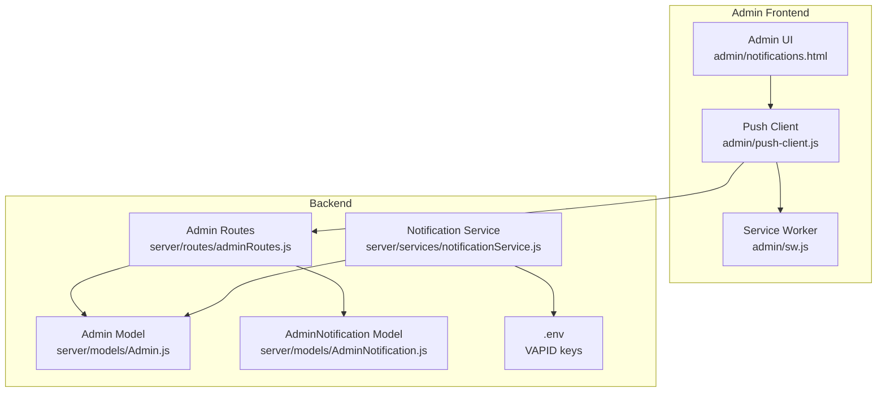
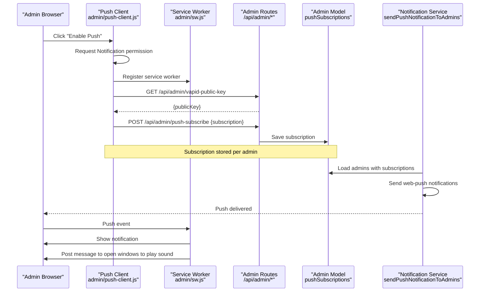
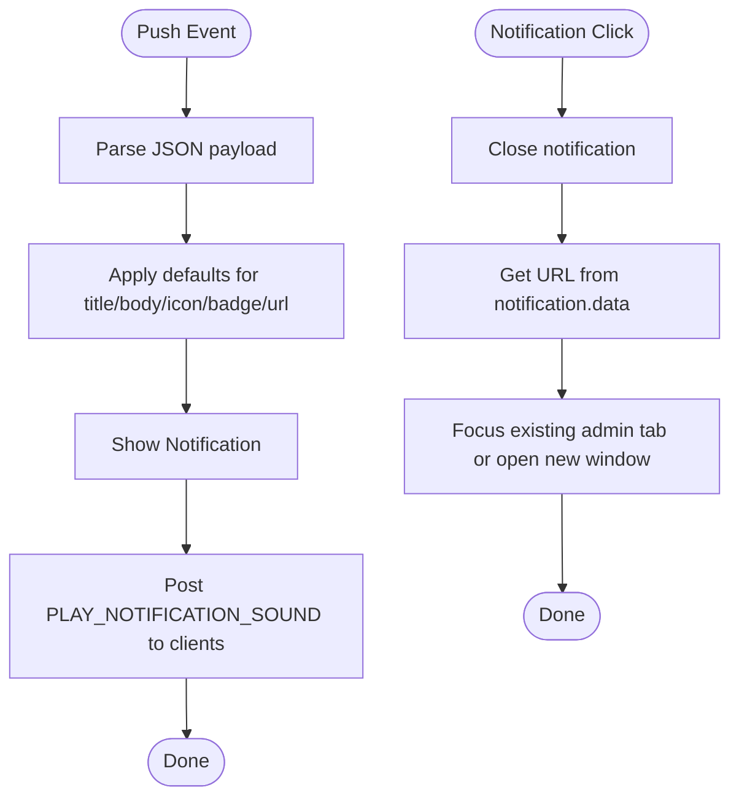
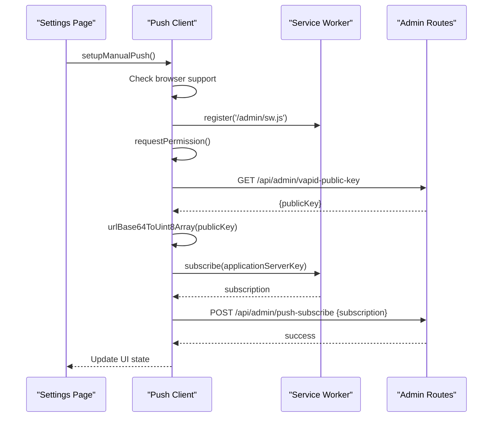
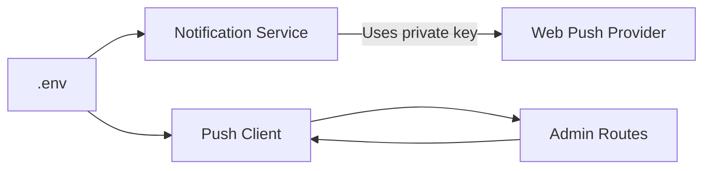
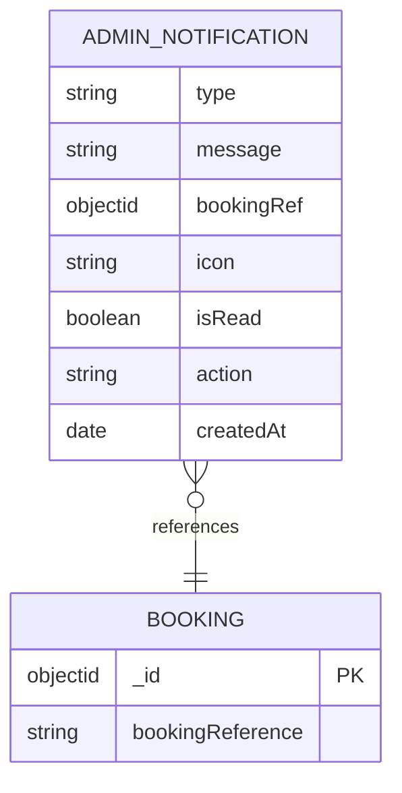
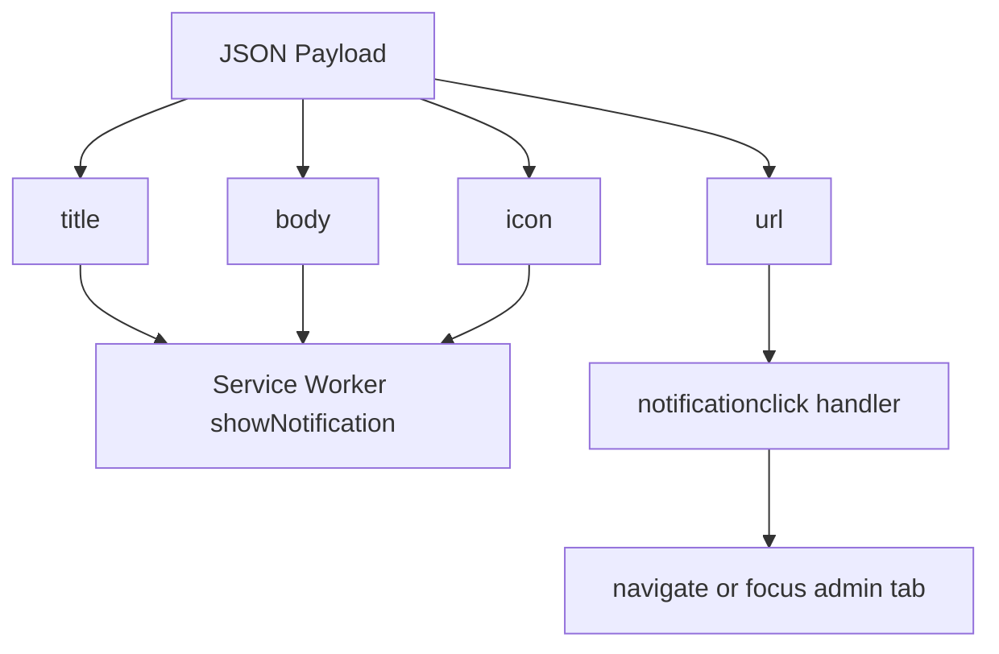
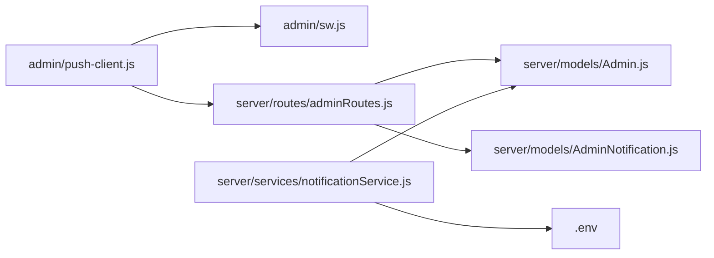

# Real-time Notifications

<cite>
**Referenced Files in This Document**
- [admin/sw.js](file://admin/sw.js)
- [admin/push-client.js](file://admin/push-client.js)
- [server/services/notificationService.js](file://server/services/notificationService.js)
- [server/models/Admin.js](file://server/models/Admin.js)
- [server/models/AdminNotification.js](file://server/models/AdminNotification.js)
- [server/routes/adminRoutes.js](file://server/routes/adminRoutes.js)
- [.env](file://.env)
- [admin/notifications.html](file://admin/notifications.html)
- [admin/dashboard.html](file://admin/dashboard.html)
</cite>

## Table of Contents
1. [Introduction](#introduction)
2. [Project Structure](#project-structure)
3. [Core Components](#core-components)
4. [Architecture Overview](#architecture-overview)
5. [Detailed Component Analysis](#detailed-component-analysis)
6. [Dependency Analysis](#dependency-analysis)
7. [Performance Considerations](#performance-considerations)
8. [Troubleshooting Guide](#troubleshooting-guide)
9. [Conclusion](#conclusion)
10. [Appendices](#appendices)

## Introduction
This document explains the real-time notification system built with the web-push protocol. It covers the service worker implementation for push subscription management and notification delivery, VAPID key configuration and secure message transmission, the admin dashboard notification system, and practical guidance for development and production deployment. It also documents notification payload structure, styling options, interactive features, browser compatibility, fallbacks, user preferences, monitoring, and security considerations.

## Project Structure
The notification system spans three layers:
- Frontend client and service worker in the admin area
- Backend routes and services for VAPID configuration and push delivery
- Data models for admin subscriptions and admin notifications

**Diagram sources**
- [admin/sw.js](file://admin/sw.js#L1-L51)
- [admin/push-client.js](file://admin/push-client.js#L1-L165)
- [admin/notifications.html](file://admin/notifications.html#L1-L120)
- [server/routes/adminRoutes.js](file://server/routes/adminRoutes.js#L22-L57)
- [server/services/notificationService.js](file://server/services/notificationService.js#L1-L78)
- [server/models/Admin.js](file://server/models/Admin.js#L45-L48)
- [server/models/AdminNotification.js](file://server/models/AdminNotification.js#L3-L37)
- [.env](file://.env#L48-L51)

**Section sources**
- [admin/sw.js](file://admin/sw.js#L1-L51)
- [admin/push-client.js](file://admin/push-client.js#L1-L165)
- [admin/notifications.html](file://admin/notifications.html#L1-L120)
- [server/routes/adminRoutes.js](file://server/routes/adminRoutes.js#L22-L57)
- [server/services/notificationService.js](file://server/services/notificationService.js#L1-L78)
- [server/models/Admin.js](file://server/models/Admin.js#L45-L48)
- [server/models/AdminNotification.js](file://server/models/AdminNotification.js#L3-L37)
- [.env](file://.env#L48-L51)

## Core Components
- Service Worker: Handles incoming push messages, displays notifications, and triggers sounds for open admin tabs.
- Push Client: Registers the service worker, requests permission, retrieves VAPID keys, subscribes to push, and plays sounds when notifications arrive while the app is open.
- Admin Routes: Expose endpoints to fetch VAPID public key and persist push subscriptions per admin.
- Notification Service: Sends web-push notifications to all subscribed admins, handles expiration and cleanup of invalid subscriptions.
- Admin Model: Stores push subscriptions array per admin.
- AdminNotification Model: Stores admin-side notifications with types, messages, optional booking references, read state, and automatic expiry.
- Environment: Provides VAPID public/private keys for secure push.

**Section sources**
- [admin/sw.js](file://admin/sw.js#L1-L51)
- [admin/push-client.js](file://admin/push-client.js#L1-L165)
- [server/routes/adminRoutes.js](file://server/routes/adminRoutes.js#L22-L57)
- [server/services/notificationService.js](file://server/services/notificationService.js#L1-L78)
- [server/models/Admin.js](file://server/models/Admin.js#L45-L48)
- [server/models/AdminNotification.js](file://server/models/AdminNotification.js#L3-L37)
- [.env](file://.env#L48-L51)

## Architecture Overview
High-level flow for enabling and delivering notifications:
- Admin enables push via Settings page
- Client requests permission and registers service worker
- Client fetches VAPID public key and subscribes to push
- Subscription is persisted server-side
- On events, server sends push to all subscribed admins
- Service worker displays notification and plays sound in open tabs

**Diagram sources**
- [admin/push-client.js](file://admin/push-client.js#L50-L97)
- [admin/sw.js](file://admin/sw.js#L1-L51)
- [server/routes/adminRoutes.js](file://server/routes/adminRoutes.js#L22-L57)
- [server/models/Admin.js](file://server/models/Admin.js#L45-L48)
- [server/services/notificationService.js](file://server/services/notificationService.js#L16-L75)

## Detailed Component Analysis

### Service Worker: Push Subscription Management and Delivery
- Push event handler parses JSON payload, sets defaults for title/body/icon/badge/url, and displays a notification.
- On push, posts a message to all open admin windows to play a sound.
- Notification click handler closes the notification and navigates to the URL stored in the notification data, focusing or opening a new window as appropriate.

**Diagram sources**
- [admin/sw.js](file://admin/sw.js#L1-L51)

**Section sources**
- [admin/sw.js](file://admin/sw.js#L1-L51)

### Push Client: Subscription Registration and Sound Playback
- Detects unsupported browsers and aborts initialization.
- Registers the service worker and requests notification permission.
- Fetches VAPID public key from backend and converts it to the required Uint8Array format.
- Subscribes to push using the VAPID key and persists the subscription via a backend endpoint.
- Listens for messages from the service worker to trigger sound playback while the app is open.
- Provides manual enablement via a UI button with UX feedback and error handling.

**Diagram sources**
- [admin/push-client.js](file://admin/push-client.js#L50-L97)
- [server/routes/adminRoutes.js](file://server/routes/adminRoutes.js#L22-L57)

**Section sources**
- [admin/push-client.js](file://admin/push-client.js#L1-L165)
- [server/routes/adminRoutes.js](file://server/routes/adminRoutes.js#L22-L57)

### VAPID Key Configuration and Secure Transmission
- VAPID public/private keys are loaded from environment variables.
- The client fetches the public key from the backend and converts it to the required format for subscription.
- The server uses the private key to sign push messages.

**Diagram sources**
- [.env](file://.env#L48-L51)
- [server/services/notificationService.js](file://server/services/notificationService.js#L5-L14)
- [admin/push-client.js](file://admin/push-client.js#L38-L47)
- [server/routes/adminRoutes.js](file://server/routes/adminRoutes.js#L22-L28)

**Section sources**
- [.env](file://.env#L48-L51)
- [server/services/notificationService.js](file://server/services/notificationService.js#L5-L14)
- [admin/push-client.js](file://admin/push-client.js#L38-L47)
- [server/routes/adminRoutes.js](file://server/routes/adminRoutes.js#L22-L28)

### Admin Dashboard Notification System
- Admin notifications are stored in a dedicated collection with types and read state.
- Routes expose endpoints to list notifications (optionally unread only), mark as read, and delete.
- The notifications UI supports filtering, bulk actions, and toggling read state.

**Diagram sources**
- [server/models/AdminNotification.js](file://server/models/AdminNotification.js#L3-L37)

**Section sources**
- [server/models/AdminNotification.js](file://server/models/AdminNotification.js#L3-L37)
- [server/routes/adminRoutes.js](file://server/routes/adminRoutes.js#L562-L631)
- [admin/notifications.html](file://admin/notifications.html#L1-L120)

### Notification Payload Structure and Interactive Features
- Push payload is a JSON object consumed by the service worker. It supports fields such as title, body, icon, and url.
- The service worker displays a notification with defaults and vibrates the device.
- Clicking the notification navigates to the URL stored in the notification data.
- While the admin panel is open, a message is posted to all windows to play a sound.

**Diagram sources**
- [admin/sw.js](file://admin/sw.js#L4-L14)
- [admin/sw.js](file://admin/sw.js#L29-L50)

**Section sources**
- [admin/sw.js](file://admin/sw.js#L1-L51)

### Browser Compatibility and Fallbacks
- The client checks for service worker and push support before initializing.
- If unsupported, the UI informs the user and disables the enable button.
- If permission is not granted, subscription is aborted.
- The service worker attempts to post a message to open windows to play sound; if the app is closed, the OS notification sound is used.

**Section sources**
- [admin/push-client.js](file://admin/push-client.js#L50-L66)
- [admin/push-client.js](file://admin/push-client.js#L116-L123)
- [admin/sw.js](file://admin/sw.js#L16-L21)

### User Preference Handling
- The client respects user permission state and updates the UI accordingly.
- Existing subscriptions are deduplicated by endpoint before saving.
- Admin notifications include read/unread state and optional booking references for navigation.

**Section sources**
- [admin/push-client.js](file://admin/push-client.js#L151-L164)
- [server/routes/adminRoutes.js](file://server/routes/adminRoutes.js#L41-L50)
- [server/models/AdminNotification.js](file://server/models/AdminNotification.js#L22-L25)

### Example Notification Scenarios
- New booking: Triggered when a booking is created; a system notification is recorded.
- Staff assignment: When staff are assigned to a booking, a notification is created with a descriptive message.
- Payment received: When a booking is marked paid, a payment notification is created with amount and client details.
- System updates: General system messages are recorded as admin notifications.

These scenarios demonstrate how the backend creates AdminNotification entries and how push notifications can be triggered via the notification service.

**Section sources**
- [server/routes/adminRoutes.js](file://server/routes/adminRoutes.js#L1064-L1077)
- [server/routes/adminRoutes.js](file://server/routes/adminRoutes.js#L1094-L1104)
- [server/models/AdminNotification.js](file://server/models/AdminNotification.js#L3-L8)

## Dependency Analysis
- Push Client depends on:
  - Service Worker for push handling
  - Admin Routes for VAPID public key and subscription persistence
- Service Worker depends on:
  - Push payload structure defined by the backend
- Notification Service depends on:
  - Admin model for retrieving subscriptions
  - Environment for VAPID keys
- Admin Routes depend on:
  - Admin model for storing subscriptions
  - AdminNotification model for listing/mark-as-read/delete

**Diagram sources**
- [admin/push-client.js](file://admin/push-client.js#L50-L97)
- [admin/sw.js](file://admin/sw.js#L1-L51)
- [server/routes/adminRoutes.js](file://server/routes/adminRoutes.js#L22-L57)
- [server/models/Admin.js](file://server/models/Admin.js#L45-L48)
- [server/models/AdminNotification.js](file://server/models/AdminNotification.js#L3-L37)
- [server/services/notificationService.js](file://server/services/notificationService.js#L1-L78)
- [.env](file://.env#L48-L51)

**Section sources**
- [admin/push-client.js](file://admin/push-client.js#L50-L97)
- [admin/sw.js](file://admin/sw.js#L1-L51)
- [server/routes/adminRoutes.js](file://server/routes/adminRoutes.js#L22-L57)
- [server/models/Admin.js](file://server/models/Admin.js#L45-L48)
- [server/models/AdminNotification.js](file://server/models/AdminNotification.js#L3-L37)
- [server/services/notificationService.js](file://server/services/notificationService.js#L1-L78)
- [.env](file://.env#L48-L51)

## Performance Considerations
- Batch delivery: The notification service iterates through admins and subscriptions, sending notifications and removing expired ones to reduce future failures.
- Deduplication: Subscriptions are deduplicated by endpoint before saving to avoid redundant storage.
- Payload size: Keep push payloads minimal to reduce bandwidth and latency.
- Background work: Use waitUntil to ensure long-running tasks complete before the service worker exits.

[No sources needed since this section provides general guidance]

## Troubleshooting Guide
Common issues and resolutions:
- VAPID keys missing: If keys are not present in environment, push notifications are disabled. Ensure keys are set in .env and restart the server.
- Subscription not saved: Verify the subscription object is present and the endpoint does not already exist before saving.
- Expired subscriptions: The notification service removes subscriptions with 404/410 errors and logs cleanup actions.
- Permission denied: If the user denies permission, the client aborts setup; prompt the user to enable notifications in browser settings.
- Unsupported browser: The client detects lack of service worker or push support and informs the user.
- Sound not playing: Ensure the app is open so the service worker can post a message to play sound; otherwise rely on OS notification sound.

**Section sources**
- [.env](file://.env#L48-L51)
- [server/services/notificationService.js](file://server/services/notificationService.js#L44-L67)
- [admin/push-client.js](file://admin/push-client.js#L50-L66)
- [admin/push-client.js](file://admin/push-client.js#L116-L123)
- [admin/sw.js](file://admin/sw.js#L16-L21)

## Conclusion
The system integrates a modern web-push pipeline with a robust admin notification layer. It supports secure, encrypted push delivery via VAPID, handles subscription lifecycle, and provides an admin dashboard for managing notifications. By following the setup and operational guidance here, teams can deploy reliable real-time notifications across devices and browsers.

[No sources needed since this section summarizes without analyzing specific files]

## Appendices

### Setup Instructions
- Development
  - Ensure VAPID keys are present in .env.
  - Start the backend server; the notification service will load VAPID details.
  - Open the admin panel, navigate to Settings, and enable push notifications.
- Production
  - Provision VAPID keys and configure .env with production values.
  - Deploy backend and ensure HTTPS is used (required for push).
  - Register the service worker under /admin/sw.js and host static assets securely.

**Section sources**
- [.env](file://.env#L48-L51)
- [server/services/notificationService.js](file://server/services/notificationService.js#L5-L14)
- [admin/push-client.js](file://admin/push-client.js#L56-L66)

### Monitoring and Engagement Tracking
- Delivery metrics: Track success/failure counts logged by the notification service after batch delivery.
- Subscription health: Monitor removal of expired subscriptions and retry logic for transient failures.
- Admin engagement: Use the admin notification endpoints to track read/unread counts and navigation via notification URLs.

**Section sources**
- [server/services/notificationService.js](file://server/services/notificationService.js#L36-L70)
- [server/routes/adminRoutes.js](file://server/routes/adminRoutes.js#L562-L631)

### Security Considerations
- Protect VAPID private keys in .env and restrict access to the server.
- Validate and sanitize push payloads on the server before sending.
- Use HTTPS in production to enable push and service worker registration.
- Regularly audit push subscriptions and remove stale endpoints.
- Enforce JWT-based authentication for admin routes that manage subscriptions and notifications.

**Section sources**
- [.env](file://.env#L48-L51)
- [server/routes/adminRoutes.js](file://server/routes/adminRoutes.js#L22-L57)
- [server/services/notificationService.js](file://server/services/notificationService.js#L44-L67)