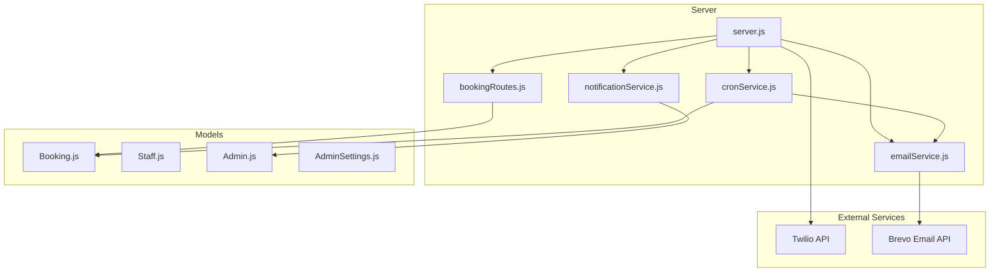
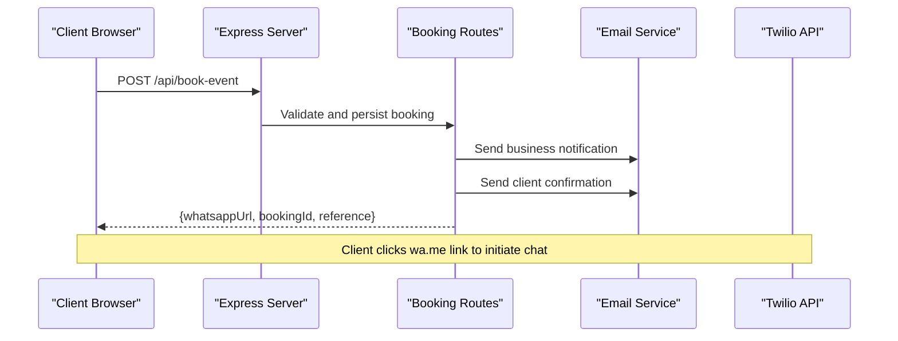
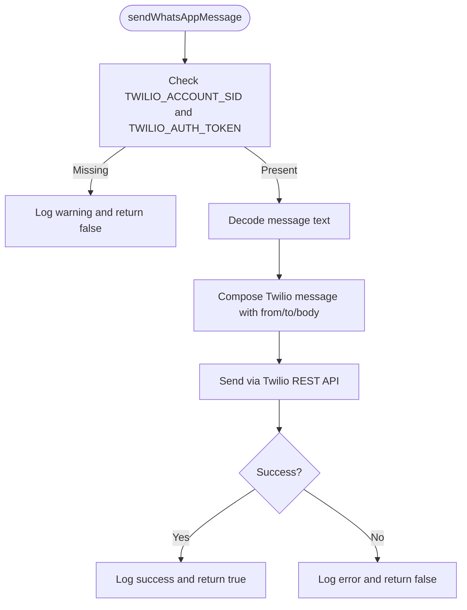
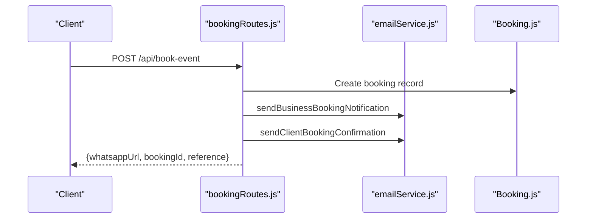
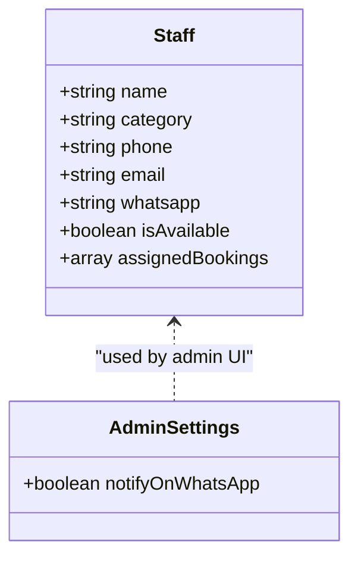
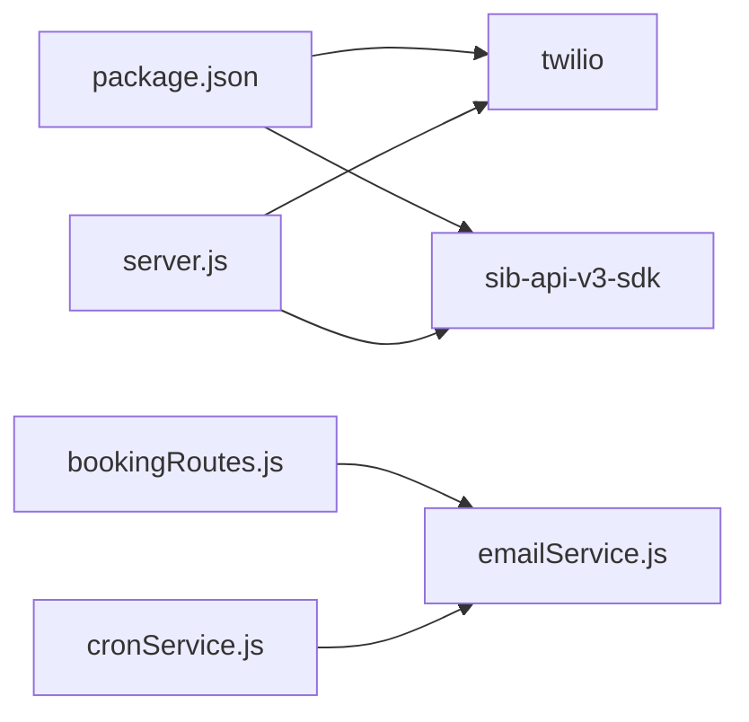

# WhatsApp Integration

<cite>
**Referenced Files in This Document**
- [server.js](file://server.js)
- [.env](file://.env)
- [package.json](file://package.json)
- [server/routes/bookingRoutes.js](file://server/routes/bookingRoutes.js)
- [server/services/emailService.js](file://server/services/emailService.js)
- [server/services/notificationService.js](file://server/services/notificationService.js)
- [server/services/cronService.js](file://server/services/cronService.js)
- [server/models/Booking.js](file://server/models/Booking.js)
- [server/models/Staff.js](file://server/models/Staff.js)
- [server/models/Admin.js](file://server/models/Admin.js)
- [server/models/AdminSettings.js](file://server/models/AdminSettings.js)
- [server/routes/adminRoutes.js](file://server/routes/adminRoutes.js)
</cite>

## Table of Contents
1. [Introduction](#introduction)
2. [Project Structure](#project-structure)
3. [Core Components](#core-components)
4. [Architecture Overview](#architecture-overview)
5. [Detailed Component Analysis](#detailed-component-analysis)
6. [Dependency Analysis](#dependency-analysis)
7. [Performance Considerations](#performance-considerations)
8. [Troubleshooting Guide](#troubleshooting-guide)
9. [Conclusion](#conclusion)
10. [Appendices](#appendices)

## Introduction
This document describes the WhatsApp integration system powered by Twilio within the Emerald Pearland Events booking platform. It covers Twilio setup (sandbox and production), message formatting, media handling, interactive features, and integration with the booking system for automatic triggers. It also documents configuration, delivery tracking, error handling, retry mechanisms, compliance, and operational guidance for high-volume scenarios.

## Project Structure
The integration spans several backend modules:
- Express server initializes Twilio client and exposes booking and admin APIs
- Booking routes handle form submissions, persist records, and generate WhatsApp links
- Email service sends automated notifications and staff reminders
- Cron service schedules staff reminders and event follow-ups
- Models define booking and staff data structures
- Environment variables store Twilio credentials and business numbers

**Diagram sources**
- [server.js](file://server.js#L15-L27)
- [server/routes/bookingRoutes.js](file://server/routes/bookingRoutes.js#L121-L285)
- [server/services/emailService.js](file://server/services/emailService.js#L9-L27)
- [server/services/notificationService.js](file://server/services/notificationService.js#L1-L78)
- [server/services/cronService.js](file://server/services/cronService.js#L98-L144)
- [server/models/Booking.js](file://server/models/Booking.js#L7-L169)
- [server/models/Staff.js](file://server/models/Staff.js#L3-L57)
- [server/models/Admin.js](file://server/models/Admin.js)
- [server/models/AdminSettings.js](file://server/models/AdminSettings.js)

**Section sources**
- [server.js](file://server.js#L15-L27)
- [package.json](file://package.json#L25-L46)

## Core Components
- Twilio client initialization and message sender
- Booking endpoint that generates a WhatsApp deep link
- Email service for business notifications, client confirmations, follow-ups, reminders, and staff communications
- Cron jobs for staff 48-hour reminders and event follow-ups
- Booking and staff models supporting integration workflows

**Section sources**
- [server.js](file://server.js#L15-L27)
- [server.js](file://server.js#L496-L519)
- [server/routes/bookingRoutes.js](file://server/routes/bookingRoutes.js#L121-L285)
- [server/services/emailService.js](file://server/services/emailService.js#L127-L250)
- [server/services/cronService.js](file://server/services/cronService.js#L98-L144)
- [server/models/Booking.js](file://server/models/Booking.js#L7-L169)
- [server/models/Staff.js](file://server/models/Staff.js#L3-L57)

## Architecture Overview
The system integrates Twilio for outbound WhatsApp messages and Brevo for inbound/outbound email. The booking flow creates a record, sends internal and client emails, and returns a prebuilt WhatsApp deep link. Staff reminders are scheduled via cron and delivered via email.

**Diagram sources**
- [server/routes/bookingRoutes.js](file://server/routes/bookingRoutes.js#L121-L285)
- [server/services/emailService.js](file://server/services/emailService.js#L127-L250)
- [server.js](file://server.js#L496-L519)

## Detailed Component Analysis

### Twilio WhatsApp Setup and Message Sending
- Initialization: The server conditionally initializes Twilio when credentials are present. If missing, Twilio features are disabled with a warning.
- Message sending: A helper function composes a WhatsApp message using the configured Twilio WhatsApp number and sends it via the Twilio REST API.
- Delivery tracking: The helper logs success or failure; no built-in delivery receipts are implemented in the current code.

**Diagram sources**
- [server.js](file://server.js#L15-L27)
- [server.js](file://server.js#L496-L519)

**Section sources**
- [server.js](file://server.js#L15-L27)
- [server.js](file://server.js#L496-L519)

### Booking Workflow and Automatic Triggers
- On successful booking submission:
  - Validates input and persists a new booking
  - Creates an admin notification and pushes to subscribed admins
  - Sends business notification to admin and client confirmation email
  - Returns a wa.me deep link pre-populated with a generated message
- Status updates can be made via admin endpoints; no Twilio message is automatically triggered by status changes in the current code.

**Diagram sources**
- [server/routes/bookingRoutes.js](file://server/routes/bookingRoutes.js#L121-L285)
- [server/services/emailService.js](file://server/services/emailService.js#L127-L250)
- [server/models/Booking.js](file://server/models/Booking.js#L141-L148)

**Section sources**
- [server/routes/bookingRoutes.js](file://server/routes/bookingRoutes.js#L121-L285)
- [server/services/emailService.js](file://server/services/emailService.js#L127-L250)
- [server/models/Booking.js](file://server/models/Booking.js#L141-L148)

### Staff Coordination and Reminders
- Staff members can store WhatsApp numbers alongside email in the Staff model.
- Cron job sends 48-hour pre-event reminders to supervisors and assigned staff via email.
- Admin settings expose a flag to enable/disable WhatsApp notifications.

**Diagram sources**
- [server/models/Staff.js](file://server/models/Staff.js#L3-L57)
- [server/models/AdminSettings.js](file://server/models/AdminSettings.js)
- [server/routes/adminRoutes.js](file://server/routes/adminRoutes.js#L776-L809)

**Section sources**
- [server/models/Staff.js](file://server/models/Staff.js#L3-L57)
- [server/services/cronService.js](file://server/services/cronService.js#L98-L144)
- [server/routes/adminRoutes.js](file://server/routes/adminRoutes.js#L776-L809)

### Message Formatting and Interactive Features
- The booking endpoint constructs a plain-text WhatsApp message with booking details and encodes it for the wa.me deep link.
- Interactive features rely on the wa.me deep link; media attachments are not implemented in the current code.
- Email templates demonstrate rich HTML formatting and embedded links for client convenience.

**Section sources**
- [server/routes/bookingRoutes.js](file://server/routes/bookingRoutes.js#L96-L102)
- [server/routes/bookingRoutes.js](file://server/routes/bookingRoutes.js#L261-L263)
- [server/services/emailService.js](file://server/services/emailService.js#L127-L250)

### Configuration Examples
- Twilio credentials and numbers are loaded from environment variables.
- Frontend references the business WhatsApp number for display and links.

**Section sources**
- [.env](file://.env#L36-L46)
- [server.js](file://server.js#L39-L40)
- [server/routes/bookingRoutes.js](file://server/routes/bookingRoutes.js#L261-L263)

## Dependency Analysis
- Twilio SDK is declared and conditionally used; absence of credentials disables Twilio features.
- Brevo SDK is used for transactional emails; cron jobs depend on it for reminders.
- Mongoose models underpin booking and staff data.

**Diagram sources**
- [package.json](file://package.json#L25-L46)
- [server.js](file://server.js#L15-L27)
- [server/services/emailService.js](file://server/services/emailService.js#L9-L27)
- [server/services/cronService.js](file://server/services/cronService.js#L98-L144)

**Section sources**
- [package.json](file://package.json#L25-L46)
- [server.js](file://server.js#L15-L27)

## Performance Considerations
- Rate limiting is applied to the booking endpoint to mitigate abuse.
- Email sending occurs synchronously during booking; consider offloading to a queue for high volume.
- Cron jobs run periodically; ensure scheduling aligns with expected event volumes.

**Section sources**
- [server/routes/bookingRoutes.js](file://server/routes/bookingRoutes.js#L18-L24)
- [server/services/cronService.js](file://server/services/cronService.js#L98-L144)

## Troubleshooting Guide
- Twilio not configured: Verify TWILIO_ACCOUNT_SID, TWILIO_AUTH_TOKEN, and TWILIO_WHATSAPP_NUMBER are set. The server logs a warning if missing.
- Message sending failures: The helper catches and logs errors; inspect logs for underlying causes.
- Email delivery: Brevo SDK must be initialized with a valid API key; otherwise, email features are disabled.
- CORS and origins: The server whitelists development and production origins; ensure frontend URLs match.
- Analytics endpoint: Accepts predefined event types; invalid types are rejected gracefully.

**Section sources**
- [server.js](file://server.js#L15-L27)
- [server.js](file://server.js#L496-L519)
- [server/services/emailService.js](file://server/services/emailService.js#L9-L27)
- [server.js](file://server.js#L49-L72)
- [server.js](file://server.js#L550-L576)

## Compliance and Operational Guidance
- Opt-in/opt-out: The codebase does not implement explicit opt-in/opt-out handling for WhatsApp. Implement a preference store and opt-out mechanism before enabling automated WhatsApp messaging.
- Privacy: Sanitize inputs and escape HTML in emails. Restrict access to sensitive fields and ensure secure storage of credentials.
- Templates: Twilio template approval is not implemented in the current code. For production, register message templates in the Twilio Console and use templated messages to improve deliverability.
- Rate limits: Twilio enforces rate limits; monitor logs and implement backoff/retry strategies if extending the integration.
- Cost optimization: Prefer email for bulk reminders; reserve WhatsApp for high-priority, personalized communications. Batch and schedule notifications to reduce costs.

[No sources needed since this section provides general guidance]

## Appendices

### Configuration Checklist
- Twilio
  - Account SID and Auth Token
  - WhatsApp Number configured in Twilio
- Brevo
  - API Key configured for email service
- Environment
  - Business WhatsApp number for display and links
  - Frontend API URL and WhatsApp number

**Section sources**
- [.env](file://.env#L36-L46)
- [server.js](file://server.js#L39-L40)

### Example Message Flows
- Booking inquiry: Client submits form → server returns wa.me link with pre-filled message
- Confirmation response: Client receives confirmation email and can click wa.me link
- Staff coordination: Cron sends 48-hour reminder emails to supervisors and assigned staff

**Section sources**
- [server/routes/bookingRoutes.js](file://server/routes/bookingRoutes.js#L121-L285)
- [server/services/emailService.js](file://server/services/emailService.js#L127-L250)
- [server/services/cronService.js](file://server/services/cronService.js#L98-L144)