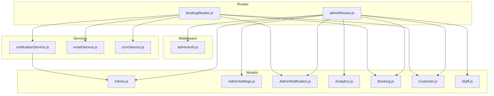
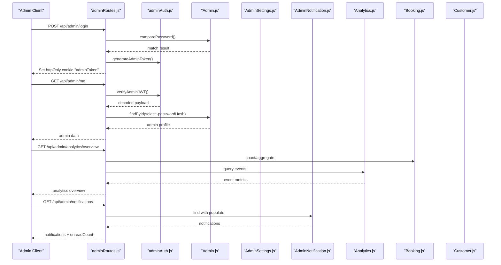
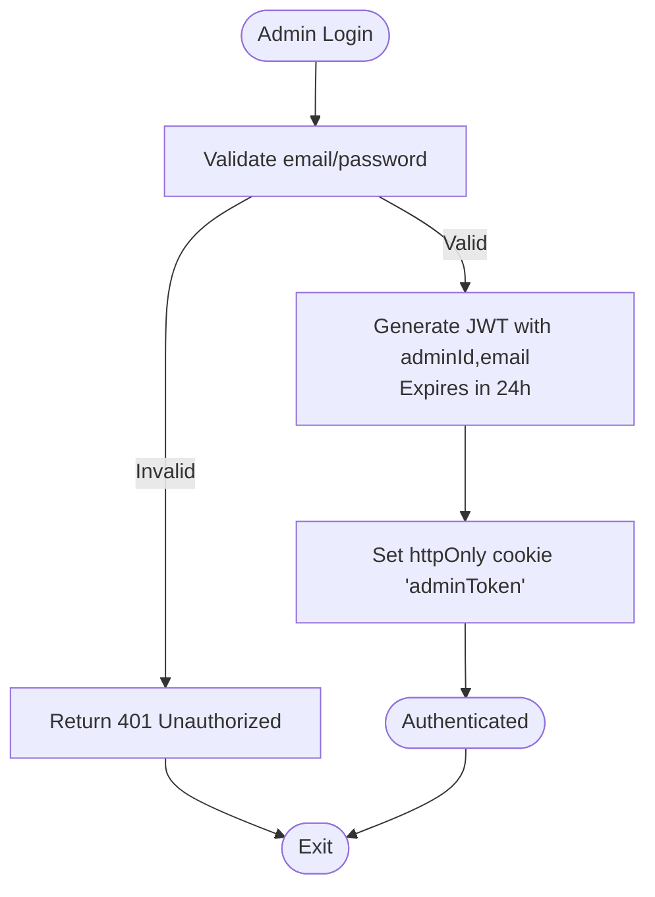
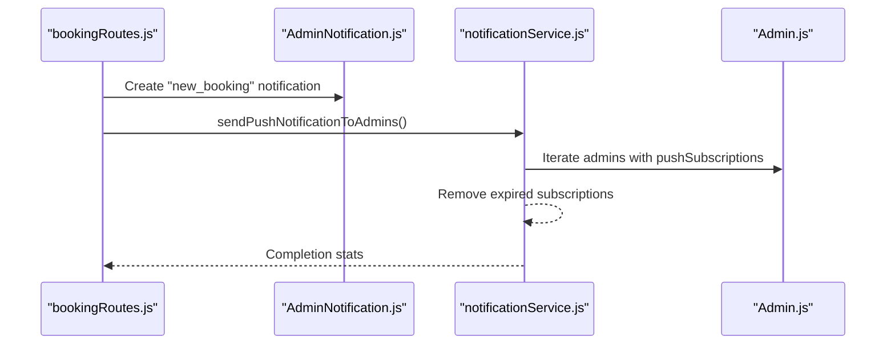
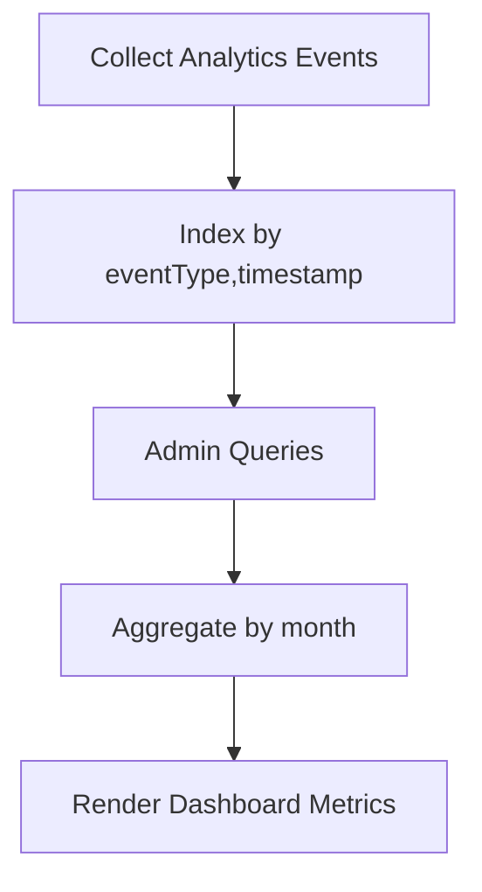
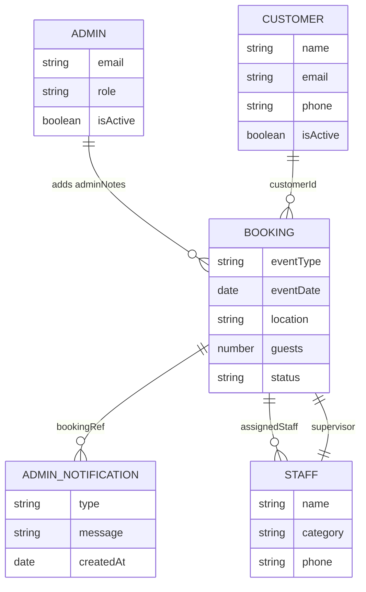
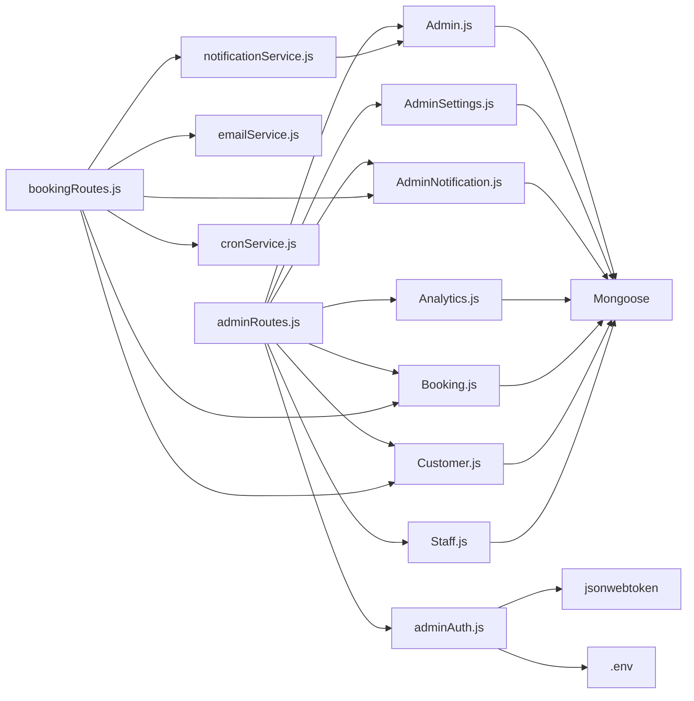

# Administrative & Support Models

<cite>
**Referenced Files in This Document**
- [Admin.js](file://server/models/Admin.js)
- [AdminSettings.js](file://server/models/AdminSettings.js)
- [AdminNotification.js](file://server/models/AdminNotification.js)
- [Analytics.js](file://server/models/Analytics.js)
- [Booking.js](file://server/models/Booking.js)
- [Customer.js](file://server/models/Customer.js)
- [Staff.js](file://server/models/Staff.js)
- [adminAuth.js](file://server/middleware/adminAuth.js)
- [adminRoutes.js](file://server/routes/adminRoutes.js)
- [bookingRoutes.js](file://server/routes/bookingRoutes.js)
- [notificationService.js](file://server/services/notificationService.js)
- [emailService.js](file://server/services/emailService.js)
- [cronService.js](file://server/services/cronService.js)
- [package.json](file://package.json)
</cite>

## Table of Contents
1. [Introduction](#introduction)
2. [Project Structure](#project-structure)
3. [Core Components](#core-components)
4. [Architecture Overview](#architecture-overview)
5. [Detailed Component Analysis](#detailed-component-analysis)
6. [Dependency Analysis](#dependency-analysis)
7. [Performance Considerations](#performance-considerations)
8. [Troubleshooting Guide](#troubleshooting-guide)
9. [Conclusion](#conclusion)
10. [Appendices](#appendices)

## Introduction
This document provides comprehensive data model documentation for administrative and support entities in the Emerald system. It covers:
- Admin model: authentication credentials, role-based permissions, and access control mechanisms
- AdminSettings model: system configuration, operational parameters, and business rules
- AdminNotification model: notification management, alert systems, and communication tracking
- Analytics model: business metrics, performance tracking, and reporting data structures
It also explains relationships with Bookings and Customer data, data retention policies, audit trail requirements, compliance considerations, and practical workflows.

## Project Structure
The administrative and support models reside under the server/models directory and integrate with middleware, routes, and services for authentication, notifications, email automation, and analytics.

**Diagram sources**
- [Admin.js](file://server/models/Admin.js#L1-L70)
- [AdminSettings.js](file://server/models/AdminSettings.js#L1-L56)
- [AdminNotification.js](file://server/models/AdminNotification.js#L1-L40)
- [Analytics.js](file://server/models/Analytics.js#L1-L41)
- [Booking.js](file://server/models/Booking.js#L1-L169)
- [Customer.js](file://server/models/Customer.js#L1-L93)
- [Staff.js](file://server/models/Staff.js#L1-L57)
- [adminAuth.js](file://server/middleware/adminAuth.js#L1-L56)
- [adminRoutes.js](file://server/routes/adminRoutes.js#L1-L1160)
- [bookingRoutes.js](file://server/routes/bookingRoutes.js#L1-L356)
- [notificationService.js](file://server/services/notificationService.js#L1-L78)
- [emailService.js](file://server/services/emailService.js#L1-L467)
- [cronService.js](file://server/services/cronService.js#L1-L185)

**Section sources**
- [package.json](file://package.json#L25-L46)

## Core Components
This section documents each administrative/support model with fields, validation rules, and security considerations.

### Admin Model
- Purpose: Stores administrative credentials, roles, and session metadata.
- Fields and constraints:
  - email: unique, lowercase, trimmed
  - passwordHash: stored hashed value
  - name: required
  - avatar: nullable
  - role: enum ['super_admin', 'admin', 'manager'], default 'admin'
  - isActive: boolean flag, default true
  - lastLogin: date, nullable
  - createdAt/updatedAt: dates
  - pushSubscriptions: array of web push subscription objects
- Security:
  - Password hashing via bcrypt before save
  - JWT-based session with httpOnly cookies
  - Roles enable role-based access control
- Access control:
  - JWT verification middleware enforces protected routes
  - Token includes adminId and email with 24h expiry

**Section sources**
- [Admin.js](file://server/models/Admin.js#L4-L49)
- [Admin.js](file://server/models/Admin.js#L52-L67)
- [adminAuth.js](file://server/middleware/adminAuth.js#L3-L31)
- [adminAuth.js](file://server/middleware/adminAuth.js#L33-L45)
- [adminAuth.js](file://server/middleware/adminAuth.js#L47-L53)

### AdminSettings Model
- Purpose: Centralized business configuration and UI preferences.
- Fields and defaults:
  - businessName, businessPhone, businessEmail, businessAddress
  - logo, notifyOnNewBooking, notifyOnWhatsApp, darkMode
  - currency, timezone, social handles, profile image
  - updatedAt
- Operational parameters:
  - Controls notification preferences and branding
  - Provides defaults for system-wide settings

**Section sources**
- [AdminSettings.js](file://server/models/AdminSettings.js#L3-L53)

### AdminNotification Model
- Purpose: Tracks administrative notifications and alerts.
- Fields and constraints:
  - type: enum including new_booking, upcoming_event, follow_up_due, system, payment_received, staff_assigned, payment
  - message: required
  - bookingRef: ObjectId referencing Booking, default null
  - icon, isRead, action, createdAt
- Retention:
  - TTL index set to expire records after 30 days

**Section sources**
- [AdminNotification.js](file://server/models/AdminNotification.js#L3-L37)

### Analytics Model
- Purpose: Captures user interaction and conversion events for reporting.
- Fields and constraints:
  - eventType: enum including form_submission, whatsapp_click, service_selection, page_view, booking_confirmed, budget_selected
  - bookingId: optional ObjectId reference to Booking
  - userAgent, ipAddress, referrer: nullable
  - timestamp: indexed for aggregation
- Indexing:
  - Timestamp indexed for fast retrieval
  - Composite index on eventType and timestamp for analytics queries

**Section sources**
- [Analytics.js](file://server/models/Analytics.js#L7-L38)

## Architecture Overview
The Admin model integrates with authentication, notifications, and analytics, while interacting with Bookings and Customers. The system uses JWT for session management and supports push notifications and email automation.

**Diagram sources**
- [adminRoutes.js](file://server/routes/adminRoutes.js#L59-L143)
- [adminAuth.js](file://server/middleware/adminAuth.js#L3-L31)
- [Admin.js](file://server/models/Admin.js#L65-L67)
- [Analytics.js](file://server/models/Analytics.js#L37-L38)
- [AdminNotification.js](file://server/models/AdminNotification.js#L36-L37)
- [Booking.js](file://server/models/Booking.js#L1-L169)
- [Customer.js](file://server/models/Customer.js#L1-L93)

## Detailed Component Analysis

### Authentication and Access Control
- JWT lifecycle:
  - Login validates credentials and issues a signed token stored in an httpOnly cookie
  - Page and API routes enforce JWT verification
  - Token includes adminId and email with 24h expiry
- Session security:
  - httpOnly cookie prevents client-side script access
  - SameSite strict and secure flags recommended in production
- Role-based access:
  - Role values define administrative hierarchy; route protection ensures only authenticated admins can access protected endpoints

**Diagram sources**
- [adminAuth.js](file://server/middleware/adminAuth.js#L47-L53)
- [adminRoutes.js](file://server/routes/adminRoutes.js#L106-L123)

**Section sources**
- [adminAuth.js](file://server/middleware/adminAuth.js#L3-L31)
- [adminAuth.js](file://server/middleware/adminAuth.js#L33-L45)
- [adminAuth.js](file://server/middleware/adminAuth.js#L47-L53)
- [adminRoutes.js](file://server/routes/adminRoutes.js#L59-L143)

### Notification Management and Communication Tracking
- AdminNotification:
  - Created for booking updates and payment changes
  - Supports TTL-based automatic cleanup after 30 days
  - Populated with booking reference for context
- Push notifications:
  - Admins subscribe push endpoints; server sends web push notifications to subscribed admins
  - Subscription management and cleanup of expired subscriptions
- Email notifications:
  - Automated emails for new bookings, confirmations, follow-ups, reminders, and appreciation
  - Cron jobs schedule follow-ups and reminders

**Diagram sources**
- [bookingRoutes.js](file://server/routes/bookingRoutes.js#L205-L223)
- [AdminNotification.js](file://server/models/AdminNotification.js#L36-L37)
- [notificationService.js](file://server/services/notificationService.js#L16-L75)
- [Admin.js](file://server/models/Admin.js#L45-L48)

**Section sources**
- [AdminNotification.js](file://server/models/AdminNotification.js#L3-L37)
- [bookingRoutes.js](file://server/routes/bookingRoutes.js#L205-L223)
- [notificationService.js](file://server/services/notificationService.js#L16-L75)

### Analytics and Reporting Data Structures
- Analytics events:
  - Capture user journey events with optional booking linkage
  - Indexed for efficient time-series queries
- Admin analytics overview:
  - Aggregates bookings, revenue, and trends
  - Computes month-over-month changes and projected revenue

**Diagram sources**
- [Analytics.js](file://server/models/Analytics.js#L37-L38)
- [adminRoutes.js](file://server/routes/adminRoutes.js#L448-L560)

**Section sources**
- [Analytics.js](file://server/models/Analytics.js#L7-L38)
- [adminRoutes.js](file://server/routes/adminRoutes.js#L448-L560)

### Relationships with Bookings and Customer
- Admins interact with Bookings and Customers primarily through administrative routes:
  - View, update, and delete bookings
  - Manage staff assignments and send messages to staff
  - Record admin notes linked to bookings
- Bookings reference:
  - Customer via customerId
  - Admin via adminNotes.addedBy
  - Staff via assignedStaff and supervisor
- Notifications link to bookings via bookingRef

**Diagram sources**
- [Admin.js](file://server/models/Admin.js#L4-L49)
- [Customer.js](file://server/models/Customer.js#L7-L79)
- [Booking.js](file://server/models/Booking.js#L65-L84)
- [Staff.js](file://server/models/Staff.js#L32-L37)
- [AdminNotification.js](file://server/models/AdminNotification.js#L13-L17)

**Section sources**
- [Booking.js](file://server/models/Booking.js#L65-L84)
- [AdminNotification.js](file://server/models/AdminNotification.js#L13-L17)

## Dependency Analysis
Administrative models depend on MongoDB/Mongoose for persistence and rely on middleware, routes, and services for runtime behavior.

**Diagram sources**
- [Admin.js](file://server/models/Admin.js#L1-L2)
- [AdminSettings.js](file://server/models/AdminSettings.js#L1-L2)
- [AdminNotification.js](file://server/models/AdminNotification.js#L1-L2)
- [Analytics.js](file://server/models/Analytics.js#L1-L2)
- [Booking.js](file://server/models/Booking.js#L1-L2)
- [Customer.js](file://server/models/Customer.js#L1-L2)
- [Staff.js](file://server/models/Staff.js#L1-L2)
- [adminAuth.js](file://server/middleware/adminAuth.js#L1)
- [adminRoutes.js](file://server/routes/adminRoutes.js#L1-L12)
- [bookingRoutes.js](file://server/routes/bookingRoutes.js#L1-L11)
- [notificationService.js](file://server/services/notificationService.js#L1-L3)
- [emailService.js](file://server/services/emailService.js#L5)
- [cronService.js](file://server/services/cronService.js#L1-L5)

**Section sources**
- [package.json](file://package.json#L25-L46)

## Performance Considerations
- Indexing:
  - AdminNotification uses TTL index for automatic expiration after 30 days
  - Analytics schema includes timestamp and composite indexes for efficient aggregation
  - Booking schema includes multiple indexes for frequent queries (customerId, eventDate, status, createdAt)
- Query patterns:
  - Admin analytics overview uses aggregation pipelines for revenue and trend computations
  - Admin notifications fetch paginated and sorted records with selective population
- Rate limiting:
  - Public booking endpoint employs rate limiting to prevent abuse

**Section sources**
- [AdminNotification.js](file://server/models/AdminNotification.js#L36-L37)
- [Analytics.js](file://server/models/Analytics.js#L37-L38)
- [Booking.js](file://server/models/Booking.js#L150-L154)
- [bookingRoutes.js](file://server/routes/bookingRoutes.js#L18-L24)
- [adminRoutes.js](file://server/routes/adminRoutes.js#L448-L560)

## Troubleshooting Guide
- Authentication failures:
  - Missing or expired adminToken cookie leads to 401 responses
  - Verify JWT_SECRET environment variable and token expiry
- Push notifications:
  - Missing VAPID keys disable push; ensure VAPID_PUBLIC_KEY and VAPID_PRIVATE_KEY are configured
  - Expired subscriptions are automatically removed; verify pushSubscriptions arrays
- Email notifications:
  - BREVO_API_KEY must be present; absence disables email service
  - Cron jobs require proper scheduling and database connectivity
- Data retention:
  - AdminNotification entries older than 30 days are automatically removed by TTL

**Section sources**
- [adminAuth.js](file://server/middleware/adminAuth.js#L8-L30)
- [adminAuth.js](file://server/middleware/adminAuth.js#L36-L44)
- [notificationService.js](file://server/services/notificationService.js#L5-L14)
- [notificationService.js](file://server/services/notificationService.js#L16-L20)
- [emailService.js](file://server/services/emailService.js#L9-L27)
- [AdminNotification.js](file://server/models/AdminNotification.js#L36-L37)

## Conclusion
The administrative and support models in Emerald provide a robust foundation for managing bookings, customers, staff, notifications, and analytics. Strong authentication via JWT, configurable settings, TTL-based retention, and integrated email and push notification services enable efficient operations. Proper indexing and aggregation queries support scalable reporting and real-time alerting.

## Appendices

### Administrative Workflows
- Admin login and session management:
  - Submit credentials to login endpoint
  - Receive httpOnly cookie for subsequent protected requests
- Viewing and updating bookings:
  - Fetch paginated and filtered bookings
  - Update status, payment, and assign staff
  - Add admin notes linked to the booking
- Managing notifications:
  - Retrieve notifications with optional unread filter
  - Mark as read or delete individual notifications
- Analytics reporting:
  - Obtain overview statistics including bookings, revenue, and trends
  - Use aggregated data to drive business decisions

**Section sources**
- [adminRoutes.js](file://server/routes/adminRoutes.js#L59-L143)
- [adminRoutes.js](file://server/routes/adminRoutes.js#L174-L217)
- [adminRoutes.js](file://server/routes/adminRoutes.js#L246-L291)
- [adminRoutes.js](file://server/routes/adminRoutes.js#L562-L631)
- [adminRoutes.js](file://server/routes/adminRoutes.js#L448-L560)

### System Configuration Scenarios
- Enable push notifications:
  - Configure VAPID_PUBLIC_KEY and VAPID_PRIVATE_KEY
  - Admins subscribe endpoints via push-subscribe route
- Configure email service:
  - Set BREVO_API_KEY to enable automated emails
  - Verify sender configuration and templates
- Customize business settings:
  - Update AdminSettings via patch endpoint
  - Adjust notification preferences and branding

**Section sources**
- [notificationService.js](file://server/services/notificationService.js#L5-L14)
- [adminRoutes.js](file://server/routes/adminRoutes.js#L22-L28)
- [adminRoutes.js](file://server/routes/adminRoutes.js#L30-L57)
- [emailService.js](file://server/services/emailService.js#L9-L27)
- [adminRoutes.js](file://server/routes/adminRoutes.js#L753-L800)

### Compliance and Audit Trail Considerations
- Authentication logs:
  - Admin lastLogin timestamps capture session activity
- Communication records:
  - AdminNotification entries provide audit trails for administrative actions
- Data retention:
  - Automatic cleanup of old notifications reduces storage footprint
- Privacy:
  - Use of httpOnly cookies and secure flags protects tokens
  - Email and push channels should respect opt-out preferences

**Section sources**
- [Admin.js](file://server/models/Admin.js#L33-L44)
- [AdminNotification.js](file://server/models/AdminNotification.js#L36-L37)
- [adminAuth.js](file://server/middleware/adminAuth.js#L114-L119)