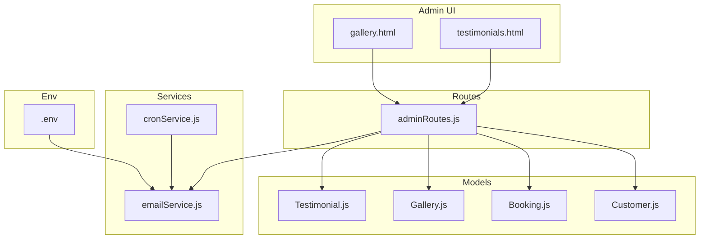
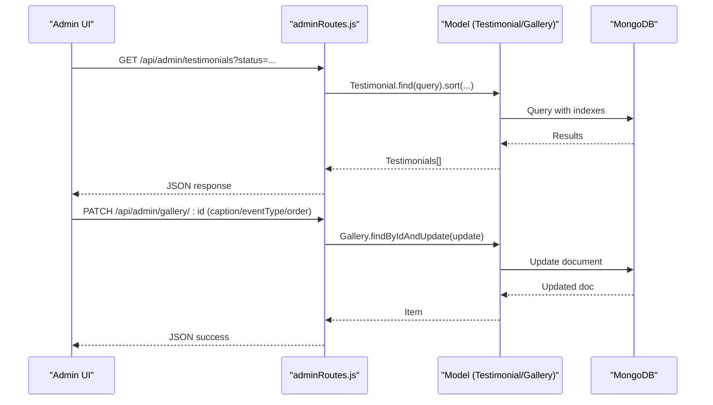
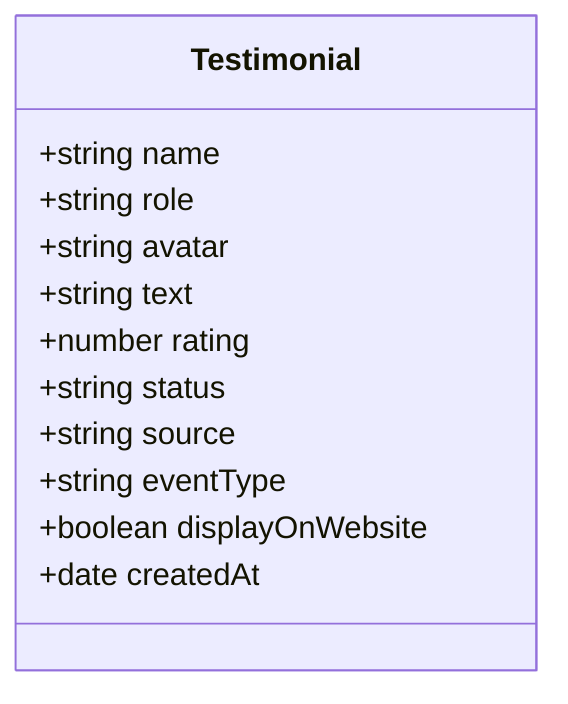
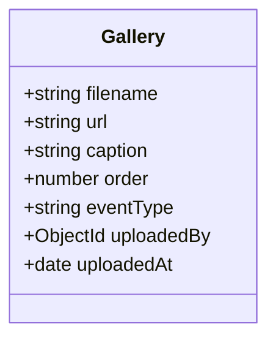
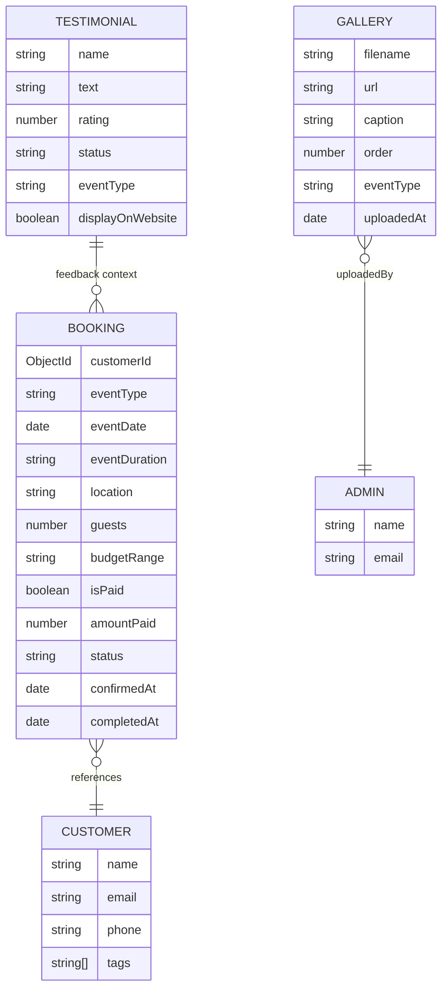
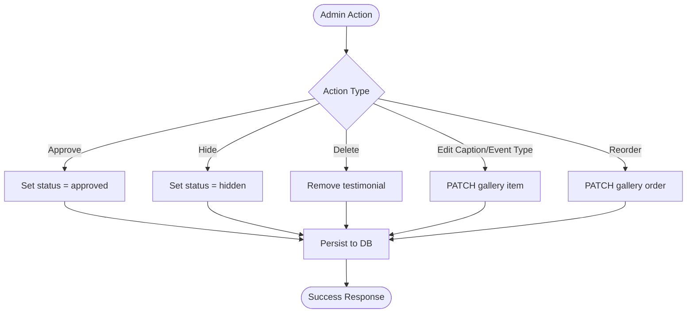
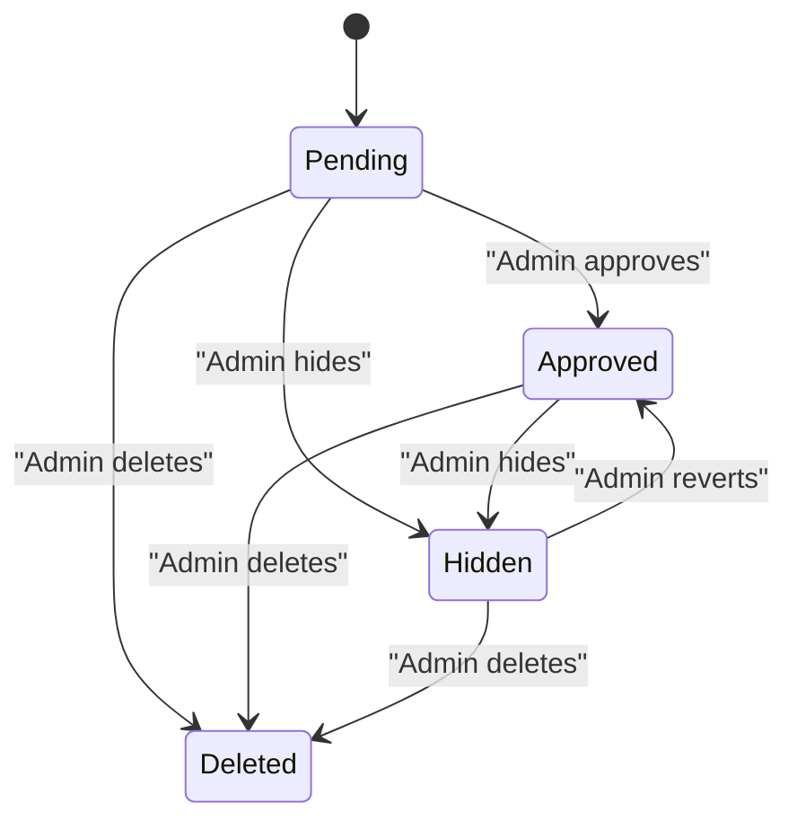
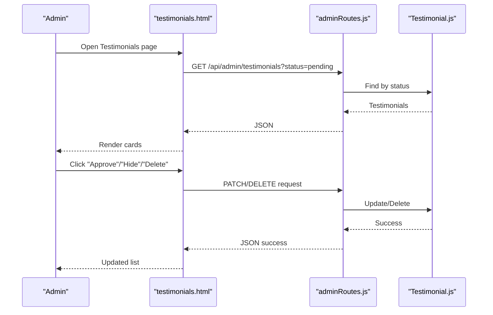
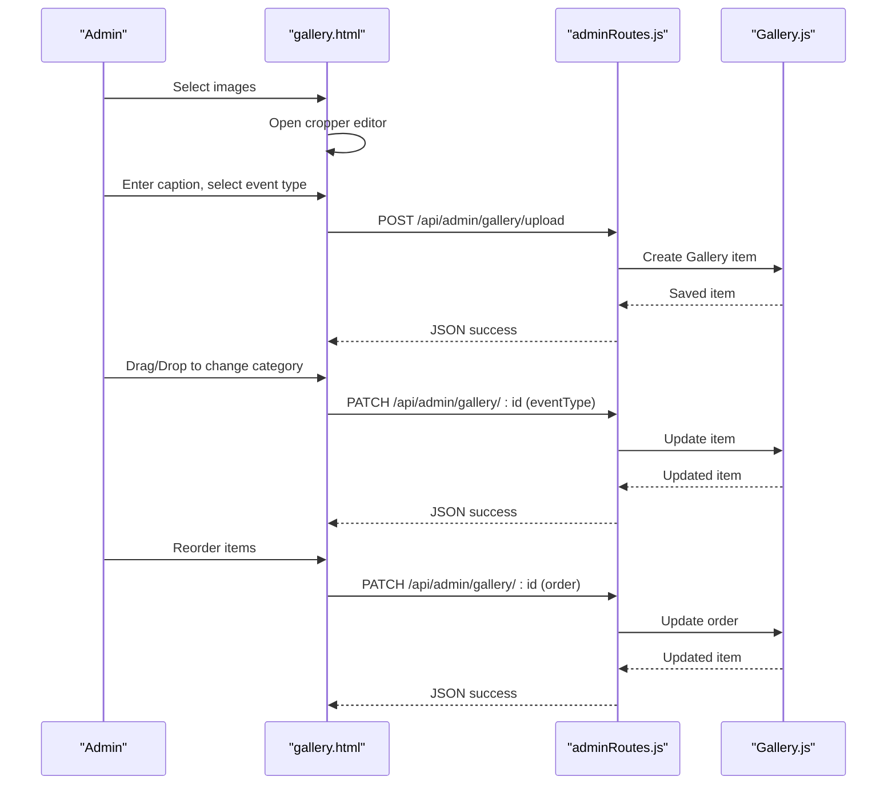
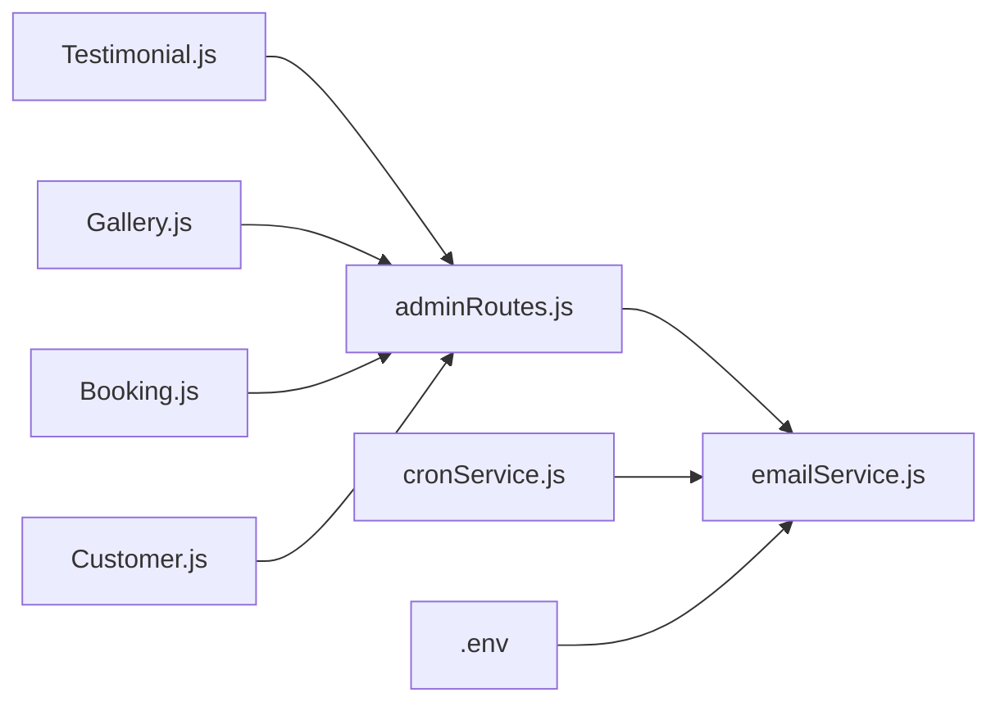

# Content & Media Models

<cite>
**Referenced Files in This Document**
- [Testimonial.js](file://server/models/Testimonial.js)
- [Gallery.js](file://server/models/Gallery.js)
- [Booking.js](file://server/models/Booking.js)
- [Customer.js](file://server/models/Customer.js)
- [adminRoutes.js](file://server/routes/adminRoutes.js)
- [testimonials.html](file://admin/testimonials.html)
- [gallery.html](file://admin/gallery.html)
- [.env](file://.env)
- [emailService.js](file://server/services/emailService.js)
- [cronService.js](file://server/services/cronService.js)
</cite>

## Table of Contents
1. [Introduction](#introduction)
2. [Project Structure](#project-structure)
3. [Core Components](#core-components)
4. [Architecture Overview](#architecture-overview)
5. [Detailed Component Analysis](#detailed-component-analysis)
6. [Dependency Analysis](#dependency-analysis)
7. [Performance Considerations](#performance-considerations)
8. [Troubleshooting Guide](#troubleshooting-guide)
9. [Conclusion](#conclusion)
10. [Appendices](#appendices)

## Introduction
This document provides comprehensive data model documentation for content and media management entities focused on Testimonials and Gallery. It explains field definitions, validation rules, approval workflows, display configurations, and moderation requirements. It also documents relationships with Booking and Customer entities, indexing strategies, search optimization, content lifecycle management, and media processing workflows. Practical examples illustrate testimonial submission and gallery upload processes, along with moderation scenarios. Performance considerations address media storage, CDN integration, and image optimization strategies.

## Project Structure
The content and media models reside under the server models directory and are exposed via admin routes. The admin UI pages manage testimonials and gallery entries. Environment variables configure external services such as email delivery and push notifications.

**Diagram sources**
- [Testimonial.js](file://server/models/Testimonial.js#L1-L51)
- [Gallery.js](file://server/models/Gallery.js#L1-L38)
- [Booking.js](file://server/models/Booking.js#L1-L169)
- [Customer.js](file://server/models/Customer.js#L1-L93)
- [adminRoutes.js](file://server/routes/adminRoutes.js#L1-L1160)
- [testimonials.html](file://admin/testimonials.html#L1-L906)
- [gallery.html](file://admin/gallery.html#L1-L1567)
- [emailService.js](file://server/services/emailService.js#L1-L30)
- [cronService.js](file://server/services/cronService.js#L1-L185)
- [.env](file://.env#L1-L51)

**Section sources**
- [Testimonial.js](file://server/models/Testimonial.js#L1-L51)
- [Gallery.js](file://server/models/Gallery.js#L1-L38)
- [adminRoutes.js](file://server/routes/adminRoutes.js#L714-L1007)
- [testimonials.html](file://admin/testimonials.html#L1-L906)
- [gallery.html](file://admin/gallery.html#L1-L1567)
- [.env](file://.env#L1-L51)

## Core Components
- Testimonial: Captures client feedback with rating, status, source, and website display flag. Includes indexing on status for filtering.
- Gallery: Manages uploaded images with metadata (caption, event type), ordering, and attribution to an admin uploader. Includes indexing on order for sorting.
- Booking and Customer: Provide CRM and relationship context for testimonials and gallery attributions. Booking includes indexes on customer, event date, status, and creation time. Customer includes indexes on email, phone, and tags.

Validation highlights:
- Testimonial: Required fields include name and text; rating constrained to 1–5; status constrained to pending/approved/hidden; optional avatar and eventType.
- Gallery: Required fields include filename and url; order defaults to 0; eventType optional; uploadedBy references Admin; uploadedAt defaults to now.
- Booking: Required fields include customer, event type, date, duration, location, guests, budget range; guest count minimum 1; enums for needUshers and status; timestamps and references to Customer and Staff.
- Customer: Unique constraints on email and phone (sparse); tags enum; arrays for booking history and preferred services; contact preference enum.

Approval and moderation:
- Testimonial status transitions are controlled via admin actions (approve/hide/delete).
- Gallery supports metadata updates (caption, event type) and reordering.

Display configurations:
- Testimonial includes a website display flag to control frontend visibility.
- Gallery orders images by numeric order ascending.

Relationships:
- Testimonial does not directly reference Booking or Customer in the model; however, testimonials are often associated with completed or confirmed bookings and clients.
- Gallery references Admin via uploadedBy ObjectId.

**Section sources**
- [Testimonial.js](file://server/models/Testimonial.js#L3-L48)
- [Gallery.js](file://server/models/Gallery.js#L3-L35)
- [Booking.js](file://server/models/Booking.js#L7-L139)
- [Customer.js](file://server/models/Customer.js#L7-L91)
- [adminRoutes.js](file://server/routes/adminRoutes.js#L732-L751)
- [adminRoutes.js](file://server/routes/adminRoutes.js#L939-L1007)

## Architecture Overview
The admin UI pages render lists of testimonials and gallery items. Admin actions trigger API endpoints that modify model records. Email and cron services support automated workflows.

**Diagram sources**
- [adminRoutes.js](file://server/routes/adminRoutes.js#L732-L751)
- [adminRoutes.js](file://server/routes/adminRoutes.js#L993-L1007)
- [Testimonial.js](file://server/models/Testimonial.js#L48-L48)
- [Gallery.js](file://server/models/Gallery.js#L35-L35)

## Detailed Component Analysis

### Testimonial Model
Fields and constraints:
- name: required string
- role: default "Client"
- avatar: optional string
- text: required string
- rating: number enum [1,2,3,4,5], default 5
- status: enum ["pending","approved","hidden"], default "pending"
- source: default "manual"
- eventType: optional string
- displayOnWebsite: boolean default false
- createdAt: default to now

Indexing:
- status: 1 (for efficient filtering by status)

Approval workflow:
- Admin filters testimonials by status (all/pending/approved/hidden).
- Admin can approve or hide testimonials via UI actions mapped to route handlers.

Display configuration:
- displayOnWebsite flag controls whether testimonials appear on the website.

Relationships:
- No direct Booking/Customer references in the model; however, testimonials are commonly linked to completed or confirmed bookings and their clients.

**Diagram sources**
- [Testimonial.js](file://server/models/Testimonial.js#L3-L48)

**Section sources**
- [Testimonial.js](file://server/models/Testimonial.js#L3-L48)
- [adminRoutes.js](file://server/routes/adminRoutes.js#L732-L751)
- [testimonials.html](file://admin/testimonials.html#L840-L895)

### Gallery Model
Fields and constraints:
- filename: required string
- url: required string
- caption: default empty string
- order: number default 0
- eventType: optional string
- uploadedBy: ObjectId referencing Admin, required
- uploadedAt: default to now

Indexing:
- order: 1 (for deterministic sort)

Media metadata and categorization:
- eventType supports categorizing photos by event type.
- caption stores optional descriptive text.

Attribution:
- uploadedBy links the image to the Admin who added it.

**Diagram sources**
- [Gallery.js](file://server/models/Gallery.js#L3-L35)

**Section sources**
- [Gallery.js](file://server/models/Gallery.js#L3-L35)
- [adminRoutes.js](file://server/routes/adminRoutes.js#L939-L1007)
- [gallery.html](file://admin/gallery.html#L1233-L1486)

### Relationships with Booking and Customer
While the Testimonial model does not directly reference Booking or Customer, the admin UI and routes demonstrate contextual relationships:
- Booking includes references to Customer and Staff, and timestamps for status transitions.
- Customer includes arrays for booking history and preferred services, and tags for segmentation.

**Diagram sources**
- [Testimonial.js](file://server/models/Testimonial.js#L3-L48)
- [Gallery.js](file://server/models/Gallery.js#L3-L35)
- [Booking.js](file://server/models/Booking.js#L7-L139)
- [Customer.js](file://server/models/Customer.js#L7-L91)

**Section sources**
- [Booking.js](file://server/models/Booking.js#L7-L139)
- [Customer.js](file://server/models/Customer.js#L7-L91)
- [adminRoutes.js](file://server/routes/adminRoutes.js#L174-L217)

### Approval Workflows and Moderation
Testimonial moderation:
- Admin filters testimonials by status.
- Approve action sets status to approved.
- Hide action sets status to hidden.
- Delete removes testimonials.

Gallery moderation:
- Admin can edit caption and event type.
- Drag-and-drop or UI actions update event type categories.
- Reordering is supported via PATCH endpoints.

**Diagram sources**
- [adminRoutes.js](file://server/routes/adminRoutes.js#L732-L751)
- [adminRoutes.js](file://server/routes/adminRoutes.js#L993-L1007)
- [testimonials.html](file://admin/testimonials.html#L864-L895)
- [gallery.html](file://admin/gallery.html#L1417-L1444)

**Section sources**
- [adminRoutes.js](file://server/routes/adminRoutes.js#L732-L751)
- [adminRoutes.js](file://server/routes/adminRoutes.js#L993-L1007)
- [testimonials.html](file://admin/testimonials.html#L840-L895)
- [gallery.html](file://admin/gallery.html#L1417-L1486)

### Content Lifecycle Management
Lifecycle stages:
- Creation: Testimonials created with status pending; Gallery items created with default order and uploadedAt timestamps.
- Moderation: Status transitions occur via admin actions; website display flag controls publication.
- Archival: Not explicitly modeled; deletion removes testimonials; completed/confirmed bookings indicate lifecycle completion.
- Version control: No explicit versioning; updates rely on timestamps and audit trails via admin notes (Booking).

[No sources needed since this diagram shows conceptual workflow, not actual code structure]

**Section sources**
- [Testimonial.js](file://server/models/Testimonial.js#L25-L28)
- [adminRoutes.js](file://server/routes/adminRoutes.js#L732-L751)
- [adminRoutes.js](file://server/routes/adminRoutes.js#L982-L991)

### Examples and Workflows

#### Testimonial Submission Workflow
- Admin filters testimonials by status (e.g., pending).
- Admin reviews testimonials and approves or hides based on policy.
- Approved testimonials may be marked for website display.

**Diagram sources**
- [adminRoutes.js](file://server/routes/adminRoutes.js#L732-L751)
- [testimonials.html](file://admin/testimonials.html#L864-L895)
- [Testimonial.js](file://server/models/Testimonial.js#L25-L28)

**Section sources**
- [adminRoutes.js](file://server/routes/adminRoutes.js#L732-L751)
- [testimonials.html](file://admin/testimonials.html#L840-L895)

#### Gallery Photo Upload and Categorization
- Admin selects images; cropper modal prepares edits.
- Metadata (caption, event type) and order are saved via PATCH endpoints.
- Images are sorted by order for display.

**Diagram sources**
- [adminRoutes.js](file://server/routes/adminRoutes.js#L951-L1007)
- [gallery.html](file://admin/gallery.html#L1252-L1295)
- [gallery.html](file://admin/gallery.html#L1417-L1486)
- [Gallery.js](file://server/models/Gallery.js#L16-L18)
- [Gallery.js](file://server/models/Gallery.js#L35-L35)

**Section sources**
- [adminRoutes.js](file://server/routes/adminRoutes.js#L951-L1007)
- [gallery.html](file://admin/gallery.html#L1252-L1295)
- [gallery.html](file://admin/gallery.html#L1417-L1486)

## Dependency Analysis
- Testimonial depends on Mongoose schema and exports a model.
- Gallery depends on Mongoose schema, Admin reference, and exports a model.
- Routes depend on models and expose CRUD endpoints for testimonials and gallery.
- Admin UI pages depend on routes for data and actions.
- Email service and cron service integrate with Booking/Customer for automated workflows.

**Diagram sources**
- [Testimonial.js](file://server/models/Testimonial.js#L1-L51)
- [Gallery.js](file://server/models/Gallery.js#L1-L38)
- [Booking.js](file://server/models/Booking.js#L1-L169)
- [Customer.js](file://server/models/Customer.js#L1-L93)
- [adminRoutes.js](file://server/routes/adminRoutes.js#L1-L1160)
- [emailService.js](file://server/services/emailService.js#L1-L30)
- [cronService.js](file://server/services/cronService.js#L1-L185)
- [.env](file://.env#L1-L51)

**Section sources**
- [adminRoutes.js](file://server/routes/adminRoutes.js#L1-L1160)
- [emailService.js](file://server/services/emailService.js#L1-L30)
- [cronService.js](file://server/services/cronService.js#L1-L185)

## Performance Considerations
- Indexes:
  - Testimonial: status index for filtering.
  - Gallery: order index for sorting.
  - Booking: indexes on customerId, eventDate, status, createdAt for efficient queries.
  - Customer: indexes on email, phone, tags for fast lookups.
- Pagination and sorting:
  - Routes implement pagination and sorting for testimonials and bookings.
- Media storage and optimization:
  - Cropping and resizing are handled client-side before upload to reduce payload sizes.
  - Consider integrating a CDN for image delivery and lazy loading for gallery grids.
  - Compress images and serve modern formats (WebP) where supported.
- Background tasks:
  - Cron jobs automate follow-ups and reminders; ensure scheduling frequency matches workload.

[No sources needed since this section provides general guidance]

## Troubleshooting Guide
Common issues and resolutions:
- Missing or invalid credentials:
  - Ensure BREVO API key is configured in environment variables for email delivery.
- CORS and cookies:
  - Admin routes use httpOnly cookies; verify domain and SameSite settings for cross-origin requests.
- Validation errors:
  - Testimonial requires name and text; Gallery requires filename and url; ensure these fields are present on submission.
- Rate limits:
  - Email provider rate limits may apply; monitor logs and adjust cadence.
- Cron job failures:
  - Inspect cron job logs for errors and verify email service initialization.

**Section sources**
- [.env](file://.env#L21-L27)
- [emailService.js](file://server/services/emailService.js#L9-L27)
- [adminRoutes.js](file://server/routes/adminRoutes.js#L59-L152)

## Conclusion
The Testimonial and Gallery models provide robust foundations for managing client feedback and media content. Clear approval workflows, metadata fields, and indexing strategies enable efficient moderation and retrieval. Relationships with Booking and Customer offer contextual relevance, while admin routes and UI pages streamline content management. Performance and reliability can be further enhanced through CDN integration, optimized image processing, and careful monitoring of automated workflows.

## Appendices

### Field Reference Summary
- Testimonial
  - name: required string
  - role: default "Client"
  - avatar: optional string
  - text: required string
  - rating: enum [1,2,3,4,5], default 5
  - status: enum ["pending","approved","hidden"], default "pending"
  - source: default "manual"
  - eventType: optional string
  - displayOnWebsite: boolean default false
  - createdAt: default now
- Gallery
  - filename: required string
  - url: required string
  - caption: default empty string
  - order: number default 0
  - eventType: optional string
  - uploadedBy: ObjectId Admin, required
  - uploadedAt: default now

**Section sources**
- [Testimonial.js](file://server/models/Testimonial.js#L3-L48)
- [Gallery.js](file://server/models/Gallery.js#L3-L35)