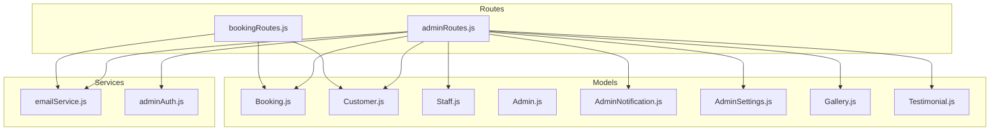
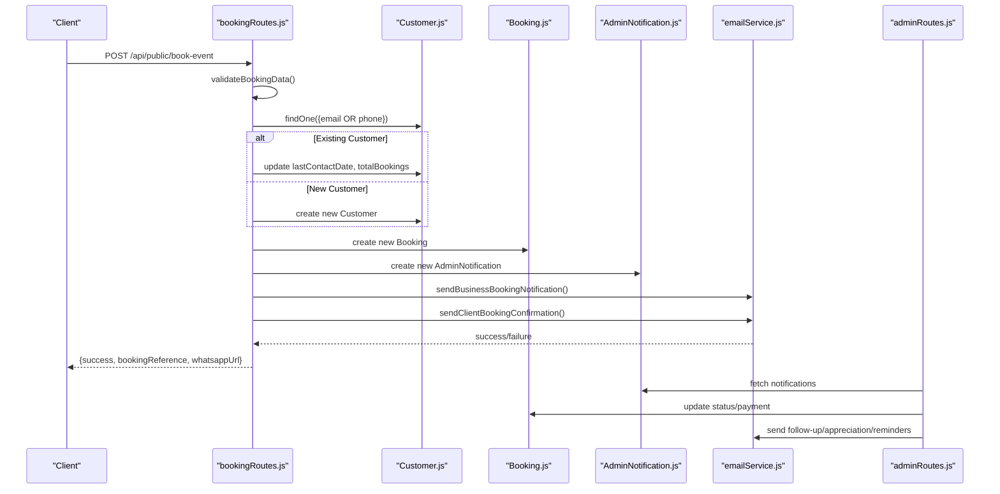
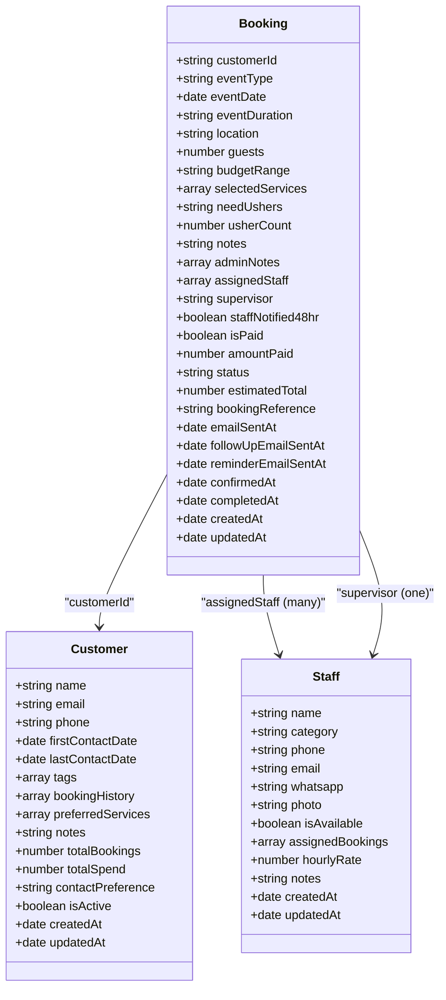
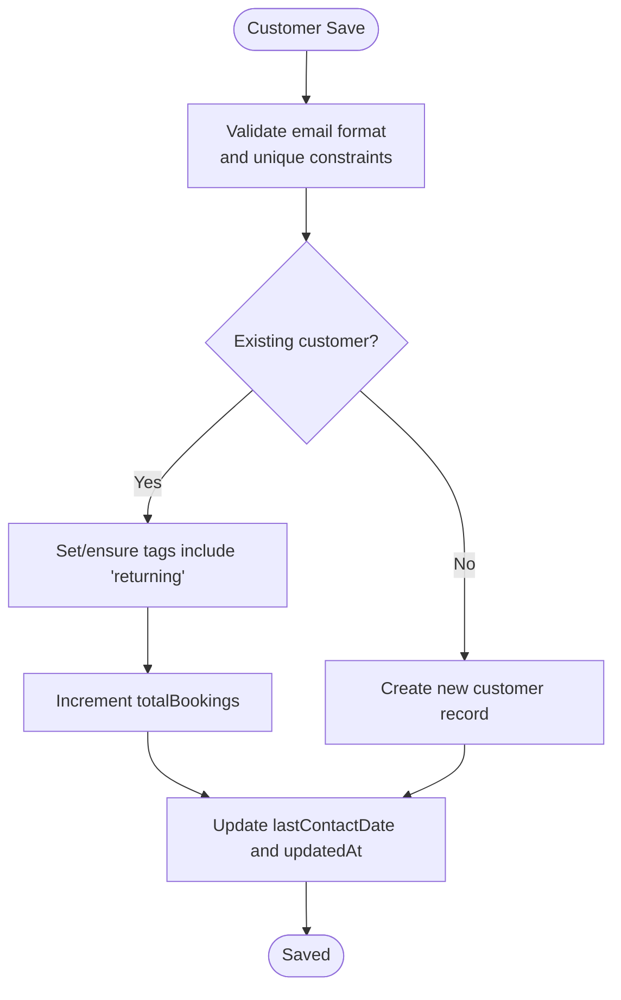
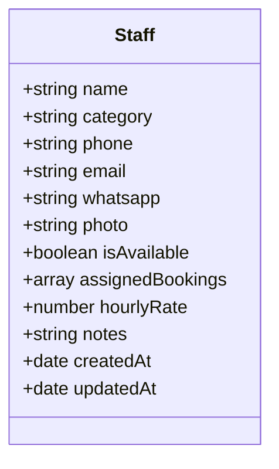
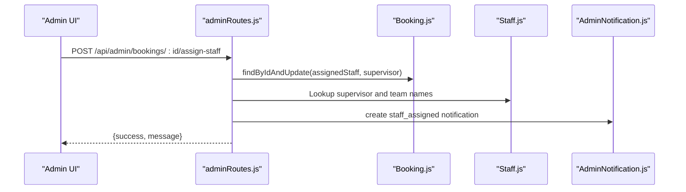
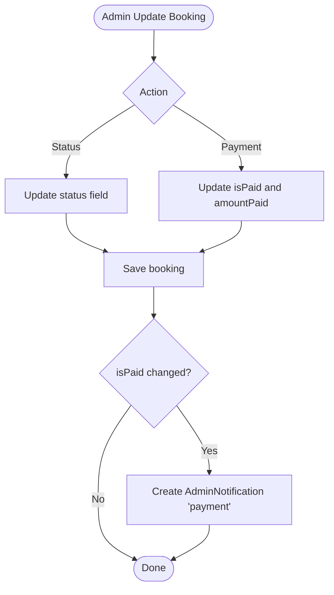
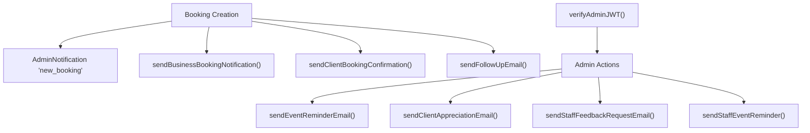
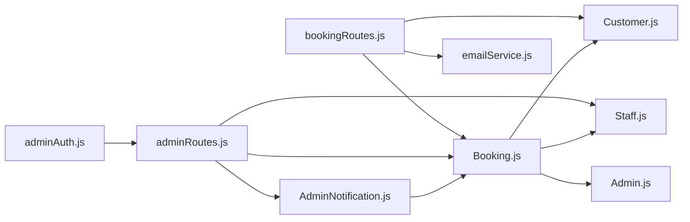

# Core Business Models

<cite>
**Referenced Files in This Document**
- [Booking.js](file://server/models/Booking.js)
- [Customer.js](file://server/models/Customer.js)
- [Staff.js](file://server/models/Staff.js)
- [bookingRoutes.js](file://server/routes/bookingRoutes.js)
- [adminRoutes.js](file://server/routes/adminRoutes.js)
- [emailService.js](file://server/services/emailService.js)
- [Admin.js](file://server/models/Admin.js)
- [AdminNotification.js](file://server/models/AdminNotification.js)
- [AdminSettings.js](file://server/models/AdminSettings.js)
- [Gallery.js](file://server/models/Gallery.js)
- [Testimonial.js](file://server/models/Testimonial.js)
- [adminAuth.js](file://server/middleware/adminAuth.js)
</cite>

## Table of Contents
1. [Introduction](#introduction)
2. [Project Structure](#project-structure)
3. [Core Components](#core-components)
4. [Architecture Overview](#architecture-overview)
5. [Detailed Component Analysis](#detailed-component-analysis)
6. [Dependency Analysis](#dependency-analysis)
7. [Performance Considerations](#performance-considerations)
8. [Troubleshooting Guide](#troubleshooting-guide)
9. [Conclusion](#conclusion)
10. [Appendices](#appendices)

## Introduction
This document provides comprehensive data model documentation for the core business entities of Emerald Pearland Events. It focuses on the Booking, Customer, and Staff models, detailing their schemas, relationships, validations, enums, and business logic. It also covers payment tracking, status management, many-to-many relationships between Bookings and Staff, and one-to-many relationships with Customers. Additional operational models and services are included to provide context for email automation, admin roles, and notifications.

## Project Structure
The core business models are implemented as Mongoose schemas under the server/models directory, with route handlers under server/routes and business logic in server/services. Admin authentication middleware ensures protected access to administrative endpoints.

**Diagram sources**
- [Booking.js](file://server/models/Booking.js#L1-L169)
- [Customer.js](file://server/models/Customer.js#L1-L93)
- [Staff.js](file://server/models/Staff.js#L1-L57)
- [bookingRoutes.js](file://server/routes/bookingRoutes.js#L1-L356)
- [adminRoutes.js](file://server/routes/adminRoutes.js#L1-L1160)
- [emailService.js](file://server/services/emailService.js#L1-L467)
- [Admin.js](file://server/models/Admin.js#L1-L70)
- [AdminNotification.js](file://server/models/AdminNotification.js#L1-L40)
- [AdminSettings.js](file://server/models/AdminSettings.js#L1-L56)
- [Gallery.js](file://server/models/Gallery.js#L1-L38)
- [Testimonial.js](file://server/models/Testimonial.js#L1-L51)
- [adminAuth.js](file://server/middleware/adminAuth.js#L1-L56)

**Section sources**
- [Booking.js](file://server/models/Booking.js#L1-L169)
- [Customer.js](file://server/models/Customer.js#L1-L93)
- [Staff.js](file://server/models/Staff.js#L1-L57)
- [bookingRoutes.js](file://server/routes/bookingRoutes.js#L1-L356)
- [adminRoutes.js](file://server/routes/adminRoutes.js#L1-L1160)
- [emailService.js](file://server/services/emailService.js#L1-L467)
- [Admin.js](file://server/models/Admin.js#L1-L70)
- [AdminNotification.js](file://server/models/AdminNotification.js#L1-L40)
- [AdminSettings.js](file://server/models/AdminSettings.js#L1-L56)
- [Gallery.js](file://server/models/Gallery.js#L1-L38)
- [Testimonial.js](file://server/models/Testimonial.js#L1-L51)
- [adminAuth.js](file://server/middleware/adminAuth.js#L1-L56)

## Core Components
This section documents the primary business entities and their schemas, constraints, and behaviors.

- Booking Model
  - Purpose: Represents event bookings with customer linkage, staff assignments, payment tracking, and status lifecycle.
  - Key Fields:
    - customerId: ObjectId referencing Customer (required)
    - eventType: Enum of supported event types (required)
    - eventDate: Date (required)
    - eventDuration: String (required)
    - location: String (required, trimmed)
    - guests: Number (required, min 1)
    - budgetRange: Enum of investment ranges (required)
    - selectedServices: Array of service objects with serviceName, quantity, estimatedCost
    - needUshers: Enum ('Yes', 'No', 'Not specified'), default 'Not specified'
    - usherCount: Number (nullable)
    - notes: String (default empty)
    - adminNotes: Array of admin note objects with note, addedBy (Admin), addedAt
    - assignedStaff: Array of Staff ObjectIds (many-to-many)
    - supervisor: Staff ObjectId (optional)
    - staffNotified48hr: Boolean (default false)
    - isPaid: Boolean (default false)
    - amountPaid: Number (default 0)
    - status: Enum ['new', 'contacted', 'confirmed', 'completed', 'cancelled'], default 'new'
    - estimatedTotal: Number (default 0)
    - bookingReference: Unique String (auto-generated)
    - Email timestamps: emailSentAt, followUpEmailSentAt, reminderEmailSentAt
    - Lifecycle timestamps: confirmedAt, completedAt, createdAt, updatedAt
  - Validation Rules:
    - eventDate must be in the future
    - guests must be >= 1
    - eventType, eventDuration, location, budgetRange required
    - Phone/email sanitization and regex validation in route handler
  - Business Logic:
    - Pre-save hook generates bookingReference if absent and updates updatedAt
    - Default population of customerId on find queries
    - Status transitions managed via admin routes
    - Payment updates tracked via isPaid and amountPaid
    - Many-to-many relationship with Staff via assignedStaff array
    - One-to-many relationship with Customer via customerId

- Customer Model
  - Purpose: CRM entity for clients with contact preferences, tags, booking history, and financial metrics.
  - Key Fields:
    - name: String (required, trimmed)
    - email: String (required, unique, lowercase, trimmed, validated)
    - phone: String (required, unique, trimmed, validated)
    - firstContactDate: Date (default now)
    - lastContactDate: Date (default now)
    - tags: Enum ['new', 'returning', 'VIP', 'interested', 'inactive'], default ['new']
    - bookingHistory: Array of Booking ObjectIds (default [])
    - preferredServices: Array of Strings (default [])
    - notes: String (default empty)
    - totalBookings: Number (default 0)
    - totalSpend: Number (default 0)
    - contactPreference: Enum ['email', 'phone', 'whatsapp'], default 'whatsapp'
    - isActive: Boolean (default true)
    - createdAt, updatedAt
  - Validation Rules:
    - Unique constraints on email and phone (sparse)
    - Regex validation for email format
    - Pre-save updates updatedAt
  - Business Logic:
    - Tags updated to 'returning' on repeat contact
    - totalBookings incremented on new booking
    - lastContactDate updated on contact

- Staff Model
  - Purpose: Represents event staff members with availability, categories, and assigned bookings.
  - Key Fields:
    - name: String (required)
    - category: String (required)
    - phone: String (required)
    - email: String (nullable)
    - whatsapp: String (nullable)
    - photo: String (nullable)
    - isAvailable: Boolean (default true)
    - assignedBookings: Array of Booking ObjectIds (one-to-many)
    - hourlyRate: Number (default 0)
    - notes: String (default empty)
    - createdAt, updatedAt
  - Validation Rules:
    - Required fields for name, category, phone
  - Business Logic:
    - Availability flag for scheduling
    - Assigned bookings tracked for reporting and reminders

**Section sources**
- [Booking.js](file://server/models/Booking.js#L7-L139)
- [Customer.js](file://server/models/Customer.js#L7-L79)
- [Staff.js](file://server/models/Staff.js#L3-L54)

## Architecture Overview
The system integrates public booking intake with administrative workflows. Public submissions trigger customer creation, booking creation, admin notifications, and automated emails. Administrators manage bookings, staff, and settings, with real-time notifications and analytics.

**Diagram sources**
- [bookingRoutes.js](file://server/routes/bookingRoutes.js#L121-L285)
- [Customer.js](file://server/models/Customer.js#L81-L85)
- [Booking.js](file://server/models/Booking.js#L142-L148)
- [AdminNotification.js](file://server/models/AdminNotification.js#L3-L34)
- [emailService.js](file://server/services/emailService.js#L127-L219)
- [adminRoutes.js](file://server/routes/adminRoutes.js#L174-L291)

## Detailed Component Analysis

### Booking Model Schema and Relationships
- Schema Definition
  - Embedded arrays: selectedServices, adminNotes
  - References: customerId (Customer), assignedStaff (Staff), supervisor (Staff), adminNotes.addedBy (Admin)
  - Enums: eventType, budgetRange, needUshers, status
  - Timestamps: createdAt, updatedAt, and specialized date fields for email and lifecycle
- Pre-save Hook
  - Generates bookingReference if missing using EPE-{timestamp}
  - Updates updatedAt on every save
- Population Strategy
  - Default population of customerId with name, email, phone on find queries
- Indexes
  - customerId, eventDate, status, createdAt for efficient queries

**Diagram sources**
- [Booking.js](file://server/models/Booking.js#L7-L139)
- [Customer.js](file://server/models/Customer.js#L7-L79)
- [Staff.js](file://server/models/Staff.js#L3-L54)

**Section sources**
- [Booking.js](file://server/models/Booking.js#L7-L169)

### Customer Model Schema and Preferences
- Schema Definition
  - Unique constraints on email and phone (sparse)
  - Enumerated tags and contactPreference
  - Financial metrics: totalBookings, totalSpend
  - Booking history tracking via ObjectId references
- Pre-save Hook
  - Updates updatedAt on save
- Indexes
  - email, phone, tags for fast filtering and tagging

**Diagram sources**
- [Customer.js](file://server/models/Customer.js#L81-L85)
- [bookingRoutes.js](file://server/routes/bookingRoutes.js#L155-L181)

**Section sources**
- [Customer.js](file://server/models/Customer.js#L7-L93)
- [bookingRoutes.js](file://server/routes/bookingRoutes.js#L155-L181)

### Staff Model Schema and Availability
- Schema Definition
  - Availability flag for scheduling
  - Category-based grouping
  - Contact channels: email, whatsapp
  - Hourly rate and notes
  - Assigned bookings tracking
- Indexes
  - None explicitly defined in schema; availability and category filters used in admin queries

**Diagram sources**
- [Staff.js](file://server/models/Staff.js#L3-L54)

**Section sources**
- [Staff.js](file://server/models/Staff.js#L3-L54)
- [adminRoutes.js](file://server/routes/adminRoutes.js#L634-L653)

### Staff Assignment Workflow
Administrators assign staff to bookings via a dedicated endpoint. The assignment updates both the booking’s assignedStaff array and creates an admin notification.

**Diagram sources**
- [adminRoutes.js](file://server/routes/adminRoutes.js#L1041-L1077)
- [Booking.js](file://server/models/Booking.js#L76-L84)
- [Staff.js](file://server/models/Staff.js#L32-L37)
- [AdminNotification.js](file://server/models/AdminNotification.js#L3-L34)

**Section sources**
- [adminRoutes.js](file://server/routes/adminRoutes.js#L1041-L1077)
- [Booking.js](file://server/models/Booking.js#L76-L84)
- [Staff.js](file://server/models/Staff.js#L32-L37)

### Payment Tracking and Status Management
- Payment
  - isPaid: Boolean flag
  - amountPaid: Number
  - Endpoint: PATCH /api/admin/bookings/:id/pay
- Status
  - Enumerated lifecycle: new, contacted, confirmed, completed, cancelled
  - Endpoint: PATCH /api/admin/bookings/:id/status
- Notifications
  - Payment received triggers AdminNotification of type 'payment'

**Diagram sources**
- [adminRoutes.js](file://server/routes/adminRoutes.js#L317-L353)
- [adminRoutes.js](file://server/routes/adminRoutes.js#L1083-L1111)
- [AdminNotification.js](file://server/models/AdminNotification.js#L3-L34)

**Section sources**
- [adminRoutes.js](file://server/routes/adminRoutes.js#L317-L353)
- [adminRoutes.js](file://server/routes/adminRoutes.js#L1083-L1111)
- [AdminNotification.js](file://server/models/AdminNotification.js#L3-L34)

### Email Automation and Notifications
- Email Service
  - Uses Brevo SDK for transactional emails
  - Functions include business notifications, client confirmations, follow-ups, reminders, appreciation, and staff feedback requests
- Notifications
  - AdminNotification model tracks system alerts with auto-expiry index
  - AdminAuth middleware protects admin endpoints with JWT cookies

**Diagram sources**
- [bookingRoutes.js](file://server/routes/bookingRoutes.js#L227-L256)
- [adminRoutes.js](file://server/routes/adminRoutes.js#L337-L418)
- [emailService.js](file://server/services/emailService.js#L127-L465)
- [AdminNotification.js](file://server/models/AdminNotification.js#L3-L34)
- [adminAuth.js](file://server/middleware/adminAuth.js#L3-L31)

**Section sources**
- [emailService.js](file://server/services/emailService.js#L1-L467)
- [AdminNotification.js](file://server/models/AdminNotification.js#L1-L40)
- [adminAuth.js](file://server/middleware/adminAuth.js#L1-L56)

## Dependency Analysis
- Model Dependencies
  - Booking depends on Customer, Staff, Admin for references
  - Staff depends on Booking for assignedBookings
  - AdminNotification depends on Booking for optional reference
- Route Dependencies
  - bookingRoutes orchestrates Customer and Booking creation and email dispatch
  - adminRoutes coordinates staff assignment, payment updates, and analytics
- Service Dependencies
  - emailService is consumed by both route layers
  - adminAuth secures admin endpoints

**Diagram sources**
- [Booking.js](file://server/models/Booking.js#L7-L139)
- [Customer.js](file://server/models/Customer.js#L7-L79)
- [Staff.js](file://server/models/Staff.js#L3-L54)
- [Admin.js](file://server/models/Admin.js#L1-L70)
- [AdminNotification.js](file://server/models/AdminNotification.js#L1-L40)
- [adminRoutes.js](file://server/routes/adminRoutes.js#L1-L1160)
- [bookingRoutes.js](file://server/routes/bookingRoutes.js#L1-L356)
- [emailService.js](file://server/services/emailService.js#L1-L467)
- [adminAuth.js](file://server/middleware/adminAuth.js#L1-L56)

**Section sources**
- [Booking.js](file://server/models/Booking.js#L7-L139)
- [Customer.js](file://server/models/Customer.js#L7-L79)
- [Staff.js](file://server/models/Staff.js#L3-L54)
- [adminRoutes.js](file://server/routes/adminRoutes.js#L1-L1160)
- [bookingRoutes.js](file://server/routes/bookingRoutes.js#L1-L356)
- [emailService.js](file://server/services/emailService.js#L1-L467)
- [adminAuth.js](file://server/middleware/adminAuth.js#L1-L56)

## Performance Considerations
- Indexing Strategies
  - Booking: customerId, eventDate, status, createdAt
  - Customer: email, phone, tags
  - AdminNotification: createdAt (auto-expire)
  - Gallery: order
- Query Patterns
  - Admin booking listing with filters (status, eventType, search) and pagination
  - Staff listing by category and availability
  - Analytics aggregation by month and status
- Recommendations
  - Add compound indexes for frequent filter combinations (e.g., status + eventDate)
  - Monitor slow queries and add targeted indexes for underperforming routes
  - Consider TTL for old notifications and archived bookings

**Section sources**
- [Booking.js](file://server/models/Booking.js#L150-L155)
- [Customer.js](file://server/models/Customer.js#L87-L90)
- [AdminNotification.js](file://server/models/AdminNotification.js#L36-L37)
- [adminRoutes.js](file://server/routes/adminRoutes.js#L174-L217)
- [adminRoutes.js](file://server/routes/adminRoutes.js#L634-L653)

## Troubleshooting Guide
- Common Issues
  - Duplicate customer records: Ensure email/phone uniqueness and handle sparse indices
  - Invalid booking dates: Validate eventDate is in the future
  - Missing admin token: Verify JWT cookie presence and expiration
  - Email failures: Confirm BREVO API key and SMTP configuration
- Error Handling
  - Route handlers return structured JSON with success flags and messages
  - Middleware catches token errors and redirects unauthenticated access
  - Services log detailed errors for debugging

**Section sources**
- [bookingRoutes.js](file://server/routes/bookingRoutes.js#L143-L150)
- [bookingRoutes.js](file://server/routes/bookingRoutes.js#L277-L284)
- [adminAuth.js](file://server/middleware/adminAuth.js#L3-L31)
- [emailService.js](file://server/services/emailService.js#L9-L27)

## Conclusion
The core business models for Emerald Pearland Events form a cohesive system: Bookings capture event details and lifecycle, Customers track CRM and financial history, and Staff manages availability and assignments. Administrative routes enforce validations, automate communications, and provide analytics. Proper indexing and monitoring will ensure scalability and reliability.

## Appendices

### Field Definitions and Constraints
- Booking
  - eventType: Enumerated event types
  - budgetRange: Investment brackets
  - needUshers: Enumerated yes/no/not specified
  - status: Enumerated lifecycle states
  - References: Customer, Staff, Admin
- Customer
  - tags: CRM segmentation
  - contactPreference: Preferred communication channel
  - Unique constraints: email, phone
- Staff
  - category: Role grouping
  - isAvailable: Scheduling flag
  - References: Booking

**Section sources**
- [Booking.js](file://server/models/Booking.js#L13-L101)
- [Customer.js](file://server/models/Customer.js#L36-L66)
- [Staff.js](file://server/models/Staff.js#L8-L31)

### Sample Data Structures
- Booking
  - Minimal required: customerId, eventType, eventDate, eventDuration, location, guests, budgetRange
  - Optional: selectedServices, needUshers, usherCount, notes, adminNotes
- Customer
  - Minimal required: name, email, phone
  - Optional: tags, preferredServices, notes, contactPreference
- Staff
  - Minimal required: name, category, phone
  - Optional: email, whatsapp, photo, isAvailable, hourlyRate, notes

**Section sources**
- [bookingRoutes.js](file://server/routes/bookingRoutes.js#L186-L199)
- [bookingRoutes.js](file://server/routes/bookingRoutes.js#L171-L179)
- [Staff.js](file://server/models/Staff.js#L3-L54)

### Practical Workflows
- Booking Creation
  - Validate input, deduplicate customer by email/phone, create Customer if needed, create Booking, send notifications and emails
- Staff Assignment
  - Update booking’s assignedStaff and supervisor, create admin notification
- Customer Management
  - List, create, delete customers; update tags and contact preferences

**Section sources**
- [bookingRoutes.js](file://server/routes/bookingRoutes.js#L121-L285)
- [adminRoutes.js](file://server/routes/adminRoutes.js#L1041-L1077)
- [adminRoutes.js](file://server/routes/adminRoutes.js#L1117-L1157)