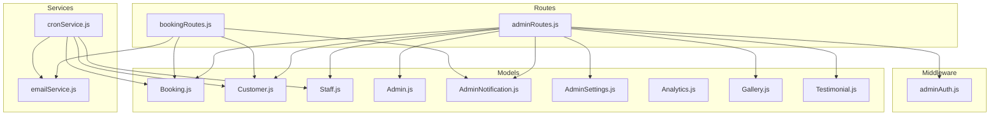
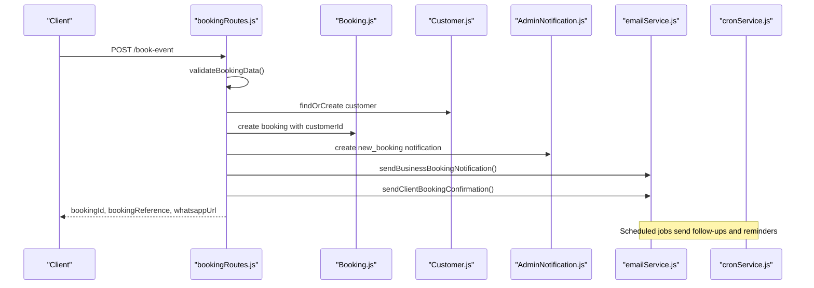
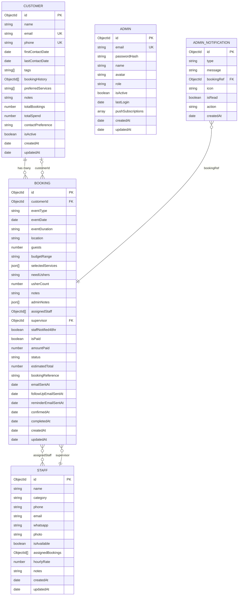
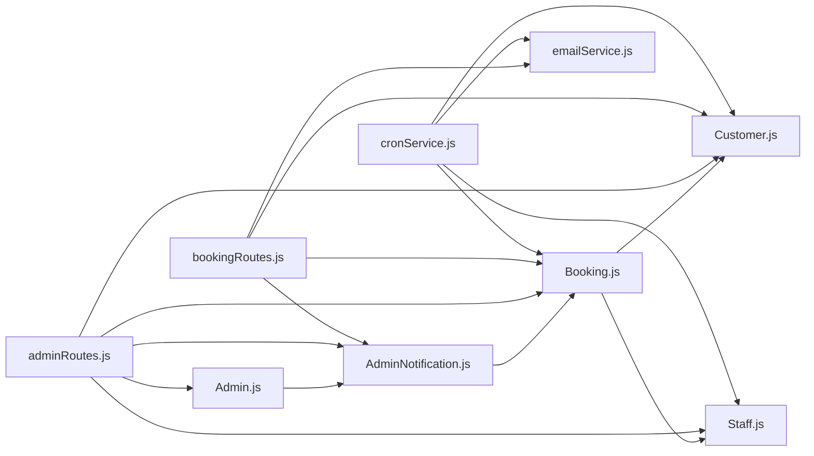

# Database Schema & Models

<cite>
**Referenced Files in This Document**
- [Booking.js](file://server/models/Booking.js)
- [Customer.js](file://server/models/Customer.js)
- [Staff.js](file://server/models/Staff.js)
- [Admin.js](file://server/models/Admin.js)
- [AdminNotification.js](file://server/models/AdminNotification.js)
- [AdminSettings.js](file://server/models/AdminSettings.js)
- [Analytics.js](file://server/models/Analytics.js)
- [Gallery.js](file://server/models/Gallery.js)
- [Testimonial.js](file://server/models/Testimonial.js)
- [adminAuth.js](file://server/middleware/adminAuth.js)
- [cronService.js](file://server/services/cronService.js)
- [emailService.js](file://server/services/emailService.js)
- [adminRoutes.js](file://server/routes/adminRoutes.js)
- [bookingRoutes.js](file://server/routes/bookingRoutes.js)
</cite>

## Table of Contents
1. [Introduction](#introduction)
2. [Project Structure](#project-structure)
3. [Core Components](#core-components)
4. [Architecture Overview](#architecture-overview)
5. [Detailed Component Analysis](#detailed-component-analysis)
6. [Dependency Analysis](#dependency-analysis)
7. [Performance Considerations](#performance-considerations)
8. [Troubleshooting Guide](#troubleshooting-guide)
9. [Conclusion](#conclusion)
10. [Appendices](#appendices)

## Introduction
This document describes the Emerald Pearland Events database schema and models. It focuses on the core entities and their relationships: Booking, Customer, Staff, and Admin. It explains field definitions, data types, validation rules, business constraints, indexing strategies, query patterns, lifecycle management, and security controls. It also includes diagrams of entity relationships and foreign key constraints, and provides practical guidance for performance, troubleshooting, and operational workflows.

## Project Structure
The database models are implemented as Mongoose schemas under the server/models directory. Supporting components include middleware for admin authentication, services for email automation and cron-based reminders, and Express routes that expose administrative and public APIs.

**Diagram sources**
- [Booking.js](file://server/models/Booking.js#L1-L169)
- [Customer.js](file://server/models/Customer.js#L1-L93)
- [Staff.js](file://server/models/Staff.js#L1-L57)
- [Admin.js](file://server/models/Admin.js#L1-L70)
- [AdminNotification.js](file://server/models/AdminNotification.js#L1-L40)
- [AdminSettings.js](file://server/models/AdminSettings.js#L1-L56)
- [Analytics.js](file://server/models/Analytics.js#L1-L41)
- [Gallery.js](file://server/models/Gallery.js#L1-L38)
- [Testimonial.js](file://server/models/Testimonial.js#L1-L51)
- [adminAuth.js](file://server/middleware/adminAuth.js#L1-L56)
- [cronService.js](file://server/services/cronService.js#L1-L185)
- [emailService.js](file://server/services/emailService.js#L1-L467)
- [adminRoutes.js](file://server/routes/adminRoutes.js#L1-L1160)
- [bookingRoutes.js](file://server/routes/bookingRoutes.js#L1-L356)

**Section sources**
- [Booking.js](file://server/models/Booking.js#L1-L169)
- [Customer.js](file://server/models/Customer.js#L1-L93)
- [Staff.js](file://server/models/Staff.js#L1-L57)
- [Admin.js](file://server/models/Admin.js#L1-L70)
- [AdminNotification.js](file://server/models/AdminNotification.js#L1-L40)
- [AdminSettings.js](file://server/models/AdminSettings.js#L1-L56)
- [Analytics.js](file://server/models/Analytics.js#L1-L41)
- [Gallery.js](file://server/models/Gallery.js#L1-L38)
- [Testimonial.js](file://server/models/Testimonial.js#L1-L51)
- [adminAuth.js](file://server/middleware/adminAuth.js#L1-L56)
- [cronService.js](file://server/services/cronService.js#L1-L185)
- [emailService.js](file://server/services/emailService.js#L1-L467)
- [adminRoutes.js](file://server/routes/adminRoutes.js#L1-L1160)
- [bookingRoutes.js](file://server/routes/bookingRoutes.js#L1-L356)

## Core Components
This section documents the primary schemas and their fields, constraints, and behaviors.

- Booking
  - Purpose: Stores event booking details, customer linkage, staff assignments, payment and status tracking, and administrative notes.
  - Key fields: customerId (foreign key to Customer), eventType, eventDate, eventDuration, location, guests, budgetRange, selectedServices, needUshers, usherCount, notes, adminNotes, assignedStaff (array of Staff), supervisor (foreign key to Staff), staffNotified48hr, isPaid, amountPaid, status, estimatedTotal, bookingReference, timestamps for email notifications and lifecycle, createdAt, updatedAt.
  - Validation: Enumerations for eventType, budgetRange, needUshers, status; numeric constraints for guests; date constraints enforced by application logic; unique/sparse for bookingReference.
  - Indexes: customerId, eventDate, status, createdAt; default population of customerId on find queries.
  - Lifecycle: Pre-save hook generates bookingReference; timestamps updated on save; default status is new; email timestamps managed by cron jobs and routes.

- Customer
  - Purpose: CRM data for clients including contact preferences, tags, booking history, and engagement metrics.
  - Key fields: name, email (unique/sparse), phone (unique/sparse), firstContactDate, lastContactDate, tags (enum), bookingHistory (array of Booking), preferredServices, notes, totalBookings, totalSpend, contactPreference, isActive, timestamps.
  - Validation: Unique constraints on email and phone; enums for tags and contactPreference; default tags include new.
  - Indexes: email, phone, tags; timestamps updated on save.

- Staff
  - Purpose: Staff profiles, categories, availability, and assigned bookings.
  - Key fields: name, category, phone, email, whatsapp, photo, isAvailable, assignedBookings (array of Booking), hourlyRate, notes, timestamps.
  - Validation: Required fields for name, category, phone; defaults for availability and rates.
  - Indexes: None explicitly defined; availability and category can be used for filtering.

- Admin
  - Purpose: Administrative users with role-based permissions and JWT-based authentication.
  - Key fields: email (unique), passwordHash (hashed), name, avatar, role (enum super_admin, admin, manager), isActive, lastLogin, pushSubscriptions, timestamps.
  - Security: Pre-save hashing via bcrypt; comparePassword method; JWT cookies with httpOnly, secure, sameSite strict; token expiry 24h.

- AdminNotification
  - Purpose: Admin-centric notifications with automatic expiration.
  - Key fields: type (enum), message, bookingRef (optional), icon, isRead, action, createdAt; TTL index expiresAfterSeconds 2592000 (30 days).

- AdminSettings
  - Purpose: Business-wide settings (business info, notifications, branding).
  - Key fields: businessName, businessPhone, businessEmail, businessAddress, logo, notifyOnNewBooking, notifyOnWhatsApp, darkMode, currency, timezone, social handles, profileImage, updatedAt.

- Analytics
  - Purpose: Lightweight analytics events (form submissions, clicks, page views).
  - Key fields: eventType (enum), bookingId (optional), userAgent, ipAddress, referrer, timestamp; indexed for aggregation.

- Gallery
  - Purpose: Public media gallery items.
  - Key fields: filename, url, caption, order, eventType, uploadedBy (Admin), uploadedAt; indexed by order.

- Testimonial
  - Purpose: Client testimonials with moderation and display controls.
  - Key fields: name, role, avatar, text, rating (1–5), status (pending, approved, hidden), source, eventType, displayOnWebsite, createdAt; indexed by status.

**Section sources**
- [Booking.js](file://server/models/Booking.js#L7-L139)
- [Customer.js](file://server/models/Customer.js#L7-L79)
- [Staff.js](file://server/models/Staff.js#L3-L54)
- [Admin.js](file://server/models/Admin.js#L4-L67)
- [AdminNotification.js](file://server/models/AdminNotification.js#L3-L34)
- [AdminSettings.js](file://server/models/AdminSettings.js#L3-L53)
- [Analytics.js](file://server/models/Analytics.js#L7-L35)
- [Gallery.js](file://server/models/Gallery.js#L3-L33)
- [Testimonial.js](file://server/models/Testimonial.js#L3-L46)

## Architecture Overview
The system integrates models with routes, middleware, and services to support booking workflows, administrative oversight, and automated communications.

**Diagram sources**
- [bookingRoutes.js](file://server/routes/bookingRoutes.js#L121-L285)
- [Booking.js](file://server/models/Booking.js#L7-L139)
- [Customer.js](file://server/models/Customer.js#L7-L79)
- [AdminNotification.js](file://server/models/AdminNotification.js#L3-L34)
- [emailService.js](file://server/services/emailService.js#L127-L219)
- [cronService.js](file://server/services/cronService.js#L21-L164)

## Detailed Component Analysis

### Entity Relationship Model
The following diagram shows the primary entities and their relationships, including foreign keys and cardinalities.

**Diagram sources**
- [Booking.js](file://server/models/Booking.js#L7-L139)
- [Customer.js](file://server/models/Customer.js#L7-L79)
- [Staff.js](file://server/models/Staff.js#L3-L54)
- [Admin.js](file://server/models/Admin.js#L4-L67)
- [AdminNotification.js](file://server/models/AdminNotification.js#L3-L34)

### Booking-Customer Relationship (One-to-Many)
- Cardinality: One Customer to Many Bookings.
- Implementation: Booking has customerId referencing Customer; default population of customer data on find queries; Customer has bookingHistory array for reverse lookup.
- Business constraints: Customer tags updated on repeat bookings; totalBookings and totalSpend maintained; contactPreference influences communication channels.

**Section sources**
- [Booking.js](file://server/models/Booking.js#L8-L12)
- [Customer.js](file://server/models/Customer.js#L42-L44)
- [bookingRoutes.js](file://server/routes/bookingRoutes.js#L155-L181)

### Booking-Staff Relationship (Many-to-Many via Assignments)
- Cardinality: Many Bookings to Many Staff via assignedStaff; optional supervisor link to a single Staff.
- Implementation: Booking.assignedStaff and Booking.supervisor are arrays/object references to Staff; Staff.assignedBookings stores Booking ids.
- Business constraints: Cron job sends 48-hour reminders to supervisor and assigned staff; staffNotified48hr flag prevents duplicate notifications.

**Section sources**
- [Booking.js](file://server/models/Booking.js#L76-L84)
- [Staff.js](file://server/models/Staff.js#L32-L37)
- [cronService.js](file://server/services/cronService.js#L101-L152)

### Admin-Bookings Administrative Oversight
- Cardinality: Admin to Bookings via administrative actions (status updates, payment updates, notes).
- Implementation: AdminNotification records administrative actions; adminRoutes expose protected endpoints to manage bookings and staff; Admin.comparePassword enables authentication; JWT cookies enforce session management.
- Business constraints: Role-based access via middleware; notifications tracked with TTL; push subscriptions supported.

**Section sources**
- [Admin.js](file://server/models/Admin.js#L24-L28)
- [AdminNotification.js](file://server/models/AdminNotification.js#L3-L34)
- [adminAuth.js](file://server/middleware/adminAuth.js#L3-L53)
- [adminRoutes.js](file://server/routes/adminRoutes.js#L174-L291)

### Field Definitions, Data Types, and Validation Rules
- Booking
  - customerId: ObjectId, required, ref Customer.
  - eventType: String, enum, required.
  - eventDate: Date, required.
  - eventDuration: String, required.
  - location: String, required, trim.
  - guests: Number, required, min 1.
  - budgetRange: String, enum, required.
  - selectedServices: Array of JSON objects with serviceName, quantity, estimatedCost.
  - needUshers: String, enum Yes/No/Not specified, default Not specified.
  - usherCount: Number, default null.
  - notes: String, default empty.
  - adminNotes: Array of JSON objects with note, addedBy (Admin), addedAt.
  - assignedStaff: Array of ObjectId refs to Staff.
  - supervisor: ObjectId ref to Staff, default null.
  - staffNotified48hr: Boolean, default false.
  - isPaid: Boolean, default false.
  - amountPaid: Number, default 0.
  - status: String, enum new/contacted/confirmed/completed/cancelled, default new.
  - estimatedTotal: Number, default 0.
  - bookingReference: String, unique/sparse.
  - Email timestamps: Date fields for emailSentAt, followUpEmailSentAt, reminderEmailSentAt.
  - Lifecycle timestamps: createdAt, updatedAt.

- Customer
  - name: String, required, trim.
  - email: String, required, lowercase, unique/sparse, match regex.
  - phone: String, required, unique/sparse, trim.
  - firstContactDate/lastContactDate: Date, defaults to now.
  - tags: Array of String, enum new/returning/VIP/interested/inactive, default [new].
  - bookingHistory: Array of ObjectId refs to Booking.
  - preferredServices: Array of String.
  - notes: String, default empty.
  - totalBookings/totalSpend: Number, defaults 0.
  - contactPreference: String, enum email/phone/whatsapp, default whatsapp.
  - isActive: Boolean, default true.
  - timestamps: createdAt, updatedAt.

- Staff
  - name: String, required.
  - category: String, required.
  - phone: String, required.
  - email/whatsapp/photo: String, default null.
  - isAvailable: Boolean, default true.
  - assignedBookings: Array of ObjectId refs to Booking.
  - hourlyRate: Number, default 0.
  - notes: String, default empty.
  - timestamps: createdAt, updatedAt.

- Admin
  - email: String, required, unique, lowercase, trim.
  - passwordHash: String, required (hashed).
  - name: String, required.
  - avatar: String, default null.
  - role: String, enum super_admin/admin/manager, default admin.
  - isActive: Boolean, default true.
  - lastLogin: Date, default null.
  - pushSubscriptions: Array, default [].
  - timestamps: createdAt, updatedAt.

- AdminNotification
  - type: String, enum including new_booking, system, payment, staff_assigned, etc.
  - message: String, required.
  - bookingRef: ObjectId ref to Booking, default null.
  - icon: String, default bell.
  - isRead: Boolean, default false.
  - action: String, default null.
  - createdAt: Date, default now.

- AdminSettings
  - Business info, contact, branding, and notification toggles with sensible defaults.

- Analytics
  - eventType: String, enum form_submission, whatsapp_click, service_selection, page_view, booking_confirmed, budget_selected.
  - bookingId: ObjectId ref to Booking, default null.
  - userAgent/ipAddress/referrer: String, default null.
  - timestamp: Date, default now, indexed.

- Gallery
  - filename/url: String, required.
  - caption: String, default empty.
  - order: Number, default 0.
  - eventType: String, default null.
  - uploadedBy: ObjectId ref to Admin, required.
  - uploadedAt: Date, default now.

- Testimonial
  - name: String, required.
  - role: String, default Client.
  - avatar: String, default null.
  - text: String, required.
  - rating: Number, enum 1–5, default 5.
  - status: String, enum pending/approved/hidden, default pending.
  - source: String, default manual.
  - eventType: String, default null.
  - displayOnWebsite: Boolean, default false.
  - createdAt: Date, default now.

**Section sources**
- [Booking.js](file://server/models/Booking.js#L7-L139)
- [Customer.js](file://server/models/Customer.js#L7-L79)
- [Staff.js](file://server/models/Staff.js#L3-L54)
- [Admin.js](file://server/models/Admin.js#L4-L67)
- [AdminNotification.js](file://server/models/AdminNotification.js#L3-L34)
- [AdminSettings.js](file://server/models/AdminSettings.js#L3-L53)
- [Analytics.js](file://server/models/Analytics.js#L7-L35)
- [Gallery.js](file://server/models/Gallery.js#L3-L33)
- [Testimonial.js](file://server/models/Testimonial.js#L3-L46)

### Indexing Strategies and Query Patterns
- Booking
  - Indexes: customerId, eventDate, status, createdAt; default population of customerId on find queries.
  - Typical queries: list bookings by status/eventType/search; paginate with sort by createdAt desc; populate customer and staff; update status/payment; add admin notes.

- Customer
  - Indexes: email, phone, tags.
  - Typical queries: find by email/phone; tag-based filtering; list with bookingHistory populated.

- Staff
  - Typical queries: list by category; populate assignedBookings; availability filtering.

- AdminNotification
  - TTL index on createdAt to expire notifications after 30 days.

- Analytics
  - Index on eventType and timestamp for efficient aggregations.

- Gallery
  - Index on order for display ordering.

- Testimonial
  - Index on status for moderation workflows.

**Section sources**
- [Booking.js](file://server/models/Booking.js#L150-L166)
- [Customer.js](file://server/models/Customer.js#L87-L90)
- [AdminNotification.js](file://server/models/AdminNotification.js#L36-L37)
- [Analytics.js](file://server/models/Analytics.js#L37-L38)
- [Gallery.js](file://server/models/Gallery.js#L35-L35)
- [Testimonial.js](file://server/models/Testimonial.js#L48-L48)

### Data Lifecycle and Business Phases
- Booking lifecycle
  - Creation: New booking created with status new; bookingReference generated; customer created or reused; admin notification created; business and client emails sent; follow-up email scheduled.
  - Status transitions: new -> contacted -> confirmed -> completed; cancelled supported.
  - Payment lifecycle: isPaid and amountPaid updated; notifications created; revenue aggregates computed.
  - Reminders: follow-up (~5 min), event reminder (48 hrs), staff 48-hr alerts via cron jobs.

- Customer lifecycle
  - Tagging: new vs returning; totalBookings and totalSpend updated on repeat bookings; contactPreference influences communication.
  - Retention: isActive flag; tags help segment engagement.

- Staff lifecycle
  - Availability: isAvailable flag; assignedBookings tracks workload; hourlyRate for cost tracking.
  - Notifications: 48-hr alerts for assigned events; supervisor receives priority notifications.

**Section sources**
- [bookingRoutes.js](file://server/routes/bookingRoutes.js#L121-L285)
- [cronService.js](file://server/services/cronService.js#L21-L164)
- [adminRoutes.js](file://server/routes/adminRoutes.js#L246-L334)

### Data Security Measures and Access Control
- Authentication
  - Admin login: JWT signed with secret; httpOnly, secure, sameSite strict cookies; token expiry 24h; lastLogin updated on success.
  - Password storage: bcrypt hashed passwordHash; comparePassword method for verification.

- Authorization
  - Protected routes: verifyAdminJWT middleware enforces token presence and validity; verifyAdminPage redirects unauthenticated users to login.

- Data protection
  - Sensitive fields: passwordHash stored hashed; email addresses normalized to lowercase; unique constraints prevent duplicates.
  - Operational logs: extensive console logging for cron jobs and routes; error handling returns sanitized messages.

**Section sources**
- [adminAuth.js](file://server/middleware/adminAuth.js#L3-L53)
- [Admin.js](file://server/models/Admin.js#L51-L67)
- [adminRoutes.js](file://server/routes/adminRoutes.js#L59-L152)

### Audit Trails and Notifications
- AdminNotification
  - Records administrative actions against bookings; TTL-based auto-expiration; unread counters; populating bookingRef for context.
- Analytics
  - Lightweight event logging for business insights; indexed for aggregation.

**Section sources**
- [AdminNotification.js](file://server/models/AdminNotification.js#L3-L34)
- [Analytics.js](file://server/models/Analytics.js#L7-L35)
- [adminRoutes.js](file://server/routes/adminRoutes.js#L562-L631)

### Sample Data Structures and Common Queries
- Create a booking
  - Fields: customerId, eventType, eventDate, eventDuration, location, guests, budgetRange, needUshers, usherCount, notes, selectedServices, status=new.
  - Example path: [bookingRoutes.js](file://server/routes/bookingRoutes.js#L186-L199)

- Update booking status
  - Endpoint: PATCH /api/admin/bookings/:id with status payload.
  - Example path: [adminRoutes.js](file://server/routes/adminRoutes.js#L246-L291)

- Add admin notes
  - Endpoint: PATCH /api/admin/bookings/:id with notes; adds adminNotes entry with addedBy.
  - Example path: [adminRoutes.js](file://server/routes/adminRoutes.js#L263-L268)

- List bookings with filters
  - Endpoint: GET /api/admin/bookings with query params status, eventType, search; paginated response.
  - Example path: [adminRoutes.js](file://server/routes/adminRoutes.js#L174-L217)

- Retrieve customer profile
  - Endpoint: GET /api/admin/bookings/:id with populated customerId.
  - Example path: [adminRoutes.js](file://server/routes/adminRoutes.js#L219-L244)

- Staff assignment and notifications
  - Update assignedStaff on booking; cron job sends 48-hr alerts to supervisor and team members.
  - Example paths: [adminRoutes.js](file://server/routes/adminRoutes.js#L246-L291), [cronService.js](file://server/services/cronService.js#L101-L152)

- Payment updates
  - Endpoint: PATCH /api/admin/bookings/:id/pay with amountPaid/isPaid; creates payment_received notification.
  - Example path: [adminRoutes.js](file://server/routes/adminRoutes.js#L293-L334)

- Public gallery
  - Endpoint: GET /gallery returns Gallery items ordered by order and uploadedAt.
  - Example path: [bookingRoutes.js](file://server/routes/bookingRoutes.js#L107-L115)

## Dependency Analysis
The following diagram shows key dependencies among models, services, and routes.

**Diagram sources**
- [Booking.js](file://server/models/Booking.js#L1-L169)
- [Customer.js](file://server/models/Customer.js#L1-L93)
- [Staff.js](file://server/models/Staff.js#L1-L57)
- [Admin.js](file://server/models/Admin.js#L1-L70)
- [AdminNotification.js](file://server/models/AdminNotification.js#L1-L40)
- [adminRoutes.js](file://server/routes/adminRoutes.js#L1-L1160)
- [bookingRoutes.js](file://server/routes/bookingRoutes.js#L1-L356)
- [cronService.js](file://server/services/cronService.js#L1-L185)
- [emailService.js](file://server/services/emailService.js#L1-L467)

**Section sources**
- [adminRoutes.js](file://server/routes/adminRoutes.js#L1-L1160)
- [bookingRoutes.js](file://server/routes/bookingRoutes.js#L1-L356)
- [cronService.js](file://server/services/cronService.js#L1-L185)

## Performance Considerations
- Indexing
  - Booking: customerId, eventDate, status, createdAt; default customer population reduces N+1 queries.
  - Customer: email, phone, tags for fast lookups and filtering.
  - AdminNotification: createdAt with TTL for automatic cleanup.
  - Analytics: eventType + timestamp for efficient time-series queries.
  - Gallery: order index for display ordering.
  - Testimonial: status index for moderation workflows.

- Query patterns
  - Paginate booking lists; filter by status/eventType/search; populate related entities selectively.
  - Use aggregation for revenue and trend reporting; leverage createdAt for time windows.

- Background jobs
  - Cron jobs schedule follow-ups and reminders; batch updates to reduce load spikes.

- Rate limiting
  - Public booking endpoint uses rate limiter to prevent abuse.

[No sources needed since this section provides general guidance]

## Troubleshooting Guide
- Authentication failures
  - Missing or expired admin token: verifyAdminJWT returns 401; ensure httpOnly cookie is present and not expired.
  - Invalid credentials: Admin.comparePassword returns false; verify email and password combination.

- Booking creation issues
  - Validation errors: validateBookingData returns list of errors; ensure required fields meet constraints.
  - Duplicate customer identifiers: unique/sparse constraints on email/phone; handle existing customer reuse.

- Email delivery problems
  - BREVO API key missing: emailService warns and disables; configure BREVO_API_KEY.
  - Staff without email: cron job skips notifications; ensure staff records include valid email.

- Notification cleanup
  - Expired notifications: TTL index removes entries after 30 days; verify createdAt values.

**Section sources**
- [adminAuth.js](file://server/middleware/adminAuth.js#L3-L53)
- [bookingRoutes.js](file://server/routes/bookingRoutes.js#L41-L88)
- [emailService.js](file://server/services/emailService.js#L9-L27)
- [AdminNotification.js](file://server/models/AdminNotification.js#L36-L37)
- [cronService.js](file://server/services/cronService.js#L101-L152)

## Conclusion
The Emerald Pearland Events schema centers on a robust Booking-Customer relationship with flexible Staff assignment and comprehensive administrative oversight. Strong indexing, validation, and background automation support efficient operations and reliable customer experiences. Security is reinforced through JWT-based admin sessions and bcrypt-secured credentials. The documented lifecycle, constraints, and query patterns provide a foundation for scaling and maintaining the system.

## Appendices
- Common administrative operations
  - View analytics overview: GET /api/admin/analytics/overview
  - Manage staff: GET/POST/DELETE /api/admin/staff
  - Manage testimonials: GET /api/admin/testimonials
  - Manage gallery: GET /api/admin/gallery
  - Settings: GET/PATCH /api/admin/settings

- Public endpoints
  - Gallery: GET /gallery
  - Book event: POST /book-event with validated payload

**Section sources**
- [adminRoutes.js](file://server/routes/adminRoutes.js#L448-L560)
- [adminRoutes.js](file://server/routes/adminRoutes.js#L633-L712)
- [adminRoutes.js](file://server/routes/adminRoutes.js#L732-L751)
- [adminRoutes.js](file://server/routes/adminRoutes.js#L753-L800)
- [bookingRoutes.js](file://server/routes/bookingRoutes.js#L107-L115)
- [bookingRoutes.js](file://server/routes/bookingRoutes.js#L121-L285)