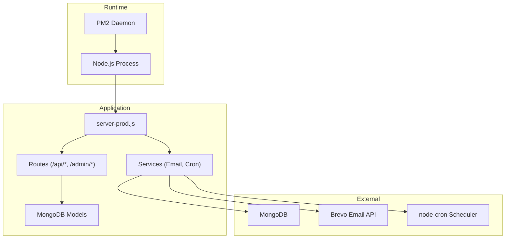
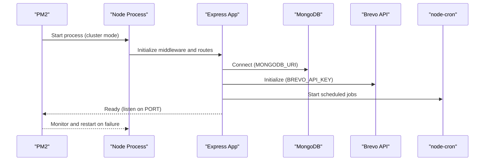
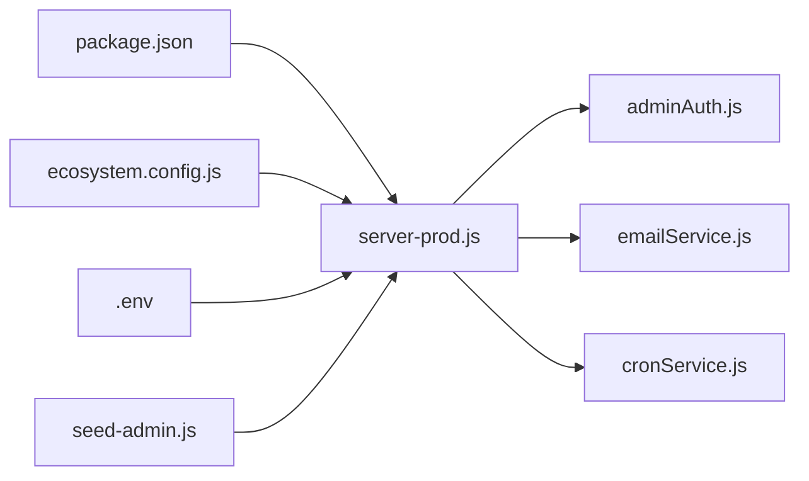

# Deployment & Operations

<cite>
**Referenced Files in This Document**
- [ecosystem.config.js](file://ecosystem.config.js)
- [package.json](file://package.json)
- [.env](file://.env)
- [server-prod.js](file://server-prod.js)
- [server.js](file://server.js)
- [seed-admin.js](file://seed-admin.js)
- [clean.js](file://clean.js)
- [server/services/cronService.js](file://server/services/cronService.js)
- [server/services/emailService.js](file://server/services/emailService.js)
- [server/middleware/adminAuth.js](file://server/middleware/adminAuth.js)
- [server/models/Admin.js](file://server/models/Admin.js)
- [server/routes/adminRoutes.js](file://server/routes/adminRoutes.js)
- [implementation_plan.md.resolved](file://implementation_plan.md.resolved)
</cite>

## Table of Contents
1. [Introduction](#introduction)
2. [Project Structure](#project-structure)
3. [Core Components](#core-components)
4. [Architecture Overview](#architecture-overview)
5. [Detailed Component Analysis](#detailed-component-analysis)
6. [Dependency Analysis](#dependency-analysis)
7. [Performance Considerations](#performance-considerations)
8. [Troubleshooting Guide](#troubleshooting-guide)
9. [Conclusion](#conclusion)
10. [Appendices](#appendices)

## Introduction
This document provides comprehensive deployment and operations guidance for the Emerald Pearland Events booking system. It covers production deployment using PM2 cluster mode, environment setup across development, staging, and production, health monitoring, maintenance procedures, deployment workflows (Git-based and manual), scaling and load balancing considerations, performance optimization, backup and disaster recovery, and operational troubleshooting. The goal is to enable reliable, repeatable deployments and smooth day-to-day operations.

## Project Structure
The system consists of:
- A Node.js/Express backend with production-ready startup and middleware pipeline
- PM2 ecosystem configuration for cluster mode and environment-specific overrides
- Environment variables managed via a .env file
- Admin dashboard and routes under /api/admin/ with JWT-based protection
- Automated email and cron-driven follow-ups
- Operational scripts for admin seeding and static asset cleanup

**Diagram sources**
- [server-prod.js](file://server-prod.js#L1-L422)
- [ecosystem.config.js](file://ecosystem.config.js#L1-L16)
- [server/services/emailService.js](file://server/services/emailService.js#L1-L467)
- [server/services/cronService.js](file://server/services/cronService.js#L1-L185)

**Section sources**
- [server-prod.js](file://server-prod.js#L1-L422)
- [ecosystem.config.js](file://ecosystem.config.js#L1-L16)

## Core Components
- PM2 Ecosystem Configuration: Defines cluster mode, environment overrides, and process lifecycle hooks.
- Production Server Entrypoint: Initializes security middleware, static serving, routes, analytics, and health checks.
- Environment Variables: Centralized configuration for ports, secrets, database URIs, and third-party integrations.
- Admin Authentication: JWT-based session management with httpOnly cookies and CSRF-safe flags.
- Email Service: Brevo SDK-backed transactional emails with scheduled follow-ups.
- Cron Jobs: Automated tasks for follow-ups, reminders, and staff notifications.
- Maintenance Scripts: Admin seeding and static asset cleanup.

**Section sources**
- [ecosystem.config.js](file://ecosystem.config.js#L1-L16)
- [server-prod.js](file://server-prod.js#L1-L422)
- [.env](file://.env#L1-L51)
- [server/middleware/adminAuth.js](file://server/middleware/adminAuth.js#L1-L56)
- [server/services/emailService.js](file://server/services/emailService.js#L1-L467)
- [server/services/cronService.js](file://server/services/cronService.js#L1-L185)
- [seed-admin.js](file://seed-admin.js#L1-L133)
- [clean.js](file://clean.js#L1-L21)

## Architecture Overview
The production runtime uses PM2 in cluster mode to utilize multiple CPU cores. The server initializes:
- Security headers (Helmet)
- Compression (gzip/brotli)
- Rate limiting and sanitization
- CORS and static file serving
- MongoDB connection and graceful shutdown
- Email initialization and cron job scheduling
- Health check endpoint and analytics capture

**Diagram sources**
- [ecosystem.config.js](file://ecosystem.config.js#L1-L16)
- [server-prod.js](file://server-prod.js#L107-L127)
- [server/services/emailService.js](file://server/services/emailService.js#L9-L27)
- [server/services/cronService.js](file://server/services/cronService.js#L21-L164)

## Detailed Component Analysis

### PM2 Cluster Mode and Process Management
- Application name, script path, and cluster mode are defined.
- Environment overrides:
  - Development: NODE_ENV set to development
  - Production: NODE_ENV set to production and PORT set to 3000
- Auto-restart and process supervision are handled by PM2.

Operational notes:
- Use PM2’s reload/stop/start commands to manage rolling updates.
- Monitor logs via PM2 logs and integrate with external log aggregation if needed.

**Section sources**
- [ecosystem.config.js](file://ecosystem.config.js#L1-L16)
- [package.json](file://package.json#L6-L11)

### Environment Setup and Secrets
- Ports and environment:
  - PORT and NODE_ENV are defined in .env and overridden in PM2 production environment.
- Database:
  - MONGODB_URI must be configured for MongoDB connectivity.
- Email:
  - BREVO_API_KEY enables transactional emails; EMAIL_USER/EMAIL_PASSWORD are used as fallbacks.
- Security:
  - JWT_SECRET is used for admin JWT signing.
- Frontend integration:
  - REACT_APP_API_URL points to the production frontend domain.

Best practices:
- Store secrets outside the repository (use CI/CD variable substitution).
- Rotate JWT_SECRET and API keys periodically.
- Validate environment variables at startup (already enforced in server-prod.js).

**Section sources**
- [.env](file://.env#L6-L51)
- [server-prod.js](file://server-prod.js#L107-L127)
- [server/services/emailService.js](file://server/services/emailService.js#L11-L26)

### Health Monitoring and Uptime Checks
- Health endpoint: GET /api/health returns environment, MongoDB status, timestamp, and uptime.
- Production logging: Morgan combined format is enabled in non-test environments.
- Error handling: Global middleware returns sanitized responses in production.

Monitoring recommendations:
- Expose /api/health to load balancer health probes.
- Integrate with uptime monitoring (e.g., UptimeRobot, Pingdom) to track response time and 5xx rates.
- Correlate logs with application metrics (CPU, memory, DB latency).

**Section sources**
- [server-prod.js](file://server-prod.js#L241-L254)
- [server-prod.js](file://server-prod.js#L34-L36)
- [server-prod.js](file://server-prod.js#L348-L362)

### Admin Authentication and Authorization
- JWT-based session via httpOnly cookie with secure and sameSite flags.
- Admin login validates credentials, generates a signed token, and sets the cookie.
- Protected routes enforce JWT verification.

Operational guidance:
- Ensure HTTPS termination at the edge (load balancer or CDN) to allow secure cookies.
- Rotate JWT_SECRET across environments.
- Implement logout by clearing the cookie.

**Section sources**
- [server/middleware/adminAuth.js](file://server/middleware/adminAuth.js#L3-L31)
- [server/middleware/adminAuth.js](file://server/middleware/adminAuth.js#L33-L45)
- [server/routes/adminRoutes.js](file://server/routes/adminRoutes.js#L59-L143)

### Email Service and Automated Notifications
- Brevo SDK is initialized using BREVO_API_KEY.
- Scheduled emails include:
  - Follow-up ~5 minutes after booking
  - 48 hours before event
  - Staff 48-hour pre-event alerts
- Email templates are generated with branding and dynamic content.

Operational guidance:
- Provision and monitor email deliverability.
- Use separate sender identities for business and client communications.
- Track delivery failures and retry logic if needed.

**Section sources**
- [server/services/emailService.js](file://server/services/emailService.js#L9-L27)
- [server/services/cronService.js](file://server/services/cronService.js#L21-L164)

### Cron Jobs and Maintenance Automation
- Cron jobs run on schedules:
  - Follow-up emails hourly
  - Event reminders every 30 minutes
  - Staff alerts every 30 minutes
- Jobs are initialized at startup and stopped gracefully on SIGINT.

Maintenance tips:
- Review logs for cron execution and failures.
- Adjust schedules based on traffic patterns.
- Ensure timezone alignment for recurring tasks.

**Section sources**
- [server/services/cronService.js](file://server/services/cronService.js#L21-L164)
- [server-prod.js](file://server-prod.js#L404-L410)

### Analytics Tracking
- POST /api/analytics/event captures eventType, user agent, IP, and optional bookingId.
- Analytics are persisted to MongoDB and logged; failures do not break the request.

Operational guidance:
- Define allowed event types and validate upstream.
- Aggregate analytics for dashboards and reporting.

**Section sources**
- [server-prod.js](file://server-prod.js#L271-L307)

### Static Assets and Admin Pages
- Static files cached for 1 day; admin pages served under /admin/* with protected routes.
- Inline JavaScript cleanup script removes unsafe attributes from admin HTML.

Operational guidance:
- Keep admin pages in sync with backend routes.
- Validate CSP directives to allow admin assets.

**Section sources**
- [server-prod.js](file://server-prod.js#L133-L230)
- [clean.js](file://clean.js#L1-L21)

### Database Models and Admin Seeding
- Admin model enforces password hashing via pre-save hook and supports role-based access.
- Seed script creates or updates admin credentials and prints account details.

Operational guidance:
- Run seed-admin.js after deploying schema changes.
- Change default passwords post-deployment.

**Section sources**
- [server/models/Admin.js](file://server/models/Admin.js#L52-L67)
- [seed-admin.js](file://seed-admin.js#L12-L61)

## Dependency Analysis
- Runtime dependencies include Express, Helmet, compression, rate limiting, MongoDB/Mongoose, Morgan, node-cron, and email providers.
- Development dependencies include nodemon and replacement utilities.
- PM2 orchestrates process lifecycle and environment overrides.

**Diagram sources**
- [package.json](file://package.json#L25-L50)
- [ecosystem.config.js](file://ecosystem.config.js#L1-L16)
- [.env](file://.env#L1-L51)
- [server-prod.js](file://server-prod.js#L1-L422)
- [server/middleware/adminAuth.js](file://server/middleware/adminAuth.js#L1-L56)
- [server/services/emailService.js](file://server/services/emailService.js#L1-L467)
- [server/services/cronService.js](file://server/services/cronService.js#L1-L185)
- [seed-admin.js](file://seed-admin.js#L1-L133)

**Section sources**
- [package.json](file://package.json#L25-L50)
- [ecosystem.config.js](file://ecosystem.config.js#L1-L16)
- [.env](file://.env#L1-L51)

## Performance Considerations
- Enable compression and cache static assets.
- Use cluster mode to leverage multiple CPU cores.
- Apply strict rate limits to protect APIs and reduce load.
- Optimize database queries and indexes for analytics and admin routes.
- Monitor MongoDB connection pool and query performance.
- Use CDN for static assets and minimize payload sizes.

[No sources needed since this section provides general guidance]

## Troubleshooting Guide
Common issues and resolutions:
- MongoDB connection failures:
  - Verify MONGODB_URI and network access.
  - Confirm server exits on connection failure in production.
- Email delivery problems:
  - Ensure BREVO_API_KEY is set and credentials are valid.
  - Check cron job logs for failures.
- Admin login issues:
  - Confirm JWT_SECRET matches across environments.
  - Check cookie flags (secure, sameSite) behind HTTPS.
- Health check failing:
  - Inspect MongoDB readiness and application logs.
- Static admin pages not loading:
  - Validate CSP and static file serving paths.
- Port conflicts:
  - Ensure PORT is free or override via environment.

**Section sources**
- [server-prod.js](file://server-prod.js#L107-L127)
- [server/services/emailService.js](file://server/services/emailService.js#L11-L26)
- [server/middleware/adminAuth.js](file://server/middleware/adminAuth.js#L16-L31)
- [server-prod.js](file://server-prod.js#L241-L254)
- [server-prod.js](file://server-prod.js#L133-L230)

## Conclusion
The Emerald Pearland Events system is production-ready with PM2 cluster mode, robust middleware, automated email workflows, and admin protections. By following the deployment and operations guidance herein—environment management, health monitoring, maintenance automation, and performance tuning—you can achieve reliable, scalable, and secure operations.

[No sources needed since this section summarizes without analyzing specific files]

## Appendices

### Deployment Workflows

#### Git-based Deployment (Recommended)
- Commit and push changes to the target branch (e.g., main).
- CI/CD pipeline:
  - Install dependencies (npm ci)
  - Build frontend assets (if applicable)
  - Upload artifacts to target host
  - Restart PM2 using ecosystem config
- Post-deploy verification:
  - Health check endpoint
  - Admin login test
  - Email delivery test

[No sources needed since this section provides general guidance]

#### Manual Deployment
- Prepare environment:
  - Copy .env to production host
  - Ensure MongoDB is reachable
- Install and run:
  - npm ci
  - pm2 start ecosystem.config.js --only emerald-pearland-events
- Monitor:
  - pm2 logs emerald-pearland-events
  - Health endpoint and application logs

**Section sources**
- [ecosystem.config.js](file://ecosystem.config.js#L1-L16)
- [package.json](file://package.json#L6-L11)

### Scaling and Load Balancing
- Horizontal scaling:
  - Use PM2 cluster mode (instances: max) to utilize all CPU cores.
- Vertical scaling:
  - Increase RAM/CPU resources as needed.
- Load balancing:
  - Place a reverse proxy/load balancer (e.g., Nginx, cloud LB) in front of PM2 clusters.
  - Configure sticky sessions if required; otherwise rely on stateless design.
- Health checks:
  - Use /api/health for readiness/liveness probes.

**Section sources**
- [ecosystem.config.js](file://ecosystem.config.js#L5-L6)
- [server-prod.js](file://server-prod.js#L241-L254)

### Backup and Disaster Recovery
- Database backups:
  - Use MongoDB native tools or cloud provider snapshots/backups.
- Configuration backups:
  - Version-control .env and ecosystem configs.
- Recovery steps:
  - Restore DB, redeploy code, restore environment variables, restart PM2.
- DR testing:
  - Periodically validate restore procedures.

[No sources needed since this section provides general guidance]

### Maintenance Procedures
- Admin seeding:
  - seed-admin.js creates or updates admin credentials.
- Static cleanup:
  - clean.js removes inline JS and normalizes IDs in admin HTML.
- Database cleanup:
  - Use MongoDB shell or Compass to remove stale collections or documents as needed.
- System optimization:
  - Review slow queries, adjust indexes, and tune rate limits.

**Section sources**
- [seed-admin.js](file://seed-admin.js#L12-L61)
- [clean.js](file://clean.js#L1-L21)

### Log Management and Auditing
- Logs:
  - PM2 logs for process-level logs.
  - Morgan combined logs for HTTP access logs.
  - Application logs for errors and analytics.
- Auditing:
  - Track admin actions via admin routes and notifications.
  - Monitor analytics events for suspicious activity.

**Section sources**
- [server-prod.js](file://server-prod.js#L34-L36)
- [server-prod.js](file://server-prod.js#L348-L362)
- [server/routes/adminRoutes.js](file://server/routes/adminRoutes.js#L562-L631)

### Implementation Plan Alignment
- The admin dashboard and routes are documented in the implementation plan, including models, middleware, and frontend assets. Use this plan as a reference for feature additions and operational changes.

**Section sources**
- [implementation_plan.md.resolved](file://implementation_plan.md.resolved#L1-L166)