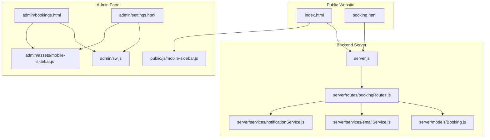
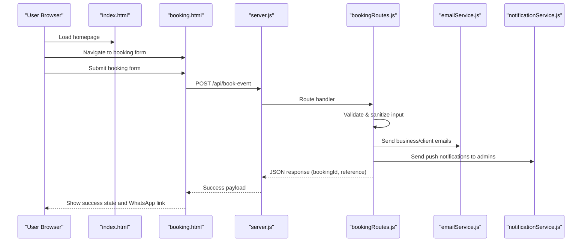
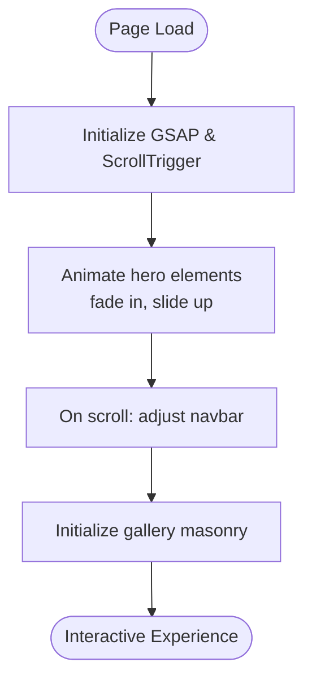
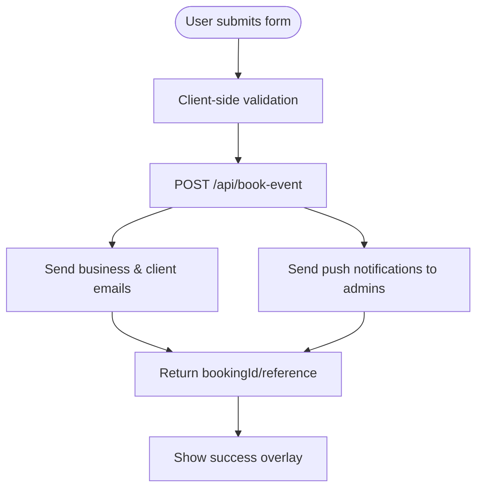
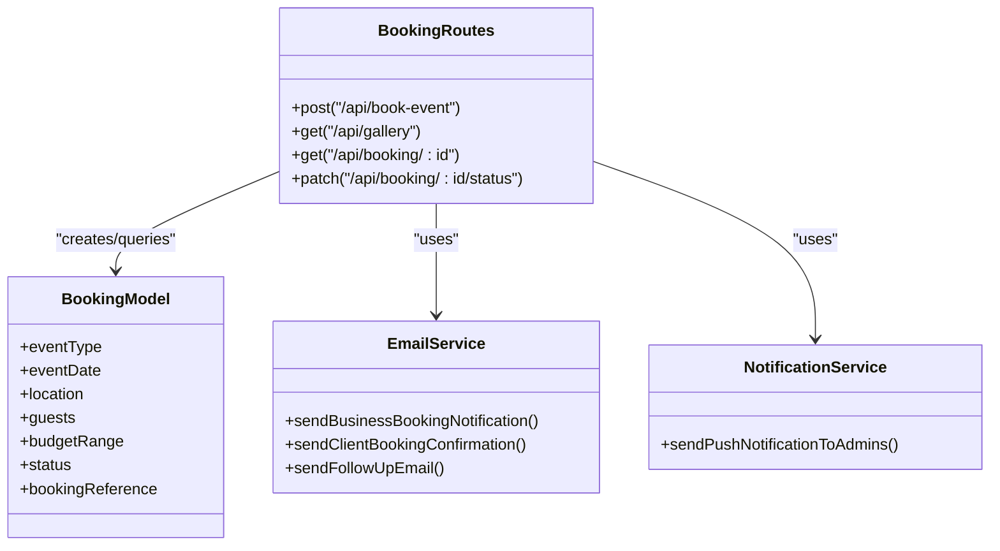
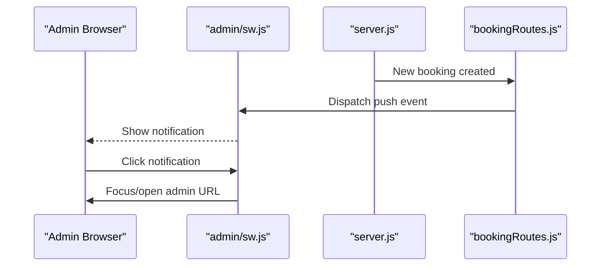
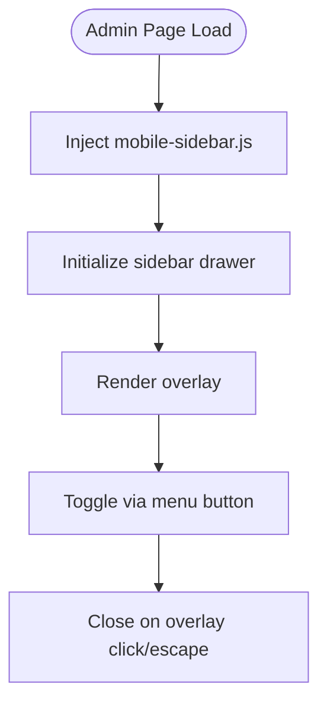
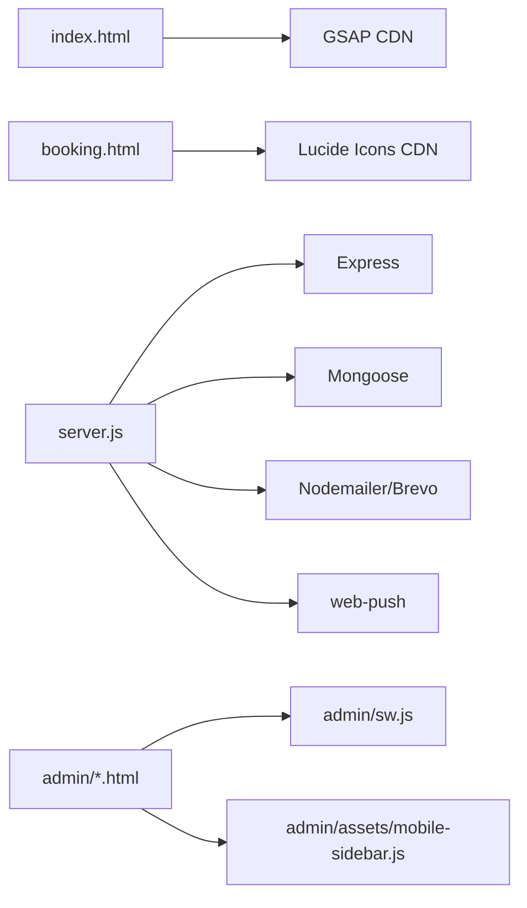

# Frontend Application

<cite>
**Referenced Files in This Document**
- [index.html](file://index.html)
- [booking.html](file://booking.html)
- [package.json](file://package.json)
- [server.js](file://server.js)
- [server-prod.js](file://server-prod.js)
- [server/routes/bookingRoutes.js](file://server/routes/bookingRoutes.js)
- [server/models/Booking.js](file://server/models/Booking.js)
- [server/services/emailService.js](file://server/services/emailService.js)
- [server/services/notificationService.js](file://server/services/notificationService.js)
- [admin/sw.js](file://admin/sw.js)
- [public/js/mobile-sidebar.js](file://public/js/mobile-sidebar.js)
- [admin/assets/mobile-sidebar.js](file://admin/assets/mobile-sidebar.js)
- [inject_mobile_css.js](file://inject_mobile_css.js)
- [inject_mobile_js.js](file://inject_mobile_js.js)
- [admin/settings.html](file://admin/settings.html)
- [admin/bookings.html](file://admin/bookings.html)
</cite>

## Table of Contents
1. [Introduction](#introduction)
2. [Project Structure](#project-structure)
3. [Core Components](#core-components)
4. [Architecture Overview](#architecture-overview)
5. [Detailed Component Analysis](#detailed-component-analysis)
6. [Dependency Analysis](#dependency-analysis)
7. [Performance Considerations](#performance-considerations)
8. [Troubleshooting Guide](#troubleshooting-guide)
9. [Conclusion](#conclusion)
10. [Appendices](#appendices)

## Introduction
This document describes the Emerald Pearland Events frontend application with a focus on the responsive website architecture, luxury event theme, interactive booking form, and mobile-first design. It explains the frontend structure (landing page, booking submission interface, and gallery showcase), mobile optimization (touch-friendly UI, progressive web app capabilities, adaptive layouts), interactive elements (form validation, real-time availability checks, visual feedback), backend integration (seamless booking workflows and dynamic content), mobile sidebar navigation and gestures, performance optimization techniques, branding and styling, and guidelines for maintaining responsiveness across devices.

## Project Structure
The application comprises:
- Public frontend pages: a main landing page and a dedicated booking page
- A Node.js/Express backend with routing for bookings and admin pages
- Admin UI with a mobile-responsive sidebar and integrated push notifications
- Progressive Web App support for admin notifications
- Utility scripts to inject mobile CSS and JavaScript into admin pages

**Diagram sources**
- [index.html](file://index.html#L1-L120)
- [booking.html](file://booking.html#L1-L120)
- [server.js](file://server.js#L105-L113)
- [server/routes/bookingRoutes.js](file://server/routes/bookingRoutes.js#L1-L30)
- [server/models/Booking.js](file://server/models/Booking.js#L1-L40)
- [server/services/emailService.js](file://server/services/emailService.js#L1-L40)
- [server/services/notificationService.js](file://server/services/notificationService.js#L1-L40)
- [admin/sw.js](file://admin/sw.js#L1-L30)
- [admin/bookings.html](file://admin/bookings.html#L1-L60)
- [admin/settings.html](file://admin/settings.html#L1-L60)
- [public/js/mobile-sidebar.js](file://public/js/mobile-sidebar.js#L1-L45)
- [admin/assets/mobile-sidebar.js](file://admin/assets/mobile-sidebar.js#L1-L40)

**Section sources**
- [index.html](file://index.html#L1-L120)
- [booking.html](file://booking.html#L1-L120)
- [server.js](file://server.js#L105-L113)
- [admin/sw.js](file://admin/sw.js#L1-L30)
- [public/js/mobile-sidebar.js](file://public/js/mobile-sidebar.js#L1-L45)
- [admin/assets/mobile-sidebar.js](file://admin/assets/mobile-sidebar.js#L1-L40)

## Core Components
- Landing page with cinematic hero, animated logo, luxury color palette, and gallery showcase
- Interactive booking form with glassmorphism styling, animated transitions, and validation feedback
- Backend booking API with rate limiting, input sanitization, email notifications, and push notifications
- Admin panel with a mobile-responsive sidebar, push notification service worker, and dynamic content endpoints
- Utility scripts to inject mobile CSS and JS into admin pages

**Section sources**
- [index.html](file://index.html#L240-L800)
- [booking.html](file://booking.html#L350-L800)
- [server/routes/bookingRoutes.js](file://server/routes/bookingRoutes.js#L120-L285)
- [server/services/emailService.js](file://server/services/emailService.js#L124-L200)
- [server/services/notificationService.js](file://server/services/notificationService.js#L16-L75)
- [admin/sw.js](file://admin/sw.js#L1-L51)
- [inject_mobile_css.js](file://inject_mobile_css.js#L1-L117)
- [inject_mobile_js.js](file://inject_mobile_js.js#L1-L17)

## Architecture Overview
The frontend communicates with the backend via REST endpoints. The booking flow integrates with email and push notification services. The admin panel is served from the same origin as the API to simplify static asset delivery and enable push notifications.

**Diagram sources**
- [booking.html](file://booking.html#L350-L800)
- [server.js](file://server.js#L105-L113)
- [server/routes/bookingRoutes.js](file://server/routes/bookingRoutes.js#L120-L285)
- [server/services/emailService.js](file://server/services/emailService.js#L124-L200)
- [server/services/notificationService.js](file://server/services/notificationService.js#L16-L75)

## Detailed Component Analysis

### Landing Page (index.html)
- Implements a luxury theme with a cinematic hero featuring a 3D animated logo and dark-to-emerald gradient overlays
- Uses GSAP for animations and Lucide icons for UI elements
- Includes a responsive gallery masonry layout with film-grain overlays and hover effects
- Mobile-first design with viewport meta and clamp-based typography

**Diagram sources**
- [index.html](file://index.html#L42-L46)
- [index.html](file://index.html#L240-L520)
- [index.html](file://index.html#L689-L790)

**Section sources**
- [index.html](file://index.html#L42-L46)
- [index.html](file://index.html#L240-L520)
- [index.html](file://index.html#L689-L790)

### Booking Submission Interface (booking.html)
- Features a cinematic background with animated light beams and particles
- Glassmorphism booking card with animated form groups and shimmering budget selector
- Real-time input feedback with error animations and loading states
- Success overlay with fade-in animation and dynamic content

**Diagram sources**
- [booking.html](file://booking.html#L350-L800)
- [server/routes/bookingRoutes.js](file://server/routes/bookingRoutes.js#L120-L285)
- [server/services/emailService.js](file://server/services/emailService.js#L124-L200)
- [server/services/notificationService.js](file://server/services/notificationService.js#L16-L75)

**Section sources**
- [booking.html](file://booking.html#L170-L220)
- [booking.html](file://booking.html#L350-L800)
- [server/routes/bookingRoutes.js](file://server/routes/bookingRoutes.js#L120-L285)

### Backend Booking API
- Validates and sanitizes booking data, enforces rate limits, and persists records
- Creates customer and booking documents, generates booking reference
- Sends business and client emails, schedules follow-up emails
- Triggers push notifications to subscribed admins and returns a WhatsApp deep-link

**Diagram sources**
- [server/routes/bookingRoutes.js](file://server/routes/bookingRoutes.js#L1-L356)
- [server/models/Booking.js](file://server/models/Booking.js#L1-L169)
- [server/services/emailService.js](file://server/services/emailService.js#L1-L200)
- [server/services/notificationService.js](file://server/services/notificationService.js#L1-L78)

**Section sources**
- [server/routes/bookingRoutes.js](file://server/routes/bookingRoutes.js#L120-L285)
- [server/models/Booking.js](file://server/models/Booking.js#L141-L148)
- [server/services/emailService.js](file://server/services/emailService.js#L124-L200)
- [server/services/notificationService.js](file://server/services/notificationService.js#L16-L75)

### Admin Panel and Push Notifications
- Admin pages are served from the same origin as the API for simplified static asset delivery
- A service worker handles push notifications, opens admin URLs, and plays sounds
- Mobile sidebar scripts provide drawer navigation with overlay and keyboard support

**Diagram sources**
- [admin/sw.js](file://admin/sw.js#L1-L51)
- [server.js](file://server.js#L82-L98)
- [server/routes/bookingRoutes.js](file://server/routes/bookingRoutes.js#L216-L222)

**Section sources**
- [admin/sw.js](file://admin/sw.js#L1-L51)
- [server.js](file://server.js#L75-L98)
- [admin/assets/mobile-sidebar.js](file://admin/assets/mobile-sidebar.js#L1-L107)
- [public/js/mobile-sidebar.js](file://public/js/mobile-sidebar.js#L1-L45)

### Mobile Optimization and Adaptive Layouts
- Mobile sidebar drawer with overlay, escape key, and click-outside-to-close
- Utility scripts inject mobile CSS and JS into admin pages to ensure responsive behavior
- Responsive breakpoints and grid adjustments for forms, stats, and tables

**Diagram sources**
- [inject_mobile_js.js](file://inject_mobile_js.js#L1-L17)
- [inject_mobile_css.js](file://inject_mobile_css.js#L1-L117)
- [admin/assets/mobile-sidebar.js](file://admin/assets/mobile-sidebar.js#L1-L107)
- [public/js/mobile-sidebar.js](file://public/js/mobile-sidebar.js#L1-L45)

**Section sources**
- [inject_mobile_js.js](file://inject_mobile_js.js#L1-L17)
- [inject_mobile_css.js](file://inject_mobile_css.js#L1-L117)
- [admin/assets/mobile-sidebar.js](file://admin/assets/mobile-sidebar.js#L1-L107)
- [public/js/mobile-sidebar.js](file://public/js/mobile-sidebar.js#L1-L45)

## Dependency Analysis
- Frontend depends on external libraries for animations and icons
- Backend depends on Express, Mongoose, email SDK, and web-push for notifications
- Admin panel shares the same origin as the API to enable push notifications and static asset serving

**Diagram sources**
- [index.html](file://index.html#L42-L49)
- [booking.html](file://booking.html#L35-L46)
- [server.js](file://server.js#L6-L13)
- [package.json](file://package.json#L25-L46)
- [admin/sw.js](file://admin/sw.js#L1-L30)
- [admin/assets/mobile-sidebar.js](file://admin/assets/mobile-sidebar.js#L1-L40)

**Section sources**
- [package.json](file://package.json#L25-L46)
- [server.js](file://server.js#L6-L13)
- [index.html](file://index.html#L42-L49)
- [booking.html](file://booking.html#L35-L46)

## Performance Considerations
- Use of GSAP for hardware-accelerated animations and ScrollTrigger for smooth scrolling
- CSS clamp() for fluid typography and responsive scaling
- Backdrop filters and gradients for visual depth without heavy assets
- Lazy loading and optimized gallery masonry layout
- Compression middleware enabled in production server
- CDN-hosted fonts and icons reduce render-blocking resources

[No sources needed since this section provides general guidance]

## Troubleshooting Guide
- If push notifications do not appear, verify VAPID keys are configured and service worker is registered
- If booking submissions fail, check rate limiter thresholds and backend logs
- If admin pages do not load static assets, ensure the admin static route serves files from the correct directory
- If mobile sidebar does not work, confirm the injection scripts ran and the sidebar initialization executes after DOM load

**Section sources**
- [server.js](file://server.js#L48-L80)
- [server/routes/bookingRoutes.js](file://server/routes/bookingRoutes.js#L18-L24)
- [admin/sw.js](file://admin/sw.js#L5-L27)
- [inject_mobile_js.js](file://inject_mobile_js.js#L1-L17)
- [inject_mobile_css.js](file://inject_mobile_css.js#L90-L117)

## Conclusion
The Emerald Pearland Events frontend combines a luxury aesthetic with robust mobile-first design and seamless backend integration. The landing page and booking interface deliver an immersive experience, while the admin panel ensures efficient operations with push notifications and responsive navigation. The architecture supports scalability, maintainability, and a consistent brand identity across devices.

[No sources needed since this section summarizes without analyzing specific files]

## Appendices

### Branding and Color Scheme
- Color palette: emerald greens, pearl tones, gold accents, and midnight backgrounds
- Typography: Cormorant Garamond for headings, Montserrat for body text
- Visual themes: cinematic overlays, film-grain effects, and glassmorphism cards

**Section sources**
- [index.html](file://index.html#L107-L119)
- [booking.html](file://booking.html#L104-L112)

### Progressive Web App (Admin Notifications)
- Service worker listens for push events and opens admin URLs
- Supports badges, vibration patterns, and cross-tab communication

**Section sources**
- [admin/sw.js](file://admin/sw.js#L1-L51)

### Mobile Sidebar Navigation
- Drawer-style sidebar with overlay and keyboard support
- Scripts injected into admin pages to ensure consistent behavior

**Section sources**
- [admin/assets/mobile-sidebar.js](file://admin/assets/mobile-sidebar.js#L1-L107)
- [public/js/mobile-sidebar.js](file://public/js/mobile-sidebar.js#L1-L45)
- [inject_mobile_js.js](file://inject_mobile_js.js#L1-L17)