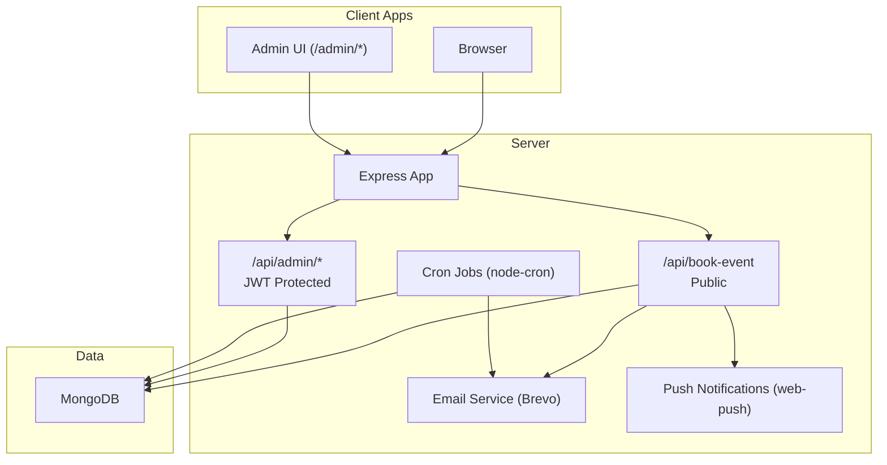
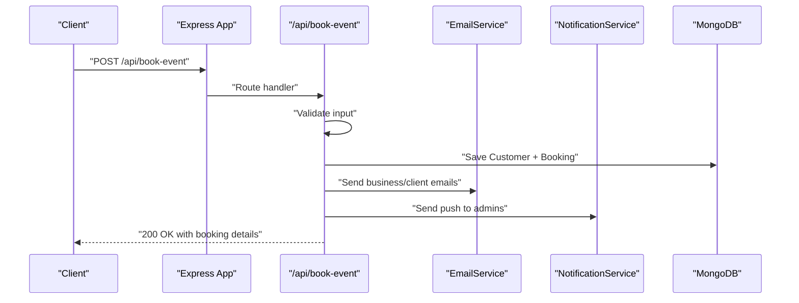
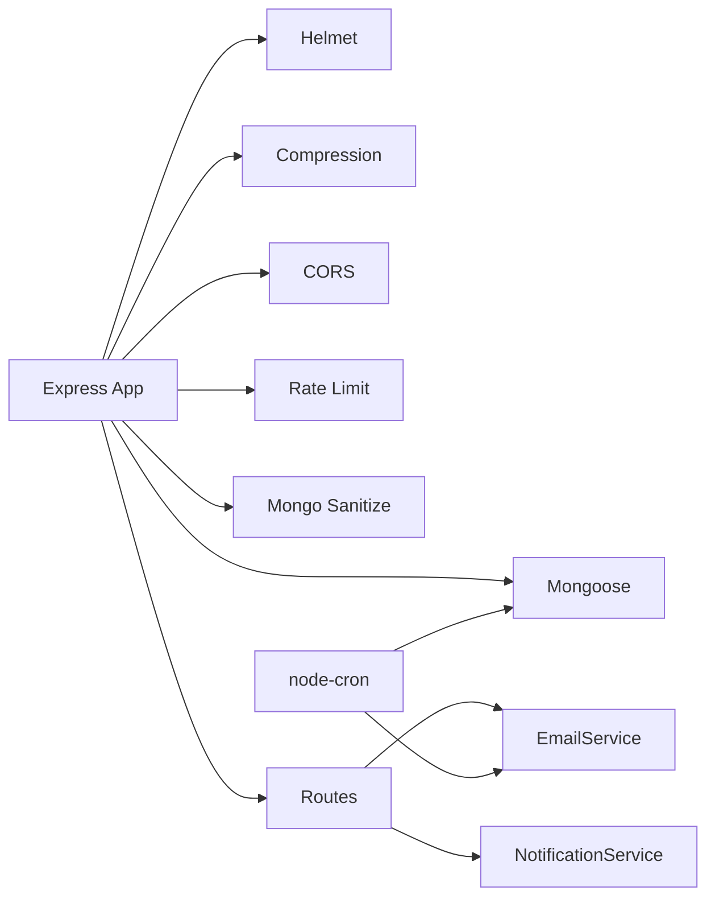

# Getting Started

<cite>
**Referenced Files in This Document**
- [package.json](file://package.json)
- [.env](file://.env)
- [server-prod.js](file://server-prod.js)
- [server.js](file://server.js)
- [ecosystem.config.js](file://ecosystem.config.js)
- [server/services/emailService.js](file://server/services/emailService.js)
- [server/services/notificationService.js](file://server/services/notificationService.js)
- [server/services/cronService.js](file://server/services/cronService.js)
- [server/routes/bookingRoutes.js](file://server/routes/bookingRoutes.js)
- [server/routes/adminRoutes.js](file://server/routes/adminRoutes.js)
- [server/middleware/adminAuth.js](file://server/middleware/adminAuth.js)
- [seed-admin.js](file://seed-admin.js)
- [implementation_plan.md.resolved](file://implementation_plan.md.resolved)
</cite>

## Table of Contents
1. [Introduction](#introduction)
2. [Project Structure](#project-structure)
3. [Core Components](#core-components)
4. [Architecture Overview](#architecture-overview)
5. [Detailed Component Analysis](#detailed-component-analysis)
6. [Dependency Analysis](#dependency-analysis)
7. [Performance Considerations](#performance-considerations)
8. [Troubleshooting Guide](#troubleshooting-guide)
9. [Conclusion](#conclusion)
10. [Appendices](#appendices)

## Introduction
This guide helps you set up the Emerald Pearland Events booking system from scratch. It covers prerequisites, installation, environment configuration, first-time admin setup, and verification steps to ensure everything works. You will learn how development and production modes differ, how to configure email and push notifications, and how to troubleshoot common deployment issues.

## Project Structure
The system is a Node.js/Express application backed by MongoDB. It exposes:
- Public API endpoints for booking and gallery retrieval
- Admin API endpoints (JWT-protected) for managing bookings, clients, staff, analytics, notifications, gallery, testimonials, and settings
- An embedded admin frontend served from the same origin as the API

**Diagram sources**
- [server-prod.js](file://server-prod.js#L232-L307)
- [server/routes/bookingRoutes.js](file://server/routes/bookingRoutes.js#L121-L285)
- [server/routes/adminRoutes.js](file://server/routes/adminRoutes.js#L59-L143)
- [server/services/emailService.js](file://server/services/emailService.js#L9-L27)
- [server/services/notificationService.js](file://server/services/notificationService.js#L1-L14)
- [server/services/cronService.js](file://server/services/cronService.js#L21-L164)

**Section sources**
- [server-prod.js](file://server-prod.js#L130-L231)
- [server/routes/bookingRoutes.js](file://server/routes/bookingRoutes.js#L107-L121)
- [server/routes/adminRoutes.js](file://server/routes/adminRoutes.js#L1-L20)

## Core Components
- Server entrypoints:
  - Development/legacy: server.js
  - Production: server-prod.js
- Environment configuration via .env
- Email delivery via Brevo SDK
- Push notifications via Web Push (VAPID)
- Automated follow-ups and reminders via cron jobs
- Admin authentication via JWT cookies

Key capabilities:
- Public booking submission with validation and email confirmation
- Admin dashboard with analytics, notifications, staff, gallery, testimonials, and settings
- Health check endpoint for monitoring
- Gallery retrieval for public consumption

**Section sources**
- [package.json](file://package.json#L6-L12)
- [server.js](file://server.js#L538-L541)
- [server-prod.js](file://server-prod.js#L241-L254)
- [server/routes/bookingRoutes.js](file://server/routes/bookingRoutes.js#L121-L285)
- [server/routes/adminRoutes.js](file://server/routes/adminRoutes.js#L59-L143)

## Architecture Overview
The system separates concerns across middleware, routes, services, and models. The production server initializes security middleware, static admin pages, API routes, email service, cron jobs, and connects to MongoDB. Admin endpoints rely on JWT cookies for authentication.

**Diagram sources**
- [server/routes/bookingRoutes.js](file://server/routes/bookingRoutes.js#L121-L285)
- [server/services/emailService.js](file://server/services/emailService.js#L127-L156)
- [server/services/notificationService.js](file://server/services/notificationService.js#L16-L75)
- [server-prod.js](file://server-prod.js#L368-L419)

**Section sources**
- [server-prod.js](file://server-prod.js#L232-L307)
- [server/routes/bookingRoutes.js](file://server/routes/bookingRoutes.js#L121-L285)

## Detailed Component Analysis

### Prerequisites
- Node.js >= 14.0.0
- npm >= 6.0.0
- MongoDB (local or remote like MongoDB Atlas)

Verify your environment:
- node --version
- npm --version
- mongod running or Atlas cluster reachable

**Section sources**
- [package.json](file://package.json#L51-L54)

### Installation and Setup
1) Install dependencies
- Run: npm install

2) Configure environment variables
- Copy .env.example to .env and fill in values for:
  - PORT, NODE_ENV, JWT_SECRET
  - MONGODB_URI
  - BREVO_API_KEY (for email)
  - EMAIL_USER, EMAIL_PASSWORD, ADMIN_EMAIL (for SMTP fallback)
  - TWILIO_ACCOUNT_SID, TWILIO_AUTH_TOKEN, TWILIO_WHATSAPP_NUMBER, BUSINESS_WHATSAPP_NUMBER
  - REACT_APP_API_URL, REACT_APP_WHATSAPP_NUMBER
  - VAPID_PUBLIC_KEY, VAPID_PRIVATE_KEY (for push notifications)

3) Seed admin user
- Run: node seed-admin.js
- This creates or resets the admin account with a known password for first-time access.

4) Initial database setup
- Start the server; it connects to MONGODB_URI and initializes collections on first write.
- Use the admin UI to manage bookings, clients, staff, and settings.

5) Start modes
- Development: npm run dev (uses server-prod.js with nodemon)
- Production: npm start (uses server-prod.js)

6) Process manager (PM2)
- ecosystem.config.js defines cluster mode and environment-specific settings.

**Section sources**
- [.env](file://.env#L1-L51)
- [seed-admin.js](file://seed-admin.js#L12-L63)
- [package.json](file://package.json#L6-L12)
- [ecosystem.config.js](file://ecosystem.config.js#L1-L16)

### Environment Variables
Essential variables and their roles:
- PORT: Server port (default 3000)
- NODE_ENV: development or production
- JWT_SECRET: Secret for signing admin JWT cookies
- MONGODB_URI: MongoDB connection string
- BREVO_API_KEY: Email provider API key (required for Brevo)
- EMAIL_USER, EMAIL_PASSWORD, ADMIN_EMAIL: SMTP fallback and admin email
- TWILIO_ACCOUNT_SID, TWILIO_AUTH_TOKEN, TWILIO_WHATSAPP_NUMBER, BUSINESS_WHATSAPP_NUMBER: WhatsApp/SMS credentials
- REACT_APP_API_URL, REACT_APP_WHATSAPP_NUMBER: Frontend configuration
- VAPID_PUBLIC_KEY, VAPID_PRIVATE_KEY: Web Push VAPID keys

Notes:
- If BREVO_API_KEY is missing, email service logs a warning and continues.
- If VAPID keys are missing, push notifications are disabled.

**Section sources**
- [.env](file://.env#L6-L51)
- [server/services/emailService.js](file://server/services/emailService.js#L9-L27)
- [server/services/notificationService.js](file://server/services/notificationService.js#L5-L14)

### Development vs Production Modes
- Development:
  - Uses server-prod.js with nodemon for auto-reload
  - Logs combined HTTP requests in production-like mode
  - Rate limits and security headers still apply
- Production:
  - Uses server-prod.js with compression, helmet, and strict rate limits
  - PM2 cluster mode with environment-specific config

**Section sources**
- [package.json](file://package.json#L6-L12)
- [server-prod.js](file://server-prod.js#L34-L101)
- [ecosystem.config.js](file://ecosystem.config.js#L1-L16)

### First-Time Admin Setup
Steps:
1) Seed admin account:
- node seed-admin.js
- Use the seeded credentials to log in via /admin/login

2) Configure email:
- Set BREVO_API_KEY for official Brevo delivery
- Optionally set EMAIL_USER/PASSWORD for SMTP fallback

3) Configure push notifications:
- Generate VAPID keys and set VAPID_PUBLIC_KEY/VAPID_PRIVATE_KEY
- Admins subscribe via /api/admin/push-subscribe

4) Verify admin endpoints:
- /api/admin/login (JWT cookie)
- /api/admin/me
- /api/admin/dashboard pages served under /admin/*

**Section sources**
- [seed-admin.js](file://seed-admin.js#L12-L63)
- [server/services/emailService.js](file://server/services/emailService.js#L9-L27)
- [server/services/notificationService.js](file://server/services/notificationService.js#L1-L14)
- [server/routes/adminRoutes.js](file://server/routes/adminRoutes.js#L22-L57)

### Verification Checklist
- Health check:
  - GET /api/health returns success and MongoDB status
- Basic booking:
  - POST /api/book-event with valid payload returns success and a WhatsApp link
- Admin login:
  - POST /api/admin/login sets adminToken cookie
  - GET /api/admin/me returns admin profile
- Emails:
  - Business notification and client confirmation emails are sent
- Push notifications:
  - Admins can subscribe and receive push alerts
- Gallery:
  - GET /api/gallery returns public items

**Section sources**
- [server.js](file://server.js#L539-L541)
- [server-prod.js](file://server-prod.js#L242-L254)
- [server/routes/bookingRoutes.js](file://server/routes/bookingRoutes.js#L121-L285)
- [server/routes/adminRoutes.js](file://server/routes/adminRoutes.js#L59-L143)
- [server/services/emailService.js](file://server/services/emailService.js#L127-L156)
- [server/services/notificationService.js](file://server/services/notificationService.js#L16-L75)

### API Endpoints Overview
- Public
  - POST /api/book-event: Submit booking, validate, create records, send emails, and push notifications
  - GET /api/gallery: Public gallery items
- Admin (JWT cookie required)
  - POST /api/admin/login: Authenticate and set adminToken cookie
  - GET /api/admin/me: Current admin profile
  - GET /api/admin/bookings, PATCH /api/admin/bookings/:id, DELETE /api/admin/bookings/:id
  - GET /api/admin/analytics/overview
  - GET/POST /api/admin/notifications
  - GET/POST /api/admin/staff
  - GET /api/admin/gallery
  - GET /api/admin/testimonials
  - GET/POST /api/admin/settings
  - POST /api/admin/push-subscribe (store push subscription)
  - GET /api/admin/vapid-public-key (retrieve VAPID public key)

**Section sources**
- [server/routes/bookingRoutes.js](file://server/routes/bookingRoutes.js#L107-L121)
- [server/routes/bookingRoutes.js](file://server/routes/bookingRoutes.js#L121-L285)
- [server/routes/adminRoutes.js](file://server/routes/adminRoutes.js#L59-L143)
- [server/routes/adminRoutes.js](file://server/routes/adminRoutes.js#L174-L217)
- [server/routes/adminRoutes.js](file://server/routes/adminRoutes.js#L448-L560)
- [server/routes/adminRoutes.js](file://server/routes/adminRoutes.js#L633-L712)
- [server/routes/adminRoutes.js](file://server/routes/adminRoutes.js#L714-L751)
- [server/routes/adminRoutes.js](file://server/routes/adminRoutes.js#L753-L800)

### Security and Authentication
- JWT-based admin authentication:
  - Cookies named adminToken
  - verifyAdminJWT middleware protects admin routes
  - generateAdminToken signs with JWT_SECRET
- Helmet and compression enabled in production
- Rate limiting for bookings and admin auth
- Mongo sanitization and body parsing

**Section sources**
- [server/middleware/adminAuth.js](file://server/middleware/adminAuth.js#L3-L31)
- [server/routes/adminRoutes.js](file://server/routes/adminRoutes.js#L59-L143)
- [server-prod.js](file://server-prod.js#L34-L101)

### Email and Push Notifications
- Brevo email service:
  - Initializes via BREVO_API_KEY
  - Sends business notifications, client confirmations, follow-ups, reminders, and staff alerts
- Web Push (VAPID):
  - Requires VAPID_PUBLIC_KEY/VAPID_PRIVATE_KEY
  - Admins subscribe via /api/admin/push-subscribe
  - Immediate push alerts on new bookings

**Section sources**
- [server/services/emailService.js](file://server/services/emailService.js#L9-L27)
- [server/services/emailService.js](file://server/services/emailService.js#L127-L156)
- [server/services/notificationService.js](file://server/services/notificationService.js#L1-L14)
- [server/routes/adminRoutes.js](file://server/routes/adminRoutes.js#L30-L57)

### Automated Tasks (Cron)
- Follow-up emails 24 hours after booking
- Event reminders 48 hours before event
- 48-hour staff alerts for supervisors and team members
- Jobs run on schedules and update booking records accordingly

**Section sources**
- [server/services/cronService.js](file://server/services/cronService.js#L21-L164)

## Dependency Analysis
High-level dependencies:
- Express, helmet, compression, cors, rate-limit, morgan, cookie-parser, mongoSanitize
- Mongoose for MongoDB
- Brevo SDK for email
- Twilio for WhatsApp/SMS
- Web-push for push notifications
- Node-cron for scheduled tasks

**Diagram sources**
- [server-prod.js](file://server-prod.js#L34-L101)
- [server/routes/bookingRoutes.js](file://server/routes/bookingRoutes.js#L1-L13)
- [server/services/emailService.js](file://server/services/emailService.js#L1-L10)
- [server/services/notificationService.js](file://server/services/notificationService.js#L1-L3)
- [server/services/cronService.js](file://server/services/cronService.js#L1-L5)

**Section sources**
- [package.json](file://package.json#L25-L46)

## Performance Considerations
- Enable production mode for compression and security headers
- Use PM2 cluster mode for multi-core scaling
- Monitor MongoDB connection and tune indexes for analytics queries
- Keep email and push notification payloads concise
- Consider queueing for high-volume email bursts

## Troubleshooting Guide
Common issues and fixes:
- MongoDB connection failure
  - Ensure MONGODB_URI is correct and reachable
  - Confirm server logs show “MongoDB connected successfully”
- Missing BREVO_API_KEY
  - Set BREVO_API_KEY or configure EMAIL_USER/PASSWORD for SMTP fallback
- Twilio credentials not set
  - WhatsApp messages will be skipped; configure TWILIO_ACCOUNT_SID/TWILIO_AUTH_TOKEN to enable
- VAPID keys missing
  - Push notifications disabled; generate and set VAPID_PUBLIC_KEY/VAPID_PRIVATE_KEY
- Admin login fails
  - Verify JWT_SECRET matches across environments
  - Clear browser cookies and retry
- Port already in use
  - Change PORT in .env or kill the process using the port
- Health check fails
  - Check MongoDB connectivity and MONGODB_URI
- CORS errors
  - Confirm frontend origin is allowed in CORS configuration

**Section sources**
- [server-prod.js](file://server-prod.js#L107-L127)
- [server/services/emailService.js](file://server/services/emailService.js#L9-L27)
- [server/services/notificationService.js](file://server/services/notificationService.js#L5-L14)
- [server/middleware/adminAuth.js](file://server/middleware/adminAuth.js#L16-L31)

## Conclusion
You now have a complete blueprint to deploy and operate the Emerald Pearland Events booking system. By installing dependencies, configuring environment variables, seeding the admin account, and verifying endpoints, you can confidently launch the system in development or production. Use the admin dashboard to manage bookings, clients, staff, and content, while leveraging Brevo for email and web-push for real-time notifications.

## Appendices

### A. Environment Variable Reference
- PORT: Server port
- NODE_ENV: development or production
- JWT_SECRET: Secret for admin JWT
- MONGODB_URI: MongoDB connection string
- BREVO_API_KEY: Email provider API key
- EMAIL_USER, EMAIL_PASSWORD, ADMIN_EMAIL: SMTP fallback and admin email
- TWILIO_ACCOUNT_SID, TWILIO_AUTH_TOKEN, TWILIO_WHATSAPP_NUMBER, BUSINESS_WHATSAPP_NUMBER: WhatsApp/SMS
- REACT_APP_API_URL, REACT_APP_WHATSAPP_NUMBER: Frontend configuration
- VAPID_PUBLIC_KEY, VAPID_PRIVATE_KEY: Web Push VAPID keys

**Section sources**
- [.env](file://.env#L6-L51)

### B. Admin Dashboard Preview (from plan)
- Pages: login, dashboard, bookings, clients, calendar, analytics, notifications, gallery, testimonials, staff, settings
- Features: JWT-protected, admin-only, luxury design system

**Section sources**
- [implementation_plan.md.resolved](file://implementation_plan.md.resolved#L95-L124)