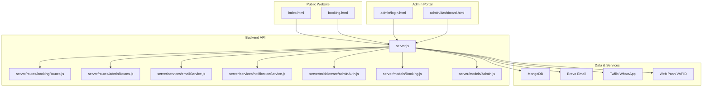
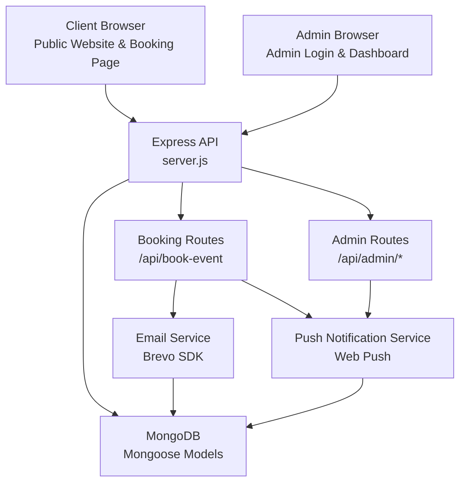
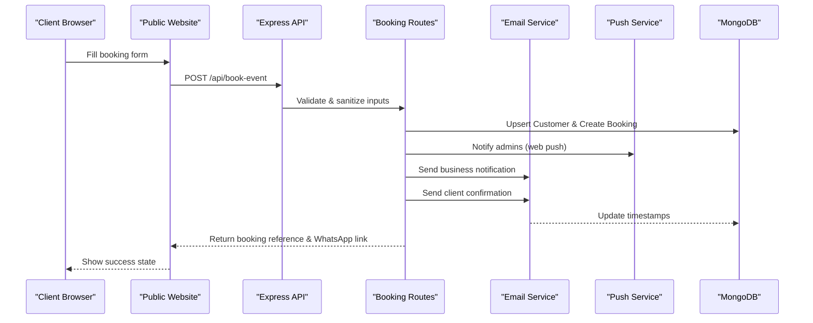
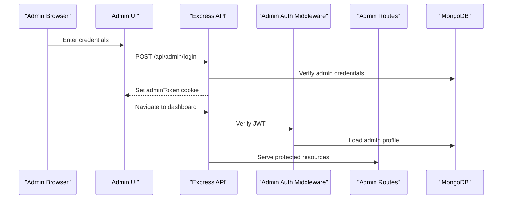
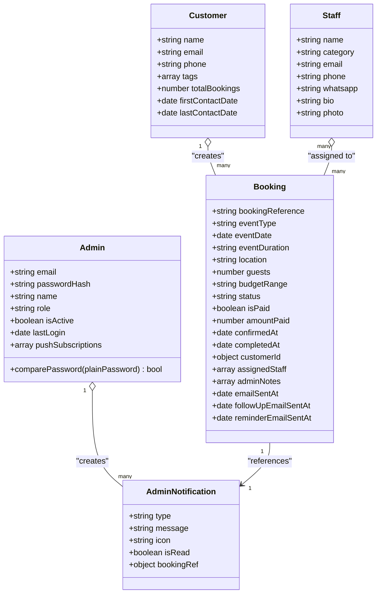
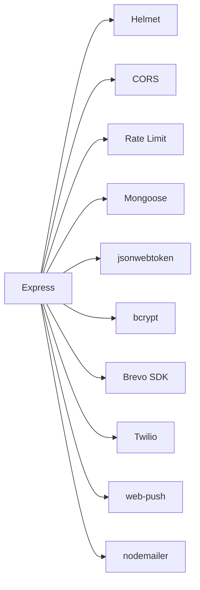

# Project Overview

<cite>
**Referenced Files in This Document**
- [package.json](file://package.json)
- [server.js](file://server.js)
- [index.html](file://index.html)
- [booking.html](file://booking.html)
- [.env](file://.env)
- [server/models/Booking.js](file://server/models/Booking.js)
- [server/routes/bookingRoutes.js](file://server/routes/bookingRoutes.js)
- [server/services/emailService.js](file://server/services/emailService.js)
- [server/middleware/adminAuth.js](file://server/middleware/adminAuth.js)
- [server/routes/adminRoutes.js](file://server/routes/adminRoutes.js)
- [server/models/Admin.js](file://server/models/Admin.js)
- [server/services/notificationService.js](file://server/services/notificationService.js)
- [admin/dashboard.html](file://admin/dashboard.html)
- [admin/login.html](file://admin/login.html)
</cite>

## Table of Contents
1. [Introduction](#introduction)
2. [Project Structure](#project-structure)
3. [Core Components](#core-components)
4. [Architecture Overview](#architecture-overview)
5. [Detailed Component Analysis](#detailed-component-analysis)
6. [Dependency Analysis](#dependency-analysis)
7. [Performance Considerations](#performance-considerations)
8. [Troubleshooting Guide](#troubleshooting-guide)
9. [Conclusion](#conclusion)

## Introduction
Emerald Pearland Events is a premium luxury event booking platform designed to streamline the coordination of high-end events in Nairobi, Kenya. The system targets discerning clients who demand exceptional service and attention to detail for weddings, corporate events, and special occasions. Its core value proposition centers on seamless automation, real-time communication, and a unified admin workflow that transforms complex event logistics into a smooth, transparent experience for both clients and staff.

The platform integrates a modern frontend website for client discovery and booking, a responsive admin portal for operations management, and a robust backend API powered by Node.js/Express and MongoDB. It leverages Brevo for professional transactional email delivery and Twilio WhatsApp for instant client engagement, while supporting web push notifications for real-time admin alerts.

## Project Structure
The repository is organized into clear layers:
- Frontend: Static HTML/CSS/JS for the public website and booking page
- Admin Portal: Static HTML/CSS/JS for administrative tasks and dashboards
- Backend: Node.js/Express server with modular routing, models, services, and middleware
- Configuration: Environment variables and deployment scripts

**Diagram sources**
- [server.js](file://server.js#L1-L611)
- [server/routes/bookingRoutes.js](file://server/routes/bookingRoutes.js#L1-L356)
- [server/routes/adminRoutes.js](file://server/routes/adminRoutes.js#L1-L1160)
- [server/services/emailService.js](file://server/services/emailService.js#L1-L467)
- [server/services/notificationService.js](file://server/services/notificationService.js#L1-L78)
- [server/middleware/adminAuth.js](file://server/middleware/adminAuth.js#L1-L56)
- [server/models/Booking.js](file://server/models/Booking.js#L1-L169)
- [server/models/Admin.js](file://server/models/Admin.js#L1-L70)
- [index.html](file://index.html#L1-L800)
- [booking.html](file://booking.html#L1-L800)
- [admin/login.html](file://admin/login.html#L1-L831)
- [admin/dashboard.html](file://admin/dashboard.html#L1-L800)

**Section sources**
- [package.json](file://package.json#L1-L56)
- [server.js](file://server.js#L1-L611)
- [index.html](file://index.html#L1-L800)
- [booking.html](file://booking.html#L1-L800)
- [admin/login.html](file://admin/login.html#L1-L831)
- [admin/dashboard.html](file://admin/dashboard.html#L1-L800)

## Core Components
- Node.js/Express backend: Central API orchestrating booking workflows, admin operations, analytics, and integrations
- MongoDB database: Persistent storage for bookings, customers, admins, staff, and gallery/testimonials
- Brevo email service: Transactional email delivery for client confirmations, business notifications, and follow-ups
- Twilio WhatsApp integration: Instant client communication via WhatsApp links and optional programmatic messages
- Modern frontend: Cinematic, mobile-first website and booking page with rich UX and responsive design
- Admin portal: Secure dashboard with push notifications, analytics, staff management, and operational controls

Key capabilities:
- Automated booking pipeline with validation, persistence, and multi-channel notifications
- Admin authentication and JWT-based sessions with protected routes
- Real-time admin alerts via web push notifications
- Public gallery and testimonials for social proof
- Comprehensive analytics and reporting for business insights

**Section sources**
- [server.js](file://server.js#L1-L611)
- [server/routes/bookingRoutes.js](file://server/routes/bookingRoutes.js#L1-L356)
- [server/routes/adminRoutes.js](file://server/routes/adminRoutes.js#L1-L1160)
- [server/services/emailService.js](file://server/services/emailService.js#L1-L467)
- [server/services/notificationService.js](file://server/services/notificationService.js#L1-L78)
- [server/middleware/adminAuth.js](file://server/middleware/adminAuth.js#L1-L56)
- [server/models/Booking.js](file://server/models/Booking.js#L1-L169)
- [server/models/Admin.js](file://server/models/Admin.js#L1-L70)
- [index.html](file://index.html#L1-L800)
- [booking.html](file://booking.html#L1-L800)
- [admin/login.html](file://admin/login.html#L1-L831)
- [admin/dashboard.html](file://admin/dashboard.html#L1-L800)

## Architecture Overview
The system follows a layered architecture:
- Presentation Layer: Public website and admin portal
- API Layer: Express routes for booking, admin, and analytics
- Service Layer: Email and push notification services
- Persistence Layer: Mongoose models backed by MongoDB
- Integration Layer: Brevo and Twilio third-party services

**Diagram sources**
- [server.js](file://server.js#L1-L611)
- [server/routes/bookingRoutes.js](file://server/routes/bookingRoutes.js#L1-L356)
- [server/routes/adminRoutes.js](file://server/routes/adminRoutes.js#L1-L1160)
- [server/services/emailService.js](file://server/services/emailService.js#L1-L467)
- [server/services/notificationService.js](file://server/services/notificationService.js#L1-L78)

## Detailed Component Analysis

### Booking Workflow
The booking process is fully automated and client-centric:
1. Client fills out the booking form on the public website
2. Frontend validates inputs and submits to the backend
3. Backend validates and sanitizes data, creates or updates customer records
4. Booking record is persisted with status tracking
5. Admin receives push notifications and email alerts
6. Client receives immediate confirmation and follow-up emails
7. Optional WhatsApp link is generated for quick client communication

**Diagram sources**
- [server/routes/bookingRoutes.js](file://server/routes/bookingRoutes.js#L121-L285)
- [server/services/emailService.js](file://server/services/emailService.js#L127-L219)
- [server/services/notificationService.js](file://server/services/notificationService.js#L16-L75)
- [server.js](file://server.js#L227-L256)

**Section sources**
- [server/routes/bookingRoutes.js](file://server/routes/bookingRoutes.js#L1-L356)
- [server/services/emailService.js](file://server/services/emailService.js#L1-L467)
- [server/services/notificationService.js](file://server/services/notificationService.js#L1-L78)
- [booking.html](file://booking.html#L1-L800)

### Admin Portal and Authentication
The admin portal provides a secure, role-aware interface:
- JWT-based authentication with httpOnly cookies
- Protected routes for bookings, analytics, staff, and settings
- Push notification subscriptions for real-time alerts
- Comprehensive CRUD operations for bookings, staff, and content

**Diagram sources**
- [server/routes/adminRoutes.js](file://server/routes/adminRoutes.js#L59-L143)
- [server/middleware/adminAuth.js](file://server/middleware/adminAuth.js#L3-L31)
- [server/models/Admin.js](file://server/models/Admin.js#L1-L70)
- [admin/login.html](file://admin/login.html#L722-L800)
- [admin/dashboard.html](file://admin/dashboard.html#L1-L800)

**Section sources**
- [server/routes/adminRoutes.js](file://server/routes/adminRoutes.js#L1-L1160)
- [server/middleware/adminAuth.js](file://server/middleware/adminAuth.js#L1-L56)
- [server/models/Admin.js](file://server/models/Admin.js#L1-L70)
- [admin/login.html](file://admin/login.html#L1-L831)
- [admin/dashboard.html](file://admin/dashboard.html#L1-L800)

### Data Models and Relationships
The system uses Mongoose models to define domain entities and their relationships.

**Diagram sources**
- [server/models/Admin.js](file://server/models/Admin.js#L1-L70)
- [server/models/Booking.js](file://server/models/Booking.js#L1-L169)
- [server/routes/adminRoutes.js](file://server/routes/adminRoutes.js#L633-L712)

**Section sources**
- [server/models/Admin.js](file://server/models/Admin.js#L1-L70)
- [server/models/Booking.js](file://server/models/Booking.js#L1-L169)
- [server/routes/adminRoutes.js](file://server/routes/adminRoutes.js#L633-L712)

### Technology Stack
- Backend: Node.js with Express, Mongoose for MongoDB ODM
- Security: Helmet, CORS, rate limiting, bcrypt, JWT
- Emails: Brevo SDK for transactional emails
- Messaging: Twilio WhatsApp integration
- Notifications: Web Push (VAPID) for admin alerts
- DevOps: PM2 ecosystem config, environment variables

**Section sources**
- [package.json](file://package.json#L25-L46)
- [server.js](file://server.js#L1-L611)
- [.env](file://.env#L1-L51)

## Dependency Analysis
The backend depends on a cohesive set of libraries and services:
- Express ecosystem for routing and middleware
- Mongoose for schema modeling and database operations
- Third-party integrations for communications and notifications
- Environment-driven configuration for production readiness

**Diagram sources**
- [package.json](file://package.json#L25-L46)
- [server.js](file://server.js#L1-L611)

**Section sources**
- [package.json](file://package.json#L1-L56)
- [server.js](file://server.js#L1-L611)

## Performance Considerations
- Input sanitization and validation reduce risk and improve reliability
- Rate limiting protects APIs from abuse
- Database indexing on frequently queried fields (customer, date, status) improves query performance
- Asynchronous email and push notifications prevent blocking the main request thread
- Environment-specific configurations enable optimized deployments

[No sources needed since this section provides general guidance]

## Troubleshooting Guide
Common issues and resolutions:
- Email delivery failures: Verify Brevo API key and sender configuration in environment variables
- WhatsApp integration: Confirm Twilio credentials and WhatsApp number configuration
- Admin authentication: Ensure JWT secret is set and cookies are accepted by the browser
- Push notifications: Validate VAPID public/private keys and device subscriptions
- Database connectivity: Confirm MongoDB URI and network accessibility

Operational checks:
- Health endpoint: GET /api/health for server status
- Environment variables: Review .env for required keys
- Logs: Inspect server logs for detailed error traces

**Section sources**
- [.env](file://.env#L1-L51)
- [server.js](file://server.js#L539-L541)
- [server/services/emailService.js](file://server/services/emailService.js#L9-L27)
- [server/services/notificationService.js](file://server/services/notificationService.js#L5-L14)

## Conclusion
Emerald Pearland Events delivers a premium, production-ready booking solution that combines elegant frontend design with powerful backend automation. By integrating Brevo, Twilio, and web push technologies, the platform ensures timely, personalized communication across the entire event lifecycle. The modular architecture, secure admin portal, and comprehensive analytics provide the foundation for scalable luxury event coordination in Nairobi and beyond.