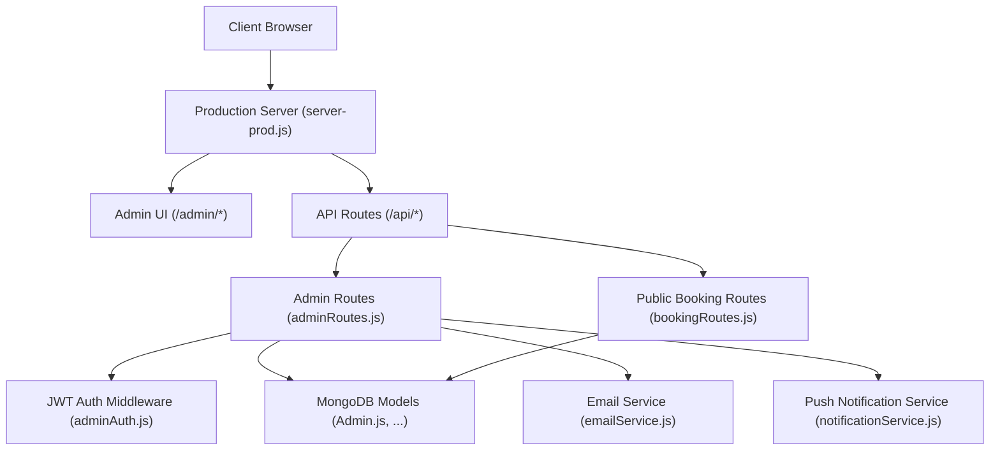
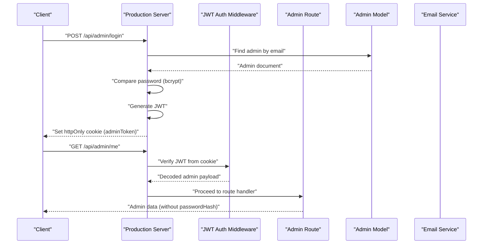
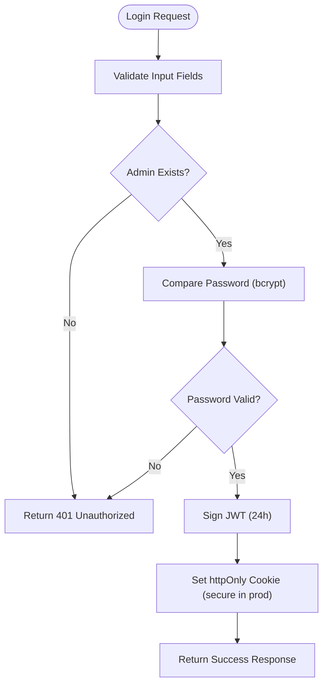
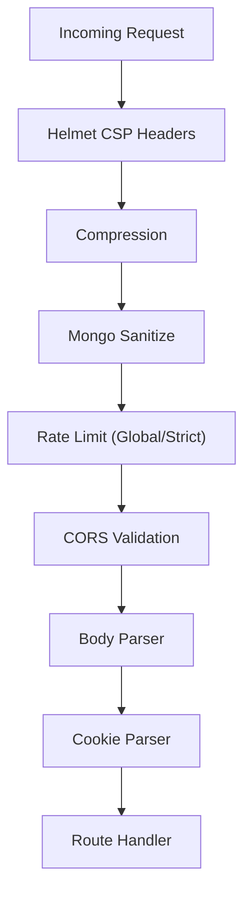
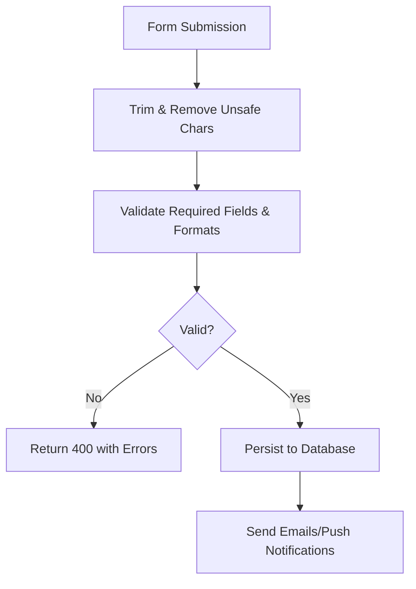
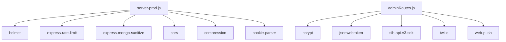

# Security Implementation

<cite>
**Referenced Files in This Document**
- [server-prod.js](file://server-prod.js)
- [server.js](file://server.js)
- [adminAuth.js](file://server/middleware/adminAuth.js)
- [Admin.js](file://server/models/Admin.js)
- [adminRoutes.js](file://server/routes/adminRoutes.js)
- [bookingRoutes.js](file://server/routes/bookingRoutes.js)
- [emailService.js](file://server/services/emailService.js)
- [notificationService.js](file://server/services/notificationService.js)
- [.env](file://.env)
- [package.json](file://package.json)
- [implementation_plan.md.resolved](file://implementation_plan.md.resolved)
</cite>

## Table of Contents
1. [Introduction](#introduction)
2. [Project Structure](#project-structure)
3. [Core Components](#core-components)
4. [Architecture Overview](#architecture-overview)
5. [Detailed Component Analysis](#detailed-component-analysis)
6. [Dependency Analysis](#dependency-analysis)
7. [Performance Considerations](#performance-considerations)
8. [Troubleshooting Guide](#troubleshooting-guide)
9. [Conclusion](#conclusion)
10. [Appendices](#appendices)

## Introduction
This document provides comprehensive security documentation for the Emerald Pearland Events system. It covers authentication and authorization mechanisms, session management, middleware stack for protection, data protection measures, input validation and sanitization, external service security configuration, mitigation strategies for common vulnerabilities, and operational best practices for development, testing, and production.

## Project Structure
The security implementation spans the production server, middleware, models, routes, and services. The production server initializes security middleware, rate limits, CORS, and static admin pages. Authentication relies on JWT stored in httpOnly cookies. Passwords are hashed with bcrypt. Input validation and sanitization protect against injection and malformed data. External integrations (email, push notifications) are configured via environment variables.

**Diagram sources**
- [server-prod.js](file://server-prod.js#L29-L101)
- [adminAuth.js](file://server/middleware/adminAuth.js#L1-L56)
- [adminRoutes.js](file://server/routes/adminRoutes.js#L1-L1160)
- [bookingRoutes.js](file://server/routes/bookingRoutes.js#L1-L356)
- [Admin.js](file://server/models/Admin.js#L1-L70)
- [emailService.js](file://server/services/emailService.js#L1-L467)
- [notificationService.js](file://server/services/notificationService.js#L1-L78)

**Section sources**
- [server-prod.js](file://server-prod.js#L29-L101)
- [implementation_plan.md.resolved](file://implementation_plan.md.resolved#L1-L166)

## Core Components
- JWT-based admin authentication with httpOnly cookies and strict SameSite policy
- Password hashing with bcrypt in the Admin model
- Helmet for security headers, express-rate-limit for abuse protection, express-mongo-sanitize for NoSQL injection prevention, and CORS configuration for cross-origin requests
- Input validation and sanitization for public endpoints and admin routes
- External service configuration for Brevo (email), Twilio (WhatsApp), and VAPID keys for web push notifications
- Session management via httpOnly cookies with secure flags in production

**Section sources**
- [adminAuth.js](file://server/middleware/adminAuth.js#L1-L56)
- [Admin.js](file://server/models/Admin.js#L1-L70)
- [server-prod.js](file://server-prod.js#L44-L101)
- [bookingRoutes.js](file://server/routes/bookingRoutes.js#L117-L285)
- [adminRoutes.js](file://server/routes/adminRoutes.js#L59-L152)
- [.env](file://.env#L1-L51)

## Architecture Overview
The security architecture centers on layered protections:
- Transport and request-level: Helmet, compression, rate limiting, CORS, body parsing, cookie parsing
- Data-level: bcrypt hashing, mongo-sanitize, input validation/sanitization
- Authentication/Authorization: JWT in httpOnly cookies, admin middleware guards
- External integrations: Brevo API keys, Twilio credentials, VAPID keys
- Observability: Morgan logging, health checks, analytics tracking

**Diagram sources**
- [server-prod.js](file://server-prod.js#L44-L101)
- [adminAuth.js](file://server/middleware/adminAuth.js#L3-L31)
- [adminRoutes.js](file://server/routes/adminRoutes.js#L59-L152)
- [Admin.js](file://server/models/Admin.js#L64-L67)
- [emailService.js](file://server/services/emailService.js#L1-L467)

## Detailed Component Analysis

### Authentication and Authorization
- JWT-based admin authentication:
  - Token generation includes admin identifier and email with 24-hour expiry
  - Token verification middleware reads httpOnly cookie and decodes JWT
  - Page-level middleware redirects unauthenticated users to login
- Session management:
  - httpOnly cookie prevents client-side JavaScript access
  - Secure flag enabled in production
  - SameSite strict for CSRF mitigation
- Password handling:
  - Pre-save hook hashes password using bcrypt with salt rounds
  - Password comparison method for login verification

**Diagram sources**
- [adminRoutes.js](file://server/routes/adminRoutes.js#L59-L152)
- [adminAuth.js](file://server/middleware/adminAuth.js#L47-L53)
- [Admin.js](file://server/models/Admin.js#L51-L67)

**Section sources**
- [adminAuth.js](file://server/middleware/adminAuth.js#L1-L56)
- [adminRoutes.js](file://server/routes/adminRoutes.js#L59-L152)
- [Admin.js](file://server/models/Admin.js#L51-L67)

### Security Middleware Stack
- Helmet:
  - Content-Security-Policy configured with self and whitelisted CDNs
  - Restricts script/style/font/media sources
- Compression:
  - Gzip/Brotli reduces payload sizes and improves transport efficiency
- express-rate-limit:
  - Global rate limiter for general traffic
  - Stricter limiter for admin login/forgot-password endpoints
- express-mongo-sanitize:
  - Sanitizes potentially malicious operators in request bodies
- CORS:
  - Whitelisted origins for localhost and production domains
  - Credentials enabled for secure cookie sharing
- Cookie parser and body parser:
  - Parses cookies and request bodies safely

**Diagram sources**
- [server-prod.js](file://server-prod.js#L44-L101)

**Section sources**
- [server-prod.js](file://server-prod.js#L44-L101)
- [package.json](file://package.json#L25-L46)

### Data Protection Measures
- Encryption at rest:
  - MongoDB stores hashed passwords; sensitive fields are not exposed in admin responses
- Secure transmission:
  - Helmet sets security headers; httpOnly cookies with secure flag in production
  - CORS restricts origins and enables credentials
- Sensitive data handling:
  - Admin responses exclude passwordHash field
  - Email and push VAPID keys are loaded from environment variables
  - Input sanitized and validated before persistence

**Section sources**
- [Admin.js](file://server/models/Admin.js#L15-L67)
- [adminRoutes.js](file://server/routes/adminRoutes.js#L154-L168)
- [server-prod.js](file://server-prod.js#L44-L101)
- [.env](file://.env#L1-L51)

### Input Validation and Sanitization
- Public booking endpoint:
  - Strict validation for required fields, dates, phone formats, and numeric constraints
  - Input sanitization trims and removes unsafe characters
- Admin routes:
  - JWT-protected endpoints enforce authentication
  - Additional validation for password changes and administrative actions
- Email and push services:
  - Email service uses official SDK with API key authentication
  - Push notifications use VAPID keys for secure web push

**Diagram sources**
- [bookingRoutes.js](file://server/routes/bookingRoutes.js#L121-L150)
- [bookingRoutes.js](file://server/routes/bookingRoutes.js#L90-L94)

**Section sources**
- [bookingRoutes.js](file://server/routes/bookingRoutes.js#L28-L88)
- [bookingRoutes.js](file://server/routes/bookingRoutes.js#L90-L94)
- [adminRoutes.js](file://server/routes/adminRoutes.js#L892-L933)

### External Services Configuration
- Brevo (email):
  - API key loaded from environment variable
  - Sender configured via environment variables
- Twilio (WhatsApp):
  - Account SID and Auth Token loaded from environment variables
  - Messages sent via WhatsApp Business API
- VAPID keys (web push):
  - Public/private keys loaded from environment variables
  - Used to authenticate push notifications

**Section sources**
- [emailService.js](file://server/services/emailService.js#L9-L27)
- [emailService.js](file://server/services/emailService.js#L32-L53)
- [notificationService.js](file://server/services/notificationService.js#L5-L14)
- [.env](file://.env#L20-L51)

### Audit Logging and Monitoring
- Analytics tracking:
  - Structured event logging with eventType, IP address, user agent, referrer
  - Indexed for efficient aggregation and reporting
- Health checks:
  - Dedicated endpoint reports server status, environment, MongoDB connectivity
- Request logging:
  - Morgan logs production HTTP requests in combined format

**Section sources**
- [server-prod.js](file://server-prod.js#L241-L254)
- [server-prod.js](file://server-prod.js#L327-L342)
- [server-prod.js](file://server-prod.js#L348-L362)
- [server/models/Analytics.js](file://server/models/Analytics.js#L1-L41)

## Dependency Analysis
Security-related dependencies include helmet, express-rate-limit, express-mongo-sanitize, cors, compression, cookie-parser, bcrypt, jsonwebtoken, and email/web-push libraries. These are declared in the project dependencies.

**Diagram sources**
- [server-prod.js](file://server-prod.js#L1-L20)
- [package.json](file://package.json#L25-L46)

**Section sources**
- [package.json](file://package.json#L25-L46)

## Performance Considerations
- Compression reduces payload sizes and improves throughput
- Rate limiting protects against abuse while allowing legitimate traffic
- Mongo sanitization prevents expensive NoSQL injection attempts
- httpOnly cookies reduce XSS attack surface
- Environment-specific configurations (production flags) ensure optimal behavior in production

## Troubleshooting Guide
- Authentication failures:
  - Verify JWT secret and cookie presence
  - Confirm httpOnly cookie is being sent with requests
- Email delivery issues:
  - Check Brevo API key and sender configuration
  - Review email service initialization logs
- Push notifications:
  - Ensure VAPID keys are present and valid
  - Check subscription cleanup logic for expired endpoints
- CORS errors:
  - Confirm origin whitelist includes frontend deployment URLs
  - Ensure credentials are enabled for authenticated requests

**Section sources**
- [adminAuth.js](file://server/middleware/adminAuth.js#L3-L31)
- [adminRoutes.js](file://server/routes/adminRoutes.js#L113-L119)
- [emailService.js](file://server/services/emailService.js#L9-L27)
- [notificationService.js](file://server/services/notificationService.js#L5-L14)
- [server-prod.js](file://server-prod.js#L60-L86)

## Conclusion
The Emerald Pearland Events system implements a robust security posture through JWT-based admin authentication, bcrypt password hashing, comprehensive middleware protections, strict input validation, and secure external service integrations. The layered approach ensures confidentiality, integrity, and availability while maintaining operability and observability across development, staging, and production environments.

## Appendices
- Security best practices:
  - Rotate JWT secrets and environment variables regularly
  - Enforce HTTPS in production and set secure flags on cookies
  - Monitor rate limit hits and adjust thresholds as needed
  - Review CSP policies periodically to align with frontend asset changes
  - Keep dependencies updated and monitor for security advisories