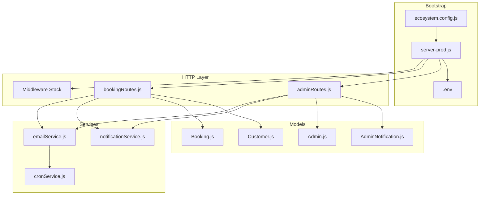
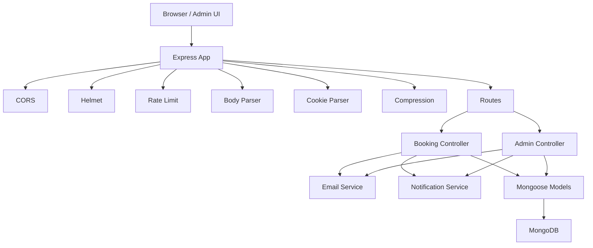
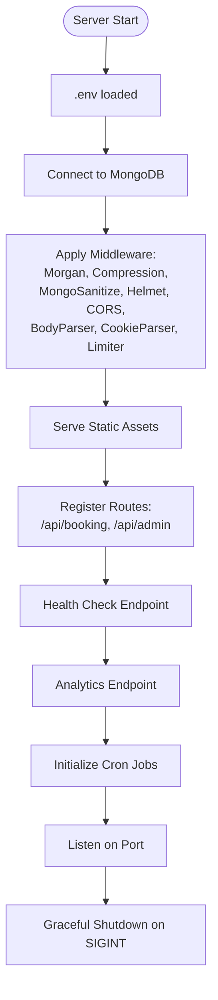
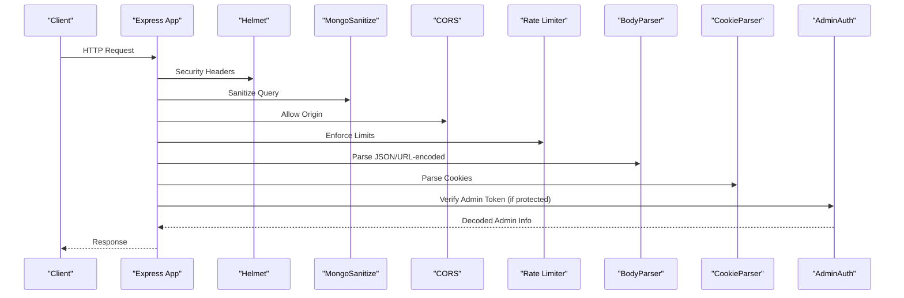
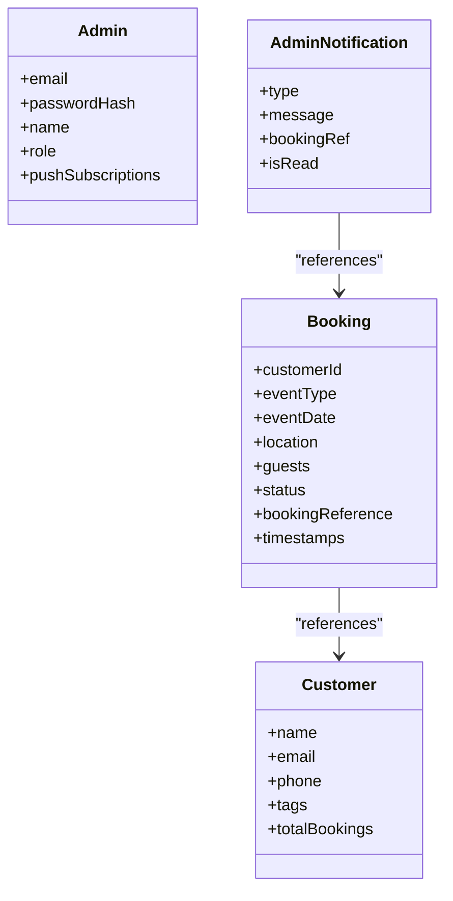
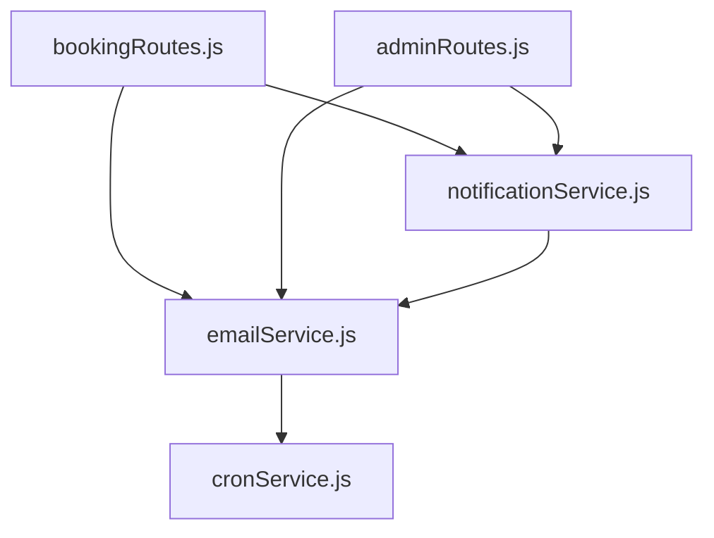
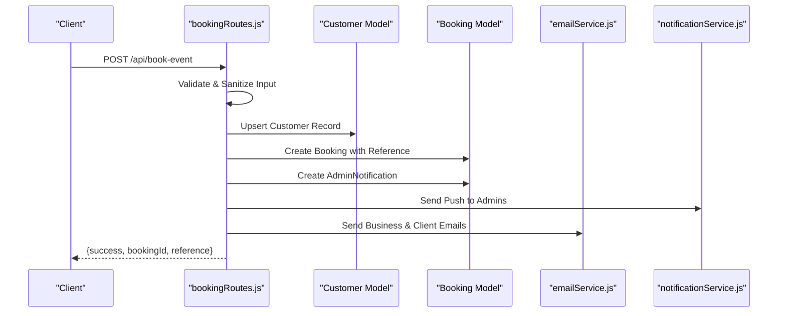
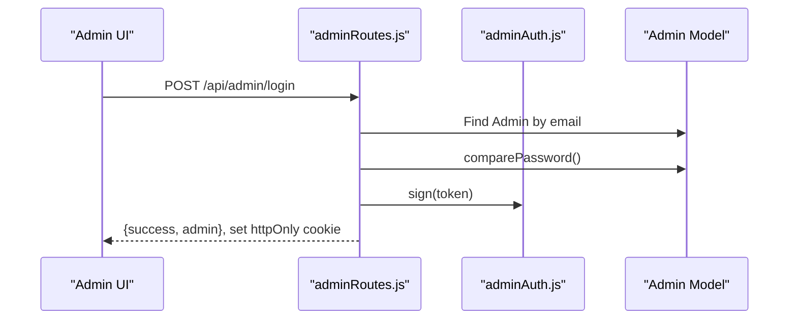
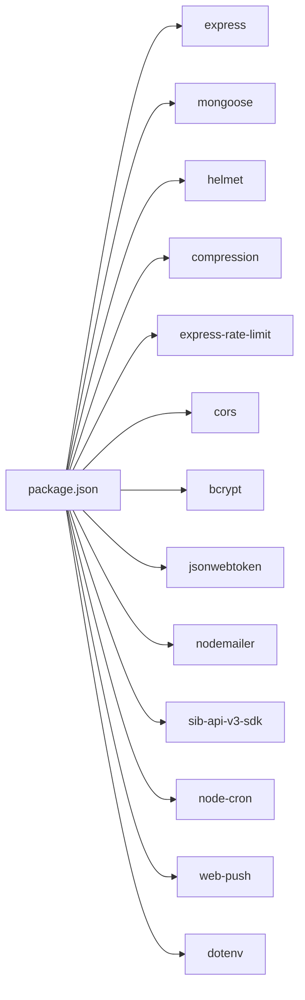
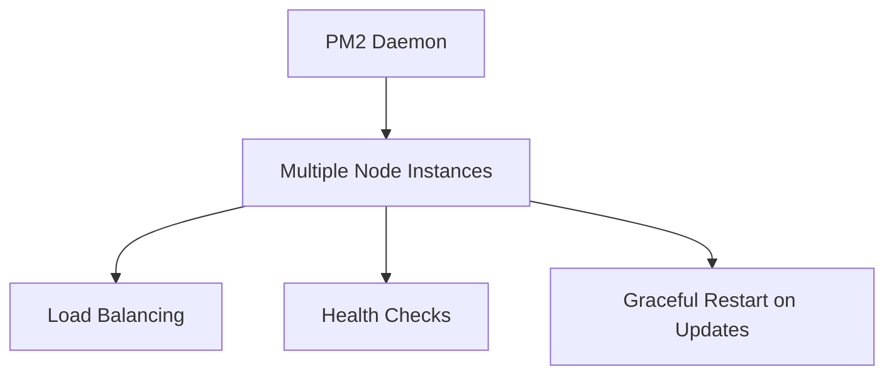

# Backend Architecture

<cite>
**Referenced Files in This Document**
- [server.js](file://server.js)
- [server-prod.js](file://server-prod.js)
- [package.json](file://package.json)
- [ecosystem.config.js](file://ecosystem.config.js)
- [.env](file://.env)
- [adminAuth.js](file://server/middleware/adminAuth.js)
- [bookingRoutes.js](file://server/routes/bookingRoutes.js)
- [adminRoutes.js](file://server/routes/adminRoutes.js)
- [emailService.js](file://server/services/emailService.js)
- [notificationService.js](file://server/services/notificationService.js)
- [cronService.js](file://server/services/cronService.js)
- [Booking.js](file://server/models/Booking.js)
- [Admin.js](file://server/models/Admin.js)
- [Customer.js](file://server/models/Customer.js)
- [AdminNotification.js](file://server/models/AdminNotification.js)
</cite>

## Table of Contents
1. [Introduction](#introduction)
2. [Project Structure](#project-structure)
3. [Core Components](#core-components)
4. [Architecture Overview](#architecture-overview)
5. [Detailed Component Analysis](#detailed-component-analysis)
6. [Dependency Analysis](#dependency-analysis)
7. [Performance Considerations](#performance-considerations)
8. [Troubleshooting Guide](#troubleshooting-guide)
9. [Conclusion](#conclusion)
10. [Appendices](#appendices)

## Introduction
This document describes the backend architecture of the Emerald system, a premium event booking platform built with Node.js and Express. It explains how the application initializes, how middleware and routing are organized, and how the layered architecture handles requests from clients to administrators. It also documents the service layer (email, notifications, and cron), the MVC-like separation of concerns, error handling and logging strategies, and production deployment using PM2 clustering.

## Project Structure
The backend is organized into clear layers:
- Application bootstrap and middleware stack: server-prod.js
- Routes: server/routes/bookingRoutes.js and server/routes/adminRoutes.js
- Middleware: server/middleware/adminAuth.js
- Services: server/services/emailService.js, server/services/notificationService.js, server/services/cronService.js
- Models (Mongoose): server/models/*.js
- Configuration: .env, ecosystem.config.js, package.json

**Diagram sources**
- [server-prod.js](file://server-prod.js#L24-L422)
- [bookingRoutes.js](file://server/routes/bookingRoutes.js#L1-L356)
- [adminRoutes.js](file://server/routes/adminRoutes.js#L1-L1160)
- [emailService.js](file://server/services/emailService.js#L1-L467)
- [notificationService.js](file://server/services/notificationService.js#L1-L78)
- [cronService.js](file://server/services/cronService.js#L1-L185)
- [Booking.js](file://server/models/Booking.js#L1-L169)
- [Admin.js](file://server/models/Admin.js#L1-L70)
- [Customer.js](file://server/models/Customer.js#L1-L93)
- [AdminNotification.js](file://server/models/AdminNotification.js#L1-L40)
- [.env](file://.env#L1-L51)
- [ecosystem.config.js](file://ecosystem.config.js#L1-L16)

**Section sources**
- [server-prod.js](file://server-prod.js#L24-L422)
- [package.json](file://package.json#L1-L56)

## Core Components
- Express application initialization and middleware stack in server-prod.js
- Route modules for public booking APIs and admin APIs
- JWT-based admin authentication middleware
- Service layer for email delivery, push notifications, and scheduled tasks
- Mongoose models for domain entities
- PM2 configuration for clustering and production deployment

**Section sources**
- [server-prod.js](file://server-prod.js#L24-L422)
- [bookingRoutes.js](file://server/routes/bookingRoutes.js#L1-L356)
- [adminRoutes.js](file://server/routes/adminRoutes.js#L1-L1160)
- [adminAuth.js](file://server/middleware/adminAuth.js#L1-L56)
- [emailService.js](file://server/services/emailService.js#L1-L467)
- [notificationService.js](file://server/services/notificationService.js#L1-L78)
- [cronService.js](file://server/services/cronService.js#L1-L185)
- [Booking.js](file://server/models/Booking.js#L1-L169)
- [Admin.js](file://server/models/Admin.js#L1-L70)
- [Customer.js](file://server/models/Customer.js#L1-L93)
- [AdminNotification.js](file://server/models/AdminNotification.js#L1-L40)
- [ecosystem.config.js](file://ecosystem.config.js#L1-L16)

## Architecture Overview
The system follows a layered architecture:
- Presentation: Static admin pages and public HTML pages served by Express
- Routing: Express routes for booking and admin operations
- Controllers: Route handlers orchestrate validation, persistence, and service calls
- Services: Email, push notifications, and cron jobs encapsulate cross-cutting concerns
- Persistence: Mongoose models define schemas and indexes
- Security: Helmet, compression, sanitization, rate limits, and JWT-based admin auth

**Diagram sources**
- [server-prod.js](file://server-prod.js#L34-L101)
- [bookingRoutes.js](file://server/routes/bookingRoutes.js#L121-L285)
- [adminRoutes.js](file://server/routes/adminRoutes.js#L59-L143)
- [emailService.js](file://server/services/emailService.js#L9-L27)
- [notificationService.js](file://server/services/notificationService.js#L16-L75)
- [Booking.js](file://server/models/Booking.js#L1-L169)
- [Admin.js](file://server/models/Admin.js#L1-L70)
- [Customer.js](file://server/models/Customer.js#L1-L93)
- [AdminNotification.js](file://server/models/AdminNotification.js#L1-L40)

## Detailed Component Analysis

### Express Application Initialization and Middleware Stack
- Initializes Express, loads environment variables, and connects to MongoDB
- Applies production-grade middleware: Morgan logging, compression, sanitization, Helmet, CORS, cookie parsing, and general rate limiting
- Serves static assets and admin SPA-like routes
- Registers API routes for booking and admin
- Provides health check and analytics endpoints
- Global error handler and graceful shutdown with cron cleanup

**Diagram sources**
- [server-prod.js](file://server-prod.js#L107-L127)
- [server-prod.js](file://server-prod.js#L34-L101)
- [server-prod.js](file://server-prod.js#L236-L254)
- [server-prod.js](file://server-prod.js#L271-L307)
- [server-prod.js](file://server-prod.js#L380-L416)

**Section sources**
- [server-prod.js](file://server-prod.js#L24-L422)

### Middleware Stack
- Security: Helmet sets CSP and security headers; mongoSanitize prevents NoSQL injection; compression reduces payload sizes
- CORS: Whitelisted origins for local and production frontends
- Rate limiting: General limiter plus stricter limits for admin auth endpoints
- Parsing: BodyParser and cookieParser
- Admin auth: JWT verification for protected admin routes and pages

**Diagram sources**
- [server-prod.js](file://server-prod.js#L44-L101)
- [adminAuth.js](file://server/middleware/adminAuth.js#L3-L31)

**Section sources**
- [server-prod.js](file://server-prod.js#L44-L101)
- [adminAuth.js](file://server/middleware/adminAuth.js#L1-L56)

### MVC Pattern Implementation
- Model: Mongoose schemas define domain entities (Booking, Admin, Customer, AdminNotification)
- View: Static HTML pages served under /admin and public pages
- Controller: Route handlers orchestrate validation, persistence, and service invocation

**Diagram sources**
- [Booking.js](file://server/models/Booking.js#L7-L139)
- [Admin.js](file://server/models/Admin.js#L4-L49)
- [Customer.js](file://server/models/Customer.js#L7-L79)
- [AdminNotification.js](file://server/models/AdminNotification.js#L3-L34)

**Section sources**
- [Booking.js](file://server/models/Booking.js#L1-L169)
- [Admin.js](file://server/models/Admin.js#L1-L70)
- [Customer.js](file://server/models/Customer.js#L1-L93)
- [AdminNotification.js](file://server/models/AdminNotification.js#L1-L40)

### Service Layer Architecture
- Email service: Uses Brevo SDK for transactional emails; supports multiple templates for bookings, reminders, and feedback
- Notification service: Web Push (VAPID) to notify admins via browser push
- Cron service: Automated follow-ups, reminders, and staff alerts

**Diagram sources**
- [bookingRoutes.js](file://server/routes/bookingRoutes.js#L7-L11)
- [adminRoutes.js](file://server/routes/adminRoutes.js#L1-L12)
- [emailService.js](file://server/services/emailService.js#L1-L467)
- [notificationService.js](file://server/services/notificationService.js#L1-L78)
- [cronService.js](file://server/services/cronService.js#L1-L185)

**Section sources**
- [emailService.js](file://server/services/emailService.js#L1-L467)
- [notificationService.js](file://server/services/notificationService.js#L1-L78)
- [cronService.js](file://server/services/cronService.js#L1-L185)

### Request-Response Flows

#### Typical Booking Workflow

**Diagram sources**
- [bookingRoutes.js](file://server/routes/bookingRoutes.js#L121-L285)
- [emailService.js](file://server/services/emailService.js#L127-L219)
- [notificationService.js](file://server/services/notificationService.js#L16-L75)
- [Customer.js](file://server/models/Customer.js#L1-L93)
- [Booking.js](file://server/models/Booking.js#L1-L169)

**Section sources**
- [bookingRoutes.js](file://server/routes/bookingRoutes.js#L121-L285)

#### Admin Authentication Flow

**Diagram sources**
- [adminRoutes.js](file://server/routes/adminRoutes.js#L59-L143)
- [adminAuth.js](file://server/middleware/adminAuth.js#L47-L53)
- [Admin.js](file://server/models/Admin.js#L64-L67)

**Section sources**
- [adminRoutes.js](file://server/routes/adminRoutes.js#L59-L143)
- [adminAuth.js](file://server/middleware/adminAuth.js#L1-L56)
- [Admin.js](file://server/models/Admin.js#L1-L70)

### Error Handling and Logging
- Morgan logs production HTTP requests
- Centralized error handler returns structured JSON with sanitized stack traces in development
- Analytics endpoint failure does not break user experience
- Graceful shutdown stops cron jobs and closes DB connections

**Section sources**
- [server-prod.js](file://server-prod.js#L34-L36)
- [server-prod.js](file://server-prod.js#L348-L362)
- [server-prod.js](file://server-prod.js#L405-L410)

## Dependency Analysis
External dependencies include Express, Mongoose, Helmet, compression, rate-limit, cors, bcrypt, jsonwebtoken, nodemailer, Brevo SDK, node-cron, web-push, and dotenv. Package scripts define dev and production startup commands.

**Diagram sources**
- [package.json](file://package.json#L25-L46)

**Section sources**
- [package.json](file://package.json#L1-L56)

## Performance Considerations
- Enable compression and cache static assets
- Use strict rate limiting for sensitive endpoints
- Leverage database indexes on frequently queried fields
- Offload long-running tasks to cron jobs and background services
- Use environment-specific configurations (.env) for production secrets

[No sources needed since this section provides general guidance]

## Troubleshooting Guide
- Missing environment variables: Confirm MONGODB_URI, BREVO_API_KEY, JWT_SECRET, VAPID keys
- Email delivery failures: Check Brevo API key and sender configuration
- Push notifications disabled: Ensure VAPID_PUBLIC_KEY and VAPID_PRIVATE_KEY are set
- MongoDB connection errors: Verify URI and network connectivity
- Admin login issues: Confirm JWT_SECRET and admin credentials

**Section sources**
- [.env](file://.env#L16-L51)
- [emailService.js](file://server/services/emailService.js#L9-L27)
- [notificationService.js](file://server/services/notificationService.js#L5-L14)
- [server-prod.js](file://server-prod.js#L107-L127)
- [adminAuth.js](file://server/middleware/adminAuth.js#L16-L30)

## Conclusion
The Emerald backend employs a robust, layered architecture with clear separation of concerns. It integrates security-first middleware, a modular route/controller layer, and a service layer for email, push notifications, and automation. Production deployment leverages PM2 clustering for scalability and reliability.

[No sources needed since this section summarizes without analyzing specific files]

## Appendices

### PM2 Clustering and Production Deployment
- PM2 cluster mode with automatic instance scaling
- Environment-specific configuration switching between development and production
- Graceful shutdown hooks to stop cron jobs and close DB connections

**Diagram sources**
- [ecosystem.config.js](file://ecosystem.config.js#L1-L16)
- [server-prod.js](file://server-prod.js#L405-L410)

**Section sources**
- [ecosystem.config.js](file://ecosystem.config.js#L1-L16)
- [server-prod.js](file://server-prod.js#L385-L416)