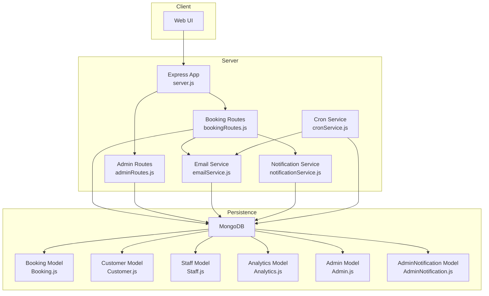
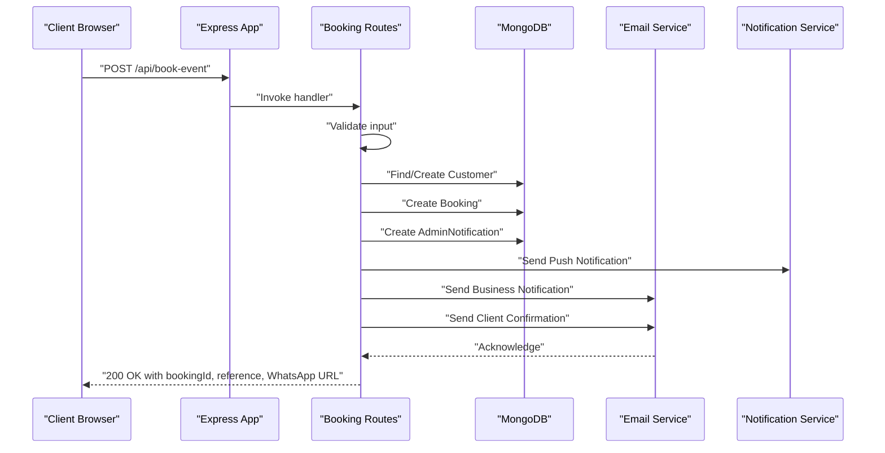
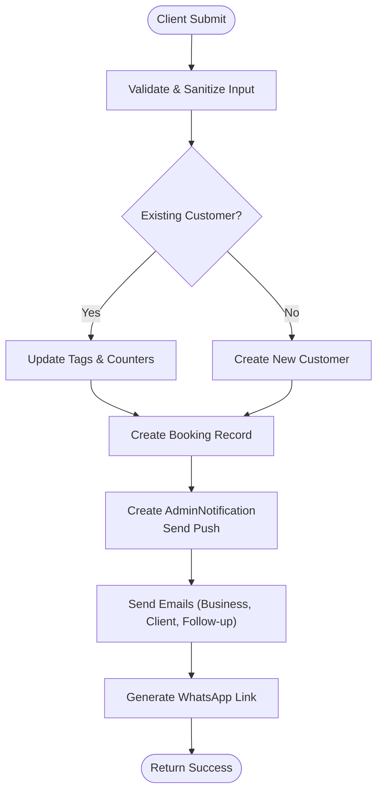
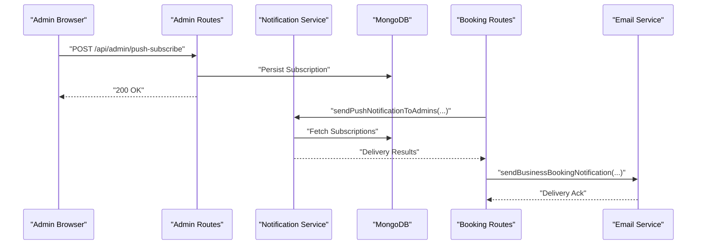
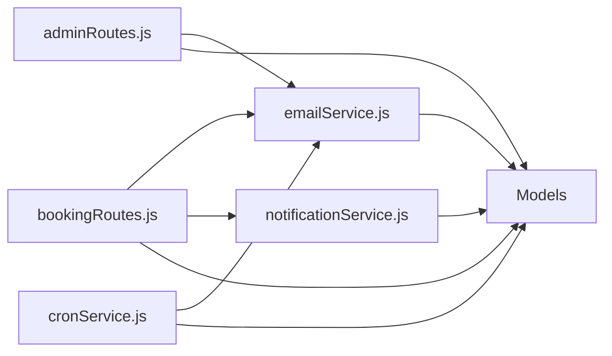
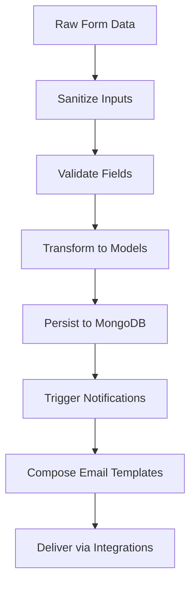
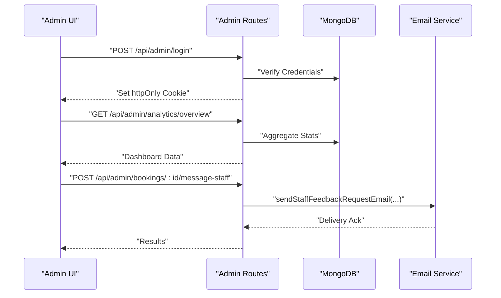
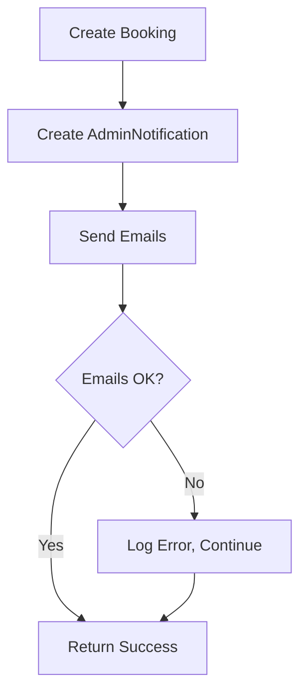
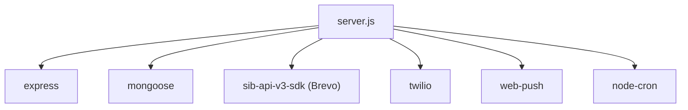

# Data Flow Architecture

<cite>
**Referenced Files in This Document**
- [server.js](file://server.js)
- [package.json](file://package.json)
- [Booking.js](file://server/models/Booking.js)
- [Customer.js](file://server/models/Customer.js)
- [Staff.js](file://server/models/Staff.js)
- [Analytics.js](file://server/models/Analytics.js)
- [Admin.js](file://server/models/Admin.js)
- [AdminNotification.js](file://server/models/AdminNotification.js)
- [bookingRoutes.js](file://server/routes/bookingRoutes.js)
- [adminRoutes.js](file://server/routes/adminRoutes.js)
- [emailService.js](file://server/services/emailService.js)
- [notificationService.js](file://server/services/notificationService.js)
- [cronService.js](file://server/services/cronService.js)
- [adminAuth.js](file://server/middleware/adminAuth.js)
</cite>

## Table of Contents
1. [Introduction](#introduction)
2. [Project Structure](#project-structure)
3. [Core Components](#core-components)
4. [Architecture Overview](#architecture-overview)
5. [Detailed Component Analysis](#detailed-component-analysis)
6. [Dependency Analysis](#dependency-analysis)
7. [Performance Considerations](#performance-considerations)
8. [Troubleshooting Guide](#troubleshooting-guide)
9. [Conclusion](#conclusion)

## Introduction
This document describes the end-to-end data flow architecture of the Emerald system, covering client booking submissions, database persistence, automated communications, and administrative workflows. It explains the booking lifecycle from initial inquiry capture to status tracking, real-time data flows for push notifications, WhatsApp messaging, and email automation, and inter-service data exchanges. It also documents data transformation patterns, consistency strategies, transaction handling, error recovery, caching strategies, and synchronization patterns.

## Project Structure
The system is a Node.js/Express application with a clear separation of concerns:
- Entry point initializes Express, middleware, CORS, rate limiting, and routes.
- Models define the domain entities and indexes for efficient queries.
- Routes encapsulate business logic for booking and admin operations.
- Services handle external integrations (email via Brevo SDK, push notifications via web-push, WhatsApp via Twilio).
- Middleware enforces admin authentication and JWT verification.
- Cron jobs automate follow-ups and reminders.

**Diagram sources**
- [server.js](file://server.js#L42-L611)
- [bookingRoutes.js](file://server/routes/bookingRoutes.js#L1-L356)
- [adminRoutes.js](file://server/routes/adminRoutes.js#L1-L800)
- [emailService.js](file://server/services/emailService.js#L1-L467)
- [notificationService.js](file://server/services/notificationService.js#L1-L78)
- [cronService.js](file://server/services/cronService.js#L1-L185)
- [Booking.js](file://server/models/Booking.js#L1-L169)
- [Customer.js](file://server/models/Customer.js#L1-L93)
- [Staff.js](file://server/models/Staff.js#L1-L57)
- [Analytics.js](file://server/models/Analytics.js#L1-L41)
- [Admin.js](file://server/models/Admin.js#L1-L70)
- [AdminNotification.js](file://server/models/AdminNotification.js#L1-L40)

**Section sources**
- [server.js](file://server.js#L38-L80)
- [package.json](file://package.json#L25-L46)

## Core Components
- Express server with middleware, CORS, rate limiting, and static serving for admin UI.
- Booking routes orchestrating validation, customer enrichment, booking creation, admin notifications, email dispatch, and WhatsApp link generation.
- Email service integrating with Brevo SDK for transactional emails.
- Notification service implementing web-push for admin browser notifications.
- Cron service scheduling follow-ups, reminders, and staff alerts.
- Models with indexes and population defaults for optimized reads and writes.
- Admin routes protecting endpoints with JWT and providing analytics dashboards.
- Analytics endpoint for lightweight telemetry.

**Section sources**
- [server.js](file://server.js#L48-L143)
- [bookingRoutes.js](file://server/routes/bookingRoutes.js#L121-L285)
- [emailService.js](file://server/services/emailService.js#L9-L27)
- [notificationService.js](file://server/services/notificationService.js#L6-L14)
- [cronService.js](file://server/services/cronService.js#L21-L164)
- [Booking.js](file://server/models/Booking.js#L141-L168)
- [adminRoutes.js](file://server/routes/adminRoutes.js#L59-L143)
- [Analytics.js](file://server/models/Analytics.js#L7-L39)

## Architecture Overview
The system follows a layered architecture:
- Presentation: Public booking form and admin UI served by Express.
- Application: Route handlers and services implement business logic.
- Persistence: Mongoose models manage schema, indexes, and population.
- Integrations: Brevo for email, Twilio for WhatsApp, web-push for browser notifications.

**Diagram sources**
- [server.js](file://server.js#L543-L547)
- [bookingRoutes.js](file://server/routes/bookingRoutes.js#L121-L285)
- [emailService.js](file://server/services/emailService.js#L127-L156)
- [notificationService.js](file://server/services/notificationService.js#L16-L75)

## Detailed Component Analysis

### Booking Lifecycle Data Flow
End-to-end booking lifecycle:
1. Initial inquiry capture: Client submits booking form; server validates and sanitizes input.
2. Customer profile creation/enrichment: Existing customer reused or new customer created with tags and counters.
3. Booking record creation: Booking persisted with generated reference and default status.
4. Admin notification: AdminNotification created and push notifications dispatched to subscribed admins.
5. Email automation: Business notification, client confirmation, and delayed follow-up email.
6. Status tracking updates: Admin updates status via protected routes; analytics endpoint records events.

**Diagram sources**
- [bookingRoutes.js](file://server/routes/bookingRoutes.js#L121-L285)
- [emailService.js](file://server/services/emailService.js#L127-L250)
- [notificationService.js](file://server/services/notificationService.js#L16-L75)

**Section sources**
- [bookingRoutes.js](file://server/routes/bookingRoutes.js#L121-L285)
- [Booking.js](file://server/models/Booking.js#L141-L168)
- [Customer.js](file://server/models/Customer.js#L81-L85)

### Real-Time Data Flow Patterns
- Push notifications: Admins subscribe via JWT-protected endpoint; server sends web-push notifications using VAPID keys.
- WhatsApp messaging: Twilio integration enabled conditionally; server generates a pre-filled WhatsApp URL for quick client engagement.
- Email automation: Immediate and delayed emails orchestrated by routes and cron jobs; Brevo SDK handles delivery.

**Diagram sources**
- [adminRoutes.js](file://server/routes/adminRoutes.js#L30-L57)
- [notificationService.js](file://server/services/notificationService.js#L16-L75)
- [emailService.js](file://server/services/emailService.js#L127-L156)

**Section sources**
- [adminRoutes.js](file://server/routes/adminRoutes.js#L30-L57)
- [notificationService.js](file://server/services/notificationService.js#L6-L14)
- [server.js](file://server.js#L497-L519)

### Inter-Service Data Flow
- Booking routes depend on email and notification services for outbound communications.
- Cron service depends on email service and models to schedule and execute automated emails.
- Admin routes depend on models and email service for staff messaging and analytics.

**Diagram sources**
- [bookingRoutes.js](file://server/routes/bookingRoutes.js#L7-L8)
- [emailService.js](file://server/services/emailService.js#L1-L467)
- [notificationService.js](file://server/services/notificationService.js#L1-L78)
- [cronService.js](file://server/services/cronService.js#L1-L185)
- [adminRoutes.js](file://server/routes/adminRoutes.js#L1-L12)

**Section sources**
- [bookingRoutes.js](file://server/routes/bookingRoutes.js#L7-L8)
- [cronService.js](file://server/services/cronService.js#L5-L5)

### Data Transformation Patterns
- Input validation and sanitization occur in booking routes to ensure data integrity.
- HTML escaping and template rendering are used for email content to prevent injection.
- WhatsApp message generation composes a structured text payload.
- Analytics endpoint captures metadata (user agent, IP, referrer) for telemetry.

**Diagram sources**
- [bookingRoutes.js](file://server/routes/bookingRoutes.js#L121-L180)
- [server.js](file://server.js#L144-L184)
- [emailService.js](file://server/services/emailService.js#L58-L122)

**Section sources**
- [bookingRoutes.js](file://server/routes/bookingRoutes.js#L90-L94)
- [server.js](file://server.js#L133-L143)

### Administrative Workflows
- Admin authentication via JWT cookies with protected endpoints.
- Analytics dashboard aggregates counts and revenue trends.
- Staff management and messaging workflows support internal coordination.

**Diagram sources**
- [adminRoutes.js](file://server/routes/adminRoutes.js#L59-L143)
- [adminRoutes.js](file://server/routes/adminRoutes.js#L448-L560)
- [adminRoutes.js](file://server/routes/adminRoutes.js#L367-L418)
- [emailService.js](file://server/services/emailService.js#L341-L378)

**Section sources**
- [adminAuth.js](file://server/middleware/adminAuth.js#L3-L31)
- [adminRoutes.js](file://server/routes/adminRoutes.js#L59-L143)
- [adminRoutes.js](file://server/routes/adminRoutes.js#L448-L560)
- [adminRoutes.js](file://server/routes/adminRoutes.js#L367-L418)

### Data Consistency, Transactions, and Error Recovery
- Single-operation consistency: Booking creation, customer creation, and admin notification are performed within the same route handler to maintain atomicity for the booking lifecycle step.
- Email failures are handled gracefully; the booking response is returned even if email dispatch fails.
- Push notification delivery is best-effort; expired subscriptions are detected and pruned.
- Cron jobs run periodically to retry follow-ups and reminders; they check flags to avoid duplicate sends.
- Rate limiting protects endpoints from abuse.

**Diagram sources**
- [bookingRoutes.js](file://server/routes/bookingRoutes.js#L227-L256)
- [notificationService.js](file://server/services/notificationService.js#L44-L68)
- [cronService.js](file://server/services/cronService.js#L33-L49)

**Section sources**
- [bookingRoutes.js](file://server/routes/bookingRoutes.js#L227-L256)
- [notificationService.js](file://server/services/notificationService.js#L16-L75)
- [cronService.js](file://server/services/cronService.js#L27-L57)

### Caching and Synchronization
- No explicit in-memory cache is implemented in the current codebase.
- Database indexing is used to optimize frequent queries (by customer, date, status, timestamps).
- Population defaults reduce N+1 query risks for related entities.

**Section sources**
- [Booking.js](file://server/models/Booking.js#L150-L166)
- [Customer.js](file://server/models/Customer.js#L87-L91)

## Dependency Analysis
External dependencies include Express, Mongoose, Brevo SDK, Twilio, web-push, and node-cron. These integrate with the application through services and routes.

**Diagram sources**
- [package.json](file://package.json#L25-L46)
- [server.js](file://server.js#L6-L13)

**Section sources**
- [package.json](file://package.json#L25-L46)

## Performance Considerations
- Indexes on frequently queried fields improve read performance for bookings, customers, and analytics.
- Population defaults reduce downstream query overhead.
- Rate limiting prevents abuse and stabilizes throughput.
- Asynchronous email dispatch avoids blocking the request thread.
- Cron jobs schedule periodic tasks to offload heavy operations.

[No sources needed since this section provides general guidance]

## Troubleshooting Guide
- Email service disabled: If BREVO_API_KEY is missing, email functions will throw an error; ensure environment configuration is present.
- Push notifications disabled: If VAPID keys are missing, push notifications are skipped; configure VAPID_PUBLIC_KEY and VAPID_PRIVATE_KEY.
- Twilio WhatsApp disabled: If credentials are missing, WhatsApp sending is skipped; configure Twilio credentials.
- Authentication failures: Admin routes enforce JWT verification; ensure cookies are set and not expired.
- Analytics endpoint: Returns success even on failure to avoid breaking user experience; check logs for errors.

**Section sources**
- [emailService.js](file://server/services/emailService.js#L9-L27)
- [notificationService.js](file://server/services/notificationService.js#L6-L14)
- [server.js](file://server.js#L18-L27)
- [adminAuth.js](file://server/middleware/adminAuth.js#L3-L31)
- [server.js](file://server.js#L571-L576)

## Conclusion
The Emerald system implements a robust, layered architecture for event booking and management. Its data flow emphasizes reliable persistence, automated communications, and admin oversight. The design balances simplicity and scalability through careful use of indexes, population defaults, asynchronous processing, and scheduled tasks. Administrators benefit from real-time notifications, analytics dashboards, and streamlined workflows for staff coordination.