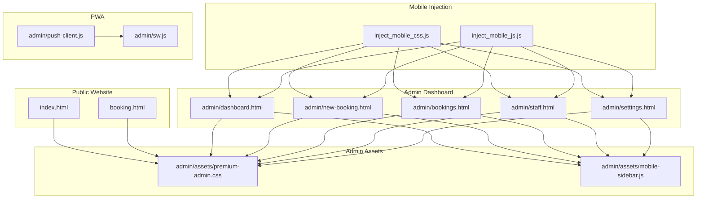
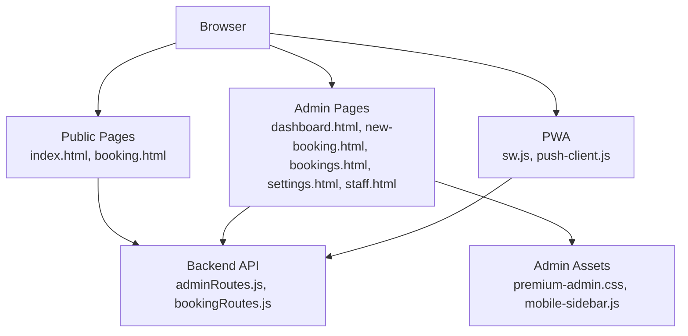
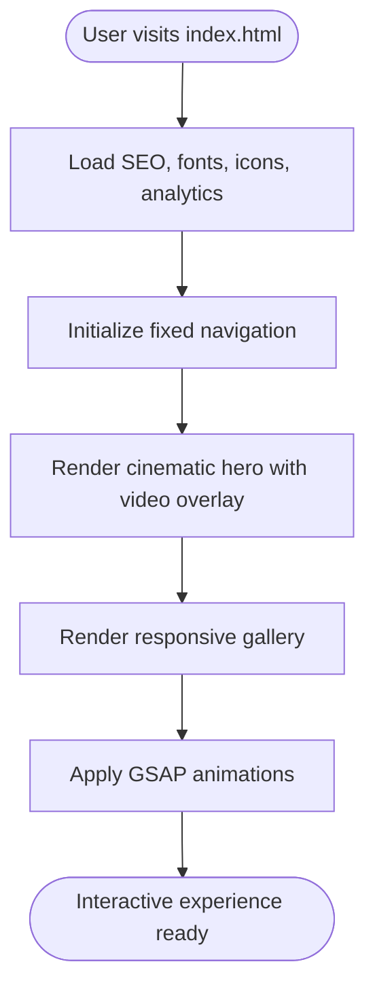
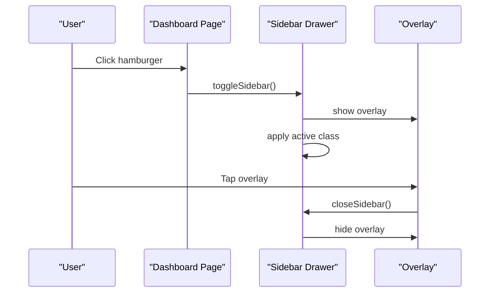
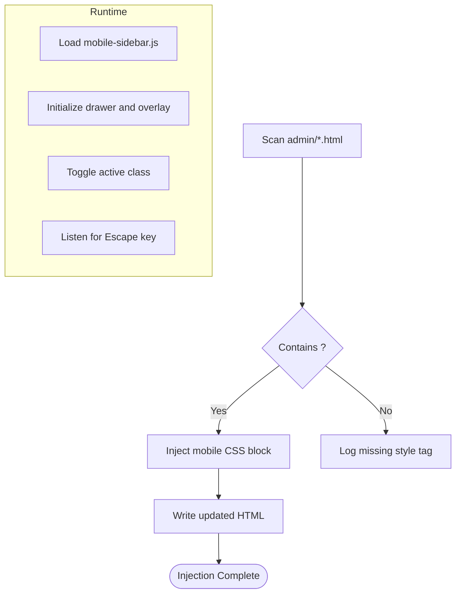
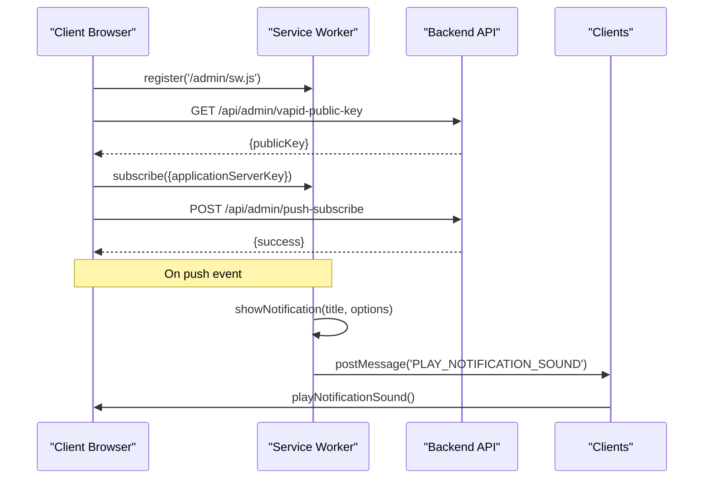
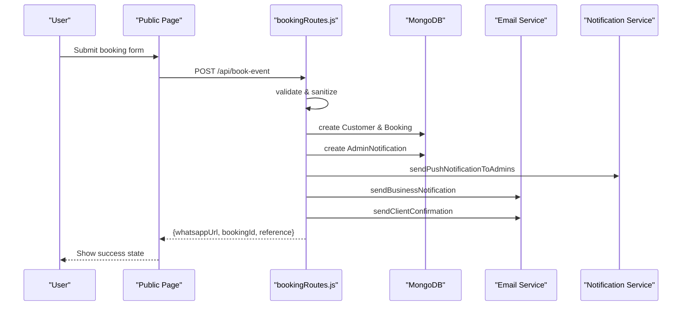
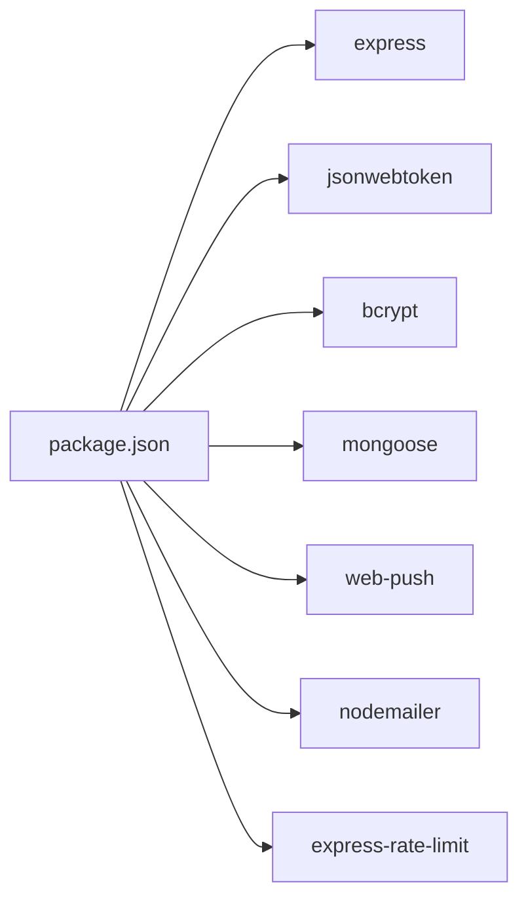

# Frontend Architecture

<cite>
**Referenced Files in This Document**
- [index.html](file://index.html)
- [booking.html](file://booking.html)
- [admin/dashboard.html](file://admin/dashboard.html)
- [admin/new-booking.html](file://admin/new-booking.html)
- [admin/bookings.html](file://admin/bookings.html)
- [admin/settings.html](file://admin/settings.html)
- [admin/staff.html](file://admin/staff.html)
- [admin/assets/premium-admin.css](file://admin/assets/premium-admin.css)
- [admin/assets/mobile-sidebar.js](file://admin/assets/mobile-sidebar.js)
- [inject_mobile_css.js](file://inject_mobile_css.js)
- [inject_mobile_js.js](file://inject_mobile_js.js)
- [admin/sw.js](file://admin/sw.js)
- [admin/push-client.js](file://admin/push-client.js)
- [server/routes/adminRoutes.js](file://server/routes/adminRoutes.js)
- [server/routes/bookingRoutes.js](file://server/routes/bookingRoutes.js)
- [server/middleware/adminAuth.js](file://server/middleware/adminAuth.js)
- [package.json](file://package.json)
</cite>

## Table of Contents
1. [Introduction](#introduction)
2. [Project Structure](#project-structure)
3. [Core Components](#core-components)
4. [Architecture Overview](#architecture-overview)
5. [Detailed Component Analysis](#detailed-component-analysis)
6. [Dependency Analysis](#dependency-analysis)
7. [Performance Considerations](#performance-considerations)
8. [Troubleshooting Guide](#troubleshooting-guide)
9. [Conclusion](#conclusion)

## Introduction
This document describes the frontend architecture of the Emerald website and admin dashboard. It covers the responsive design with a mobile-first approach, Progressive Web App (PWA) features, frontend structure for main website pages and admin components, mobile optimization (CSS injection, JavaScript adaptation, touch interface), admin interface architecture (navigation, real-time updates, interactive elements), static asset management, frontend-backend integration (API consumption, form handling, real-time communication), and user experience architecture for luxury event booking and admin workflows. Performance optimization strategies are also included.

## Project Structure
The frontend is organized into:
- Public website pages: index.html (homepage), booking.html (event booking)
- Admin dashboard pages: dashboard.html, new-booking.html, bookings.html, settings.html, staff.html, and others
- Admin assets: CSS overrides and mobile sidebar behavior
- Automation scripts for mobile responsiveness injection
- Service worker and push notification client for PWA

**Diagram sources**
- [index.html](file://index.html#L1-L120)
- [booking.html](file://booking.html#L1-L120)
- [admin/dashboard.html](file://admin/dashboard.html#L1-L120)
- [admin/new-booking.html](file://admin/new-booking.html#L1-L120)
- [admin/bookings.html](file://admin/bookings.html#L1-L120)
- [admin/settings.html](file://admin/settings.html#L1-L120)
- [admin/staff.html](file://admin/staff.html#L1-L120)
- [admin/assets/premium-admin.css](file://admin/assets/premium-admin.css#L1-L60)
- [admin/assets/mobile-sidebar.js](file://admin/assets/mobile-sidebar.js#L1-L40)
- [inject_mobile_css.js](file://inject_mobile_css.js#L1-L40)
- [inject_mobile_js.js](file://inject_mobile_js.js#L1-L17)
- [admin/sw.js](file://admin/sw.js#L1-L30)
- [admin/push-client.js](file://admin/push-client.js#L1-L40)

**Section sources**
- [index.html](file://index.html#L1-L120)
- [booking.html](file://booking.html#L1-L120)
- [admin/dashboard.html](file://admin/dashboard.html#L1-L120)
- [admin/new-booking.html](file://admin/new-booking.html#L1-L120)
- [admin/bookings.html](file://admin/bookings.html#L1-L120)
- [admin/settings.html](file://admin/settings.html#L1-L120)
- [admin/staff.html](file://admin/staff.html#L1-L120)
- [admin/assets/premium-admin.css](file://admin/assets/premium-admin.css#L1-L60)
- [admin/assets/mobile-sidebar.js](file://admin/assets/mobile-sidebar.js#L1-L40)
- [inject_mobile_css.js](file://inject_mobile_css.js#L1-L40)
- [inject_mobile_js.js](file://inject_mobile_js.js#L1-L17)
- [admin/sw.js](file://admin/sw.js#L1-L30)
- [admin/push-client.js](file://admin/push-client.js#L1-L40)

## Core Components
- Public website pages:
  - index.html: Hero, cinematic visuals, navigation, responsive gallery, and animations
  - booking.html: Glassmorphism booking form, animated hero, investment selector, and success state
- Admin dashboard pages:
  - dashboard.html: Stats grid, charts placeholder, notifications, and layout
  - new-booking.html: Booking creation form and admin controls
  - bookings.html: Booking listing, filters, modals, and actions
  - settings.html: Admin settings management
  - staff.html: Staff directory and management
- Admin assets:
  - premium-admin.css: Luxury theme with emerald and gold palette, typography, and button styling
  - mobile-sidebar.js: Mobile drawer behavior, overlay, keyboard support, and navigation integration
- Mobile injection:
  - inject_mobile_css.js: Injects mobile responsiveness CSS into all admin HTML files
  - inject_mobile_js.js: Ensures mobile-sidebar.js is included in admin HTML files
- PWA:
  - admin/sw.js: Push notification service worker handling push and click actions
  - admin/push-client.js: Registers service worker, requests permissions, subscribes to push, and plays sounds

**Section sources**
- [index.html](file://index.html#L100-L200)
- [booking.html](file://booking.html#L90-L180)
- [admin/dashboard.html](file://admin/dashboard.html#L10-L80)
- [admin/new-booking.html](file://admin/new-booking.html#L10-L80)
- [admin/bookings.html](file://admin/bookings.html#L10-L80)
- [admin/settings.html](file://admin/settings.html#L1-L80)
- [admin/staff.html](file://admin/staff.html#L1-L80)
- [admin/assets/premium-admin.css](file://admin/assets/premium-admin.css#L1-L60)
- [admin/assets/mobile-sidebar.js](file://admin/assets/mobile-sidebar.js#L1-L40)
- [inject_mobile_css.js](file://inject_mobile_css.js#L1-L40)
- [inject_mobile_js.js](file://inject_mobile_js.js#L1-L17)
- [admin/sw.js](file://admin/sw.js#L1-L30)
- [admin/push-client.js](file://admin/push-client.js#L1-L40)

## Architecture Overview
The frontend follows a mobile-first responsive architecture with:
- CSS custom properties and SCSS-like nesting for consistent theming
- Modular admin layouts with sidebar navigation and topbar
- Progressive Web App features for push notifications and offline readiness
- Static asset management via centralized CSS and lightweight JS
- Backend integration through REST APIs with JWT authentication for admin and public endpoints

**Diagram sources**
- [index.html](file://index.html#L1-L120)
- [booking.html](file://booking.html#L1-L120)
- [admin/dashboard.html](file://admin/dashboard.html#L1-L120)
- [admin/new-booking.html](file://admin/new-booking.html#L1-L120)
- [admin/bookings.html](file://admin/bookings.html#L1-L120)
- [admin/settings.html](file://admin/settings.html#L1-L120)
- [admin/staff.html](file://admin/staff.html#L1-L120)
- [admin/assets/premium-admin.css](file://admin/assets/premium-admin.css#L1-L60)
- [admin/assets/mobile-sidebar.js](file://admin/assets/mobile-sidebar.js#L1-L40)
- [admin/sw.js](file://admin/sw.js#L1-L30)
- [admin/push-client.js](file://admin/push-client.js#L1-L40)
- [server/routes/adminRoutes.js](file://server/routes/adminRoutes.js#L1-L60)
- [server/routes/bookingRoutes.js](file://server/routes/bookingRoutes.js#L1-L60)

## Detailed Component Analysis

### Public Website Pages
- index.html
  - Implements viewport meta, SEO metadata, fonts, icons, analytics, structured data
  - Uses CSS custom properties for a cohesive dark/emerald/gold theme
  - Features fixed navigation with scroll effects, cinematic hero with video overlay, animated logo and glow effects, responsive gallery with masonry layout
  - Animations powered by GSAP and Lucide icons loaded via CDN
- booking.html
  - Glassmorphism design with backdrop blur and gradient borders
  - Animated hero with cinematic background and floating particles
  - Comprehensive booking form with validation helpers, investment range selector, responsive grid layout, and success overlay
  - Loading spinner and error animations for improved UX

**Diagram sources**
- [index.html](file://index.html#L1-L120)
- [index.html](file://index.html#L240-L320)
- [index.html](file://index.html#L689-L760)

**Section sources**
- [index.html](file://index.html#L1-L120)
- [index.html](file://index.html#L240-L320)
- [index.html](file://index.html#L689-L760)
- [booking.html](file://booking.html#L90-L180)
- [booking.html](file://booking.html#L356-L420)
- [booking.html](file://booking.html#L700-L800)

### Admin Dashboard Architecture
- Layout and Navigation
  - Fixed sidebar with logo, navigation links, badges, and footer
  - Topbar with search, date, notifications, and admin menu
  - Main content area with page-specific sections
- Interactive Elements
  - Stats cards with hover animations and progress indicators
  - Action buttons with cinematic glow effects
  - Skeleton loaders for perceived performance
- Mobile Responsiveness
  - Sidebar transforms into a drawer on small screens
  - Overlay for backdrop and escape-to-close behavior
  - Adjustments to topbar, forms, and tables for mobile

**Diagram sources**
- [admin/dashboard.html](file://admin/dashboard.html#L42-L120)
- [admin/dashboard.html](file://admin/dashboard.html#L611-L720)
- [admin/assets/mobile-sidebar.js](file://admin/assets/mobile-sidebar.js#L1-L40)
- [admin/assets/mobile-sidebar.js](file://admin/assets/mobile-sidebar.js#L60-L95)

**Section sources**
- [admin/dashboard.html](file://admin/dashboard.html#L42-L120)
- [admin/dashboard.html](file://admin/dashboard.html#L397-L473)
- [admin/dashboard.html](file://admin/dashboard.html#L611-L720)
- [admin/assets/premium-admin.css](file://admin/assets/premium-admin.css#L154-L200)
- [admin/assets/mobile-sidebar.js](file://admin/assets/mobile-sidebar.js#L1-L40)
- [admin/assets/mobile-sidebar.js](file://admin/assets/mobile-sidebar.js#L60-L95)

### Mobile Optimization Implementation
- CSS Injection
  - inject_mobile_css.js scans admin HTML files and injects a unified mobile responsiveness block before the closing </style>
  - Ensures consistent drawer behavior, responsive grids, and modal sizing across admin pages
- JavaScript Adaptation
  - inject_mobile_js.js ensures mobile-sidebar.js is included in all admin pages except login
  - mobile-sidebar.js initializes sidebar drawer, overlay, keyboard handling, and navigation integration
- Touch Interface Design
  - Large touch targets for buttons and navigation
  - Smooth transitions and gestures for drawer opening/closing
  - Overlay prevents background scrolling and provides escape behavior

**Diagram sources**
- [inject_mobile_css.js](file://inject_mobile_css.js#L90-L116)
- [inject_mobile_css.js](file://inject_mobile_css.js#L6-L88)
- [inject_mobile_js.js](file://inject_mobile_js.js#L1-L17)
- [admin/assets/mobile-sidebar.js](file://admin/assets/mobile-sidebar.js#L1-L40)
- [admin/assets/mobile-sidebar.js](file://admin/assets/mobile-sidebar.js#L60-L95)

**Section sources**
- [inject_mobile_css.js](file://inject_mobile_css.js#L1-L40)
- [inject_mobile_css.js](file://inject_mobile_css.js#L90-L116)
- [inject_mobile_js.js](file://inject_mobile_js.js#L1-L17)
- [admin/assets/mobile-sidebar.js](file://admin/assets/mobile-sidebar.js#L1-L40)
- [admin/assets/mobile-sidebar.js](file://admin/assets/mobile-sidebar.js#L60-L95)

### Progressive Web App Features
- Service Worker
  - admin/sw.js handles push notifications, displays notifications, and opens admin URLs
  - Sends messages to open tabs to play notification sounds
- Push Client
  - admin/push-client.js registers service worker, requests permission, retrieves VAPID public key, subscribes to push, and plays notification sounds
  - Provides manual enablement flow and updates UI state accordingly

**Diagram sources**
- [admin/sw.js](file://admin/sw.js#L1-L30)
- [admin/sw.js](file://admin/sw.js#L29-L50)
- [admin/push-client.js](file://admin/push-client.js#L49-L97)
- [admin/push-client.js](file://admin/push-client.js#L99-L106)
- [server/routes/adminRoutes.js](file://server/routes/adminRoutes.js#L22-L28)
- [server/routes/adminRoutes.js](file://server/routes/adminRoutes.js#L30-L57)

**Section sources**
- [admin/sw.js](file://admin/sw.js#L1-L30)
- [admin/sw.js](file://admin/sw.js#L29-L50)
- [admin/push-client.js](file://admin/push-client.js#L49-L97)
- [admin/push-client.js](file://admin/push-client.js#L99-L106)
- [server/routes/adminRoutes.js](file://server/routes/adminRoutes.js#L22-L28)
- [server/routes/adminRoutes.js](file://server/routes/adminRoutes.js#L30-L57)

### Static Asset Management
- CSS Organization
  - Premium admin theme in premium-admin.css defines a luxury color scheme and typography
  - Public pages use inline CSS for homepage and booking form styling
- JavaScript Modules
  - mobile-sidebar.js is modular and self-contained with initialization and cleanup
  - Push client encapsulates service worker registration and subscription logic
- Asset Injection
  - Scripts automatically inject mobile CSS and JS into admin pages to maintain consistency

**Section sources**
- [admin/assets/premium-admin.css](file://admin/assets/premium-admin.css#L1-L60)
- [admin/assets/premium-admin.css](file://admin/assets/premium-admin.css#L154-L200)
- [admin/assets/mobile-sidebar.js](file://admin/assets/mobile-sidebar.js#L1-L40)
- [inject_mobile_css.js](file://inject_mobile_css.js#L90-L116)
- [inject_mobile_js.js](file://inject_mobile_js.js#L1-L17)

### Frontend-Backend Integration Patterns
- Authentication
  - Admin JWT verification middleware checks httpOnly cookies and decodes tokens
  - Admin login sets a secure, sameSite cookie and returns admin info
- Public Booking Flow
  - bookingRoutes.js validates input, sanitizes data, creates customer and booking records, generates notifications, sends emails, and returns a WhatsApp deep link
  - Rate limiting protects against spam
- Admin CRUD Operations
  - adminRoutes.js exposes protected endpoints for bookings, analytics, notifications, staff, gallery, testimonials, and settings
  - Real-time notifications are created and can trigger push to admins

**Diagram sources**
- [server/routes/bookingRoutes.js](file://server/routes/bookingRoutes.js#L121-L285)
- [server/routes/bookingRoutes.js](file://server/routes/bookingRoutes.js#L143-L150)
- [server/routes/bookingRoutes.js](file://server/routes/bookingRoutes.js#L206-L222)
- [server/routes/bookingRoutes.js](file://server/routes/bookingRoutes.js#L227-L256)
- [server/middleware/adminAuth.js](file://server/middleware/adminAuth.js#L3-L31)

**Section sources**
- [server/middleware/adminAuth.js](file://server/middleware/adminAuth.js#L3-L31)
- [server/routes/bookingRoutes.js](file://server/routes/bookingRoutes.js#L121-L285)
- [server/routes/adminRoutes.js](file://server/routes/adminRoutes.js#L174-L217)
- [server/routes/adminRoutes.js](file://server/routes/adminRoutes.js#L562-L586)

### User Experience Architecture
- Luxury Event Booking Flow
  - index.html establishes brand presence with cinematic visuals and navigation
  - booking.html provides a streamlined, validated form with animated feedback and success state
  - Real-time notifications and push alerts keep admins informed
- Admin Workflow Efficiency
  - Dashboard presents key metrics and quick actions
  - Bookings listing supports filtering, modals, and batch actions
  - Staff and settings pages streamline team and configuration management
  - Mobile drawer improves admin usability on small screens

**Section sources**
- [index.html](file://index.html#L100-L200)
- [booking.html](file://booking.html#L356-L420)
- [booking.html](file://booking.html#L700-L800)
- [admin/dashboard.html](file://admin/dashboard.html#L397-L473)
- [admin/bookings.html](file://admin/bookings.html#L335-L404)
- [admin/staff.html](file://admin/staff.html#L179-L200)

## Dependency Analysis
- Frontend Dependencies
  - Express, helmet, compression, cors, morgan, bcrypt, jsonwebtoken, mongoose, nodemailer, web-push, dotenv, playwright, twilio, express-rate-limit, morgan, node-cron
- Internal Dependencies
  - Admin routes depend on adminAuth middleware and model schemas
  - Booking routes depend on email and notification services
  - Admin pages depend on premium-admin.css and mobile-sidebar.js

**Diagram sources**
- [package.json](file://package.json#L25-L46)

**Section sources**
- [package.json](file://package.json#L25-L46)

## Performance Considerations
- Resource Loading
  - Use preconnect for Google Fonts and CDN-hosted libraries
  - Lazy-load non-critical resources; defer non-essential scripts
- Caching
  - Configure cache headers for static assets
  - Use service worker caching strategies for offline readiness
- Progressive Enhancement
  - Ensure core functionality works without JavaScript
  - Enhance with animations and interactivity progressively
- Mobile Optimization
  - Minimize paint and layout thrashing with transform/opacity changes
  - Use efficient CSS custom properties and avoid expensive filters on many elements

## Troubleshooting Guide
- Push Notifications Not Working
  - Verify service worker registration and push permission
  - Confirm VAPID public key retrieval and subscription persistence
  - Check notification click handling and URL navigation
- Admin Authentication Issues
  - Ensure httpOnly cookie is present and not expired
  - Verify JWT secret and token decoding
- Mobile Drawer Not Responding
  - Confirm mobile-sidebar.js is injected and initialized
  - Check overlay and event listeners for proper cleanup

**Section sources**
- [admin/push-client.js](file://admin/push-client.js#L49-L97)
- [admin/sw.js](file://admin/sw.js#L1-L30)
- [server/middleware/adminAuth.js](file://server/middleware/adminAuth.js#L3-L31)
- [admin/assets/mobile-sidebar.js](file://admin/assets/mobile-sidebar.js#L1-L40)

## Conclusion
The Emerald frontend combines a mobile-first responsive design with luxury aesthetics and robust admin capabilities. The architecture leverages modern CSS, modular JavaScript, and a PWA for real-time engagement. Backend integration is secured with JWT and RESTful endpoints, supporting both public booking workflows and admin productivity. Performance and user experience are prioritized through thoughtful animations, progressive enhancement, and efficient asset management.