# Security Architecture

<cite>
**Referenced Files in This Document**
- [server-prod.js](file://server-prod.js)
- [server.js](file://server.js)
- [package.json](file://package.json)
- [.env](file://.env)
- [server/middleware/adminAuth.js](file://server/middleware/adminAuth.js)
- [server/models/Admin.js](file://server/models/Admin.js)
- [server/routes/adminRoutes.js](file://server/routes/adminRoutes.js)
- [server/services/emailService.js](file://server/services/emailService.js)
- [implementation_plan.md.resolved](file://implementation_plan.md.resolved)
</cite>

## Table of Contents
1. [Introduction](#introduction)
2. [Project Structure](#project-structure)
3. [Core Components](#core-components)
4. [Architecture Overview](#architecture-overview)
5. [Detailed Component Analysis](#detailed-component-analysis)
6. [Dependency Analysis](#dependency-analysis)
7. [Performance Considerations](#performance-considerations)
8. [Troubleshooting Guide](#troubleshooting-guide)
9. [Conclusion](#conclusion)

## Introduction
This document describes the security architecture of the Emerald system. It covers multi-layered protections including JWT-based authentication for admin users, input validation and sanitization, rate limiting, CORS configuration, security middleware, environment variable management, API key security, communication security, and threat mitigation strategies. It also outlines authorization patterns, data protection measures, audit/logging, and incident response procedures.

## Project Structure
The security architecture spans the production server, middleware, models, routes, and services. The production server initializes security middleware, rate limits, CORS, and mounts admin and booking routes. Admin routes enforce JWT-based authorization via cookies. Models implement password hashing and roles. Services encapsulate email delivery and push notification subscriptions.

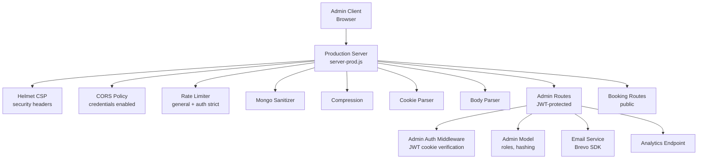

**Diagram sources**
- [server-prod.js](file://server-prod.js#L24-L127)
- [server/middleware/adminAuth.js](file://server/middleware/adminAuth.js#L1-L56)
- [server/models/Admin.js](file://server/models/Admin.js#L1-L70)
- [server/routes/adminRoutes.js](file://server/routes/adminRoutes.js#L1-L168)
- [server/services/emailService.js](file://server/services/emailService.js#L1-L27)

**Section sources**
- [server-prod.js](file://server-prod.js#L24-L127)
- [package.json](file://package.json#L25-L46)

## Core Components
- JWT-based admin authentication with httpOnly cookies and strict SameSite policy
- Helmet CSP for content security and security headers
- CORS configuration enabling credentials for trusted origins
- Rate limiting for general traffic and stricter limits for admin auth endpoints
- Mongo sanitization to mitigate NoSQL injection
- Compression for transport efficiency
- Cookie parser for secure cookie handling
- Body parser with size limits
- Admin model with password hashing and role enumeration
- Admin routes enforcing JWT and providing logout and profile endpoints
- Email service using Brevo SDK with API key management
- Analytics endpoint capturing user agent, IP, and referrer

**Section sources**
- [server/middleware/adminAuth.js](file://server/middleware/adminAuth.js#L1-L56)
- [server/models/Admin.js](file://server/models/Admin.js#L1-L70)
- [server/routes/adminRoutes.js](file://server/routes/adminRoutes.js#L59-L168)
- [server-prod.js](file://server-prod.js#L44-L101)
- [server/services/emailService.js](file://server/services/emailService.js#L9-L27)

## Architecture Overview
The production server configures a layered security stack:
- Transport and request hardening via Helmet and compression
- Origin and credential controls via CORS
- Input integrity via mongo-sanitize and body parsing limits
- Authentication via JWT stored in httpOnly cookies with secure flags
- Authorization enforced by middleware on admin routes
- Rate limiting differentiated by endpoint sensitivity
- Email delivery secured by API key management
- Analytics captures metadata for monitoring

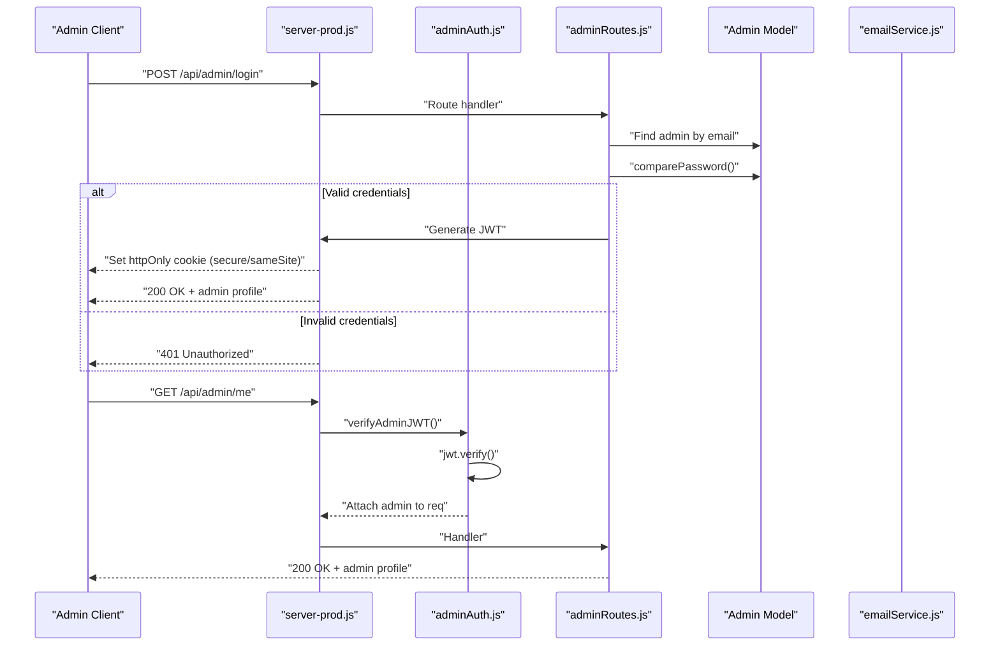

**Diagram sources**
- [server/routes/adminRoutes.js](file://server/routes/adminRoutes.js#L59-L168)
- [server/middleware/adminAuth.js](file://server/middleware/adminAuth.js#L3-L31)
- [server/models/Admin.js](file://server/models/Admin.js#L64-L67)

## Detailed Component Analysis

### JWT-Based Admin Authentication
- Token generation embeds admin identity and expires in 24 hours
- Login sets an httpOnly cookie with secure flag in production and strict SameSite
- Middleware verifies token presence and validity; expired tokens return 401
- Logout clears the cookie
- Profile endpoint returns admin without password hash

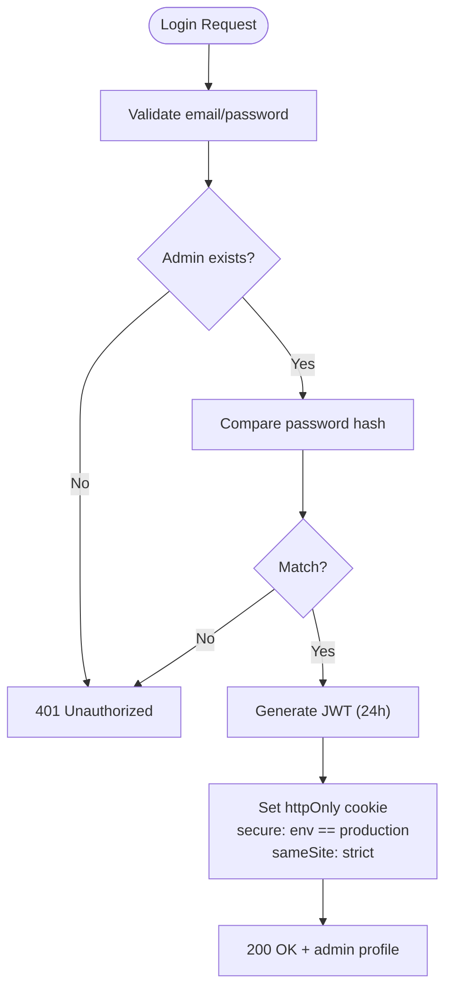

**Diagram sources**
- [server/routes/adminRoutes.js](file://server/routes/adminRoutes.js#L59-L168)
- [server/middleware/adminAuth.js](file://server/middleware/adminAuth.js#L47-L53)

**Section sources**
- [server/middleware/adminAuth.js](file://server/middleware/adminAuth.js#L3-L31)
- [server/routes/adminRoutes.js](file://server/routes/adminRoutes.js#L59-L168)
- [server/models/Admin.js](file://server/models/Admin.js#L52-L67)

### Authorization Patterns and Role-Based Access Control
- Admin roles enumerated: super_admin, admin, manager
- JWT middleware enforces access to admin routes
- Middleware attaches admin payload to request for downstream use
- Logout clears session cookie

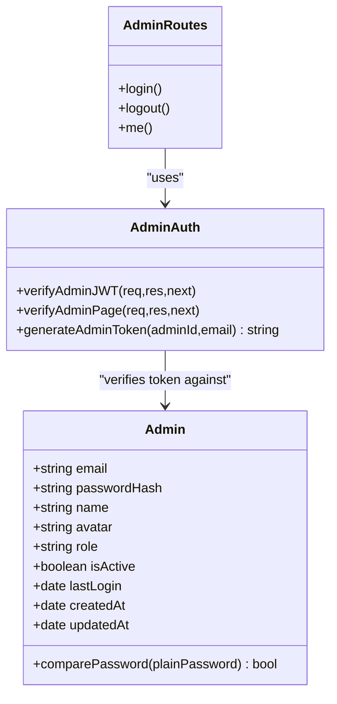

**Diagram sources**
- [server/models/Admin.js](file://server/models/Admin.js#L4-L49)
- [server/middleware/adminAuth.js](file://server/middleware/adminAuth.js#L1-L56)
- [server/routes/adminRoutes.js](file://server/routes/adminRoutes.js#L59-L168)

**Section sources**
- [server/models/Admin.js](file://server/models/Admin.js#L24-L28)
- [server/middleware/adminAuth.js](file://server/middleware/adminAuth.js#L3-L31)
- [server/routes/adminRoutes.js](file://server/routes/adminRoutes.js#L145-L168)

### Input Validation and Sanitization
- Body parser limits payload sizes
- Mongo sanitize middleware prevents NoSQL injection
- Email and phone validation helpers used in booking flow
- HTML escaping helper used when generating emails
- Strict rate limits protect endpoints from abuse

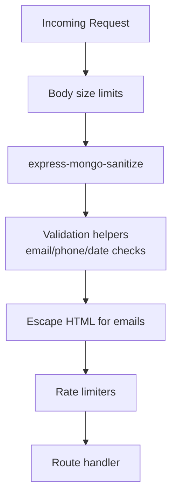

**Diagram sources**
- [server-prod.js](file://server-prod.js#L88-L101)
- [server.js](file://server.js#L110-L184)
- [server.js](file://server.js#L521-L532)

**Section sources**
- [server-prod.js](file://server-prod.js#L41-L42)
- [server.js](file://server.js#L110-L184)
- [server.js](file://server.js#L521-L532)

### Rate Limiting Mechanisms
- General limiter: 1000 requests per 15 minutes per IP
- Stricter auth limiter: 20 requests per 15 minutes for login and forgot-password
- Booking limiter present in legacy server for public endpoints

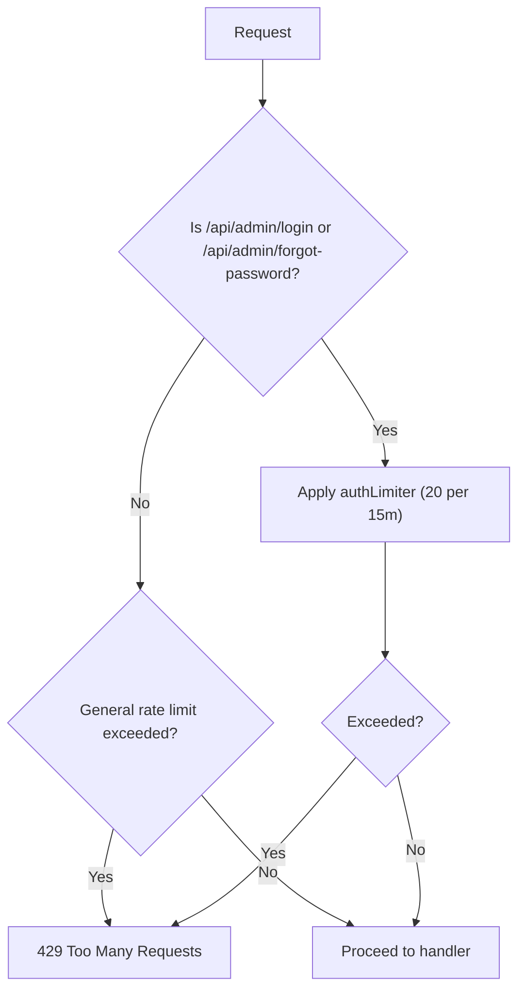

**Diagram sources**
- [server-prod.js](file://server-prod.js#L95-L101)
- [server-prod.js](file://server-prod.js#L313-L322)

**Section sources**
- [server-prod.js](file://server-prod.js#L95-L101)
- [server-prod.js](file://server-prod.js#L313-L322)
- [server.js](file://server.js#L114-L121)

### CORS Configuration
- Origins include localhost ports, loopback IPs, and production domains
- Credentials enabled for trusted origins
- Methods explicitly allowed for admin endpoints

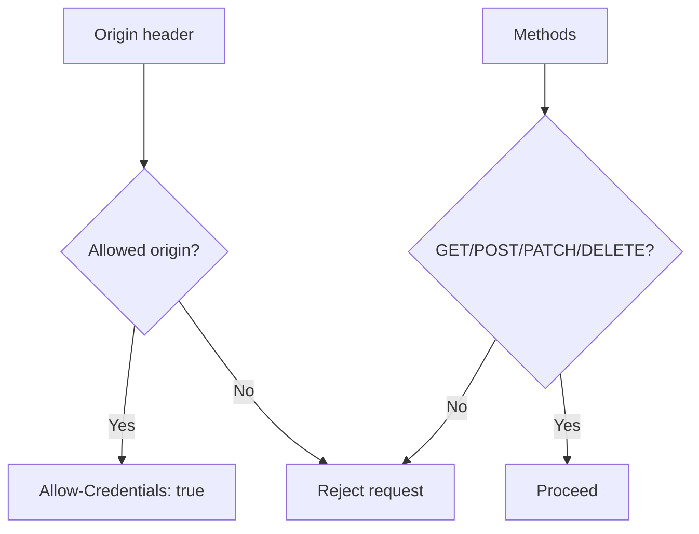

**Diagram sources**
- [server-prod.js](file://server-prod.js#L60-L86)

**Section sources**
- [server-prod.js](file://server-prod.js#L60-L86)

### Security Middleware Stack
- Helmet CSP defines default, script, style, font, image, media, and connect sources
- Compression reduces bandwidth and improves latency
- Cookie parser enables secure cookie handling
- Mongo sanitize protects against NoSQL injection
- Morgan logs requests in production environments

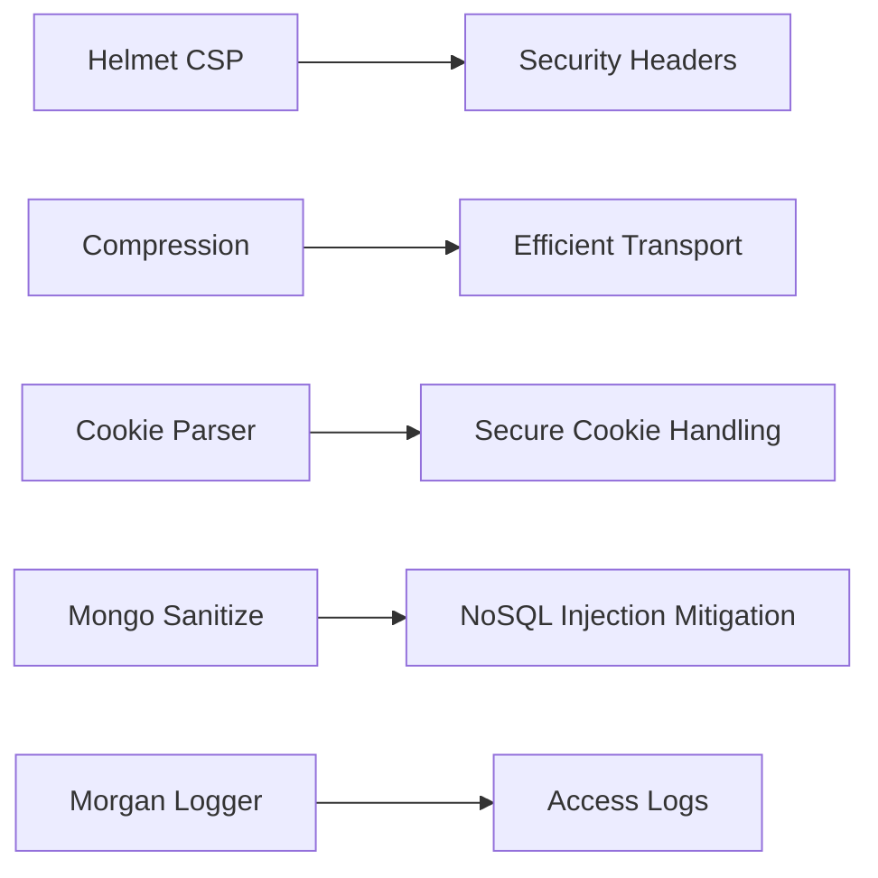

**Diagram sources**
- [server-prod.js](file://server-prod.js#L44-L58)
- [server-prod.js](file://server-prod.js#L38-L39)
- [server-prod.js](file://server-prod.js#L93-L93)
- [server-prod.js](file://server-prod.js#L41-L42)
- [server-prod.js](file://server-prod.js#L34-L36)

**Section sources**
- [server-prod.js](file://server-prod.js#L44-L58)
- [server-prod.js](file://server-prod.js#L34-L39)
- [server-prod.js](file://server-prod.js#L41-L42)

### Communication Security
- httpOnly cookies with secure flag in production and strict SameSite
- Helmet CSP restricts resources and connections
- CORS credentials enabled for trusted origins
- Environment-driven cookie security flags

```mermaid
sequenceDiagram
participant S as "server-prod.js"
participant C as "Admin Client"
S->>C : "Set-Cookie : adminToken=<jwt>; HttpOnly; Secure; SameSite=Strict"
C->>S : "Subsequent requests with cookie"
S-->>C : "200 OK (authorized)"
```

**Diagram sources**
- [server/routes/adminRoutes.js](file://server/routes/adminRoutes.js#L113-L119)
- [server/middleware/adminAuth.js](file://server/middleware/adminAuth.js#L3-L31)

**Section sources**
- [server/routes/adminRoutes.js](file://server/routes/adminRoutes.js#L113-L119)
- [server-prod.js](file://server-prod.js#L44-L58)

### Data Protection Measures
- Environment variables store secrets (JWT secret, DB URI, Brevo API key, email credentials)
- Admin passwords hashed with bcrypt before persistence
- Email content sanitized and escaped to prevent injection
- Analytics records IP, user agent, and referrer for monitoring

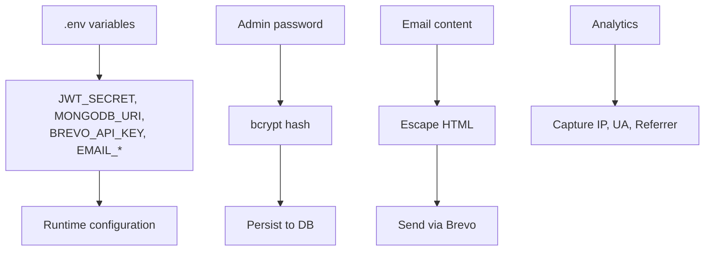

**Diagram sources**
- [.env](file://.env#L6-L27)
- [server/models/Admin.js](file://server/models/Admin.js#L52-L67)
- [server/services/emailService.js](file://server/services/emailService.js#L32-L53)
- [server-prod.js](file://server-prod.js#L271-L299)

**Section sources**
- [.env](file://.env#L6-L27)
- [server/models/Admin.js](file://server/models/Admin.js#L52-L67)
- [server/services/emailService.js](file://server/services/emailService.js#L9-L27)
- [server-prod.js](file://server-prod.js#L271-L299)

### Threat Mitigation Strategies
- DDoS protection via general and auth-specific rate limits
- SQL injection prevention: No SQL usage; MongoDB with mongo-sanitize
- XSS prevention: Helmet CSP, HTML escaping in generated emails
- CSRF mitigation: Strict SameSite cookies and CORS controls
- Credential exposure: httpOnly cookies, environment variables, Brevo API key

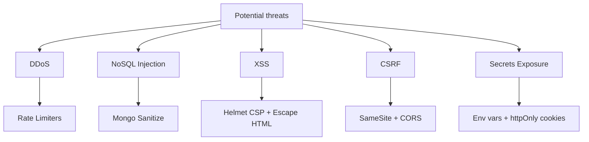

**Diagram sources**
- [server-prod.js](file://server-prod.js#L95-L101)
- [server-prod.js](file://server-prod.js#L41-L42)
- [server-prod.js](file://server-prod.js#L44-L58)
- [server/routes/adminRoutes.js](file://server/routes/adminRoutes.js#L113-L119)
- [.env](file://.env#L6-L27)

**Section sources**
- [server-prod.js](file://server-prod.js#L95-L101)
- [server-prod.js](file://server-prod.js#L41-L42)
- [server-prod.js](file://server-prod.js#L44-L58)
- [server/routes/adminRoutes.js](file://server/routes/adminRoutes.js#L113-L119)

### Security Audit Trails and Logging
- Morgan access logs in non-test environments
- Centralized error handling returns minimal stack traces in production
- Analytics endpoint records event metadata for monitoring
- Email service initialization logs warnings when API key is missing

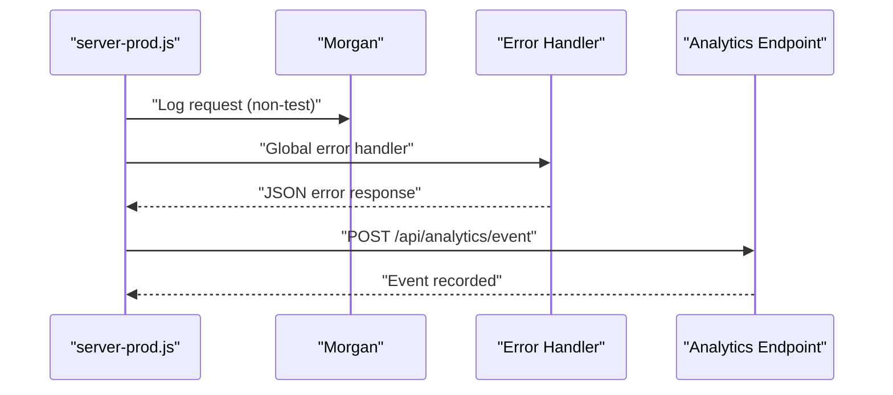

**Diagram sources**
- [server-prod.js](file://server-prod.js#L34-L36)
- [server-prod.js](file://server-prod.js#L348-L362)
- [server-prod.js](file://server-prod.js#L271-L307)

**Section sources**
- [server-prod.js](file://server-prod.js#L34-L36)
- [server-prod.js](file://server-prod.js#L348-L362)
- [server-prod.js](file://server-prod.js#L271-L307)

### Incident Response Procedures
- Immediate: verify environment variables and service initialization
- Investigate: review Morgan logs and analytics metadata
- Remediate: adjust rate limits, rotate secrets, update CORS origins
- Monitor: confirm service health endpoint and email delivery status

[No sources needed since this section provides general guidance]

## Dependency Analysis
External dependencies supporting security:
- jsonwebtoken for JWT signing/verification
- bcrypt for password hashing
- helmet for CSP and security headers
- express-rate-limit for rate limiting
- express-mongo-sanitize for NoSQL injection prevention
- cors for cross-origin controls
- cookie-parser for cookie handling
- compression for transport efficiency
- morgan for logging
- dotenv for environment variable loading

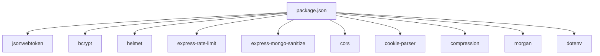

**Diagram sources**
- [package.json](file://package.json#L25-L46)

**Section sources**
- [package.json](file://package.json#L25-L46)

## Performance Considerations
- Compression reduces payload sizes; ensure it does not interfere with admin static assets caching
- Rate limits prevent resource exhaustion; tune thresholds based on traffic patterns
- Helmet CSP may block external resources; whitelist only necessary CDNs
- Cookie flags improve security but can reduce compatibility with certain deployment setups

[No sources needed since this section provides general guidance]

## Troubleshooting Guide
Common issues and resolutions:
- 401 Unauthorized on admin routes: verify httpOnly cookie presence and token validity
- CORS errors: ensure origin is whitelisted and credentials enabled
- Rate limit exceeded: reduce client-side polling or increase thresholds temporarily
- Email delivery failures: confirm BREVO_API_KEY is set and service initialized
- Analytics recording errors: endpoint tolerates failures; check logs for transient issues

**Section sources**
- [server/middleware/adminAuth.js](file://server/middleware/adminAuth.js#L3-L31)
- [server-prod.js](file://server-prod.js#L60-L86)
- [server-prod.js](file://server-prod.js#L95-L101)
- [server/services/emailService.js](file://server/services/emailService.js#L9-L27)
- [server-prod.js](file://server-prod.js#L271-L307)

## Conclusion
The Emerald system implements a robust, multi-layered security architecture centered on JWT-based admin authentication, strict cookie policies, Helmet CSP, CORS controls, rate limiting, and input sanitization. Secrets are managed via environment variables, and email delivery is secured through API keys. The design balances usability with strong protections against common web threats while providing observability through logging and analytics.