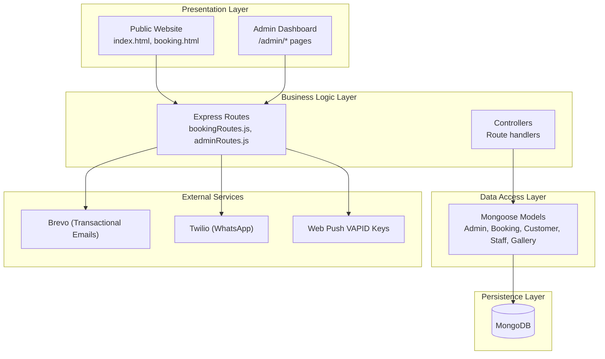
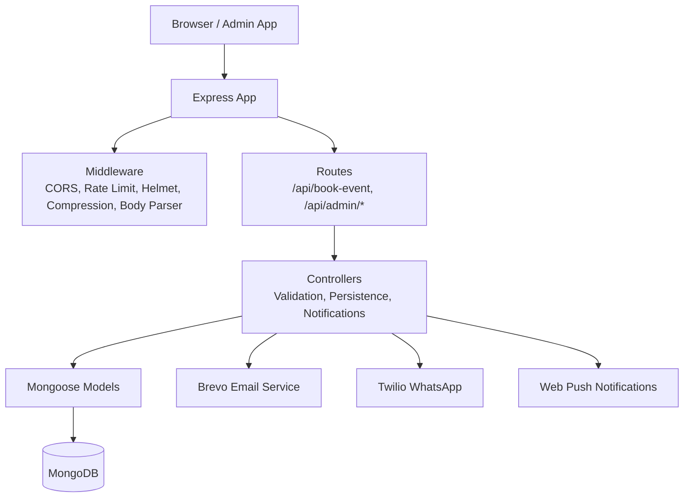
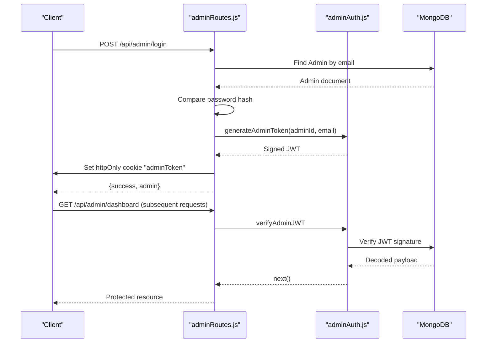
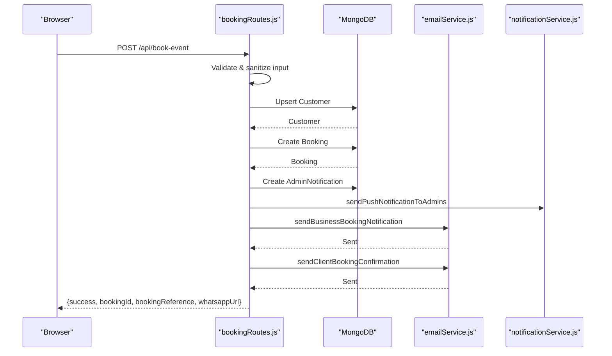
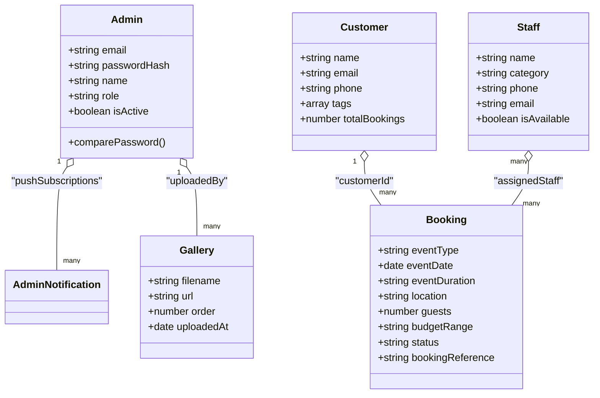
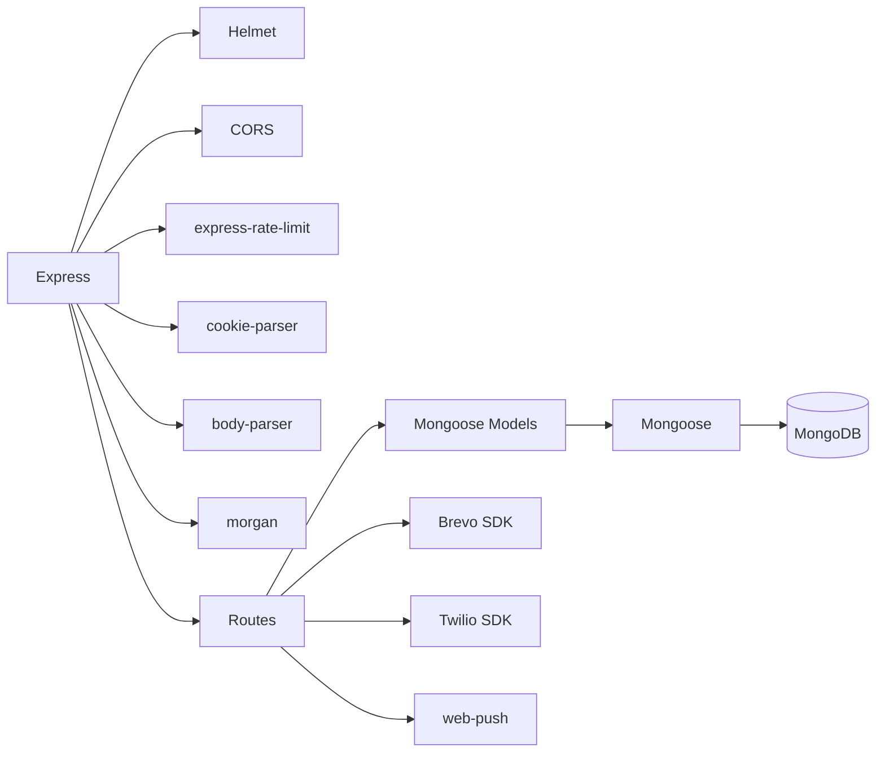
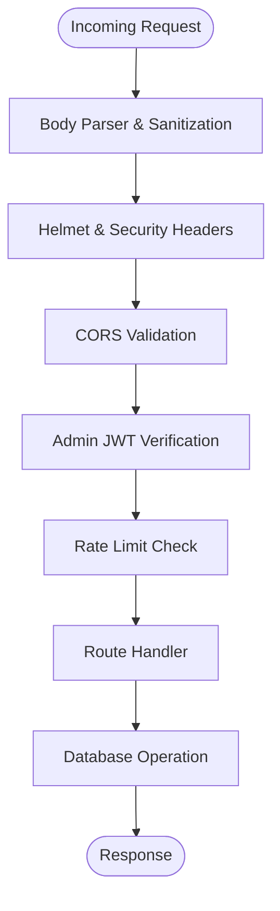
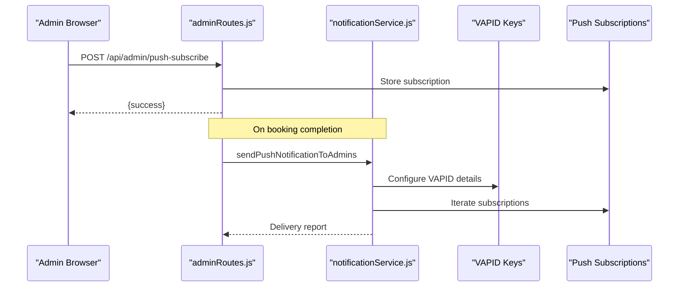
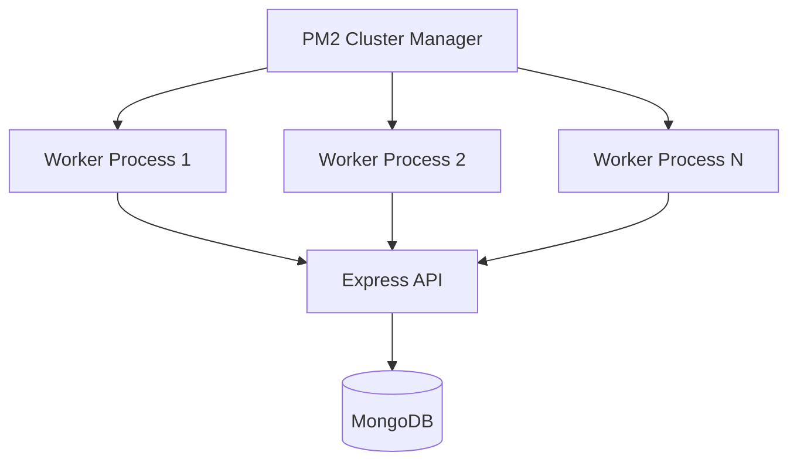

# System Architecture

<cite>
**Referenced Files in This Document**
- [package.json](file://package.json)
- [server.js](file://server.js)
- [server-prod.js](file://server-prod.js)
- [.env](file://.env)
- [ecosystem.config.js](file://ecosystem.config.js)
- [server/middleware/adminAuth.js](file://server/middleware/adminAuth.js)
- [server/routes/adminRoutes.js](file://server/routes/adminRoutes.js)
- [server/routes/bookingRoutes.js](file://server/routes/bookingRoutes.js)
- [server/models/Admin.js](file://server/models/Admin.js)
- [server/models/Booking.js](file://server/models/Booking.js)
- [server/models/Customer.js](file://server/models/Customer.js)
- [server/models/Staff.js](file://server/models/Staff.js)
- [server/models/Gallery.js](file://server/models/Gallery.js)
- [server/services/emailService.js](file://server/services/emailService.js)
- [server/services/notificationService.js](file://server/services/notificationService.js)
</cite>

## Table of Contents
1. [Introduction](#introduction)
2. [Project Structure](#project-structure)
3. [Core Components](#core-components)
4. [Architecture Overview](#architecture-overview)
5. [Detailed Component Analysis](#detailed-component-analysis)
6. [Dependency Analysis](#dependency-analysis)
7. [Performance Considerations](#performance-considerations)
8. [Security Architecture](#security-architecture)
9. [Real-Time Communication](#real-time-communication)
10. [Scalability and Deployment](#scalability-and-deployment)
11. [Cross-Cutting Concerns](#cross-cutting-concerns)
12. [Troubleshooting Guide](#troubleshooting-guide)
13. [Conclusion](#conclusion)

## Introduction
This document describes the architectural design of the Emerald Pearland Events booking system. The system is a production-ready Node.js/Express application that manages event bookings, admin dashboards, CRM-like customer records, staff coordination, and integrated communications via Brevo (email) and Twilio (WhatsApp). It follows a layered architecture with clear separation of concerns across presentation, business logic, data access, and persistence layers. The system emphasizes security, reliability, and scalability through modern middleware, rate limiting, JWT-based admin authentication, and PM2 clustering.

## Project Structure
The repository is organized into:
- Presentation layer: Static HTML/CSS/JS for the public website and admin dashboard, served by Express
- Business logic layer: Express routes and controllers handling API requests
- Data access layer: Mongoose models for MongoDB
- Persistence layer: MongoDB database
- Services: Email and push notification utilities
- Middleware: Admin authentication and shared utilities

**Diagram sources**
- [server-prod.js](file://server-prod.js#L139-L239)
- [server/routes/bookingRoutes.js](file://server/routes/bookingRoutes.js#L1-L356)
- [server/routes/adminRoutes.js](file://server/routes/adminRoutes.js#L1-L1160)
- [server/models/Admin.js](file://server/models/Admin.js#L1-L70)
- [server/models/Booking.js](file://server/models/Booking.js#L1-L169)
- [server/models/Customer.js](file://server/models/Customer.js#L1-L93)
- [server/models/Staff.js](file://server/models/Staff.js#L1-L57)
- [server/models/Gallery.js](file://server/models/Gallery.js#L1-L38)
- [server/services/emailService.js](file://server/services/emailService.js#L1-L467)
- [server/services/notificationService.js](file://server/services/notificationService.js#L1-L78)

**Section sources**
- [server-prod.js](file://server-prod.js#L139-L239)
- [package.json](file://package.json#L25-L46)

## Core Components
- Express application with layered middleware and route registration
- Admin authentication using JWT cookies with httpOnly, secure, and strict SameSite attributes
- Booking workflow: validation → customer deduplication → booking creation → admin notification → email delivery → push notification
- Email service powered by Brevo SDK for transactional emails
- Push notification service using Web Push with VAPID keys
- WhatsApp integration via Twilio for outbound messages
- MongoDB models for Admin, Booking, Customer, Staff, and Gallery
- Rate limiting for spam protection and brute-force prevention
- CORS configuration supporting multiple origins and credentials

**Section sources**
- [server-prod.js](file://server-prod.js#L24-L127)
- [server/middleware/adminAuth.js](file://server/middleware/adminAuth.js#L1-L56)
- [server/routes/bookingRoutes.js](file://server/routes/bookingRoutes.js#L121-L285)
- [server/services/emailService.js](file://server/services/emailService.js#L9-L27)
- [server/services/notificationService.js](file://server/services/notificationService.js#L1-L78)
- [server/models/Admin.js](file://server/models/Admin.js#L1-L70)
- [server/models/Booking.js](file://server/models/Booking.js#L1-L169)
- [server/models/Customer.js](file://server/models/Customer.js#L1-L93)
- [server/models/Staff.js](file://server/models/Staff.js#L1-L57)
- [server/models/Gallery.js](file://server/models/Gallery.js#L1-L38)

## Architecture Overview
The system employs a layered architecture:
- Presentation: Static HTML/CSS/JS for public and admin UIs; Express serves both APIs and static assets
- Business Logic: Route handlers orchestrate validation, persistence, notifications, and integrations
- Data Access: Mongoose models define schemas and lifecycle hooks
- Persistence: MongoDB stores all domain entities
- Cross-Cutting: Security middleware, rate limiting, logging, and error handling

**Diagram sources**
- [server-prod.js](file://server-prod.js#L34-L127)
- [server/routes/bookingRoutes.js](file://server/routes/bookingRoutes.js#L1-L356)
- [server/routes/adminRoutes.js](file://server/routes/adminRoutes.js#L1-L1160)
- [server/services/emailService.js](file://server/services/emailService.js#L1-L467)
- [server/services/notificationService.js](file://server/services/notificationService.js#L1-L78)

## Detailed Component Analysis

### Admin Authentication and Authorization
- JWT-based session management with httpOnly cookies for admin pages
- Two middleware variants:
  - verifyAdminJWT: protects API endpoints
  - verifyAdminPage: redirects unauthenticated users to login for admin pages
- Token generation with 24h expiry and secret from environment

**Diagram sources**
- [server/routes/adminRoutes.js](file://server/routes/adminRoutes.js#L59-L143)
- [server/middleware/adminAuth.js](file://server/middleware/adminAuth.js#L3-L53)
- [server/models/Admin.js](file://server/models/Admin.js#L64-L67)

**Section sources**
- [server/middleware/adminAuth.js](file://server/middleware/adminAuth.js#L1-L56)
- [server/routes/adminRoutes.js](file://server/routes/adminRoutes.js#L59-L143)
- [server/models/Admin.js](file://server/models/Admin.js#L1-L70)

### Booking Workflow and Data Flow
- Public clients submit booking requests via /api/book-event
- Validation and sanitization occur in the route handler
- Customer deduplication by email/phone; new customers tagged appropriately
- Booking creation with generated reference and initial status
- Admin notification and push notification dispatched immediately
- Brevo emails sent to business and client; follow-up scheduled asynchronously
- Optional WhatsApp link generation for quick client communication

**Diagram sources**
- [server/routes/bookingRoutes.js](file://server/routes/bookingRoutes.js#L121-L285)
- [server/services/emailService.js](file://server/services/emailService.js#L127-L156)
- [server/services/notificationService.js](file://server/services/notificationService.js#L16-L75)

**Section sources**
- [server/routes/bookingRoutes.js](file://server/routes/bookingRoutes.js#L1-L356)
- [server/services/emailService.js](file://server/services/emailService.js#L1-L467)
- [server/services/notificationService.js](file://server/services/notificationService.js#L1-L78)

### MVC Pattern Implementation
- Model: Mongoose schemas for Admin, Booking, Customer, Staff, Gallery
- View: Static HTML/CSS/JS for public site and admin dashboard
- Controller: Route handlers in bookingRoutes.js and adminRoutes.js

**Diagram sources**
- [server/models/Admin.js](file://server/models/Admin.js#L1-L70)
- [server/models/Booking.js](file://server/models/Booking.js#L1-L169)
- [server/models/Customer.js](file://server/models/Customer.js#L1-L93)
- [server/models/Staff.js](file://server/models/Staff.js#L1-L57)
- [server/models/Gallery.js](file://server/models/Gallery.js#L1-L38)

**Section sources**
- [server/models/Admin.js](file://server/models/Admin.js#L1-L70)
- [server/models/Booking.js](file://server/models/Booking.js#L1-L169)
- [server/models/Customer.js](file://server/models/Customer.js#L1-L93)
- [server/models/Staff.js](file://server/models/Staff.js#L1-L57)
- [server/models/Gallery.js](file://server/models/Gallery.js#L1-L38)

## Dependency Analysis
External libraries and services:
- Express, Helmet, CORS, compression, rate-limit, cookie-parser, body-parser, morgan
- Mongoose, MongoDB driver
- Brevo SDK for transactional emails
- Twilio SDK for WhatsApp
- Web Push for browser notifications
- PM2 for clustering and process management

**Diagram sources**
- [package.json](file://package.json#L25-L46)
- [server-prod.js](file://server-prod.js#L34-L127)

**Section sources**
- [package.json](file://package.json#L25-L46)
- [server-prod.js](file://server-prod.js#L34-L127)

## Performance Considerations
- Compression: Gzip/Brotli enabled to reduce payload sizes
- Static asset caching: 1-day cache with ETags for public and images
- Indexes on frequently queried fields (e.g., Booking, Customer, Gallery)
- Rate limiting: Separate limits for general API and stricter limits for admin auth endpoints
- Asynchronous email delivery: Non-blocking follow-ups and reminders
- PM2 clustering: Automatic multi-process scaling using “max” instances

**Section sources**
- [server-prod.js](file://server-prod.js#L38-L101)
- [server-prod.js](file://server-prod.js#L134-L141)
- [server/models/Booking.js](file://server/models/Booking.js#L150-L166)
- [server/models/Customer.js](file://server/models/Customer.js#L87-L90)
- [server/models/Gallery.js](file://server/models/Gallery.js#L35)
- [ecosystem.config.js](file://ecosystem.config.js#L5)

## Security Architecture
- Admin authentication:
  - JWT stored in httpOnly, secure cookies with SameSite=strict
  - Secret key from environment variables
  - Middleware validates tokens and enforces protected routes
- Input sanitization:
  - Body parsing with size limits
  - Custom sanitization and regex validation for booking data
  - MongoDB injection protection via express-mongo-sanitize
- Transport security:
  - Helmet sets secure CSP, HSTS, X-Frame-Options, etc.
  - HTTPS enforcement in production via cookie secure flag
- Rate limiting:
  - General rate limiter for IPs
  - Stricter limits for admin login and forgot-password endpoints
- CORS:
  - Allow-listed origins for development and production hosts
  - Credentials enabled for admin dashboard

**Diagram sources**
- [server-prod.js](file://server-prod.js#L34-L101)
- [server/middleware/adminAuth.js](file://server/middleware/adminAuth.js#L3-L53)

**Section sources**
- [server/middleware/adminAuth.js](file://server/middleware/adminAuth.js#L1-L56)
- [server-prod.js](file://server-prod.js#L44-L101)
- [server/routes/bookingRoutes.js](file://server/routes/bookingRoutes.js#L90-L94)

## Real-Time Communication
- Push notifications:
  - Admins subscribe via POST /api/admin/push-subscribe
  - VAPID public/private keys configured in environment
  - Immediate push dispatch on new bookings
- WhatsApp integration:
  - Twilio SDK initialized if credentials present
  - WhatsApp messages sent via Twilio Programmable Messaging
  - Public booking endpoint generates WhatsApp deep links

**Diagram sources**
- [server/routes/adminRoutes.js](file://server/routes/adminRoutes.js#L22-L57)
- [server/services/notificationService.js](file://server/services/notificationService.js#L1-L78)
- [.env](file://.env#L48-L50)

**Section sources**
- [server/routes/adminRoutes.js](file://server/routes/adminRoutes.js#L22-L57)
- [server/services/notificationService.js](file://server/services/notificationService.js#L1-L78)
- [server/routes/bookingRoutes.js](file://server/routes/bookingRoutes.js#L216-L222)
- [.env](file://.env#L36-L40)

## Scalability and Deployment
- PM2 clustering:
  - Application runs with exec_mode cluster and instances=max
  - Environment-specific configurations for development and production
- Load balancing:
  - PM2 distributes incoming connections across worker processes
- MongoDB:
  - Connection handled centrally with robust error logging and graceful shutdown
- Monitoring:
  - Morgan logs HTTP requests in production
  - Health check endpoint exposes MongoDB connectivity and uptime

**Diagram sources**
- [ecosystem.config.js](file://ecosystem.config.js#L1-L16)
- [server-prod.js](file://server-prod.js#L384-L416)

**Section sources**
- [ecosystem.config.js](file://ecosystem.config.js#L1-L16)
- [server-prod.js](file://server-prod.js#L384-L416)

## Cross-Cutting Concerns
- Logging:
  - Morgan combined format for production logs
  - Console logs for initialization steps and errors
- Error handling:
  - Centralized error middleware for Express
  - Graceful shutdown hooks for SIGINT to stop cron jobs and close DB
- Environment configuration:
  - .env file supplies secrets and service credentials
- Analytics:
  - Public endpoint to track analytics events safely

**Section sources**
- [server-prod.js](file://server-prod.js#L34-L36)
- [server-prod.js](file://server-prod.js#L348-L362)
- [server-prod.js](file://server-prod.js#L405-L410)
- [.env](file://.env#L1-L51)
- [server-prod.js](file://server-prod.js#L271-L307)

## Troubleshooting Guide
Common issues and resolutions:
- MongoDB connection failures:
  - Verify MONGODB_URI in .env and network accessibility
  - Check server logs for connection errors
- Email delivery problems:
  - Ensure BREVO_API_KEY is set; otherwise Brevo service remains uninitialized
  - Confirm sender email and reply-to settings
- Push notifications not received:
  - Validate VAPID_PUBLIC_KEY and VAPID_PRIVATE_KEY in .env
  - Ensure admin browsers have subscribed and subscriptions are stored
- WhatsApp messages not sent:
  - Confirm Twilio credentials and WhatsApp number configuration
  - Check Twilio SDK installation and permissions
- Admin authentication errors:
  - Verify JWT_SECRET matches across deployments
  - Ensure cookies are httpOnly and SameSite=strict in production

**Section sources**
- [server-prod.js](file://server-prod.js#L107-L127)
- [server/services/emailService.js](file://server/services/emailService.js#L9-L27)
- [server/services/notificationService.js](file://server/services/notificationService.js#L6-L14)
- [server/routes/bookingRoutes.js](file://server/routes/bookingRoutes.js#L261-L263)
- [server/middleware/adminAuth.js](file://server/middleware/adminAuth.js#L16)

## Conclusion
The Emerald Pearland Events system is a robust, layered architecture that cleanly separates presentation, business logic, data access, and persistence. It leverages JWT-based admin authentication, comprehensive rate limiting, Brevo email integration, Twilio WhatsApp messaging, and Web Push notifications to provide a seamless booking and administration experience. With PM2 clustering, production-grade middleware, and centralized error handling, the system is designed for reliability, scalability, and maintainability.