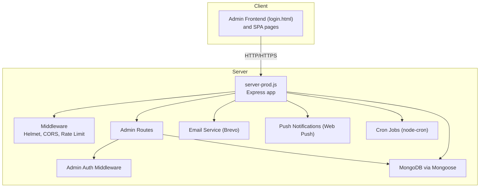
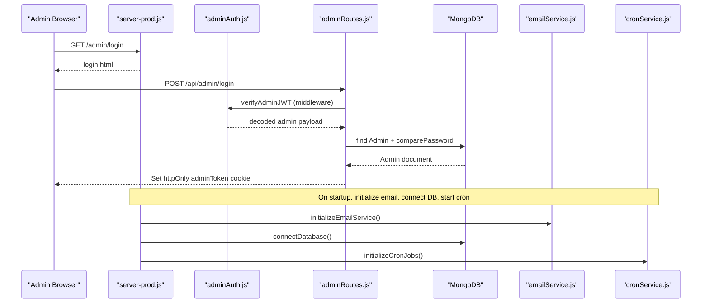
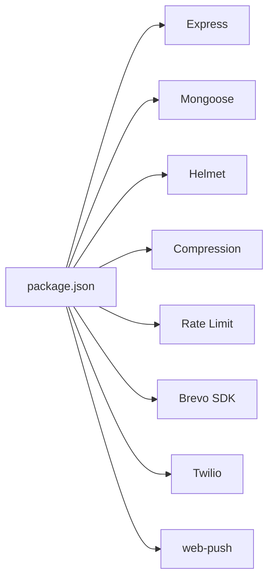

# Troubleshooting & FAQ

<cite>
**Referenced Files in This Document**
- [.env](file://.env)
- [package.json](file://package.json)
- [server.js](file://server.js)
- [server-prod.js](file://server-prod.js)
- [emailService.js](file://server/services/emailService.js)
- [notificationService.js](file://server/services/notificationService.js)
- [cronService.js](file://server/services/cronService.js)
- [adminAuth.js](file://server/middleware/adminAuth.js)
- [adminRoutes.js](file://server/routes/adminRoutes.js)
- [Admin.js](file://server/models/Admin.js)
- [Booking.js](file://server/models/Booking.js)
- [login.html](file://admin/login.html)
- [test-email.js](file://test-email.js)
- [ecosystem.config.js](file://ecosystem.config.js)
</cite>

## Table of Contents
1. [Introduction](#introduction)
2. [Project Structure](#project-structure)
3. [Core Components](#core-components)
4. [Architecture Overview](#architecture-overview)
5. [Detailed Component Analysis](#detailed-component-analysis)
6. [Dependency Analysis](#dependency-analysis)
7. [Performance Considerations](#performance-considerations)
8. [Troubleshooting Guide](#troubleshooting-guide)
9. [FAQ](#faq)
10. [Conclusion](#conclusion)
11. [Appendices](#appendices)

## Introduction
This document provides comprehensive troubleshooting and frequently asked questions for the Emerald Pearland Events system. It focuses on diagnosing and resolving common issues related to email delivery (Brevo configuration), database connectivity, authentication failures, push notification setup, performance, and integration with external services such as WhatsApp, email automation, and analytics. It also includes step-by-step diagnostic procedures, developer debugging techniques, escalation guidelines, and preventive maintenance recommendations.

## Project Structure
The system is a Node.js/Express application with:
- A production server entrypoint that initializes security middleware, database connections, email and cron services, and serves admin pages and APIs.
- A modular service layer for email, push notifications, and scheduled tasks.
- Admin authentication middleware and protected admin routes.
- MongoDB models for Admin, Booking, and supporting entities.
- An admin portal frontend served from the backend for authentication and administrative tasks.

**Diagram sources**
- [server-prod.js](file://server-prod.js#L24-L422)
- [adminAuth.js](file://server/middleware/adminAuth.js#L1-L56)
- [adminRoutes.js](file://server/routes/adminRoutes.js#L1-L1160)
- [emailService.js](file://server/services/emailService.js#L1-L467)
- [notificationService.js](file://server/services/notificationService.js#L1-L78)
- [cronService.js](file://server/services/cronService.js#L1-L185)
- [login.html](file://admin/login.html#L1-L831)

**Section sources**
- [server-prod.js](file://server-prod.js#L24-L422)
- [package.json](file://package.json#L1-L56)

## Core Components
- Environment configuration and secrets are loaded via dotenv and consumed across services.
- Email service integrates with Brevo SDK for transactional emails; a fallback Gmail Nodemailer transport is present but not used in production initialization.
- Push notifications use Web Push with VAPID keys stored in environment variables.
- Cron jobs automate follow-ups, reminders, and staff alerts.
- Admin authentication relies on JWT cookies and middleware.
- MongoDB connection is established early in server startup with strict error handling.

**Section sources**
- [.env](file://.env#L1-L51)
- [server-prod.js](file://server-prod.js#L107-L127)
- [emailService.js](file://server/services/emailService.js#L9-L27)
- [notificationService.js](file://server/services/notificationService.js#L1-L78)
- [cronService.js](file://server/services/cronService.js#L21-L164)
- [adminAuth.js](file://server/middleware/adminAuth.js#L1-L56)
- [adminRoutes.js](file://server/routes/adminRoutes.js#L59-L143)

## Architecture Overview
The system follows a layered architecture:
- Presentation: Admin pages and SPA served by Express.
- Application: Protected admin routes, JWT-based auth, and service orchestration.
- Persistence: MongoDB models and indexes.
- Integrations: Brevo for email, Twilio for WhatsApp, Web Push for browser notifications.

**Diagram sources**
- [server-prod.js](file://server-prod.js#L368-L419)
- [adminAuth.js](file://server/middleware/adminAuth.js#L3-L31)
- [adminRoutes.js](file://server/routes/adminRoutes.js#L59-L143)
- [emailService.js](file://server/services/emailService.js#L9-L27)
- [cronService.js](file://server/services/cronService.js#L21-L164)

## Detailed Component Analysis

### Email Delivery (Brevo) Troubleshooting
Common symptoms:
- Business booking notifications not received.
- Client confirmation emails failing silently.
- SMTP fallback (Gmail) not used in production.

Root causes and fixes:
- Missing or invalid Brevo API key in environment variables.
- Incorrect sender configuration or domain not verified in Brevo.
- Network restrictions blocking outbound HTTPS to Brevo endpoints.
- Email templates or HTML formatting causing rendering issues.

Diagnostic steps:
- Confirm environment variables are loaded and exported.
- Run the email test script to validate initialization and send flow.
- Review server logs for email initialization warnings or errors.
- Temporarily enable verbose logging around email initialization and send calls.

Operational guidance:
- Prefer Brevo SDK for reliability and deliverability; avoid mixing transports.
- Ensure sender identity and domain are verified in Brevo.
- Monitor Brevo dashboard for suppression lists and bounce rates.

**Section sources**
- [.env](file://.env#L21-L22)
- [emailService.js](file://server/services/emailService.js#L9-L27)
- [emailService.js](file://server/services/emailService.js#L32-L53)
- [test-email.js](file://test-email.js#L1-L34)
- [server-prod.js](file://server-prod.js#L370-L374)

### Database Connectivity Troubleshooting
Symptoms:
- Server fails to start with MongoDB connection error.
- API endpoints return database-related errors.

Root causes:
- Missing or incorrect MONGODB_URI.
- Network firewall blocking MongoDB Atlas or local instance.
- Authentication failure due to wrong credentials or IP whitelist.
- DNS resolution issues.

Diagnostic steps:
- Verify MONGODB_URI is present and correct in environment.
- Attempt to connect locally using a MongoDB client.
- Check server logs for connection error messages and exit behavior.
- Confirm network access to MongoDB cluster from hosting environment.

Fixes:
- Update .env with a valid URI.
- Whitelist current IP or use appropriate cluster settings.
- Ensure hosting platform allows outbound connections to MongoDB.

**Section sources**
- [.env](file://.env#L16)
- [server-prod.js](file://server-prod.js#L107-L127)
- [server.js](file://server.js#L38-L40)

### Authentication Failures (Admin Login)
Symptoms:
- Login returns invalid credentials or token errors.
- Admin pages redirect to login despite valid credentials.

Root causes:
- Missing or expired JWT secret.
- Wrong credentials or account not found.
- Cookie security flags mismatch (secure/sameSite) in production vs. localhost.
- Admin account not hashed properly or corrupted password hash.

Diagnostic steps:
- Check JWT_SECRET in environment.
- Verify admin account exists and password compares successfully.
- Inspect cookie flags and domain settings.
- Review login route logs for detailed error paths.

Fixes:
- Regenerate JWT_SECRET and redeploy.
- Recreate admin accounts with proper hashing.
- Align cookie flags with deployment environment.

**Section sources**
- [.env](file://.env#L8)
- [adminAuth.js](file://server/middleware/adminAuth.js#L16-L30)
- [adminRoutes.js](file://server/routes/adminRoutes.js#L60-L143)
- [login.html](file://admin/login.html#L749-L776)

### Push Notification Setup Issues
Symptoms:
- Push notifications disabled with warnings.
- Admins cannot subscribe or receive notifications.

Root causes:
- Missing VAPID public/private keys.
- Subscription endpoints become stale and cause 404/410 errors.
- No valid pushSubscriptions stored for admins.

Diagnostic steps:
- Confirm VAPID keys are present in environment.
- Check admin push subscription endpoints and validity.
- Review server logs for push notification warnings and errors.
- Validate browser support and HTTPS for Web Push.

Fixes:
- Generate and configure VAPID keys.
- Purge expired subscriptions and re-subscribe.
- Ensure admin portal is served over HTTPS in production.

**Section sources**
- [.env](file://.env#L48-L50)
- [notificationService.js](file://server/services/notificationService.js#L5-L14)
- [notificationService.js](file://server/services/notificationService.js#L16-L75)
- [adminRoutes.js](file://server/routes/adminRoutes.js#L22-L57)

### WhatsApp Messaging (Twilio) Troubleshooting
Symptoms:
- WhatsApp messages not sent; warnings indicate Twilio not configured.
- Twilio credentials missing or invalid.

Root causes:
- Missing TWILIO_ACCOUNT_SID or TWILIO_AUTH_TOKEN.
- Invalid TWILIO_WHATSAPP_NUMBER format.
- Twilio package not installed or incompatible.

Diagnostic steps:
- Verify Twilio credentials and number in environment.
- Check server logs for Twilio initialization warnings.
- Attempt manual message send via helper function.

Fixes:
- Install Twilio package and set valid credentials.
- Ensure WhatsApp number format matches Twilio requirements.

**Section sources**
- [.env](file://.env#L37-L40)
- [server.js](file://server.js#L15-L27)
- [server.js](file://server.js#L497-L519)

### Analytics Tracking and External Integrations
Symptoms:
- Analytics events not recorded or fail silently.
- GA4 measurement ID misconfigured.

Root causes:
- Missing or invalid GA4 measurement ID.
- Analytics endpoint errors are caught and logged without failing the request.
- CORS or origin mismatches for analytics submissions.

Diagnostic steps:
- Confirm GA4 measurement ID is set.
- Review analytics endpoint logs for validation and save errors.
- Validate frontend origin matches CORS configuration.

Fixes:
- Correct GA4 measurement ID.
- Ensure analytics endpoint receives valid eventType and parameters.

**Section sources**
- [.env](file://.env#L33-L34)
- [server-prod.js](file://server-prod.js#L268-L307)
- [server.js](file://server.js#L550-L576)

## Dependency Analysis
Key runtime dependencies include Express, Mongoose, Helmet, compression, rate limiting, nodemailer, Brevo SDK, Twilio, and web-push. These are declared in package.json and used across server initialization and services.

**Diagram sources**
- [package.json](file://package.json#L25-L46)

**Section sources**
- [package.json](file://package.json#L25-L46)

## Performance Considerations
- Database query optimization:
  - Booking schema defines indexes on common query fields; ensure queries leverage these.
  - Use pagination and selective field projection in admin endpoints.
- Memory usage monitoring:
  - Use Node.js built-in tools and process monitoring to track heap and restarts.
- Load balancing:
  - PM2 cluster mode is configured; ensure sticky sessions if required and monitor worker health.

**Section sources**
- [Booking.js](file://server/models/Booking.js#L150-L166)
- [ecosystem.config.js](file://ecosystem.config.js#L1-L16)

## Troubleshooting Guide

### Step-by-Step Diagnostic Procedures
- Log analysis:
  - Tail server logs for initialization messages and error stacks.
  - Look for MongoDB connection errors, email initialization warnings, and cron job logs.
- Environment variable verification:
  - Confirm all required variables are present and correctly formatted.
  - Validate secrets and URIs are not truncated or commented out.
- Service connectivity testing:
  - Test database connectivity externally.
  - Validate outbound HTTPS to Brevo/Twilio endpoints.
  - Verify admin login flow and cookie behavior.
- API testing:
  - Use curl or Postman to hit health check and admin endpoints.
  - Test analytics endpoint with valid eventType.
- Developer debugging:
  - Add targeted console logs around critical paths.
  - Use the email test script to validate Brevo integration.

### Common Issues and Resolutions
- Email delivery failures:
  - Ensure BREVO_API_KEY is set and valid.
  - Check sender domain verification and template rendering.
- Database connection errors:
  - Fix MONGODB_URI and network/firewall settings.
- Authentication failures:
  - Verify JWT_SECRET and admin account credentials.
- Push notification setup issues:
  - Configure VAPID keys and purge invalid subscriptions.
- WhatsApp messaging setup issues:
  - Install Twilio and set valid credentials and number.

### Escalation Procedures and Support
- For critical incidents:
  - Capture server logs, environment variables snapshot, and reproduction steps.
  - Engage hosting provider for network/firewall checks.
  - Contact Brevo/Twilio support with error codes and timestamps.
- Support contact:
  - Internal admin contact listed in environment variables for business communications.

**Section sources**
- [server-prod.js](file://server-prod.js#L348-L362)
- [.env](file://.env#L27)
- [server.js](file://server.js#L578-L594)

## FAQ

### Booking Process
- How do I submit a booking?
  - Use the public booking page to fill the form; the system validates required fields and sends notifications.
- Why did I not receive a confirmation email?
  - Check that Brevo API key is configured and sender domain is verified. Review server logs for errors.
- Can I modify my booking after submission?
  - Admin can update status, assign staff, and manage payment details in the admin portal.

### Admin Access
- I forgot my admin password. What should I do?
  - There is no built-in “forgot password” route; reset the admin account or contact a super admin to assist.
- Why am I being redirected to the login page?
  - Ensure the adminToken cookie is present and not expired. Check cookie flags and domain settings.

### Mobile Functionality
- Is the admin portal mobile-friendly?
  - Yes, the admin pages are responsive and include mobile-specific styles and navigation.
- Can I receive push notifications on mobile browsers?
  - Requires HTTPS and valid VAPID keys; ensure subscription is active and not expired.

### System Limitations
- Are there rate limits?
  - Yes, general and admin-specific rate limits are enforced to prevent abuse.
- What analytics are supported?
  - Analytics endpoint supports event tracking; ensure eventType is valid and sender domain is verified.

**Section sources**
- [adminRoutes.js](file://server/routes/adminRoutes.js#L94-L101)
- [login.html](file://admin/login.html#L417-L536)

## Conclusion
This guide consolidates practical troubleshooting steps, diagnostics, and resolutions for the Emerald Pearland Events system. By validating environment configuration, verifying service connectivity, and following the outlined procedures, most issues can be identified and resolved quickly. Regular monitoring, proactive maintenance, and adherence to best practices will help sustain reliable operation.

## Appendices

### Environment Variables Checklist
- Server and secrets:
  - PORT, NODE_ENV, JWT_SECRET
- Database:
  - MONGODB_URI
- Email (Brevo):
  - BREVO_API_KEY, EMAIL_USER, EMAIL_PASSWORD, ADMIN_EMAIL
- Google Analytics:
  - GA4_MEASUREMENT_ID
- Twilio WhatsApp:
  - TWILIO_ACCOUNT_SID, TWILIO_AUTH_TOKEN, TWILIO_WHATSAPP_NUMBER, BUSINESS_WHATSAPP_NUMBER
- Frontend:
  - REACT_APP_API_URL, REACT_APP_WHATSAPP_NUMBER
- Web Push:
  - VAPID_PUBLIC_KEY, VAPID_PRIVATE_KEY

**Section sources**
- [.env](file://.env#L6-L50)

### Developer Debugging Tools and Techniques
- Email testing:
  - Use the provided test script to initialize the email service and send a sample notification.
- API testing:
  - Use the health check endpoint to verify server readiness and MongoDB status.
- Monitoring:
  - Enable Morgan for production logging and inspect logs for anomalies.
- Cluster mode:
  - Use PM2 configuration to run multiple workers and monitor process health.

**Section sources**
- [test-email.js](file://test-email.js#L1-L34)
- [server-prod.js](file://server-prod.js#L241-L254)
- [ecosystem.config.js](file://ecosystem.config.js#L1-L16)